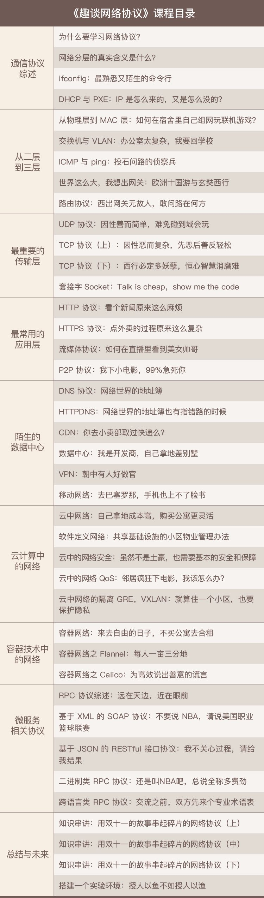

趣谈网络协议-0-介绍

----------

**想要不被滚滚而来的新技术淘汰，就要掌握这些可以长久使用的知识，而网络协议就是值得你学习，而且是到 40 岁之后依然有价值的知识**

之前网络协议学习过程为：一看觉得懂，一问就打鼓，一用就糊涂。

这个教程的学习方式做出改变：

1. **从身边经常见到的事情出发，用故事来讲解各种网络协议，然后慢慢扩展到不熟悉的领域**
2. **用贴近场景的方式来讲解网络协议，将各个层次的关系串起来，而非孤立地讲解某个概念。**
3. **在讲解完各个层次的网络协议之后，着重剖析如何在当下热门领域使用这些协议，比如云计算、容器和微服务。**

学习知识的方法和态度：**看似最枯燥、最基础的东西往往具有最长久的生命力。**

### 目录

