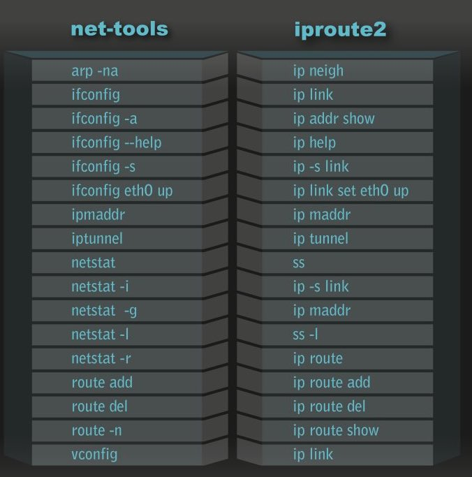

## 3-ifconfig：最熟悉又陌生的命令行


### 1.怎么查IP地址？

`ifconfig`（Windows系统对应`ipconfig`）和`ip addr`两个命令分别属于`net-tools`和`iproute2`两个工具系列，这个两个工具文末有介绍。

```shell
root@test:~# ip addr
1: lo: <LOOPBACK,UP,LOWER_UP> mtu 65536 qdisc noqueue state UNKNOWN group default 
    link/loopback 00:00:00:00:00:00 brd 00:00:00:00:00:00
    inet 127.0.0.1/8 scope host lo
       valid_lft forever preferred_lft forever
    inet6 ::1/128 scope host 
       valid_lft forever preferred_lft forever
2: eth0: <BROADCAST,MULTICAST,UP,LOWER_UP> mtu 1500 qdisc pfifo_fast state UP group default qlen 1000
    link/ether fa:16:3e:c7:79:75 brd ff:ff:ff:ff:ff:ff
    inet 10.100.122.2/24 brd 10.100.122.255 scope global eth0
       valid_lft forever preferred_lft forever
    inet6 fe80::f816:3eff:fec7:7975/64 scope link 
       valid_lft forever preferred_lft forever
```


<font color=#FF8C00>IP 地址是一个网卡在网络世界的通讯地址，相当于我们现实世界的门牌号码。</font>

上面的结果中，`10.100.122.2` 就是一个 IP 地址。这个地址被点分隔为四个部分，每个部分 8 个 bit，所以 IP 地址总共是 **32** 位。这样产生的 IP 地址的数量很快就不够用了。因为当时设计 IP 地址的时候，哪知道今天会有这么多的计算机啊！因为不够用，于是就有了 [**IPv6**](https://zh.wikipedia.org/wiki/IPv6)，也就是上面输出结果里面 `inet6 fe80::f816:3eff:fec7:7975/64`(一般是8个部分组成，之间用`:`隔开，每个部分是4个十六进制数组成，`4*4*8=128`，`::`表示一组0或多组连续0)。这个有 **128** 位，现在看来是够了，但是未来的事情谁知道呢？

本来 32 位的 IP 地址就不够，还被分成了 5 类。现在想想，当时分配地址的时候，真是太奢侈了。


 A、B、 C 类主要分两部分，前面一部分是网络号，后面一部分是主机号。


这里面有个尴尬的事情，就是 C 类地址能包含的最大主机数量实在太少了，只有 254 个。当时设计的时候恐怕没想到，现在估计一个网吧都不够用吧。而 B 类地址能包含的最大主机数量又太多了。6 万多台机器放在一个网络下面，一般的企业基本达不到这个规模，闲着的地址就是浪费。


### **2.无类型域间选路**

因为B类和C类最大主机数的尴尬，所以有了一个折中的方法，<font color=#FF8C00>**无类型域间选路**</font>(Classless Inter-Domain Routing)，简称**CIDR**。之前ABC类地址网络号的位数都是固定好，**CIDR**通过在IP地址后加一个数字来指定网络号的位数。例如，上面IP地址后就有一个数字，`10.100.122.2/24` 后面 24 的意思是，32 位中，前 24 位是网络号，后 8 位是主机号。

伴随着 CIDR 存在的，一个是<font color=#FF8C00>**广播地址**</font>，10.100.122.255。如果发送这个地址，所有 10.100.122 网络里面的机器都可以收到。另一个是<font color=#FF8C00>**子网掩码**</font>，255.255.255.0。**将子网掩码和 IP 地址按位计算 AND，就可得到网络号。**


### **3.公有 IP 地址和私有 iP 地址**

在日常的工作中，几乎不用划分 A 类、B 类或者 C 类，所以时间长了，很多人就忘记了这个分类，而只记得 CIDR。但是有一点还是要注意的，就是**公有 IP 地址**和**私有 IP 地址**。


平时我们看到的数据中心里，办公室、家里或学校的 IP 地址，一般都是私有 IP 地址段。因为这些地址允许组织内部的 IT 人员自己管理、自己分配，而且可以**重复**。因此，你学校的某个私有 IP 地址段和我学校的可以是一样的。

公有 IP 地址有个组织**统一分配**，需要购买。如果你搭建一个网站，给你学校的人使用，让你们学校的 IT 人员给你一个 IP 地址就行。但是假如你要做一个类似网易163这样的网站，就需要有公有 IP 地址，这样全世界的人才能访问。

表格中的 192.168.0.x 是最常用的私有 IP 地址。你家里有 Wi-Fi，对应就会有一个 IP 地址。一般你家里地上网设备不会超过 256 个，所以 /24 基本就够了。有时候我们也能见到 /16 的 CIDR，这两种是最常见的，也是最容易理解的。

不需要将十进制转换为二进制 32 位，就能明显看出 192.168.0 是网络号，后面是主机号。而整个网络里面的第一个地址 192.168.0.1，往往就是你这个**私有网络的出口地址**。例如，你家里的电脑连接 Wi-Fi，Wi-Fi 路由器的地址就是 192.168.0.1，而 192.168.0.255 就是广播地址。一旦发送这个地址，整个 192.168.0 网络里面的所有机器都能收到。

但是也不总都是这样的情况。因此，其他情况往往就会很难理解，还容易出错。

#### 举例：一个容易“犯错”的 CIDR

我们来看 `16.158.165.91/22` 这个 CIDR。求一下这个网络的第一个地址、子网掩码和广播地址。

你要是上来就写 `16.158.165.1`，那就大错特错了。

/22 不是 8 的整数倍，不好办，只能先变成二进制来看。16.158 的部分不会动，它占了前 16 位。中间的 165，变为二进制为‭10100101‬。除了前面的 16 位，还剩 6 位。所以，这 8 位中前 6 位是网络号，`16.158.<101001>`，而 `<01>.91` 是机器号。

第一个地址是 `16.158.<101001><00>.1`，即 `16.158.164.1`。子网掩码是 `255.255.<111111><00>.0`，即 `255.255.252.0`。广播地址为 `16.158.<101001><11>.255`，即 `16.158.167.255`。

这五类地址中，还有一类 D 类是**组播地址**。使用这一类地址，属于某个组的机器都能收到。这有点类似在公司里面大家都加入了一个邮件组。发送邮件，加入这个组的都能收到。组播地址在后面讲述 [VXLAN 协议]()的时候会提到。

继续开头`ip addr`的结果，在IP地址的后面有个`scope`，对于`eth0`这张网卡来讲，是`global`，说明这张网卡是可以**对外**的，可以接收来自各个地方的包。对于`lo`来讲，是`host`，说明这张网卡仅仅可以供**本机相互通信**。

`lo`全称是**loopback**，又称环回接口，往往会被分配到 `127.0.0.1` 这个地址。这个地址用于本机通信，经过内核处理后直接返回，不会在任何网络中出现。

### 4.MAC 地址

在 IP地址的上一行是 `link/ether fa:16:3e:c7:79:75 brd ff:ff:ff:ff:ff:ff`，这个被称为<font color=#FF8C00>MAC地址</font>，是一个网卡的物理地址，用十六进制表示，6个字节。

关于MAC地址，[1-为什么要学习网络协议？](NP-1.md)中的问题部分解释过。

MAC 地址的通信范围比较小，局限在一个子网里面。例如，从 192.168.0.2/24 访问 192.168.0.3/24 是可以用 MAC 地址的。一旦跨子网，即从 192.168.0.2/24 到 192.168.1.2/24，MAC 地址就不行了，需要 IP 地址起作用了。

### **5.网络设备的状态标识**

``ip addr`的结果中`<BROADCAST,MULTICAST,UP,LOWER_UP>`  叫作**net_device flags**，**网络设备的状态标识**。

**UP** 表示网卡处于启动的状态；  

**BROADCAST** 表示这个网卡有广播地址，可以发送广播包；  

**MULTICAST** 表示网卡可以发送多播包；  

**LOWER_UP** 表示 L1 是启动的，也即网线插着呢。

后面的`MTU 1500` 是指最大传输单元MTU（**M**aximum **T**ransmission **U**nit）为 1500，这是以太网的默认值。MTU 是二层 MAC 层的概念。

以太网规定连 MAC头带正文合起来，不允许超过 1500 个字节。正文里面有 IP 的头、TCP 的头、HTTP 的头。如果放不下，就需要分片来传输。

`qdisc` 全称是**queueing discipline**，中文叫**排队规则**。内核如果需要通过某个网络接口发送数据包，它都需要按照为这个接口配置的 qdisc（排队规则）把数据包加入队列。

最简单的 `qdisc` 是 `pfifo`，它不对进入的数据包做任何的处理，数据包采用先入先出的方式通过队列。`pfifo_fast` 稍微复杂一些，它的队列包括三个波段（band）。在每个波段里面，使用先进先出规则。

三个波段（band）的优先级也不相同。band 0 的优先级最高，band 2 的最低。如果 band 0 里面有数据包，系统就不会处理 band 1 里面的数据包，band 1 和 band 2 之间也是一样。

数据包是按照**服务类型**（Type of Service，**TOS**）被分配到三个波段（band）里面的。TOS 是 IP 头里面的一个字段，代表了当前的包是高优先级的，还是低优先级的。

队列是个好东西，后面我们讲云计算中的网络的时候，会有很多用户共享一个网络出口的情况，这个时候如何排队，每个队列有多粗，队列处理速度应该怎么提升，我都会详细为你讲解。


### 6.小结和补充

- IP 是地址，有定位功能；MAC 是身份证，无定位功能；
- CIDR 可以用来判断是不是本地人；
- IP 分公有的 IP 和私有的 IP。


- 你知道 net-tools 和 iproute2 的“历史”故事吗？

  **net-tools**起源于BSD，自2001年起，Linux社区已经对其停止维护，而**iproute2**旨在取代net-tools，并提供了一些新功能。一些Linux发行版已经停止支持net-tools，只支持iproute2。
  net-tools通过procfs(/proc)和ioctl系统调用去访问和改变内核网络配置，而iproute2则通过**netlink**套接字接口与内核通讯。
  net-tools中工具的名字比较杂乱，而iproute2则相对整齐和直观，基本是ip命令加后面的子命令。
  虽然取代意图很明显，但是这么多年过去了，net-tool依然还在被广泛使用，最好还是两套命令都掌握吧。



