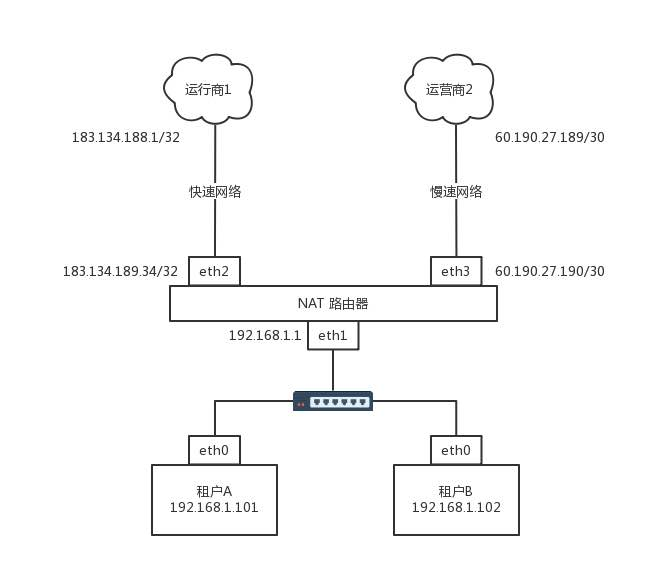
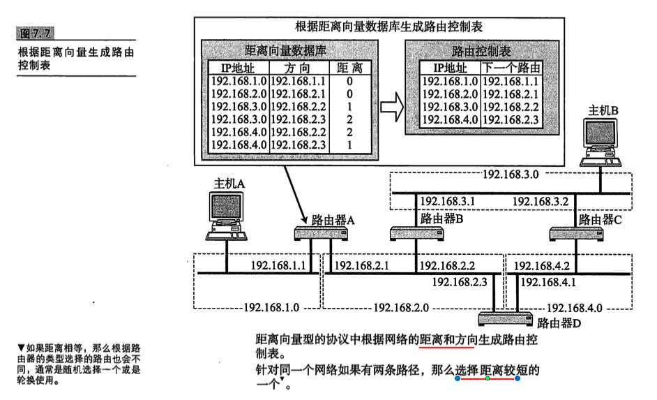
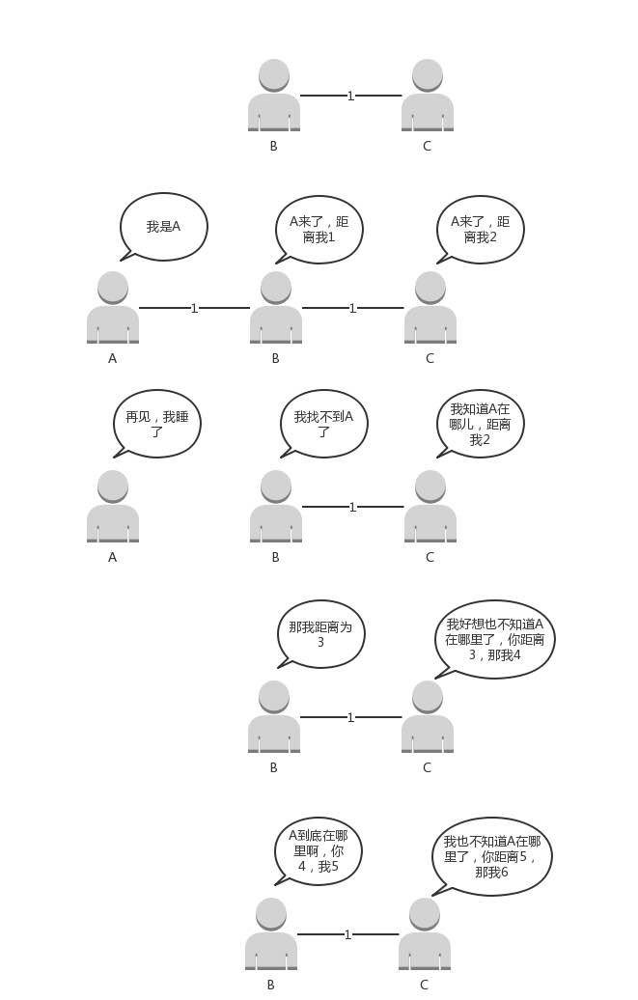
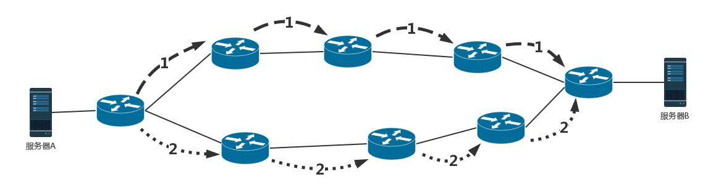
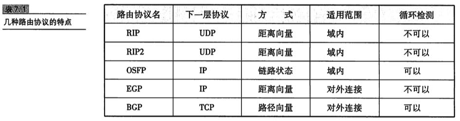
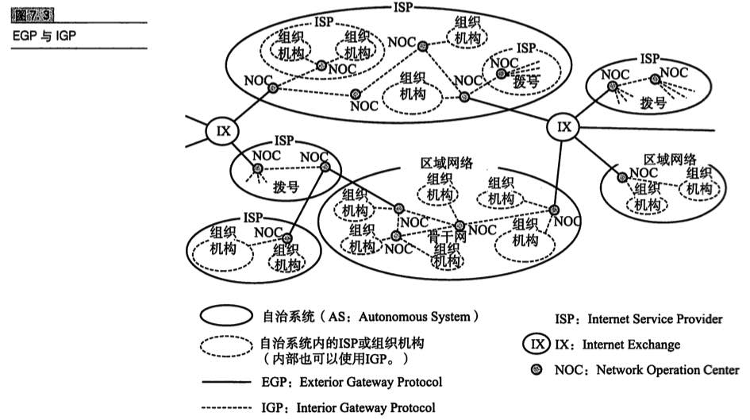

## 趣谈网络协议-9-路由协议：西出网关无故人，敢问路在何方

俗话说得好，在家千日好，出门一日难。网络包一旦出了网关，就像玄奘西行一样踏上了江湖漂泊的路。

上一节我们描述的是一个相对简单的情形。出了网关之后，只有一条路可以走。但是，网络世界复杂得多，一旦出了网关，会<u>面临着很多路由器</u>，有很多条道路可以选。如何选择一个更快速的道路求取真经呢？

### 1.如何配置路由？

通过上一节的内容，你应该已经知道，路由器就是一台网络设备，它有<u>多张网卡</u>。当一个入口的网络包送到路由器时，它会根据一个本地的转发信息库，来决定如何正确地转发流量。这个转发信息库通常被称为<font color=#FF8C00>**路由表**</font>。

一张路由表中会有多条路由规则。每一条规则至少包含这三项信息。

- 目的网络：这个包想去哪儿？
- 出口设备：将包从哪个口扔出去？
- 下一跳网关：下一个路由器的地址。

通过 `route` 命令和 `ip route` 命令都可以进行查询或者配置。

例如，我们设置 `ip route add 10.176.48.0/20 via 10.173.32.1 dev eth0`，就说明要去 10.176.48.0/20 这个目标网络，要从 eth0端口出去，经过 10.173.32.1。

上一节的例子中，网关上的路由策略就是按照这三项配置信息进行配置的。这种配置方式的一个核心思想是：**根据目的IP地址来配置路由**。

### 2.如何配置策略路由？

当然，在真实的复杂的网络环境中，除了可以根据目的 ip 地址配置路由外，还可以根据多个参数来配置路由，这就称为<font color=#FF8C00>**策略路由**</font>。

可以配置多个路由表，可以根据<u>源IP地址</u>、<u>入口设备</u>、<u>TOS</u> 等选择路由表，然后在路由表中查找路由。这样可以使得来自不同来源的包走不同的路由。

例如，我们设置：


```
ip rule add from 192.168.1.0/24 table 10 
ip rule add from 192.168.2.0/24 table 20
```

表示从 192.168.1.10/24 这个网段来的，使用 table 10 中的路由表，而从 192.168.2.0/24 网段来的，使用 table20 的路由表。


在一条路由规则中，也可以走多条路径。例如，在下面的路由规则中：

```shell
ip route add default scope global nexthop via 100.100.100.1 weight 1 nexthop via 200.200.200.1 weight 2
```

下一跳有两个地方，分别是 100.100.100.1 和 200.200.200.1，权重分别为 1 比 2。

在什么情况下会用到如此复杂的配置呢？我来举一个现实中的例子。

我是房东，家里从运营商那儿拉了两根网线。这两根网线分别属于两个运行商。一个带宽大一些，一个带宽小一些。这个时候，我就不能买普通的家用路由器了，得买个高级点的，可以接两个外网的。

家里的网络呢，就是普通的家用网段 192.168.1.x/24。家里有两个租户，分别把线连到路由器上。IP 地址为 192.168.1.101/24 和 192.168.1.102/24，网关都是 192.168.1.1/24，网关在路由器上。

就像上一节说的一样，家里的网段是私有网段，出去的包需要 NAT 成公网的 IP 地址，因而路由器是一个 NAT 路由器。

两个运营商都要为这个网关配置一个公网的 IP 地址。如果你去查看你们家路由器里的网段，基本就是我图中画的样子。



运行商里面也有一个 IP 地址，在运营商网络里面的网关。不同的运营商方法不一样，有的是 /32 的，也即一个一对一连接。

例如，运营商 1 给路由器分配的地址是 183.134.189.34/32，而运营商网络里面的网关是 183.134.188.1/32。有的是 /30 的，也就是分了一个特别小的网段。运营商 2 给路由器分配的地址是 60.190.27.190/30，运营商网络里面的网关是 60.190.27.189/30。

根据这个网络拓扑图，可以将路由配置成这样：

```shell
ip route list table main 
60.190.27.189/30 dev eth3  proto kernel  scope link  src 60.190.27.190
183.134.188.1 dev eth2  proto kernel  scope link  src 183.134.189.34
192.168.1.0/24 dev eth1  proto kernel  scope link  src 192.168.1.1
127.0.0.0/8 dev lo  scope link
default via 183.134.188.1 dev eth2
```

当路由这样配置的时候，就告诉这个路由器如下的规则：

- 如果去运营商二，就走 eth3；
- 如果去运营商一呢，就走 eth2；
- 如果访问内网，就走 eth1；
- 如果所有的规则都匹配不上，默认走运营商一，也即走快的网络。

但是问题来了，租户A 不想多付钱，他说我就上上网页，从不看电影，凭什么收我同样贵的网费啊？没关系，咱有技术可以解决。

下面我添加一个 Table，名字叫chao。
```
# echo 200 chao >> /etc/iproute2/rt_tables
```

添加一条规则：
```
# ip rule add from 192.168.1.101 table chao
# ip rule ls
0:    from all lookup local 
32765:    from 10.0.0.10 lookup chao
32766:    from all lookup main 
32767:    from all lookup default
```

设定规则为：从 192.168.1.101 来的包都查看个 chao 这个新的路由表。

在 chao 路由表中添加规则：
```
# ip route add default via 60.190.27.189 dev eth3 table chao
# ip route flush cache
```

默认的路由走慢的，谁让你不付钱。

简单网络环境使用静态路由，复杂网络环境需要动态路由。

### 3.动态路由算法

**动态路由**是指<u>让路由协议在运行过程中自动地设置路由控制信息的一种方法</u>。

使用动态路由路由器，可以根据路由协议算法生成**动态路由表**，随网络运行状况的变化而变化。那路由算法是什么样的呢？

不同网络之间的复杂路径，可以抽象为数据结构**图**，而不同网络间的寻找可以转化为**如何在图中找到最短路径**的问题。

求最短路径常用的有两种方法，一种是 <font color=#FF8C00>**Bellman-Ford算法**</font>，一种是 <font color=#FF8C00>**Dijkstra算法**</font>。

#### 3.1  距离矢量路由算法

第一大类的算法称为**距离矢量路由**（distance vector routing）。它是基于 Bellman-Ford算法的。

这种算法的基本思路是，每个路由器都保存一个路由表，包含多行，每行对应网络中的一个路由器，每一行包含两部分信息，一个是<u>要到目标路由器，从那条线出去</u>，另一个是<u>到目标路由器的距离</u>。

由此可以看出，每个路由器都是知道全局信息的。那这个信息如何更新呢？每个路由器都知道自己和邻居之间的距离，每过几秒，每个路由器都将自己所知的到达所有的路由器的距离告知邻居，每个路由器也能从邻居那里得到相似的信息。

每个路由器根据新收集的信息，计算和其他路由器的距离，比如自己的一个邻居距离目标路由器的距离是 M，而自己距离邻居是 x，则自己距离目标路由器是 x+M。



这个算法比较简单，但是还是有问题。

**第一个问题就是好消息传得快，坏消息传得慢。**如果有个路由器加入了这个网络，它的邻居就能很快发现它，然后将消息广播出去。要不了多久，整个网络就都知道了。但是一旦一个路由器挂了，挂的消息是没有广播的。当每个路由器发现原来的道路到不了这个路由器的时候，感觉不到它已经挂了，而是试图通过其他的路径访问，直到试过了所有的路径，才发现这个路由器是真的挂了。

再举个例子。



最终，B、C距离A的数越来越大，直到超过一个阈值，才能判定A真的挂了。

这个道理有点像有人走丢了。当你突然发现找不到这个人了。于是你去学校问，是不是在他姨家呀？找到他姨家，他姨说，是不是在他舅舅家呀？他舅舅说，是不是在他姥姥家呀？他姥姥说，是不是在学校呀？总归要问一圈，或者是超过一定的时间，大家才会认为这个人的确走丢了。如果这个人其实只是去见了一个谁都不认识的网友去了，当这个人回来的时候，只要他随便见到其中的一个亲戚，这个亲戚就会拉着他到他的家长那里，说你赶紧回家，你妈都找你一天了。

这种算法的**第二个问题是，每次发送的时候，要发送整个全局路由表**。网络大了，谁也受不了，所以最早的路由协议**RIP**(Routing Information Protocol)就是这个算法。它适用于小型网络（小于 15 跳）。当网络规模都小的时候，没有问题。现在一个数据中心内部路由器数目就很多，因而不适用了。

所以上面的两个问题，限制了距离矢量路由的网络规模。

#### 3.2 链路状态路由算法

第二大类算法是**链路状态路由**（link state routing），基于 Dijkstra算法。

这种算法的基本思路是：当一个路由器启动的时候，首先是发现邻居，向邻居 say hello，邻居都回复。然后计算和邻居的距离，发送一个 echo，要求马上返回，除以二就是距离。然后将自己和邻居之间的链路状态包广播出去，发送到整个网络的每个路由器。这样每个路由器都能够收到它和邻居之间的关系的信息。因而，每个路由器都能在自己本地构建一个完整的图，然后针对这个图使用 Dijkstra算法，找到两点之间的最短路径。

不像距离距离矢量路由协议那样，更新时发送整个路由表。链路状态路由协议**只广播更新的或改变的网络拓扑**，这使得更新信息更小，节省了带宽和 CPU 利用率。而且一旦一个路由器挂了，它的邻居都会广播这个消息，可以使得坏消息迅速收敛。

### 4.动态路由协议

#### 4.1. 基于链路状态路由算法的OSPF

**OSPF（Open Shortest Path First，开放式最短路径优先）**就是这样一个基于链路状态路由协议，广泛应用在数据中心中的协议。由于主要用在数据中心内部，用于路由决策，因而称为**内部网关协议**（Interior Gateway Protocol，简称**IGP**）。

内部网关协议的重点就是找到最短的路径。在一个组织内部，路径最短往往最优。当然有时候 OSPF 可以发现多个最短的路径，可以在这多个路径中进行负载均衡，这常常被称为**等价路由**。



这一点非常重要。有了等价路由，到一个地方去可以有相同的两个路线，可以**分摊流量**，还可以当一条路不通的时候，走另外一条路。这个在后面我们讲数据中心的网络的时候，一般应用的接入层会有负载均衡[**LVS**（Linux Virtual Server）](https://baike.baidu.com/item/LVS/17738?fr=aladdin)。它可以和 OSPF一起，实现**高吞吐量**的接入层设计。

#### 4.2 基于距离矢量路由算法的 BGP

但是外网的路由协议，也即国家之间的，又有所不同。我们称为**外网路由协议**（Border Gateway Protocol，简称**BGP**）。

在一个国家内部，有路当然选近的走。但是国家之间，不光远近的问题，还有政策的问题。例如，唐僧去西天取经，有的路近。但是路过的国家看不惯僧人，见了僧人就抓。例如灭法国，连光头都要抓。这样的情况即便路近，也最好绕远点走。

对于网络包同样，每个数据中心都设置自己的 Policy。例如，<u>哪些外部的 IP 可以让内部知晓，哪些内部的 IP 可以让外部知晓，哪些可以通过，哪些不能通过。</u>这就好比，虽然从我家里到目的地最近，但是不能谁都能从我家走啊！

在网络世界，这一个个国家成为**自治系统AS**（Autonomous System）。自治系统分几种类型。

- Stub AS：对外只有一个连接。这类 AS 不会传输其他 AS 的包。例如，个人或者小公司的网络。
- Multihomed AS：可能有多个连接连到其他的 AS，但是大多拒绝帮其他的 AS 传输包。例如一些大公司的网络。
- Transit AS：有多个连接连到其他的 AS，并且可以帮助其他的 AS 传输包。例如主干网。

每个自治系统都有**边界路由器**，通过它和外面的世界建立联系。


BGP 又分为两类，**eBGP** 和 **iBGP**。自治系统间，边界路由器之间使用 eBGP 广播路由。内部网络也需要访问其他的自治系统。边界路由器如何将 BGP 学习到的路由导入到内部网络呢？就是通过运行 iBGP，使得内部的路由器能够找到到达外网目的地的最好的边界路由器。

BGP协议使用的算法是**路径矢量路由协议**（path-vector protocol）。它是距离矢量路由协议的升级版。

前面说了距离矢量路由协议的缺点。其中一个是收敛慢。在 BGP 里面，除了下一跳 hop 之外，还包括了自治系统 AS 的路径，从而可以避免坏消息传的慢的问题，也即上面所描述的，B 知道 C 原来能够到达 A，是因为通过自己，一旦自己都到达不了 A 了，就不用假设 C 还能到达 A 了。

另外，在路径中将一个自治系统看成一个整体，不区分自治系统内部的路由器，这样自治系统的数目是非常有限的。就像大家都能记住出去玩，从中国出发先到韩国然后到日本，只要不计算细到具体哪一站，就算是发送全局信息，也是没有问题的。

### 5.小结和补充

- 路由分**静态路由**和**动态路由**，静态路由可以配置复杂的策略路由，控制转发策略；

- 动态路由主流算法有两种，**距离矢量算法**和**链路状态算法**。基于两种算法产生两种协议，**BGP协议**和 **OSPF协议**。

#### 5.1 主要路由协议



#### 5.2 EGP与IGP




-------

疑问：EGP 与 BGP 的区别？