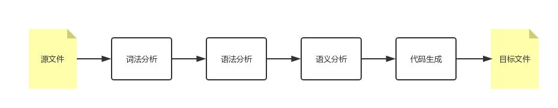
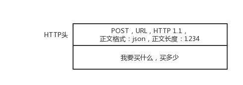
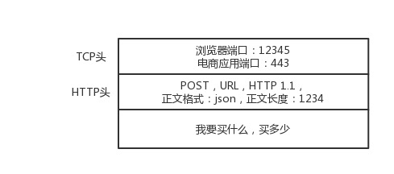
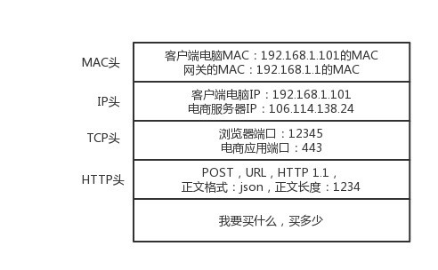
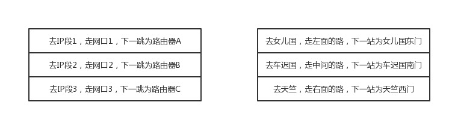
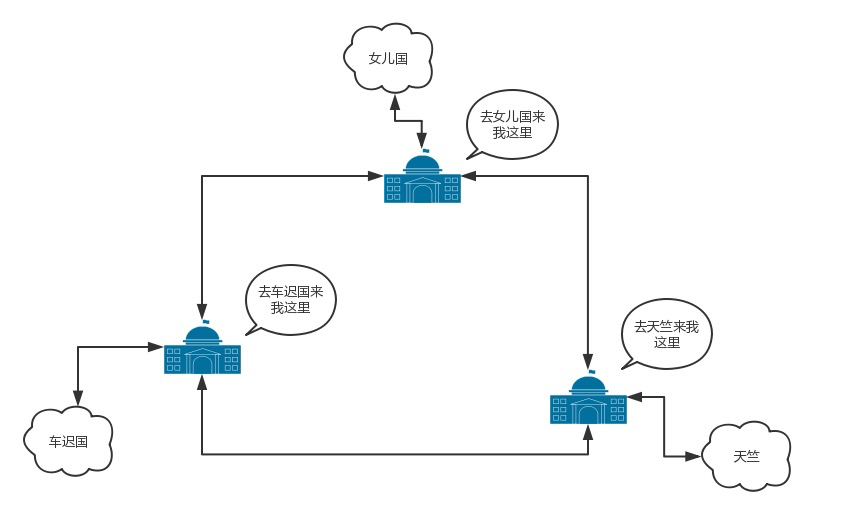
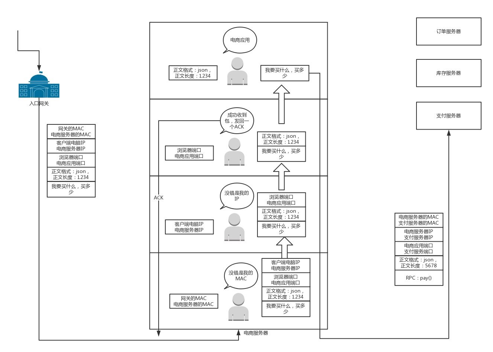
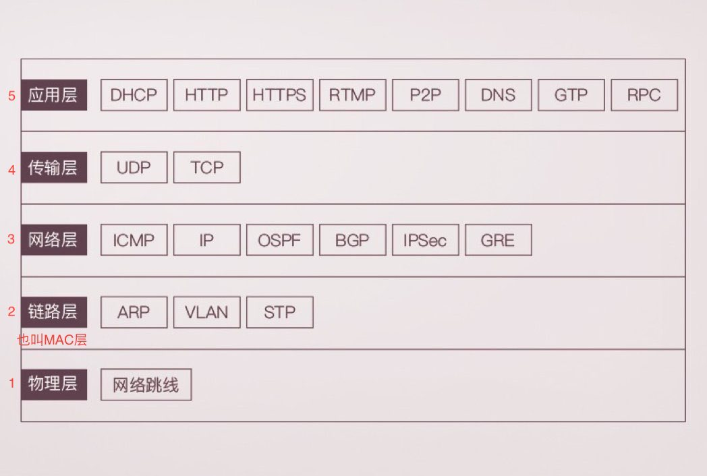

## 趣谈网络协议-1-为什么要学习网络协议？

```
public class HelloWorld {
  public static void main(String[] args){
    System.out.println("Hello World!");
  }
}
```

这段文字是人类和计算机沟通的协议，**只有通过这种协议，计算机才知道我们想让它做什么。**


### 1.协议三要素

这种协议还是更接近人类语言，机器不能直接读懂，需要进行翻译，翻译的工作教给<font color=#FF8C00>编译器（compile）</font>。

编译过程的简单表示：



计算机语言作为程序员控制一台计算机工作的协议，具备了协议的三要素。

<font color=#FF8C00>**语法**</font>，就是这一段内容要符合一定的**规则**和**格式**。例如，括号要成对，结束要使用分号等。 

<font color=#FF8C00>**语义**</font>，就是这一段内容要代表某种意义。例如数字减去数字是有意义的，数字减去文本一般来说就没有意义。 

<font color=#FF8C00>**顺序**</font>，就是先干啥，后干啥。例如，可以先加上某个数值，然后再减去某个数值。 


**只有通过网络协议，才能使一大片机器互相协作、共同完成一件事。**

用网易考拉的HTTP一段，来描述协议的三要素：

```
HTTP/1.1 200 OK
Date: Tue, 27 Mar 2018 16:50:26 GMT
Content-Type: text/html;charset=UTF-8
Content-Language: zh-CN
 
<!DOCTYPE html>
<html>
<head>
<base href="https://pages.kaola.com/" />
<meta charset="utf-8"/> <title> 网易考拉 3 周年主会场 </title>
```

首先，符合语法，也就是说，只有按照上面那个格式来，浏览器才认。例如，上来是**状态**，然后是**首部**，然后是**内容**。 

第二，符合语义，就是要按照约定的意思来。例如，状态 200，表述的意思是网页成功返回。如果不成功，就是我们常见的“404”。 

第三，符合顺序，你一点浏览器，就是发送出一个 HTTP 请求，然后才有上面那一串 HTTP 返回的东西。 


### 2.常用的网络协议

通过一个电商网站下单过程，看涉及的网络协议：

1. 在浏览器里面输入网易考拉的URL [https://www.kaola.com](https://www.kaola.com/)；

   然后通过<font color=#FF8C00>DNS</font>（地址簿协议）或<font color=#FF8C00>HTTPDNS</font>（更精准的地址簿协议）；

   最终得到互联网的“门牌号”，IP地址`106.114.138.24` ；

   知道地址，浏览器开始打包发送请求，普通请求使用<font color=#FF8C00>HTTP</font>协议，购物等需要加密传输的使用<font color=#FF8C00>HTTPS</font>协议；



​	DNS、HTTP、HTTPS 所在的层我们称为<font color=#FF8C00>**应用层**</font>。

2. 应用层封装后，浏览器会将包传输给<font color=#FF8C00>**传输层**</font>；

   传输层有两种协议，一种是**无连接**的协议<font color=#FF8C00>UDP</font>，一种是**面向连接**的协议<font color=#FF8C00>TCP</font>。对于支付来讲，往往使用 TCP 协议。所谓的面向连接就是，TCP 会保证这个包能够到达目的地。如果不能到达，就会重新发送，直至到达。

   TCP 协议里面会有两个端口，一个是浏览器监听的端口，一个是电商的服务器监听的端口。操作系统往往通过端口来判断，它得到的包应该给哪个进程。



3. 传输层层封装后，浏览器会将包传输给<font color=#FF8C00>**网络层**</font>（也叫IP层）。这层涉及<font color=#FF8C00>IP协议</font>，IP协议会封装浏览器所在机器的 IP 地址(**源IP地址**)和电商网站所在服务器的 IP 地址（**目标IP地址**）。


​	操作系统既然知道了目标 IP 地址，就开始想如何根据这个门牌号找到目标机器。操作系统往往会判断，这个目标 IP 地址是本地人，还是外地人。如果是本地人，从门牌号就能看出来，但是显然电商网站不在本地，而在遥远的地方。 

​	操作系统知道要离开本地去远方。虽然不知道远方在何处，但是可以这样类比一下：如果去国外要去海关，去外地就要去<font color=#FF8C00>网关</font>。而操作系统启动的时候，就会被 <font color=#FF8C00>DHCP</font>协议配置 IP 地址，以及默认的网关的 IP 地址 **192.168.1.1**。 

​	操作系统如何将 IP 地址发给网关呢？在本地通信基本靠吼，于是操作系统大吼一声，谁是 192.168.1.1 啊？网关会回答它，我就是，我的本地地址在村东头。这个本地地址就是<font color=#FF8C00>MAC地址</font>，而大吼的那一声是<font color=#FF8C00>ARP协议</font>。 



4. 于是操作系统将 IP 包交给了下一层，也就是<font color=#FF8C00>MAC层</font>(也叫<font color=#FF8C00>数据链路层</font>)。网卡再将包发出去。由于这个包里面是有 MAC 地址的，因而它能够到达网关（最接近它的网关）。 

   网关收到包之后，会根据自己的知识，判断下一步应该怎么走。网关往往是一个**路由器**，它有一个**路由表**，指导到某个 IP 地址应该怎么走。 

   路由器有点像玄奘西行路过的一个个国家的一个个城关。每个城关都连着两个国家，每个国家相当于一个局域网，在每个国家内部，都可以使用本地的地址 MAC 进行通信。 

   一旦跨越城关，就需要拿出 IP 头来，里面写着贫僧来自东土大唐（就是源 IP 地址），欲往西天拜佛求经（指的是目标 IP 地址）。路过宝地，借宿一晚，明日启行，请问接下来该怎么走啊？ 



​	城关往往是知道这些“知识”的，因为城关和临近的城关也会经常沟通。到哪里应该怎么走，这种沟通的协议称为<font color=#FF8C00>路由协议</font>，常用的有<font color=#FF8C00>OSPF</font>和<font color=#FF8C00>BGP</font>。



5. 城关与城关之间是一个国家，当网络包知道了下一步去哪个城关，还是要使用国家内部的 MAC 地址，通过下一个城关的 MAC 地址，找到下一个城关，然后再问下一步的路怎么走，一直到走出最后一个城关。 

   最后一个城关知道这个网络包要去的地方。于是，对着这个国家吼一声，谁是目标 IP 啊？目标服务器就会回复一个 MAC 地址。网络包过关后，通过这个 MAC 地址就能找到目标服务器。 

   目标服务器发现 MAC 地址对上了，取下 MAC 头来，发送给操作系统的网络层。发现 IP 也对上了，就取下 IP 头。IP 头里会写上一层封装的是 TCP 协议，然后将其交给**传输层**，即**TCP层**。 

   在这一层里，对于收到的每个包，都会有一个回复的包说明收到了。这个回复的包绝非这次下单请求的结果，例如购物是否成功，扣了多少钱等，而仅仅是 TCP 层的一个说明，即*收到之后的回复*。当然这个回复，会沿着刚才来的方向走回去，报个平安。 

   因为一旦出了国门，西行路上千难万险，如果在这个过程中，网络包走丢了，例如进了大沙漠，或者被强盗抢劫杀害怎么办呢？因而到了要报个平安。 

6. 如果过一段时间还是没到，发送端的 TCP 层会重新发送这个包，还是上面的过程，直到有一天收到平安到达的回复。**这个重试绝非你的浏览器重新将下单这个动作重新请求一次。**对于浏览器来讲，就发送了一次下单请求，TCP 层不断自己闷头重试。除非 TCP这一层出了问题，例如连接断了，才轮到浏览器的应用层重新发送下单请求。 

   当网络包平安到达 TCP层之后，TCP头中有目标端口号，通过这个端口号，可以找到电商网站的进程正在监听这个端口号，假设一个 Tomcat，将这个包发给电商网站。 



7. 电商网站的进程得到 HTTP 请求的内容，知道了要买东西，买多少。往往一个电商网站最初接待请求的这个 Tomcat 只是个接待员，负责统筹处理这个请求，而不是所有的事情都自己做。例如，这个接待员要告诉专门管理订单的进程，登记要买某个商品，买多少，要告诉管理库存的进程，库存要减少多少，要告诉支付的进程，应该付多少钱，等等。 

   如何告诉相关的进程呢？往往通过<font color=#FF8C00> **RPC调用**</font>，即远程过程调用的方式来实现。远程过程调用就是当告诉管理订单进程的时候，接待员不用关心中间的网络互连问题，会由 RPC框架统一处理。RPC 框架有很多种，有基于 HTTP 协议放在 HTTP 的报文里面的，有直接封装在 TCP 报文里面的。 

   当接待员发现相应的部门都处理完毕，就回复一个 HTTPS 的包，告知下单成功。这个 HTTPS 的包，会像来的时候一样，经过千难万险到达你的个人电脑，最终进入浏览器，显示支付成功。 


### 3.网络协议总结





### 4.问题

1. **mac地址是唯一的，为什么可以修改?**  

   想想身份证，身份证号是唯一的，不能改变的，但是可以造假。mac地址全球唯一，它是固化在网卡里的。网卡毕竟是个硬件，需要软件支持，既操作系统识别。重点来了，操作系统识别出来的mac地址是可以更改的，它只不过是一个字符串。我们常说的修改mac指的是修改电脑中记录的既注册表中的记录。

2. **有了mac地址为什么还要有ip地址。**  

   这两个相当于出生地和现居地址。身份证号是你的唯一标识，不会重复，一落户就有（网卡一出厂就有mac）。现在我要和你通信（写信给你），地址用你的姓名+身份证，信能送到你手上吗?明显不能！身份证号前六位能定位你出生的县。mac地址前几位也可以定位生产厂家。但是你出生后会离开这个县（哪怕在这个县，也不能具体找到你）。所以一般写个人信息就要有出生地和现居地址了。