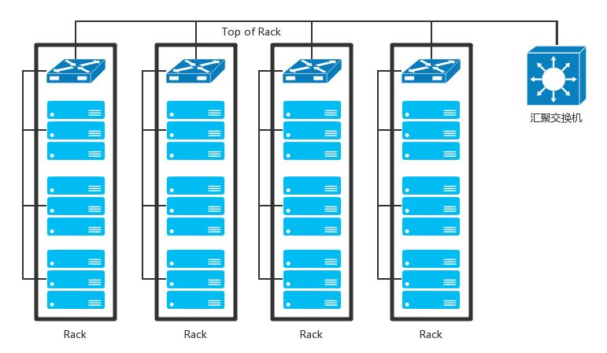
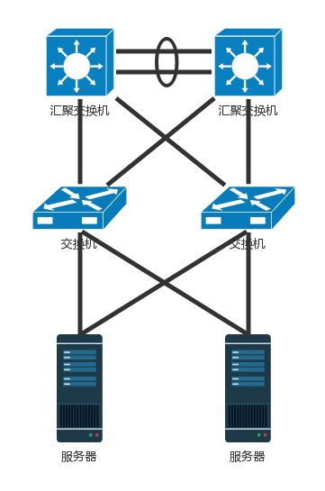
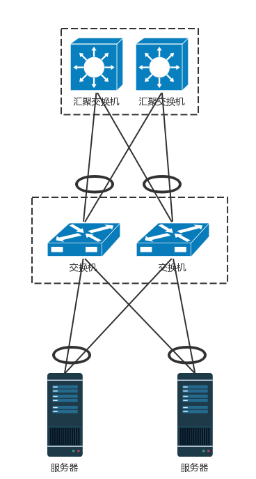
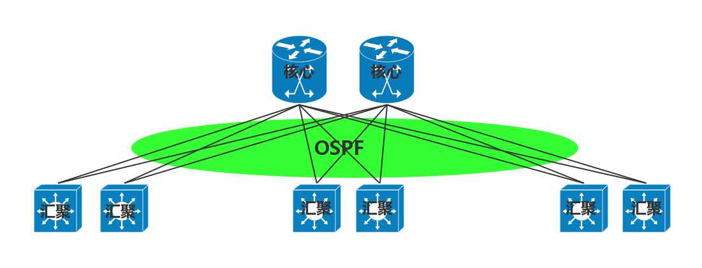
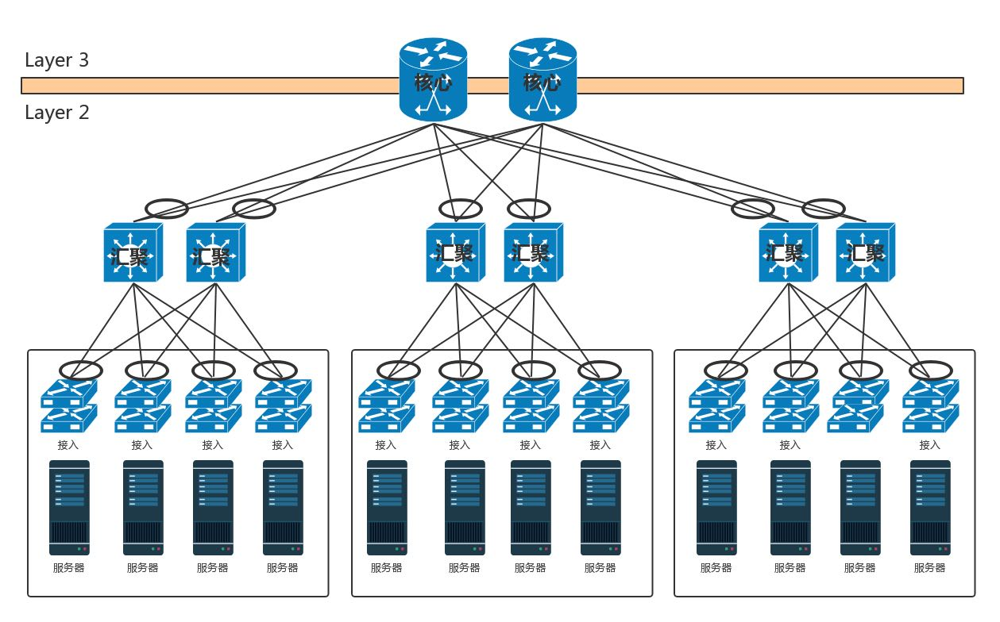
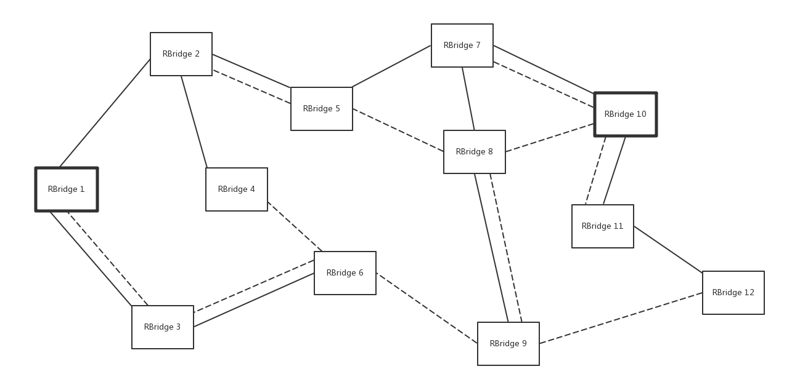
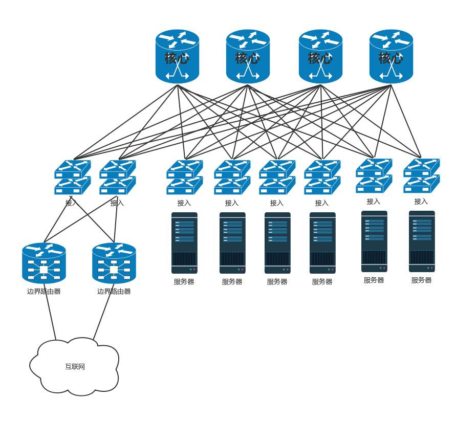

## 趣谈网络协议-21-数据中心：我是开发商，自己拿地盖别墅

无论你是看新闻、下订单、看视频、下载文件，最终访问的目的地都在数据中心里面。我们前面学了这么多的网络协议和网络相关的知识，你是不是很好奇，数据中心究竟长啥样呢？

数据中心是一个大杂烩，几乎要用到前面学过的所有知识。

前面讲办公室网络的时候，我们知道办公室里面有很多台电脑。如果要访问外网，需要经过一个叫网关的东西，而**网关**往往是一个路由器。

数据中心里面也有一大堆的电脑，但是它和咱们办公室里面的笔记本或者台式机不一样。数据中心里面是服务器。服务器被放在一个个叫作**机架**（**Rack**）的架子上面。

数据中心的入口和出口也是路由器，由于在数据中心的边界，就像在一个国家的边境，称为**边界路由器**（Border Router）。为了高可用，边界路由器会有多个。

一般家里只会连接一个运营商的网络，而为了高可用， 为了当一个运营商出问题的时候，还可以通过另外一个运营商来提供服务，所以数据中心的边界路由器会连接<u>多个运营商网络</u>。

既然是路由器，就需要跑路由协议，数据中心往往就是路由协议中的自治区域（AS）。数据中心里面的机器要想访问外面的网站，数据中心里面也是有对外提供服务的机器，都可以通过 BGP协议，获取内外互通的路由信息。这就是我们常听到的**多线BGP**的概念。

如果数据中心非常简单，没几台机器，那就像家里或者宿舍一样，所有的服务器都直接连到路由器上就可以了。但是数据中心里面往往有非常多的机器，当塞满一机架的时候，需要有交换机将这些服务器连接起来，可以互相通信。

这些交换机往往是放在机架顶端的，所以经常称为**TOR**（Top Of Rack）**交换机**。这一层的交换机常常称为**接入层**（Access Layer）。注意这个接入层和原来讲过的应用的接入层不是一个概念。

当一个机架放不下的时候，就需要多个机架，还需要有交换机将多个机架连接在一起。这些交换机对性能的要求更高，带宽也更大。这些交换机称为**汇聚层交换机**（Aggregation Layer）。

数据中心里面的每一个连接都是需要考虑高可用的。这里首先要考虑的是，如果一台机器只有一个网卡，上面连着一个网线，接入到 TOR 交换机上。如果网卡坏了，或者不小心网线掉了，机器就上不去了。所以，需要至少两个网卡、两个网线插到 TOR 交换机上，但是两个网卡要工作得像一张网卡一样，这就是常说的**网卡绑定**（bond）。

这就需要服务器和交换机都支持一种协议**LACP**（Link Aggregation Control Protocol）。它们互相通信，将多个网卡聚合称为一个网卡，多个网线聚合成一个网线，在网线之间可以进行负载均衡，也可以为了高可用作准备。

网卡有了高可用保证，但交换机还有问题。如果一个机架只有一个交换机，它挂了，那整个机架都不能上网了。因而 TOR 交换机也需要高可用，同理接入层和汇聚层的连接也需要高可用性，也不能单线连着。

最传统的方法是，部署两个接入交换机、两个汇聚交换机。服务器和两个接入交换机都连接，接入交换机和两个汇聚都连接，当然这样会形成环，所以需要启用 STP 协议，去除环，但是这样两个汇聚就只能一主一备了。STP 协议里我们学过，只有一条路会起作用。

交换机有一种技术叫作**堆叠**，所以另一种方法是，将多个交换机形成一个逻辑的交换机，服务器通过多根线分配连到多个接入层交换机上，而接入层交换机多根线分别连接到多个交换机上，并且通过堆叠的私有协议，形成**双活**的连接方式。

由于对带宽要钱求更大，而且挂了影响也更大，所以两个堆叠可能就不够了，可以就会有更多的，比如四个堆叠为一个逻辑的交换机。

汇聚层将大量的计算节点相互连接在一起，形成一个集群。在这个集群里面，服务器之间通过二层互通，这个区域常称为一个**POD**（Point Of Delivery），有时候也称为一个**可用区**（Available Zone）。

当节点数目再多的时候，一个可用区放不下，需要将多个可用区连在一起，连接多个可用区的交换机称为**核心交换机**。

核心交换机吞吐量更大，高可用要求更高，肯定需要堆叠，但是往往仅仅堆叠，不足以满足吞吐量，因而还是需要部署多组核心交换机。核心和汇聚交换机之间为了高可用，也是全互连模式的。

这个时候还存在那个问题，出现环路怎么办？

一种方式是，不同的可用区在不同的二层网络，需要分配不同的网段。汇聚和核心之间通过三层网络互通的，二层都不在一个广播域里面，不会存在二层环路的问题。三层有环是没有问题的，只要通过路由协议选择最佳的路径就可以了。那为啥二层不能有环路，而三层可以呢？你可以回忆一下二层环路的情况。

如图，核心层和汇聚层之间通过内部的路由协议 OSPF，找到最佳的路径进行访问，而且还可以通过 ECMP等价路由，在多个路径之间进行负载均衡和高可用。

但是随着数据中心里面的机器越来越多，尤其是有了云计算、大数据，集群规模非常大，而且都要求在一个二层网络里面。这就需要二层互连从**汇聚层**上升为**核心层**，也即在核心以下，全部是二层互连，全部在一个广播域里面，这就是常说的**大二层**。

如果大二层横向流量不大，核心交换机数目不多，可以做堆叠，但是如果横向流量很大，仅仅堆叠满足不了，就需要部署多组核心交换机，而且要和汇聚层进行全互连。由于堆叠只解决一个核心交换机组内的无环问题，而组之间全互连，还需要其他机制进行解决。

如果是 STP，那部署多组核心无法扩大横向流量的能力，因为还是只有一组起作用。

于是大二层就引入了**TRILL**（Transparent Interconnection of Lots of Link），即**多链接透明互联协议**。它的基本思想是，二层环有问题，三层环没有问题，那就把三层的路由能力模拟在二层实现。

运行TRILL协议的交换机称为**RBridge**，是**具有路由转发特性的网桥设备**，只不过这个路由是根据 MAC 地址来的，不是根据 IP 来的。

Rbridage 之间通过**链路状态协议**运作。记得这个路由协议吗？通过它可以学习整个大二层的拓扑，知道访问哪个 MAC 应该从哪个网桥走；还可以计算最短的路径，也可以通过等价的路由进行负载均衡和高可用性。

TRILL 协议在原来的 MAC 头外面加上自己的头，以及外层的 MAC 头。TRILL 头里面的 Ingress RBridge，有点像 IP 头里面的源 IP 地址，Egress RBridge 是目标 IP 地址，这两个地址是端到端的，在中间路由的时候，不会发生改变。而外层的 MAC，可以有下一跳的 Bridge，就像路由的下一跳，也是通过 MAC 地址来呈现的一样。

如图中所示的过程，有一个包要从主机 A 发送到主机 B，中间要经过 RBridge 1、RBridge 2、RBridge X 等等，直到 RBridge 3。在 RBridge 2 收到的包里面，分内外两层，内层就是传统的主机 A 和主机 B 的 MAC 地址以及内层的 VLAN。

在外层首先加上一个 TRILL 头，里面描述这个包从 RBridge 1 进来的，要从 RBridge 3 出去，并且像三层的 IP 地址一样有跳数。然后再外面，目的 MAC 是 RBridge 2，源 MAC 是 RBridge 1，以及外层的 VLAN。

当 RBridge 2 收到这个包之后，首先看 MAC 是否是自己的 MAC，如果是，要看自己是不是 Egress RBridge，也即是不是最后一跳；如果不是，查看跳数是不是大于 0，然后通过类似路由查找的方式找到下一跳 RBridge X，然后将包发出去。

RBridge 2 发出去的包，内层的信息是不变的，外层的 TRILL 头里面。同样，描述这个包从 RBridge 1 进来的，要从 RBridge 3 出去，但是跳数要减 1。外层的目标 MAC 变成 RBridge X，源 MAC 变成 RBridge 2。

如此一直转发，直到 RBridge 3，将外层解出来，发送内层的包给主机 B。

这个过程是不是和 IP 路由很像？

对于大二层的广播包，也需要通过分发树的技术来实现。我们知道 STP 是将一个有环的图，通过去掉边形成一棵树，而分发树是一个有环的图形成多棵树，不同的树有不同的 VLAN，有的广播包从 VLAN A 广播，有的从 VLAN B 广播，实现负载均衡和高可用。

核心交换机之外，就是边界路由器了。至此从服务器到数据中心边界的层次情况已经清楚了。

在核心交换上面，往往会挂一些安全设备，例如入侵检测、DDoS 防护等等。这是整个数据中心的屏障，防止来自外来的攻击。核心交换机上往往还有负载均衡器，原理前面的章节已经说过了。

在有的数据中心里面，对于存储设备，还会有一个存储网络，用来连接 SAN 和 NAS。但是对于新的云计算来讲，往往不使用传统的 SAN 和 NAS，而使用部署在 x86 机器上的软件定义存储，这样存储也是服务器了，而且可以和计算节点融合在一个机架上，从而更加有效率，也就没有了单独的存储网络了。

于是整个数据中心的网络如下图所示。

这是一个典型的三层网络结构。这里的三层不是指 IP 层，而是指接入层、汇聚层、核心层三层。这种模式非常有利于外部流量请求到内部应用。这个类型的流量，是从外到内或者从内到外，对应到上面那张图里，就是从上到下，从下到上，上北下南，所以称为**南北流量**。

但是随着云计算和大数据的发展，节点之间的交互越来越多，例如大数据计算经常要在不同的节点将数据拷贝来拷贝去，这样需要经过交换机，使得数据从左到右，从右到左，左西右东，所以称为**东西流量**。

为了解决东西流量的问题，演进出了**叶脊网络**（Spine/Leaf）。

- **叶子交换机**（leaf），直接连接物理服务器。L2/L3 网络的分界点在叶子交换机上，叶子交换机之上是三层网络。
- **脊交换机**（spine switch），相当于核心交换机。叶脊之间通过 ECMP 动态选择多条路径。脊交换机现在只是为叶子交换机提供一个弹性的 L3 路由网络。南北流量可以不用直接从脊交换机发出，而是通过与 leaf 交换机并行的交换机，再接到边界路由器出去。

传统的三层网络架构是垂直的结构，而叶脊网络架构是扁平的结构，更易于水平扩展。

### 小结和补充

- 数据中心分为三层。服务器连接到**接入层**，然后是汇聚层，再然后是**核心层**，最外面是**边界路由器**和**安全设备**。
- 数据中心的所有链路都需要**高可用性**。服务器需要**绑定网卡**，交换机需要堆叠，三层设备可以通过**等价路由**，二层设备可以通过 **TRILL协议**。
- 随着云和大数据的发展，东西流量相对于南北流量越来越重要，因而演化为叶脊网络结构。

- 对于数据中心来讲，高可用是非常重要的，每个设备都要考虑高可用，那跨机房的高可用，你知道应该怎么做吗？

- 前面说的浏览新闻、购物、下载、看视频等行为，都是普通用户通过公网访问数据中心里面的资源。那 IT 管理员应该通过什么样的方式访问数据中心呢？