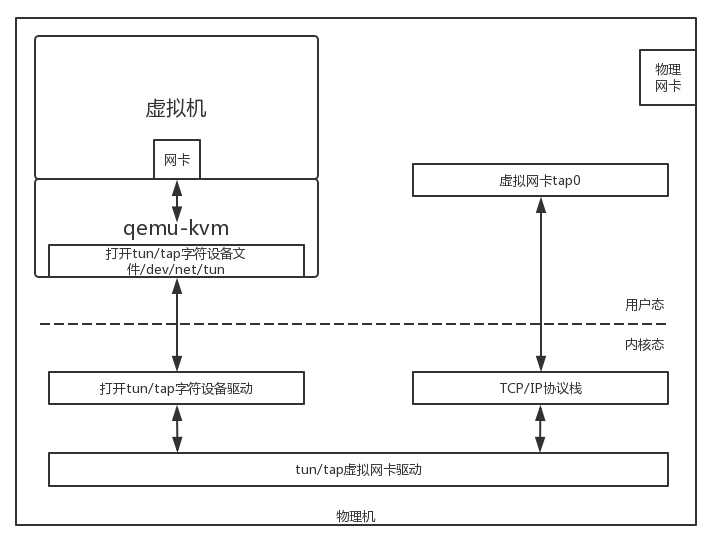
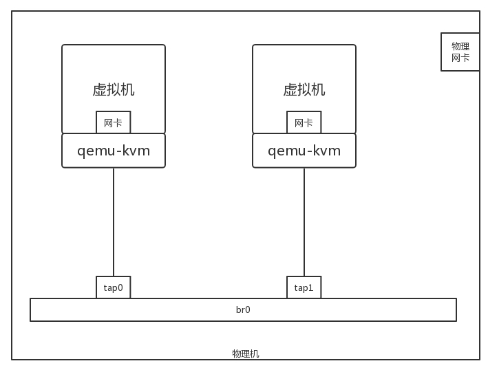
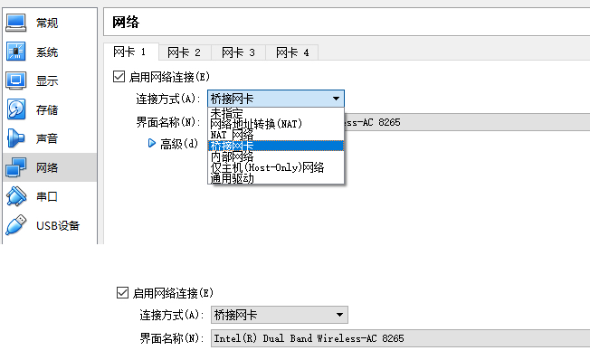
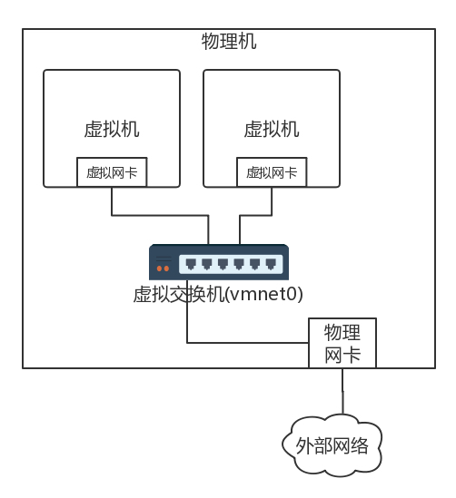
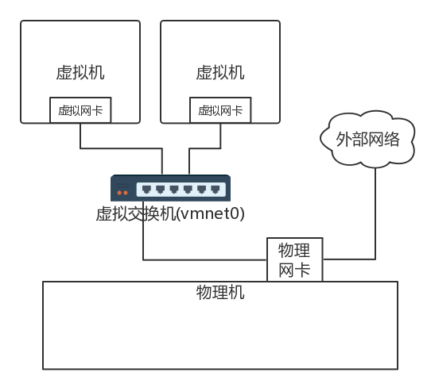
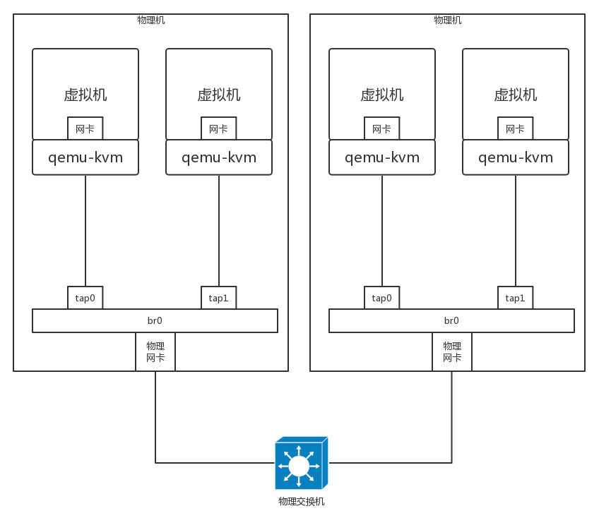
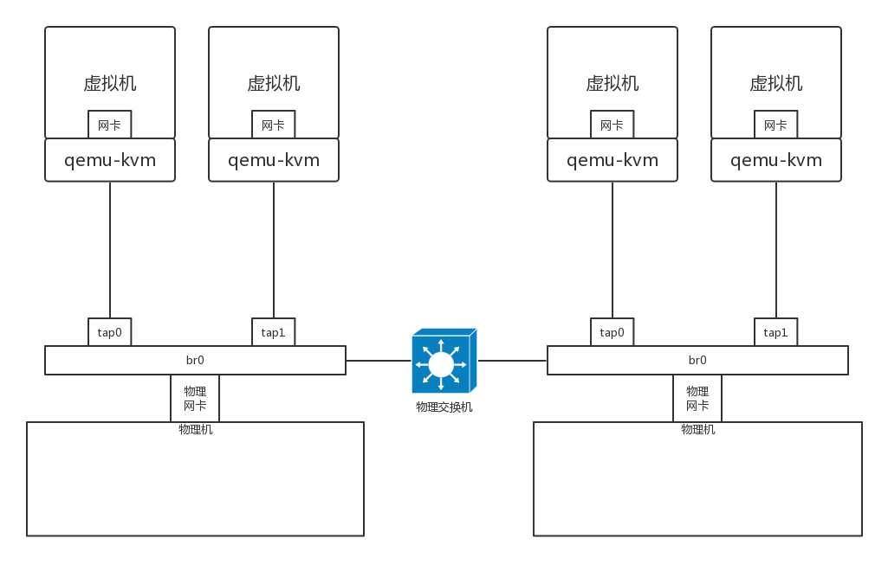
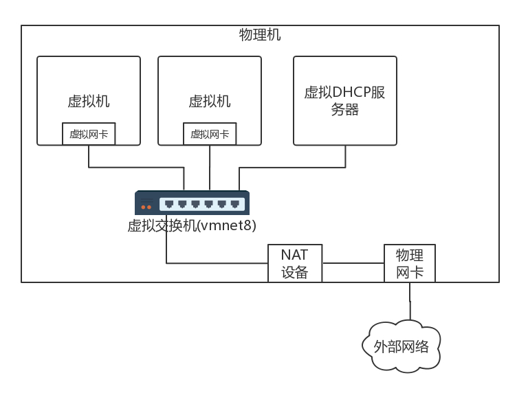
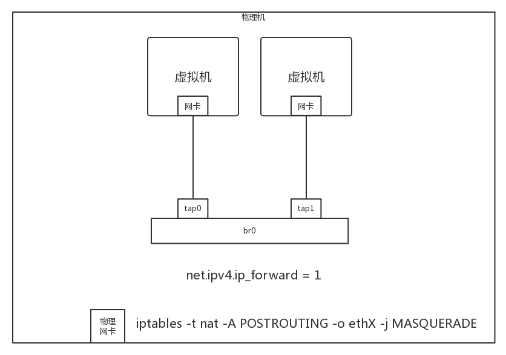

## 趣谈网络协议-24-云中网络：自己拿地成本高，购买公寓更灵活

前面我们讲了，数据中心里面堆着一大片一大片的机器，用网络连接起来，机器数目一旦非常多，人们就发现，维护这么一大片机器还挺麻烦的，有好多不灵活的地方。

采购不灵活：如果客户需要一台电脑，那就需要自己采购、上架、插网线、安装操作系统，周期非常长。一旦采购了，一用就 N 年，不能退货，哪怕业务不做了，机器还在数据中心里留着。
运维不灵活：一旦需要扩容 CPU、内存、硬盘，都需要去机房手动弄，非常麻烦。
规格不灵活：采购的机器往往动不动几百 G 的内存，而每个应用往往可能只需要 4 核 8G，所以很多应用混合部署在上面，端口各种冲突，容易相互影响。
复用不灵活：一台机器，一旦一个用户不用了，给另外一个用户，那就需要重装操作系统。因为原来的操作系统可能遗留很多数据，非常麻烦。

### 1.从物理机到虚拟机

为了解决这些问题，人们发明了一种叫虚拟机的东西，并基于它产生了云计算技术。

其实在你的个人电脑上，就可以使用虚拟机。如果你对虚拟机没有什么概念，你可以下载一个桌面虚拟化的软件，自己动手尝试一下。它可以让你灵活地指定 CPU 的数目、内存的大小、硬盘的大小，可以有多个网卡，然后在一台笔记本电脑里面创建一台或者多台虚拟电脑。不用的时候，一点删除就没有了。

在数据中心里面，也有一种类似的开源技术 qemu-kvm，能让你在一台巨大的物理机里面，掏出一台台小的机器。这套软件就能解决上面的问题：一点就能创建，一点就能销毁。你想要多大就有多大，每次创建的系统还都是新的。

我们常把物理机比喻为自己拿地盖房子，而虚拟机则相当于购买公寓，更加灵活方面，随时可买可卖。 那这个软件为什么能做到这些事儿呢？

它用的是软件模拟硬件的方式。刚才说了，数据中心里面用的 qemu-kvm。从名字上来讲，emu 就是 Emulator（模拟器）的意思，主要会模拟 CPU、内存、网络、硬盘，使得虚拟机感觉自己在使用独立的设备，但是真正使用的时候，当然还是使用物理的设备。

例如，多个虚拟机轮流使用物理 CPU，内存也是使用虚拟内存映射的方式，最终映射到物理内存上。硬盘在一块大的文件系统上创建一个 N 个 G 的文件，作为虚拟机的硬盘。

简单比喻，虚拟化软件就像一个“骗子”，向上“骗”虚拟机里面的应用，让它们感觉独享资源，其实自己啥都没有，全部向下从物理机里面弄。

### 2.虚拟网卡的原理

那网络是如何“骗”应用的呢？如何将虚拟机的网络和物理机的网络连接起来？

首先，虚拟机要有一张网卡。对于 qemu-kvm 来说，这是通过 Linux 上的一种 TUN/TAP 技术来实现的。

虚拟机是物理机上跑着的一个软件。这个软件可以像其他应用打开文件一样，打开一个称为 TUN/TAP 的 Char Dev（字符设备文件）。打开了这个字符设备文件之后，在物理机上就能看到一张虚拟 TAP 网卡。

虚拟化软件作为“骗子”，会将打开的这个文件，在虚拟机里面虚拟出一张网卡，让虚拟机里面的应用觉得它们真有一张网卡。于是，所有的网络包都往这里发。

当然，网络包会到虚拟化软件这里。它会将网络包转换成为文件流，写入字符设备，就像写一个文件一样。内核中 TUN/TAP 字符设备驱动会收到这个写入的文件流，交给 TUN/TAP 的虚拟网卡驱动。这个驱动将文件流再次转成网络包，交给 TCP/IP 协议栈，最终从虚拟 TAP 网卡发出来，成为标准的网络包。

就这样，几经转手，数据终于从虚拟机里面，发到了虚拟机外面。

### 3.虚拟网卡连接到云中

我们就这样有了虚拟 TAP 网卡。接下来就要看，这个卡怎么接入庞大的数据中心网络中。

在接入之前，我们先来看，云计算中的网络都需要注意哪些点。

共享：尽管每个虚拟机都会有一个或者多个虚拟网卡，但是物理机上可能只有有限的网卡。那这么多虚拟网卡如何共享同一个出口？
隔离：分两个方面，一个是安全隔离，两个虚拟机可能属于两个用户，那怎么保证一个用户的数据不被另一个用户窃听？一个是流量隔离，两个虚拟机，如果有一个疯狂下片，会不会导致另外一个上不了网？
互通：分两个方面，一个是如果同一台机器上的两个虚拟机，属于同一个用户的话，这两个如何相互通信？另一个是如果不同物理机上的两个虚拟机，属于同一个用户的话，这两个如何相互通信？
灵活：虚拟机和物理不同，会经常创建、删除，从一个机器漂移到另一台机器，有的互通、有的不通等等，灵活性比物理网络要好得多，需要能够灵活配置。

### 4.共享与互通问题

这些问题，我们一个个来解决。

首先，一台物理机上有多个虚拟机，有多个虚拟网卡，这些虚拟网卡如何连在一起，进行相互访问，并且可以访问外网呢？

还记得我们在大学宿舍里做的事情吗？你可以想象你的物理机就是你们宿舍，虚拟机就是你的个人电脑，这些电脑应该怎么连接起来呢？当然应该买一个交换机。

在物理机上，应该有一个虚拟的交换机，在 Linux 上有一个命令叫作 brctl，可以创建虚拟的网桥 brctl addbr br0。创建出来以后，将两个虚拟机的虚拟网卡，都连接到虚拟网桥 brctl addif br0 tap0 上，这样将两个虚拟机配置相同的子网网段，两台虚拟机就能够相互通信了。

那这些虚拟机如何连外网呢？在桌面虚拟化软件上面，我们能看到以下选项。

这里面，host-only 的网络对应的，其实就是上面两个虚拟机连到一个 br0 虚拟网桥上，而且不考虑访问外部的场景，只要虚拟机之间能够相互访问就可以了。

如果要访问外部，往往有两种方式。

一种方式称为**桥接**。如果在桌面虚拟化软件上选择桥接网络，则在你的笔记本电脑上，就会形成下面的结构。

每个虚拟机都会有虚拟网卡，在你的笔记本电脑上，会发现多了几个网卡，其实是虚拟交换机。这个虚拟交换机将虚拟机连接在一起。在桥接模式下，物理网卡也连接到这个虚拟交换机上，物理网卡在桌面虚拟化软件上，在“界面名称”那里选定。

如果使用桥接网络，当你登录虚拟机里看 IP 地址的时候会发现，你的虚拟机的地址和你的笔记本电脑的，以及你旁边的同事的电脑的网段是一个网段。这是为什么呢？这其实相当于将物理机和虚拟机放在同一个网桥上，相当于这个网桥上有三台机器，是一个网段的，全部打平了。我将图画成下面的样子你就好理解了。

在数据中心里面，采取的也是类似的技术，只不过都是 Linux，在每台机器上都创建网桥 br0，虚拟机的网卡都连到 br0 上，物理网卡也连到 br0 上，所有的 br0 都通过物理网卡出来连接到物理交换机上。

同样我们换一个角度看待这个拓扑图。同样是将网络打平，虚拟机会和你的物理网络具有相同的网段。

在这种方式下，不但解决了同一台机器的互通问题，也解决了跨物理机的互通问题，因为都在一个二层网络里面，彼此用相同的网段访问就可以了。但是当规模很大的时候，会存在问题。

你还记得吗？在一个二层网络里面，最大的问题是广播。一个数据中心的物理机已经很多了，广播已经非常严重，需要通过 VLAN 进行划分。如果使用了虚拟机，假设一台物理机里面创建 10 台虚拟机，全部在一个二层网络里面，那广播就会很严重，所以除非是你的桌面虚拟机或者数据中心规模非常小，才可以使用这种相对简单的方式。

另外一种方式称为**NAT**。如果在桌面虚拟化软件中使用 NAT 模式，在你的笔记本电脑上会出现如下的网络结构。

在这种方式下，你登录到虚拟机里面查看 IP 地址，会发现虚拟机的网络是虚拟机的，物理机的网络是物理机的，两个不相同。虚拟机要想访问物理机的时候，需要将地址 NAT 成为物理机的地址。

除此之外，它还会在你的笔记本电脑里内置一个 DHCP 服务器，为笔记本电脑上的虚拟机动态分配 IP 地址。因为虚拟机的网络自成体系，需要进行 IP 管理。为什么桥接方式不需要呢？因为桥接将网络打平了，虚拟机的 IP 地址应该由物理网络的 DHCP 服务器分配。

在数据中心里面，也是使用类似的方式。这种方式更像是真的将你宿舍里面的情况，搬到一台物理机上来。

虚拟机是你的电脑，路由器和 DHCP Server 相当于家用路由器或者寝室长的电脑，物理网卡相当于你们宿舍的外网网口，用于访问互联网。所有电脑都通过内网网口连接到一个网桥 br0 上，虚拟机要想访问互联网，需要通过 br0 连到路由器上，然后通过路由器将请求 NAT 成为物理网络的地址，转发到物理网络。

如果是你自己登录到物理机上做个简单配置，你可以简化一下。例如将虚拟机所在网络的网关的地址直接配置到 br0 上，不用 DHCP Server，手动配置每台虚拟机的 IP 地址，通过命令 iptables -t nat -A POSTROUTING -o ethX -j MASQUERADE，直接在物理网卡 ethX 上进行 NAT，所有从这个网卡出去的包都 NAT 成这个网卡的地址。通过设置 net.ipv4.ip_forward = 1，开启物理机的转发功能，直接做路由器，而不用单独的路由器，这样虚拟机就能直接上网了。

### 5.隔离问题

解决了互通的问题，接下来就是隔离的问题。

如果一台机器上的两个虚拟机不属于同一个用户，怎么办呢？好在 brctl 创建的网桥也是支持 VLAN 功能的，可以设置两个虚拟机的 tag，这样在这个虚拟网桥上，两个虚拟机是不互通的。

但是如何跨物理机互通，并且实现 VLAN 的隔离呢？由于 brctl 创建的网桥上面的 tag 是没办法在网桥之外的范围内起作用的，于是我们需要寻找其他的方式。

有一个命令**vconfig**，可以基于物理网卡 eth0 创建带 VLAN 的虚拟网卡，所有从这个虚拟网卡出去的包，都带这个 VLAN，如果这样，跨物理机的互通和隔离就可以通过这个网卡来实现。

首先为每个用户分配不同的 VLAN，例如有一个用户 VLAN 10，一个用户 VLAN 20。在一台物理机上，基于物理网卡，为每个用户用 vconfig 创建一个带 VLAN 的网卡。不同的用户使用不同的虚拟网桥，带 VLAN 的虚拟网卡也连接到虚拟网桥上。

这样是否能保证两个用户的隔离性呢？不同的用户由于网桥不通，不能相互通信，一旦出了网桥，由于 VLAN 不同，也不会将包转发到另一个网桥上。另外，出了物理机，也是带着 VLAN ID 的。只要物理交换机也是支持 VLAN 的，到达另一台物理机的时候，VLAN ID 依然在，它只会将包转发给相同 VLAN 的网卡和网桥，所以跨物理机，不同的 VLAN 也不会相互通信。

使用 brctl 创建出来的网桥功能是简单的，基于 VLAN 的虚拟网卡也能实现简单的隔离。但是这都不是大规模云平台能够满足的，一个是 VLAN 的隔离，数目太少。前面我们学过，VLAN ID 只有 4096 个，明显不够用。另外一点是这个配置不够灵活。谁和谁通，谁和谁不通，流量的隔离也没有实现，还有大量改进的空间。

### 小结

- 云计算的关键技术是虚拟化，这里我们重点关注的是，虚拟网卡通过打开 TUN/TAP 字符设备的方式，将虚拟机内外连接起来；
- 云中的网络重点关注四个方面，共享、隔离、互通、灵活。其中共享和互通有两种常用的方式，分别是桥接和 NAT，隔离可以通过 VLAN 的方式。

### 问题

1. 为了直观，这一节的内容我们以桌面虚拟化系统举例。在数据中心里面，有一款著名的开源软件 OpenStack，这一节讲的网络连通方式对应 OpenStack 中的哪些模型呢？
2. 这一节的最后，我们也提到了，本节提到的网络配置方式比较不灵活，你知道什么更加灵活的方式吗？