## 28-云中网络的隔离GRE、VXLAN：虽然住一个小区，也要保护隐私

对于云平台中的隔离问题，前面咱们用的策略一直都是 VLAN，但是我们也说过这种策略的问题，VLAN 只有 12 位，共 4096 个。当时设计的时候，看起来是够了，但是现在绝对不够用，怎么办呢？

**一种方式是修改这个协议**。这种方法往往不可行，因为当这个协议形成一定标准后，千千万万设备上跑的程序都要按这个规则来。现在说改就放，谁去挨个儿告诉这些程序呢？很显然，这是一项不可能的工程。

**另一种方式就是扩展**，在原来包的格式的基础上扩展出一个头，里面包含足够用于区分租户的 ID，外层的包的格式尽量和传统的一样，依然兼容原来的格式。一旦遇到需要区分用户的地方，我们就用这个特殊的程序，来处理这个特殊的包的格式。

这个概念很像咱们[22-VPN：朝中有人好做官](NP-22.md)讲过的**隧道理论**，还记得自驾游通过摆渡轮到海南岛的那个故事吗？在那一节，我们说过，扩展的包头主要是用于加密的，而我们现在需要的包头是要能够区分用户的。

底层的物理网络设备组成的网络我们称为**Underlay网络**，而用于虚拟机和云中的这些技术组成的网络称为**Overlay网络**，这是一种**基于物理网络的虚拟化网络实现**。这一节我们重点讲两个 Overlay的网络技术。

### 1. GRE

第一个技术是GRE，全称 **Generic Routing Encapsulation**，它是一种 IP-over-IP 的隧道技术。它将 IP 包封装在 GRE包里，外面加上 IP 头，在隧道的一端封装数据包，并在通路上进行传输，到另外一端的时候解封装。你可以认为 Tunnel 是一个虚拟的、点对点的连接。

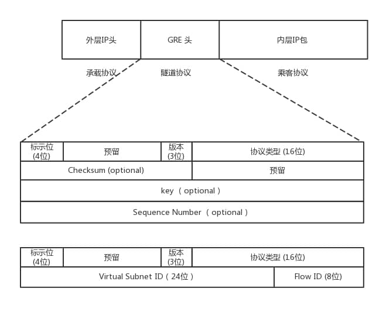

从这个图中可以看到，在 GRE 头中，前 32 位是一定会有的，后面的都是可选的。在前 4 位标识位里面，有标识后面到底有没有可选项？这里面有个很重要的 key 字段，是一个 32 位的字段，里面存放的往往就是用于区分用户的 Tunnel ID。32 位，够任何云平台喝一壶的了！

下面的格式类型专门用于网络虚拟化的 GRE 包头格式，称为**NVGRE**，也给网络 ID 号 24 位，也完全够用了。

除此之外，GRE 还需要有一个地方来封装和解封装 GRE 的包，这个地方往往是路由器或者有路由功能的 Linux 机器。

使用 GRE 隧道，传输的过程就像下面这张图。这里面有两个网段、两个路由器，中间要通过 GRE 隧道进行通信。当隧道建立之后，会多出两个 Tunnel 端口，用于封包、解封包。

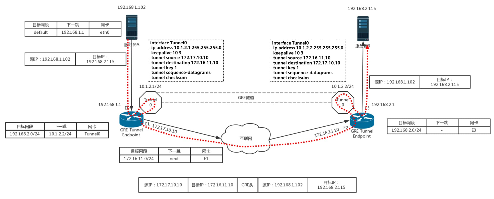

1. 主机 A 在左边的网络，IP 地址为 192.168.1.102，它想要访问主机 B，主机 B 在右边的网络，IP 地址为 192.168.2.115。于是发送一个包，源地址为 192.168.1.102，目标地址为 192.168.2.115。因为要跨网段访问，于是根据默认的 default 路由表规则，要发给默认的网关 192.168.1.1，也即左边的路由器。
2. 根据路由表，从左边的路由器，去 192.168.2.0/24 这个网段，应该走一条 GRE 的隧道，从隧道一端的网卡 Tunnel0 进入隧道。
3. 在 Tunnel 隧道的端点进行包的封装，在内部的 IP 头之外加上 GRE 头。对于 NVGRE 来讲，是在 MAC 头之外加上 GRE 头，然后加上外部的 IP 地址，也即路由器的外网 IP 地址。源 IP 地址为 172.17.10.10，目标 IP 地址为 172.16.11.10，然后从 E1 的物理网卡发送到公共网络里。
4. 在公共网络里面，沿着路由器一跳一跳地走，全部都按照外部的公网 IP 地址进行。
5. 当网络包到达对端路由器的时候，也要到达对端的 Tunnel0，然后开始解封装，将外层的 IP 头取下来，然后根据里面的网络包，根据路由表，从 E3 口转发出去到达服务器 B。

从 GRE 的原理可以看出，GRE 通过隧道的方式，很好地解决了 VLAN ID 不足的问题。但是，GRE 技术本身还是存在一些不足之处。

首先是**Tunnel 的数量问题**。GRE 是一种点对点隧道，如果有三个网络，就需要在每两个网络之间建立一个隧道。如果网络数目增多，这样隧道的数目会呈指数性增长。

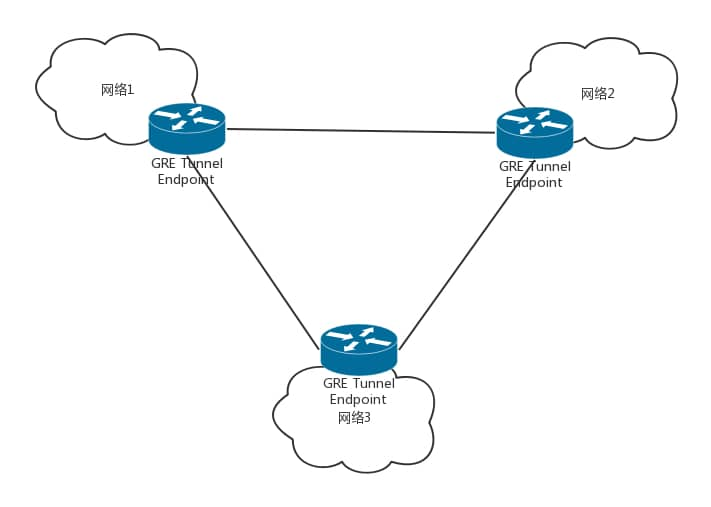

其次，**GRE 不支持组播**，因此一个网络中的一个虚机发出一个广播帧后，GRE 会将其广播到所有与该节点有隧道连接的节点。

另外一个问题是目前还是**有很多防火墙和三层网络设备无法解析 GRE**，因此它们无法对 GRE 封装包做合适地过滤和负载均衡。

### 2. VXLAN

第二种 Overlay 的技术称为 [**VXLAN**](https://baike.baidu.com/item/vxlan/20385445?fr=aladdin)(Virtual eXtensible Local Area Network，**虚拟扩展局域网**)。和三层外面再套三层的 GRE 不同，VXLAN 则是从二层外面就套了一个 VXLAN 的头，这里面包含的 VXLAN ID 为 24 位，也够用了。在 VXLAN 头外面还封装了 UDP、IP，以及外层的 MAC 头。


VXLAN 作为扩展性协议，也需要一个地方对 VXLAN 的包进行封装和解封装，实现这个功能的点称为**VTEP**（VXLAN Tunnel Endpoint）。

VTEP 相当于虚拟机网络的管家。每台物理机上都可以有一个 VTEP。每个虚拟机启动的时候，都需要向这个 VTEP 管家注册，每个 VTEP 都知道自己上面注册了多少个虚拟机。当虚拟机要跨 VTEP 进行通信的时候，需要通过 VTEP 代理进行，由 VTEP 进行包的封装和解封装。

和 GRE 端到端的隧道不同，VXLAN 不是点对点的，而是支持通过组播的来定位目标机器的，而非一定是这一端发出，另一端接收。

当一个 VTEP 启动的时候，它们都需要通过 IGMP 协议。加入一个组播组，就像加入一个邮件列表，或者加入一个微信群一样，所有发到这个邮件列表里面的邮件，或者发送到微信群里面的消息，大家都能收到。而当每个物理机上的虚拟机启动之后，VTEP 就知道，有一个新的 VM 上线了，它归我管。

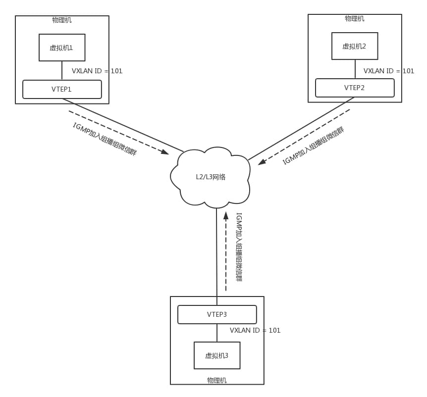

如图，虚拟机 1、2、3 属于云中同一个用户的虚拟机，因而需要分配相同的 VXLAN ID=101。在云的界面上，就可以知道它们的 IP 地址，于是可以在虚拟机 1 上 ping 虚拟机 2。

虚拟机 1 发现，它不知道虚拟机 2 的 MAC 地址，因而包没办法发出去，于是要发送 ARP 广播。

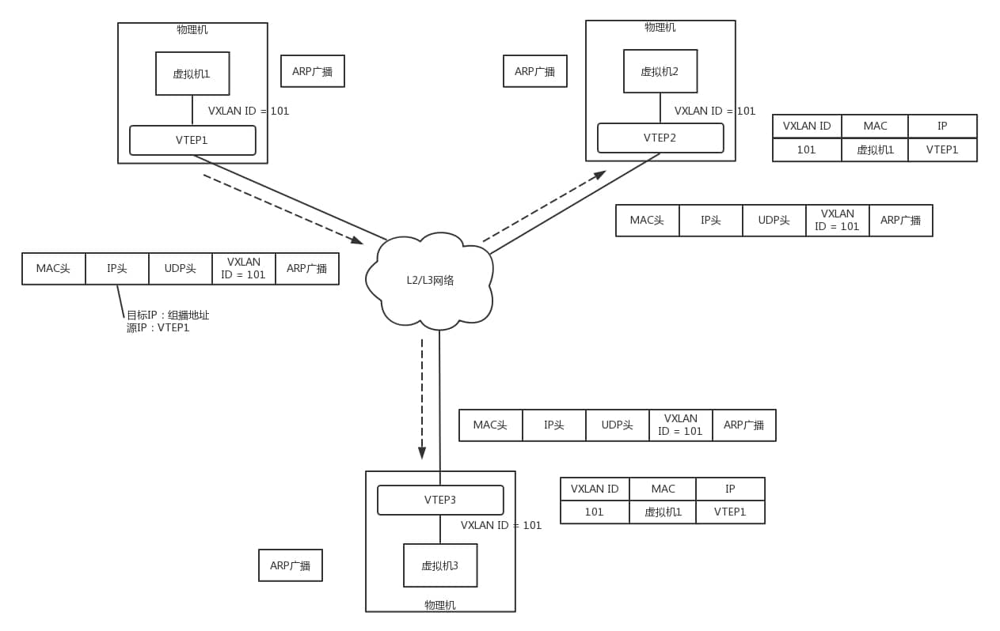

ARP 请求到达 VTEP1 的时候，VTEP1 知道，我这里有一台虚拟机，要访问一台不归我管的虚拟机，需要知道 MAC 地址，可是我不知道啊，这该咋办呢？

VTEP1 想，我不是加入了一个微信群么？可以在里面 @all 一下，问问虚拟机 2 归谁管。于是 VTEP1 将 ARP 请求封装在 VXLAN 里面，组播出去。

当然在群里面，VTEP2 和 VTEP3 都收到了消息，因而都会解开 VXLAN 包看，里面是一个 ARP。

VTEP3 在本地广播了半天，没人回，都说虚拟机 2 不归自己管。

VTEP2 在本地广播，虚拟机 2 回了，说虚拟机 2 归我管，MAC 地址是这个。通过这次通信，VTEP2 也学到了，虚拟机 1 归 VTEP1 管，以后要找虚拟机 1，去找 VTEP1 就可以了。

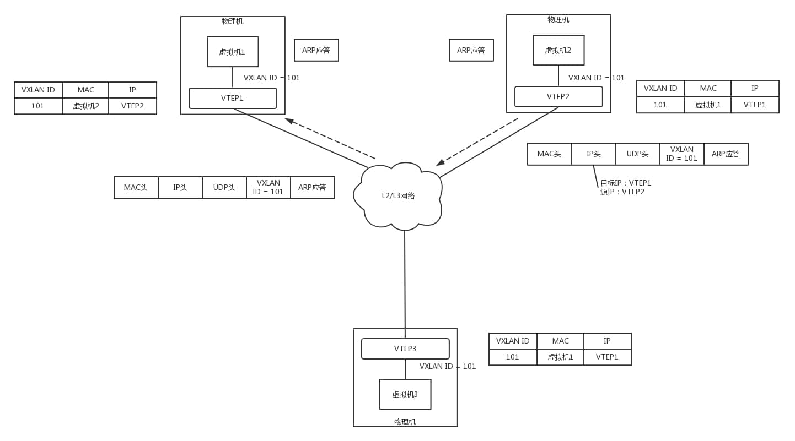

VTEP2 将 ARP 的回复封装在 VXLAN 里面，这次不用组播了，直接发回给 VTEP1。

VTEP1 解开 VXLAN 的包，发现是 ARP 的回复，于是发给虚拟机 1。通过这次通信，VTEP1 也学到了，虚拟机 2 归 VTEP2 管，以后找虚拟机 2，去找 VTEP2 就可以了。

虚拟机 1 的 ARP 得到了回复，知道了虚拟机 2 的 MAC 地址，于是就可以发送包了。

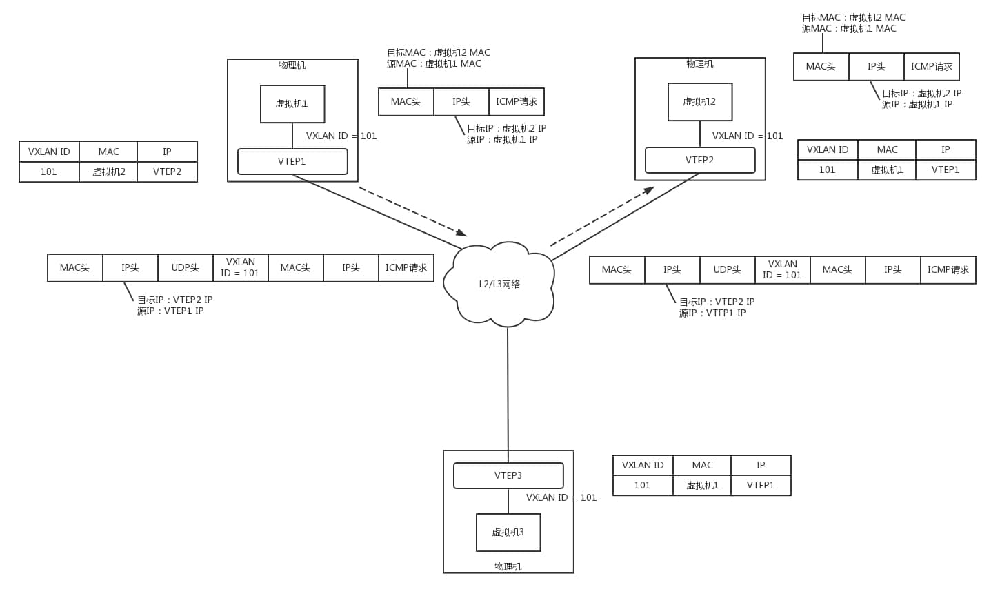

虚拟机 1 发给虚拟机 2 的包到达 VTEP1，它当然记得刚才学的东西，要找虚拟机 2，就去 VTEP2，于是将包封装在 VXLAN 里面，外层加上 VTEP1 和 VTEP2 的 IP 地址，发送出去。

网络包到达 VTEP2 之后，VTEP2 解开 VXLAN 封装，将包转发给虚拟机 2。

虚拟机 2 回复的包，到达 VTEP2 的时候，它当然也记得刚才学的东西，要找虚拟机 1，就去 VTEP1，于是将包封装在 VXLAN 里面，外层加上 VTEP1 和 VTEP2 的 IP 地址，也发送出去。

网络包到达 VTEP1 之后，VTEP1 解开 VXLAN 封装，将包转发给虚拟机 1。

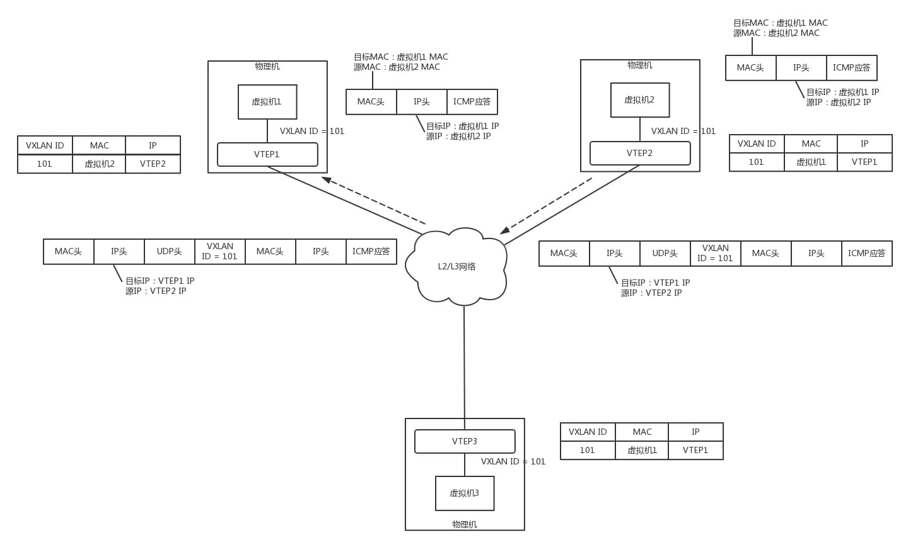


有了 GRE 和 VXLAN 技术，我们就可以解决云计算中 VLAN 的限制了。那如何将这个技术融入云平台呢？

还记得将你宿舍里面的情况，所有东西都搬到一台物理机上那个故事吗？

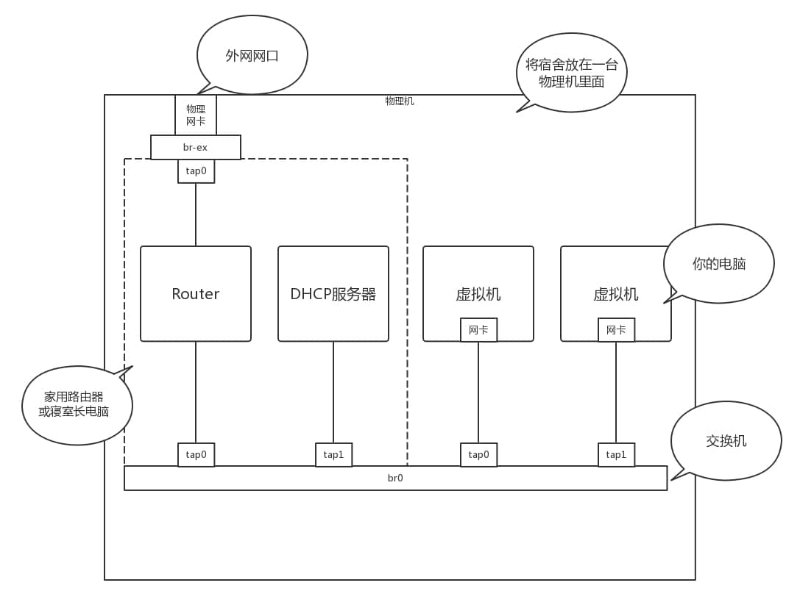

虚拟机是你的电脑，路由器和 DHCP Server 相当于家用路由器或者寝室长的电脑，外网网口访问互联网，所有的电脑都通过内网网口连接到一个交换机 br0 上，虚拟机要想访问互联网，需要通过 br0 连到路由器上，然后通过路由器将请求 NAT 后转发到公网。

接下来的事情就惨了，你们宿舍闹矛盾了，你们要分成三个宿舍住，对应上面的图，你们寝室长，也即路由器单独在一台物理机上，其他的室友也即 VM 分别在两台物理机上。这下把一个完整的 br0 一刀三断，每个宿舍都是单独的一段。

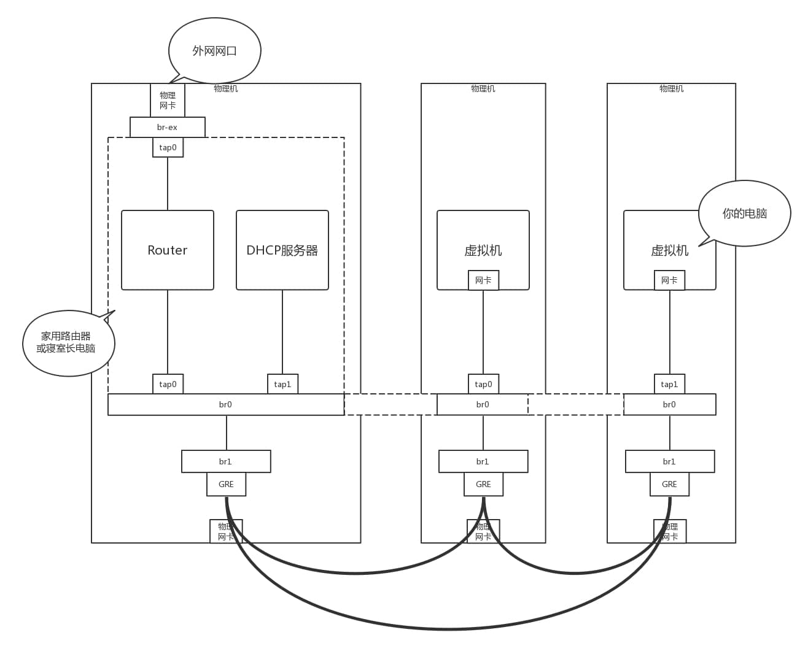

可是只有你的寝室长有公网口可以上网，于是你偷偷在三个宿舍中间打了一个隧道，用网线通过隧道将三个宿舍的两个 br0 连接起来，让其他室友的电脑和你寝室长的电脑，看起来还是连到同一个 br0 上，其实中间是通过你隧道中的网线做了转发。

为什么要多一个 br1 这个虚拟交换机呢？主要通过 br1 这一层将虚拟机之间的互联和物理机机之间的互联分成两层来设计，中间隧道可以有各种挖法，GRE、VXLAN 都可以。

使用了 OpenvSwitch 之后，br0 可以使用 OpenvSwitch 的 Tunnel 功能和 Flow 功能。

OpenvSwitch 支持三类隧道：GRE、VXLAN、IPsec_GRE。在使用 OpenvSwitch 的时候，虚拟交换机就相当于 GRE 和 VXLAN 封装的端点。

我们模拟创建一个如下的网络拓扑结构，来看隧道应该如何工作。


三台物理机，每台上都有两台虚拟机，分别属于两个不同的用户，因而 VLAN tag 都得打地不一样，这样才不能相互通信。但是不同物理机上的相同用户，是可以通过隧道相互通信的，因而通过 GRE 隧道可以连接到一起。

接下来，所有的 Flow Table 规则都设置在 br1 上，每个 br1 都有三个网卡，其中网卡 1 是对内的，网卡 2 和 3 是对外的。

下面我们具体来看 Flow Table 的设计。

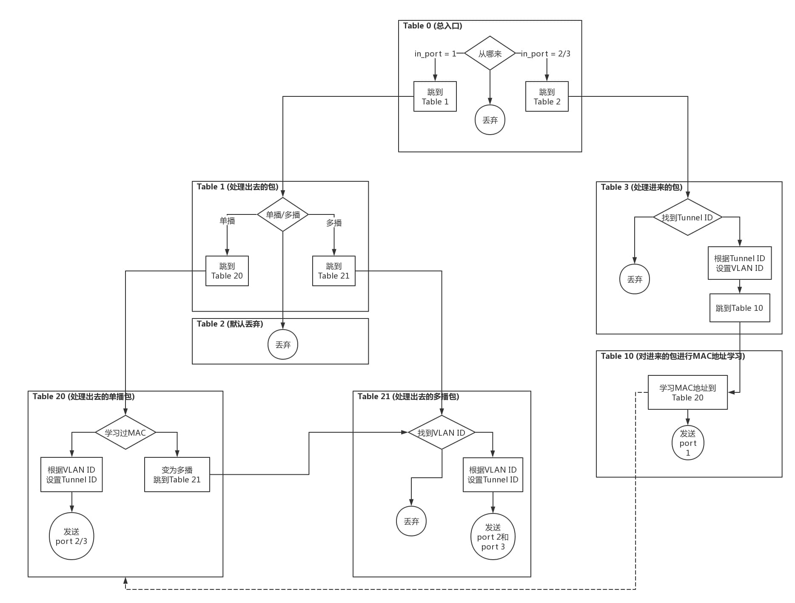

1.Table 0 是所有流量的入口，所有进入 br1 的流量，分为两种流量，一个是进入物理机的流量，一个是从物理机发出的流量。

从 port 1 进来的，都是发出去的流量，全部由 Table 1 处理。
```shell
ovs-ofctl add-flow br1 "hard_timeout=0 idle_timeout=0 priority=1 in_port=1 actions=resubmit(,1)"
```
从 port 2、3 进来的，都是进入物理机的流量，全部由 Table 3 处理。
```shell
ovs-ofctl add-flow br1 "hard_timeout=0 idle_timeout=0 priority=1 in_port=2 actions=resubmit(,3)"
ovs-ofctl add-flow br1 "hard_timeout=0 idle_timeout=0 priority=1 in_port=3 actions=resubmit(,3)"
```
如果都没匹配上，就默认丢弃。
```shell
ovs-ofctl add-flow br1 "hard_timeout=0 idle_timeout=0 priority=0 actions=drop"
```
2.Table 1 用于处理所有出去的网络包，分为两种情况，一种是单播，一种是多播。

对于单播，由 Table 20 处理。
```shell
ovs-ofctl add-flow br1 "hard_timeout=0 idle_timeout=0 priority=1 table=1 dl_dst=00:00:00:00:00:00/01:00:00:00:00:00 actions=resubmit(,20)"
```
对于多播，由 Table 21 处理。
```shell
ovs-ofctl add-flow br1 "hard_timeout=0 idle_timeout=0 priority=1 table=1 dl_dst=01:00:00:00:00:00/01:00:00:00:00:00 actions=resubmit(,21)"
```
3.Table 2 是紧接着 Table1 的，如果既不是单播，也不是多播，就默认丢弃。
```shell
ovs-ofctl add-flow br1 "hard_timeout=0 idle_timeout=0 priority=0 table=2 actions=drop"
```
4.Table 3 用于处理所有进来的网络包，需要将隧道 Tunnel ID 转换为 VLAN ID。

如果匹配不上 Tunnel ID，就默认丢弃。
```shell
ovs-ofctl add-flow br1 "hard_timeout=0 idle_timeout=0 priority=0 table=3 actions=drop"
```
如果匹配上了 Tunnel ID，就转换为相应的 VLAN ID，然后跳到 Table 10。
```shell
ovs-ofctl add-flow br1 "hard_timeout=0 idle_timeout=0 priority=1 table=3 tun_id=0x1 actions=mod_vlan_vid:1,resubmit(,10)"
ovs-ofctl add-flow br1 "hard_timeout=0 idle_timeout=0 priority=1 table=3 tun_id=0x2 actions=mod_vlan_vid:2,resubmit(,10)"
```
5. 对于进来的包，Table 10 会进行 MAC 地址学习。这是一个二层交换机应该做的事情，学习完了之后，再从 port 1 发出去。
```shell
ovs-ofctl add-flow br1 "hard_timeout=0 idle_timeout=0 priority=1 table=10  actions=learn(table=20,priority=1,hard_timeout=300,NXM_OF_VLAN_TCI[0..11],NXM_OF_ETH_DST[]=NXM_OF_ETH_SRC[],load:0->NXM_OF_VLAN_TCI[],load:NXM_NX_TUN_ID[]->NXM_NX_TUN_ID[],output:NXM_OF_IN_PORT[]),output:1"
```
Table 10 是用来学习 MAC 地址的，学习的结果放在 Table 20 里面。Table20 被称为 MAC learning table。

NXM_OF_VLAN_TCI 是 VLAN tag。在 MAC learning table 中，每一个 entry 都仅仅是针对某一个 VLAN 来说的，不同 VLAN 的 learning table 是分开的。在学习结果的 entry 中，会标出这个 entry 是针对哪个 VLAN 的。

NXM_OF_ETH_DST[]=NXM_OF_ETH_SRC[] 表示，当前包里面的 MAC Source Address 会被放在学习结果的 entry 里的 dl_dst 里。这是因为每个交换机都是通过进入的网络包来学习的。某个 MAC 从某个 port 进来，交换机就应该记住，以后发往这个 MAC 的包都要从这个 port 出去，因而源 MAC 地址就被放在了目标 MAC 地址里面，因为这是为了发送才这么做的。

load:0->NXM_OF_VLAN_TCI[] 是说，在 Table20 中，将包从物理机发送出去的时候，VLAN tag 设为 0，所以学习完了之后，Table 20 中会有 actions=strip_vlan。

load:NXM_NX_TUN_ID[]->NXM_NX_TUN_ID[] 的意思是，在 Table 20 中，将包从物理机发出去的时候，设置 Tunnel ID，进来的时候是多少，发送的时候就是多少，所以学习完了之后，Table 20 中会有 set_tunnel。

output:NXM_OF_IN_PORT[] 是发送给哪个 port。例如是从 port 2 进来的，那学习完了之后，Table 20 中会有 output:2。


所以如图所示，通过左边的 MAC 地址学习规则，学习到的结果就像右边的一样，这个结果会被放在 Table 20 里面。

6.Table 20 是 MAC Address Learning Table。如果不为空，就按照规则处理；如果为空，就说明没有进行过 MAC 地址学习，只好进行广播了，因而要交给 Table 21 处理。
```shell
ovs-ofctl add-flow br1 "hard_timeout=0 idle_timeout=0 priority=0 table=20 actions=resubmit(,21)"
```
7.Table 21 用于处理多播的包。

如果匹配不上 VLAN ID，就默认丢弃。
```shell
ovs-ofctl add-flow br1 "hard_timeout=0 idle_timeout=0 priority=0 table=21 actions=drop"
```
如果匹配上了 VLAN ID，就将 VLAN ID 转换为 Tunnel ID，从两个网卡 port 2 和 port 3 都发出去，进行多播。
```shell
ovs-ofctl add-flow br1 "hard_timeout=0 idle_timeout=0 priority=1table=21dl_vlan=1 actions=strip_vlan,set_tunnel:0x1,output:2,output:3"
ovs-ofctl add-flow br1 "hard_timeout=0 idle_timeout=0 priority=1table=21dl_vlan=2 actions=strip_vlan,set_tunnel:0x2,output:2,output:3"
```

### 3. 小结和补充

- 要对不同用户的网络进行隔离，解决 VLAN 数目有限的问题，需要通过 Overlay 的方式，常用的有 GRE 和 VXLAN。
- GRE 是一种点对点的隧道模式，VXLAN 支持组播的隧道模式，它们都要在某个 Tunnel Endpoint 进行封装和解封装，来实现跨物理机的互通。
- OpenvSwitch 可以作为 Tunnel Endpoint，通过设置流表的规则，将虚拟机网络和物理机网络进行隔离、转换。

- 虽然 VXLAN 可以支持组播，但是如果虚拟机数目比较多，在 Overlay 网络里面，广播风暴问题依然会很严重，你能想到什么办法解决这个问题吗？

- 基于虚拟机的云比较复杂，而且虚拟机里面的网卡，到物理网络转换层次比较多，有一种比虚拟机更加轻量级的云的模式，你知道是什么吗？