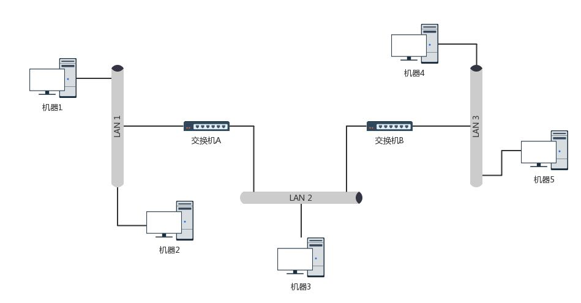
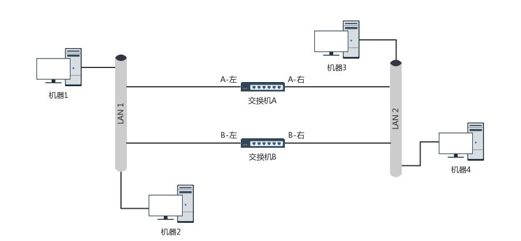
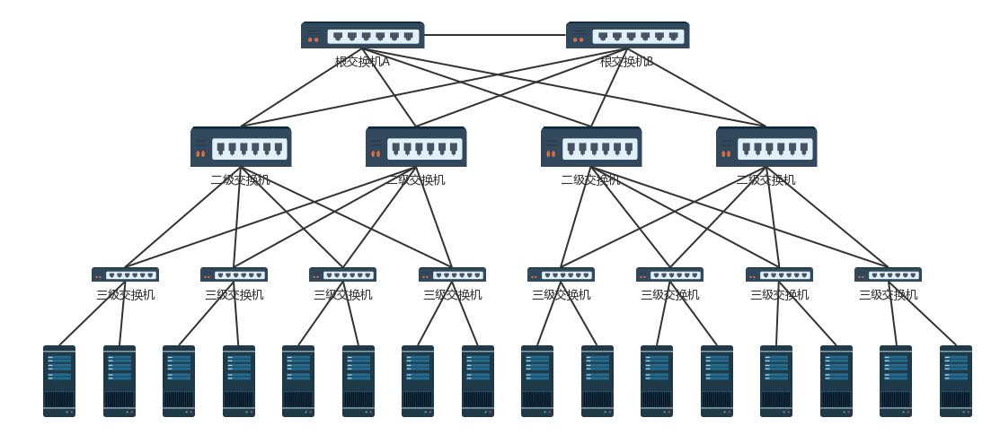
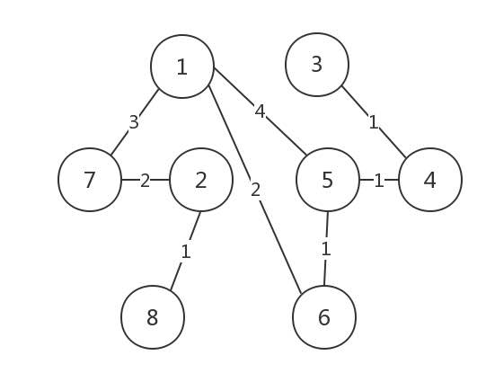
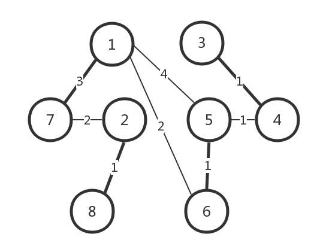
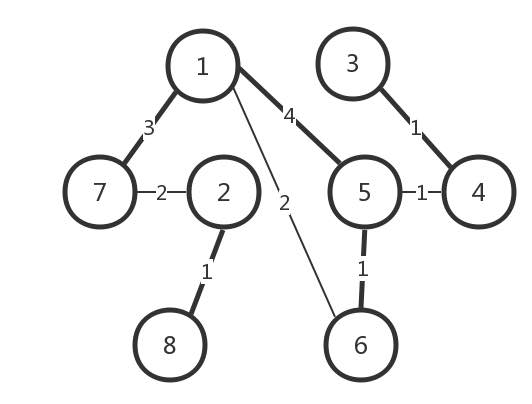
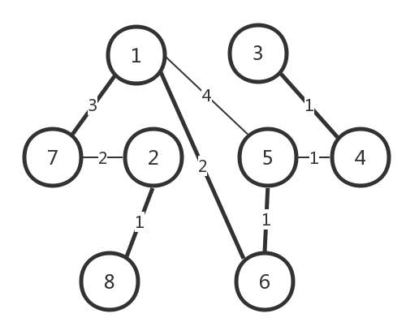
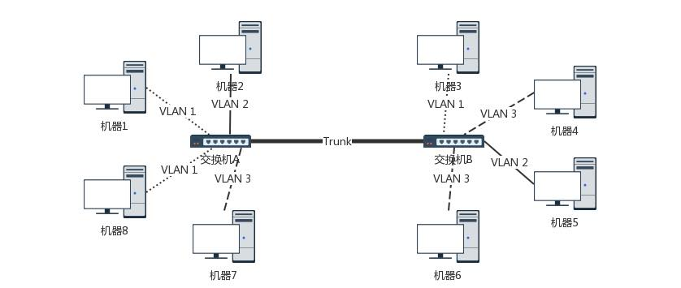

## 趣谈网络协议-6-交换机与VLAN：办公室太复杂，我要回学校

上一次，我们在宿舍里组建了一个本地的局域网 LAN，可以愉快地玩游戏了。这是一个非常简单的场景，因为只有一台交换机，电脑数目很少。今天，让我们切换到一个稍微复杂一点的场景，办公室。

### 1.拓扑结构是怎么形成的？

我们常见到的办公室大多是一排排的桌子，每个桌子都有网口，一排十几个座位就有十几个网口，一个楼层就会有几十个甚至上百个网口。如果算上所有楼层，这个场景自然比你宿舍里的复杂多了。具体哪里复杂呢？我来给你具体讲解。

首先，这个时候，一个交换机肯定不够用，需要多台交换机，交换机之间连接起来，就形成一个稍微复杂的拓扑结构。

我们先来看两台交换机的情形。两台交换机连接着三个局域网，每个局域网上都有多台机器。如果机器1只知道机器4的IP地址，当它想要访问机器4，把包发出去的时候，它必须要知道机器4的MAC地址。

于是机器1 发起广播，机器2 收到这个广播，但是这不是找它的，所以没它什么事。交换机A 一开始是不知道任何拓扑信息的，在它收到这个广播后，采取的策略是，<u>除了广播包来的方向外，它还要转发给其他所有的网口</u>。于是机器3 也收到广播信息了，但是这和它也没什么关系。

当然，交换机B 也是能够收到广播信息的，但是这时候它也是不知道任何拓扑信息的，因而也是进行广播的策略，将包转发到局域网三。这个时候，机器4 和机器5 都收到了广播信息。机器4 主动响应说，这是找我的，这是我的 MAC地址。于是一个 ARP请求就成功完成了。

在上面的过程中，交换机A 和交换机B 都是能够学习到这样的信息：机器1 是在左边这个网口的。当了解到这些拓扑信息之后，情况就好转起来。当机器2 要访问机器1 的时候，机器2 并不知道机器1的 MAC地址，所以机器 2 会发起一个ARP请求。这个广播消息会到达机器 1，也同时会到达交换机 A。这个时候交换机A 已经知道机器1 是不可能在右边的网口的，所以这个广播信息就不会广播到局域网二和局域网三。

当机器3 要访问机器1 的时候，也需要发起一个广播的ARP 请求。这个时候交换机 A 和交换机 B 都能够收到这个广播请求。交换机A 当然知道主机A 是在左边这个网口的，所以会把广播消息转发到局域网一。同时，交换机B 收到这个广播消息之后，由于它知道机器1 是不在右边这个网口的，所以不会将消息广播到局域网三。

### 2.如何解决常见的环路问题？

这样看起来，两台交换机工作得非常好。随着办公室越来越大，交换机数目肯定越来越多。当整个拓扑结构复杂了，这么多网线，绕过来绕过去，不可避免地会出现一些意料不到的情况。其中常见的问题就是环路问题。

例如这个图，当两个交换机将两个局域网同时连接起来的时候。你可能会觉得，这样反而有了高可用性。但是却不幸地出现了环路。出现了环路会有什么结果呢？

我们来想象一下机器1 访问机器 2 的过程。一开始，机器1 并不知道机器2 的 MAC 地址，所以它需要发起一个 ARP 的广播。广播到达机器 2，机器2 会把 MAC 地址返回来，看起来没有这两个交换机什么事情。

但是问题来了，这两个交换机还是都能够收到广播包的。交换机A 一开始是不知道机器2 在哪个局域网的，所以它会把广播消息放到局域网二，在局域网二广播的时候，交换机B 右边这个网口也是能够收到广播消息的。交换机B 会将这个广播息信息发送到局域网一。局域网一的这个广播消息，又会到达交换机A 左边的这个接口。交换机A 这个时候还是不知道机器2 在哪个局域网，于是将广播包又转发到局域网二。左转左转左转，好像是个圈哦。

可能有人会说，当两台交换机都能够逐渐学习到拓扑结构之后，是不是就可以了？

别想了，压根儿学不会的。机器1 的广播包到达交换机A 和交换机B 的时候，本来两个交换机都学会了机器1 是在局域网一的，但是当交换机A 将包广播到局域网二之后，交换机B 右边的网口收到了来自交换 A 的广播包。根据学习机制，这彻底损坏了交换机B 的三观，刚才机器1 还在左边的网口呢，怎么又出现在右边的网口呢？哦，那肯定是机器1 换位置了，于是就误会了，交换机B 就学会了，机器1 是从右边这个网口来的，把刚才学习的那一条清理掉。同理，交换机A 右边的网口，也能收到交换机B 转发过来的广播包，同样也误会了，于是也学会了，机器1 从右边的网口来，不是从左边的网口来。

然而当广播包从左边的局域网一广播的时候，两个交换机再次刷新三观，原来机器1 是在左边的，过一会儿，又发现不对，是在右边的，过一会，又发现不对，是在左边的。

这还是一个包转来转去，每台机器都会发广播包，交换机转发也会复制广播包，当广播包越来越多的时候，按照上一节讲过一个共享道路的算法，也就是路会越来越堵，最后谁也别想走。所以，必须有一个方法解决环路的问题，怎么破除环路呢？

### 3. STP 协议中那些难以理解的概念

在数据结构中，有一个方法叫作**最小生成树**。有环的我们常称为**图**。将图中的环破了，就生成了树。在计算机网络中，生成树的算法叫作**STP**，全称Spanning Tree Protocol。

STP 协议比较复杂，一开始很难看懂，但是其实这是一场血雨腥风的武林比武或者华山论剑，最终决出五岳盟主的方式。

在 STP 协议里面有很多概念，译名就非常拗口，但是我一作比喻，你很容易就明白了。

- **Root Bridge**，也就是**根交换机**。这个比较容易理解，可以比喻为“掌门”交换机，是某棵树的老大，是掌门，最大的大哥。
- **Designated Bridges**，有的翻译为**指定交换机**。这个比较难理解，可以想像成一个“小弟”，对于树来说，就是一棵树的树枝。所谓“指定”的意思是，我拜谁做大哥，其他交换机通过这个交换机到达根交换机，也就相当于拜他做了大哥。这里注意是树枝，不是叶子，因为叶子往往是主机。
- **Bridge Protocol Data Units （BPDU）** ，**网桥协议数据单元**。可以比喻为“相互比较实力”的协议。行走江湖，比的就是武功，拼的就是实力。当两个交换机碰见的时候，也就是相连的时候，就需要互相比一比内力了。BPDU 只有掌门能发，已经隶属于某个掌门的交换机只能传达掌门的指示。
- **Priority Vector，优先级向量**。可以比喻为实力 （**值越小越牛**）。实力是啥？就是一组ID 数目，[Root Bridge ID, Root Path Cost, Bridge ID, and Port ID]。为什么这样设计呢？这是因为要看怎么来比实力。先看 Root Bridge ID。拿出老大的 ID 看看，发现掌门一样，那就是师兄弟；再比 Root Path Cost，也即我**距离我的老大的距离**，也就是拿和掌门关系比，看同一个门派内谁和老大关系铁；最后比 Bridge ID，比我自己的 ID，拿自己的本事比。

### 4. STP 的工作过程是怎样的？

一开始，江湖纷争，异常混乱。大家都觉得自己是掌门，谁也不服谁。于是，所有的交换机都认为自己是掌门，每个网桥都被分配了一个 ID。这个 ID 里有管理员分配的优先级，当然网络管理员知道哪些交换机贵，哪些交换机好，就会给它们分配高的优先级。这种交换机生下来武功就很高，起步就是乔峰。

既然都是掌门，互相都连着网线，就互相发送 BPDU 来比功夫呗。这一比就发现，有人是岳不群，有人是封不平，赢的接着当掌门，输的就只好做小弟了。当掌门的还会继续发 BPDU，而输的人就没有机会了。它们只有在收到掌门发的 BPDU 的时候，转发一下，表示服从命令。

数字表示优先级。就像这个图，5 和 6 碰见了，6 的优先级低，所以乖乖做小弟。于是一个小门派形成，5 是掌门，6 是小弟。其他诸如 1-7、2-8、3-4 这样的小门派，也诞生了。于是江湖出现了很多小的门派，小的门派，接着合并。

合并的过程会出现以下四种情形，我分别来介绍。

**情形一：掌门遇到掌门**

当 5 碰到了 1，掌门碰见掌门，1 觉得自己是掌门，5 也刚刚跟别人 PK 完成为掌门。这俩掌门比较功夫，最终 1 胜出。于是输掉的掌门 5 就会率领所有的小弟归顺。结果就是 1 成为大掌门。

**情形二：同门相遇**

同门相遇可以是掌门与自己的小弟相遇，这说明存在“环”了。这个小弟已经通过其他门路拜在你门下，结果你还不认识，就 PK 了一把。结果掌门发现这个小弟功夫不错，不应该级别这么低，就把它招到门下亲自带，那这个小弟就相当于升职了。

我们再来看，假如 1 和 6 相遇。6 原来就拜在 1 的门下，只不过 6 的上司是 5，5 的上司是 1。1 发现，6 距离我才只有 2，比从 5 这里过来的 5（=4+1）近多了，那 6 就直接汇报给我吧。于是，5 和 6 分别汇报给 1。

同门相遇还可以是小弟相遇。这个时候就要比较谁和掌门的关系近，当然近的当大哥。刚才 5 和 6 同时汇报给 1 了，后来 5 和 6 再比较功夫的时候发现，5 你直接汇报给 1 距离是 4，如果 5 汇报给 6 再汇报给 1，距离只有 2+1=3，所以 5 干脆拜 6 为上司。

**情形三：掌门与其他帮派小弟相遇**

小弟拿本帮掌门和这个掌门比较，赢了，这个掌门拜入门来。输了，会拜入新掌门，并且逐渐拉拢和自己连接的兄弟，一起弃暗投明。

例如，2 和 7 相遇，虽然 7 是小弟，2 是掌门。就个人武功而言，2 比 7 强，但是 7 的掌门是 1，比 2 牛，所以没办法，2 要拜入 7 的门派，并且连同自己的小弟都一起拜入。

**情形四：不同门小弟相遇**

各自拿掌门比较，输了的拜入赢的门派，并且逐渐将与自己连接的兄弟弃暗投明。

例如，5 和 4 相遇。虽然 4 的武功好于 5，但是 5 的掌门是 1，比 4 牛，于是 4 拜入 5 的门派。后来当 3 和 4 相遇的时候，3 发现 4 已经叛变了，4 说我现在老大是 1，比你牛，要不你也来吧，于是 3 也拜入 1。

最终，生成一棵树，武林一统，天下太平。但是天下大势，分久必合，合久必分，天下统一久了，也会有相应的问题。

### 5. 如何解决广播问题和安全问题？

毕竟机器多了，交换机也多了，就算交换机比 Hub 智能一些，但是还是难免有广播的问题，一大波机器，相关的部门、不相关的部门，广播一大堆，性能就下来了。就像一家公司，创业的时候，一二十个人，坐在一个会议室，有事情大家讨论一下，非常方便。但是如果变成了 50 个人，全在一个会议室里面吵吵，就会乱的不得了。

你们公司有不同的部门，有的部门需要保密的，比如人事部门，肯定要讨论升职加薪的事儿。由于在同一个广播域里面，很多包都会在一个局域网里面飘啊飘，碰到了一个会抓包的程序员，就能抓到这些包，如果没有加密，就能看到这些敏感信息了。还是上面的例子，50 个人在一个会议室里面七嘴八舌的讨论，其中有两个 HR，那他们讨论的问题，肯定被其他人偷偷听走了。

那咋办，分部门，分会议室呗。那我们就来看看怎么分。

有两种分的方法，一个是**物理隔离**。每个部门设一个单独的会议室，对应到网络方面，就是每个部门有单独的交换机，配置单独的子网，这样部门之间的沟通就需要路由器了。路由器咱们还没讲到，以后再说。这样的问题在于，有的部门人多，有的部门人少。人少的部门慢慢人会变多，人多的部门也可能人越变越少。如果每个部门有单独的交换机，口多了浪费，少了又不够用。

另外一种方式是**虚拟隔离**，就是用我们常说的**VLAN**，或者叫**虚拟局域网**。使用 VLAN，一个交换机上会连属于多个局域网的机器，那交换机怎么区分哪个机器属于哪个局域网呢？

我们只需要在原来的二层的头上加一个 **TAG**，里面有一个 **VLAN ID**，一共 12 位。为什么是 12 位呢？因为 12 位可以划分 4096 个 VLAN。这样是不是还不够啊。现在的情况证明，目前云计算厂商里面绝对不止 4096 个用户。当然每个用户需要一个 VLAN 了啊，怎么办呢，这个我们在后面的章节再说。

如果我们买的交换机是支持 VLAN 的，当这个交换机把二层的头取下来的时候，就能够识别这个 VLAN ID。这样只有相同 VLAN 的包，才会互相转发，不同 VLAN 的包，是看不到的。这样广播问题和安全问题就都能够解决了。

我们可以设置交换机每个口所属的 VLAN。如果某个口坐的是程序员，他们属于 VLAN 10；如果某个口坐的是人事，他们属于 VLAN 20；如果某个口坐的是财务，他们属于 VLAN 30。这样，财务发的包，交换机只会转发到 VLAN 30 的口上。程序员啊，你就监听 VLAN 10 吧，里面除了代码，啥都没有。

而且对于交换机来讲，每个 VLAN 的口都是可以重新设置的。一个财务走了，把他所在的作为的口从 VLAN 30 移除掉，来了一个程序员，坐在财务的位置上，就把这个口设置为 VLAN 10，十分灵活。

有人会问交换机之间怎么连接呢？将两个交换机连接起来的口应该设置成什么 VLAN 呢？对于支持 VLAN 的交换机，有一种口叫作**Trunk口**。它可以转发属于任何 VLAN 的口。交换机之间可以通过这种口相互连接。

好了，解决这么多交换机连接在一起的问题，办公室的问题似乎搞定了。然而这只是一般复杂的场景，因为你能接触到的网络，到目前为止，不管是你的台式机，还是笔记本所连接的网络，对于带宽、高可用等都要求不高。就算出了问题，一会儿上不了网，也不会有什么大事。

我们在宿舍、学校或者办公室，经常会访问一些网站，这些网站似乎永远不会“挂掉”。那是因为这些网站都生活在一个叫做数据中心的地方，那里的网络世界更加复杂。在后面的章节，我会为你详细讲解。

### 6. 小结

- 当交换机的数目越来越多的时候，会遭遇环路问题，让网络包迷路，这就需要使用 STP 协议，通过华山论剑比武的方式，将有环路的图变成没有环路的树，从而解决环路问题。
- 交换机数目多会面临隔离问题，可以通过 VLAN 形成虚拟局域网，从而解决广播问题和安全问题。

### 7. 问题

1. STP 协议能够很好的解决环路问题，但是也有它的缺点，你能举几个例子吗？

   STP 对于跨地域甚至跨国组织的网络支持，就很难做了，计算量摆着呢

2. 在一个比较大的网络中，如果两台机器不通，你知道应该用什么方式调试吗？

    ping 加抓包工具，如 wireshark