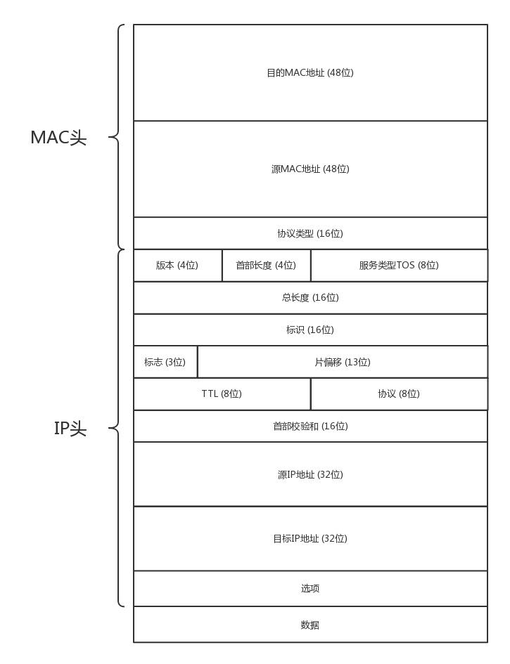
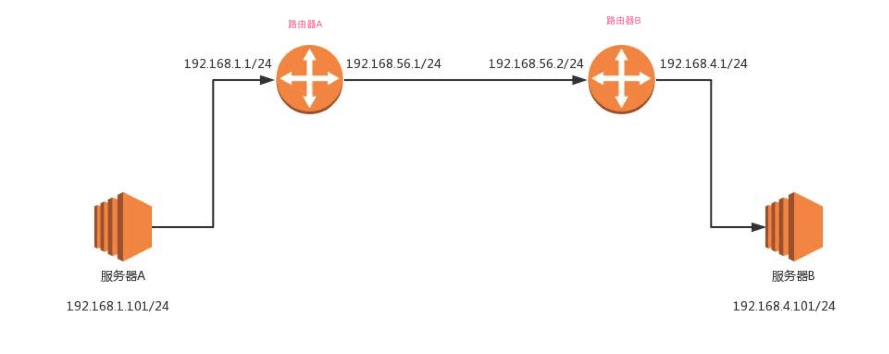
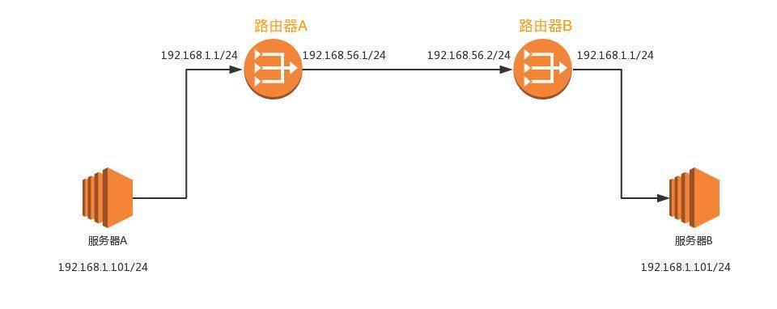

趣谈网络协议-8-世界这么大，我想出网关：欧洲十国游与玄奘西行

--------------

前几节，我主要跟你讲了宿舍里和办公室里用到的网络协议。你已经有了一些基础，是时候去外网逛逛了！

### 怎么在宿舍上网？

还记得咱们在宿舍的时候买了台交换机，几台机器组了一个局域网打游戏吗？可惜啊，只能打局域网的游戏，不能上网啊！盼啊盼啊，终于盼到大二，允许宿舍开通网络了。学校给每个宿舍的网口分配了一个 IP 地址。这个 IP 是校园网的 IP，完全由网管部门控制。宿舍网的 IP 地址多为 192.168.1.x。校园网的 IP 地址，假设是 10.10.x.x。

这个时候，你要在宿舍上网，有两个办法：

第一个办法，让你们宿舍长再买一个网卡。这个时候，你们宿舍长的电脑里就有两张网卡。一张网卡的线插到你们宿舍的交换机上，另一张网卡的线插到校园网的网口。而且，这张新的网卡的 IP 地址要按照学校网管部门分配的配置，不然上不了网。**这种情况下，如果你们宿舍的人要上网，就需要一直开着宿舍长的电脑。**

第二个办法，你们共同出钱买个家庭路由器（反正当时我们买不起）。家庭路由器会有内网网口和外网网口。把外网网口的线插到校园网的网口上，将这个外网网口配置成和网管部的一样。内网网口连上你们宿舍的所有的电脑。**这种情况下，如果你们宿舍的人要上网，就需要一直开着路由器。**

这两种方法其实是一样的。只不过第一种方式，让你的宿舍长的电脑，变成一个有多个口的路由器而已。而你买的家庭路由器，里面也跑着程序，和你宿舍长电脑里的功能一样，只不过是一个嵌入式的系统。

当你的宿舍长能够上网之后，接下来，就是其他人的电脑怎么上网的问题。这就需要配置你们的网卡。当然 DHCP 是可以默认配置的。在进行网卡配置的时候，除了 IP 地址，还需要配置一个Gateway的东西，这个就是网关。

### 你了解 MAC 头和 IP 头的细节吗？

一旦配置了 IP 地址和网关，往往就能够指定目标地址进行访问了。由于在跨网关访问的时候，牵扯到 MAC 地址和 IP 地址的变化，这里有必要详细描述一下 MAC 头和 IP 头的细节。

在 MAC 头里面，先是目标 MAC 地址，然后是源 MAC 地址，然后有一个协议类型，用来说明里面是 IP 协议。IP 头里面的版本号，目前主流的还是 IPv4，服务类型 TOS 在第三节讲 `iPhone addr` 命令的时候讲过，TTL 在第 7 节讲 ICMP 协议的时候讲过。另外，还有 8 位标识协议。这里到了下一层的协议，也就是，是 TCP 还是 UDP。最重要的就是源IP 和目标IP。先是源 IP地址，然后是目标 IP地址。

在任何一台机器上，当要访问另一个 IP地址的时候，都会先判断，这个目标 IP地址，和当前机器的 IP地址，是否在同一个网段。怎么判断同一个网段呢？需要 CIDR 和子网掩码，这个在第三节的时候也讲过了。

如果是**同一个网段**，例如，你访问你旁边的兄弟的电脑，那就没网关什么事情，直接将源地址和目标地址放入 IP 头中，然后通过 ARP 获得 MAC 地址，将源 MAC 和目的 MAC 放入 MAC 头中，发出去就可以了。

如果**不是同一网段**，例如，你要访问你们校园网里面的 BBS，该怎么办？这就需要发往默认网关 Gateway。Gateway 的地址一定是和源IP地址是一个网段的。往往不是第一个，就是第二个。例如 192.168.1.0/24 这个网段，Gateway 往往会是 192.168.1.1/24 或者 192.168.1.2/24。

如何发往默认网关呢？网关不是和源IP 地址是一个网段的么？这个过程就和发往同一个网段的其他机器是一样的：将源地址和目标IP地址放入 IP头中，通过 ARP 获得网关的 MAC 地址，将 MAC 和网关的 MAC 放入 MAC 头中，发送出去。网关所在的端口，例如 192.168.1.1/24 将网络包收进来，然后接下来怎么做，就完全看网关的了。

**网关往往是一个路由器，是一个三层转发的设备**。啥叫**三层设备**？前面也说过了，就是把 MAC 头和 IP 头都取下来，然后根据里面的内容，看看接下来把包往哪里转发的设备。

在你的宿舍里面，网关就是你宿舍长的电脑。一个路由器往往有多个网口，如果是一台服务器做这个事情，则就有多个网卡，其中一个网卡是和源 IP 同网段的。

很多情况下，人们把网关就叫作路由器。其实不完全准确，而另一种比喻更加恰当：路由器是一台设备，它有五个网口或者网卡，相当于有五只手，分别连着五个局域网。每只手的 IP 地址都和局域网的 IP 地址相同的网段，每只手都是它握住的那个局域网的网关。

任何一个想发往其他局域网的包，都会到达其中一只手，被拿进来，拿下 MAC头和 IP头，看看，根据自己的路由算法，选择另一只手，加上 IP 头和 MAC 头，然后扔出去。

### 静态路由是什么？

这个时候，问题来了，该选择哪一只手？IP 头和 MAC 头加什么内容，哪些变、哪些不变呢？这个问题比较复杂，大致可以分为两类，一个是**静态路由**，一个是动态路由。动态路由下一节我们详细地讲。这一节我们先说静态路由。

**静态路由，其实就是在路由器上，配置一条一条规则。**这些规则包括：想访问 BBS 站（它肯定有个网段），从 2 号口出去，下一跳是 IP2；想访问教学视频站（它也有个自己的网段），从 3 号口出去，下一跳是 IP3，然后保存在路由器里。

每当要选择从哪只手抛出去的时候，就一条一条的匹配规则，找到符合的规则，就按规则中设置的那样，从某个口抛出去，找下一跳 IPX。

### IP 头和 MAC 头哪些变、哪些不变？

对于 IP头和 MAC头哪些变、哪些不变的问题，可以分两种类型。我把它们称为“欧洲十国游”型和“玄奘西行”型。

之前我说过，MAC 地址是一个局域网内才有效的地址。因而，MAC地址只要过网关，就必定会改变，因为已经换了局域网。两者主要的区别在于 IP地址是否改变。不改变 IP地址的网关，我们称为**转发网关**；改变 IP 地址的网关，我们称为**NAT网关**。

#### “欧洲十国游”型

结合这个图，我们先来看“欧洲十国游”型。

服务器 A 要访问服务器 B。首先，服务器 A 会思考，192.168.4.101 和我不是一个网段的，因而需要先发给网关。那网关是谁呢？已经静态配置好了，网关是 192.168.1.1。网关的 MAC 地址是多少呢？发送 ARP 获取网关的 MAC 地址，然后发送包。包的内容是这样的：

- 源 MAC：服务器 A 的 MAC
- 目标 MAC：192.168.1.1 这个网口的 MAC
- 源 IP：192.168.1.101
- 目标 IP：192.168.4.101

包到达 192.168.1.1 这个网口，发现 MAC 一致，将包收进来，开始思考往哪里转发。

在路由器A 中配置了静态路由之后，要想访问 192.168.4.0/24，要从 192.168.56.1 这个口出去，下一跳为 192.168.56.2。

于是，路由器A 思考的时候，匹配上了这条路由，要从 192.168.56.1 这个口发出去，发给 192.168.56.2，那 192.168.56.2 的 MAC 地址是多少呢？路由器 A 发送 ARP 获取 192.168.56.2 的 MAC 地址，然后发送包。包的内容是这样的：

- 源 MAC：192.168.56.1 的 MAC 地址
- 目标 MAC：192.168.56.2 的 MAC 地址
- 源IP：192.168.1.101
- 目标IP：192.168.4.101

包到达 192.168.56.2 这个网口，发现 MAC 一致，将包收进来，开始思考往哪里转发。

在路由器B 中配置了静态路由，要想访问 192.168.4.0/24，要从 192.168.4.1 这个口出去，没有下一跳了。因为我右手这个网卡，就是这个网段的，我是最后一跳了。

于是，路由器B 思考的时候，匹配上了这条路由，要从 192.168.4.1 这个口发出去，发给 192.168.4.101。那 192.168.4.101 的 MAC 地址是多少呢？路由器 B 发送 ARP 获取 192.168.4.101 的 MAC 地址，然后发送包。包的内容是这样的：

- 源 MAC：192.168.4.1 的 MAC 地址
- 目标 MAC：192.168.4.101 的 MAC 地址
- 源 IP：192.168.1.101
- 目标 IP：192.168.4.101

包到达服务器 B，MAC 地址匹配，将包收进来。

通过这个过程可以看出，**每到一个新的局域网，MAC都是要变的，但是 IP地址都不变**。在 IP头里面，不会保存任何网关的 IP 地址。**所谓的下一跳是，某个 IP 要将这个 IP 地址转换为 MAC 放入 MAC 头。**

之所以将这种模式比喻称为**欧洲十国游**，是因为在整个过程中，IP 头里面的地址都是不变的。IP 地址在三个局域网都可见，在三个局域网之间的网段都不会冲突。在三个网段之间传输包，IP 头不改变。这就像在欧洲各国之间旅游，一个签证就能搞定。

#### “玄奘西行”型

这里遇见的第一个问题是，局域网之间没有商量过，各定各的网段，因而 IP 段冲突了。最左面大唐的地址是 192.168.1.101，最右面印度的地址也是 192.168.1.101，如果单从 IP 地址上看，简直是自己访问自己，其实是大唐的 192.168.1.101 要访问印度的 192.168.1.101。

怎么解决这个问题呢？既然局域网之间没有商量过，你们各管各的，那到国际上，也即中间的局域网里面，就需要使用另外的地址。就像出国，不能用咱们自己的身份证，而要改用护照一样，玄奘西游也要拿着专门取经的通关文牒，而不能用自己国家的身份证。

首先，目标服务器B 在国际上要有一个国际的身份，我们给它一个 192.168.56.2。在网关 B 上，我们记下来，国际身份 192.168.56.2 对应国内身份 192.168.1.101。凡是要访问 192.168.56.2，都转成 192.168.1.101。

于是，源服务器 A 要访问目标服务器 B，要指定的目标地址为 192.168.56.2。这是它的国际身份。服务器 A 想，192.168.56.2 和我不是一个网段的，因而需要发给网关，网关是谁？已经静态配置好了，网关是 192.168.1.1，网关的 MAC 地址是多少？发送 ARP 获取网关的 MAC 地址，然后发送包。包的内容是这样的：

- 源 MAC：服务器 A 的 MAC
- 目标 MAC：192.168.1.1 这个网口的 MAC
- 源 IP：192.168.1.101
- 目标 IP：192.168.56.2

包到达 192.168.1.1 这个网口，发现 MAC 一致，将包收进来，开始思考往哪里转发。

在路由器 A 中配置了静态路由：要想访问 192.168.56.2/24，要从 192.168.56.1 这个口出去，没有下一跳了，因为我右手这个网卡，就是这个网段的，我是最后一跳了。

于是，路由器 A 思考的时候，匹配上了这条路由，要从 192.168.56.1 这个口发出去，发给 192.168.56.2。那 192.168.56.2 的 MAC 地址是多少呢？路由器 A 发送 ARP 获取 192.168.56.2 的 MAC 地址。

当网络包发送到中间的局域网的时候，服务器 A 也需要有个国际身份，因而在国际上，源 IP 地址也不能用 192.168.1.101，需要改成 192.168.56.1。发送包的内容是这样的：

- 源 MAC：192.168.56.1 的 MAC 地址
- 目标 MAC：192.168.56.2 的 MAC 地址
- 源 IP：192.168.56.1
- 目标 IP：192.168.56.2

包到达 192.168.56.2 这个网口，发现 MAC 一致，将包收进来，开始思考往哪里转发。

路由器 B 是一个 **NAT网关**，它上面配置了，要访问国际身份 192.168.56.2 对应国内身份 192.168.1.101，于是改为访问 192.168.1.101。

在路由器 B 中配置了静态路由：要想访问 192.168.1.0/24，要从 192.168.1.1 这个口出去，没有下一跳了，因为我右手这个网卡，就是这个网段的，我是最后一跳了。

于是，路由器B 思考的时候，匹配上了这条路由，要从 192.168.1.1 这个口发出去，发给 192.168.1.101。

那 192.168.1.101 的 MAC 地址是多少呢？路由器 B 发送 ARP 获取 192.168.1.101 的 MAC 地址，然后发送包。内容是这样的：

- 源 MAC：192.168.1.1 的 MAC 地址
- 目标 MAC：192.168.1.101 的 MAC 地址
- 源 IP：192.168.56.1
- 目标 IP：192.168.1.101

包到达服务器 B，MAC地址匹配，将包收进来。

从服务器 B 接收的包可以看出，源 IP 为服务器 A 的国际身份，因而发送返回包的时候，也发给这个国际身份，由路由器 A 做 NAT，转换为国内身份。

从这个过程可以看出，IP 地址也会变。这个过程用英文说就是**Network Address Translation**，简称**NAT**。

其实这第二种方式我们经常见，现在大家每家都有家用路由器，家里的网段都是 192.168.1.x，所以你肯定访问不了你邻居家的这个私网的 IP 地址的。所以，当我们家里的包发出去的时候，都被家用路由器 NAT 成为了运营商的地址了。

很多办公室访问外网的时候，也是被 NAT 过的，因为不可能办公室里面的 IP 也是公网可见的，公网地址实在是太贵了，所以一般就是整个办公室共用一个到两个出口 IP 地址。你可以通过 https://www.whatismyip.com/ 查看自己的出口 IP 地址。

### 小结

- 如果离开本局域网，就需要经过网关，网关是路由器的一个网口；
- 路由器是一个三层设备，里面有如何寻找下一跳的规则；
- 经过路由器之后 MAC 头要变，如果 IP 不变，相当于不换护照的欧洲旅游，如果 IP 变，相当于换护照的玄奘西行。

### 问题

1. 当在你家里要访问 163 网站的时候，你的包需要 NAT 成为公网 IP，返回的包又要 NAT 成你的私有 IP，返回包怎么知道这是你的请求呢？它怎么就这么智能的 NAT 成了你的 IP 而非别人的 IP 呢？
2. 对于路由规则，这一节讲述了静态路由，需要手动配置，如果要自动配置，你觉得应该怎么办呢？
   欢迎你留言和我讨