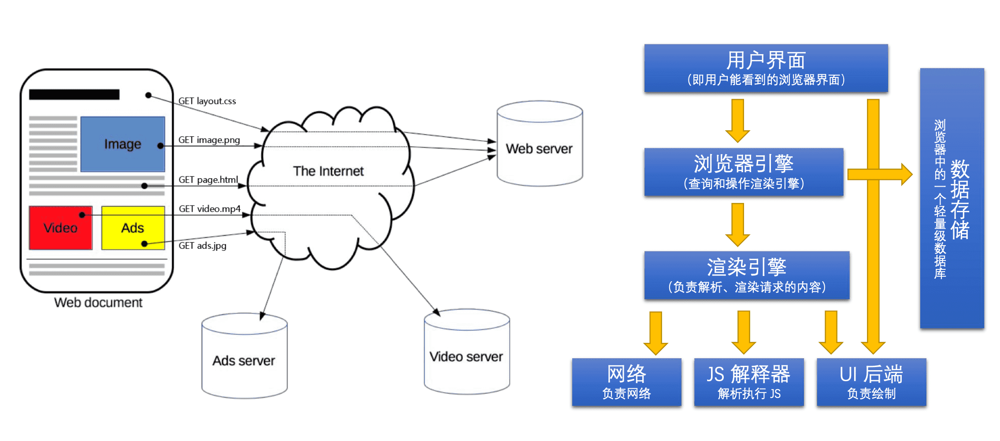
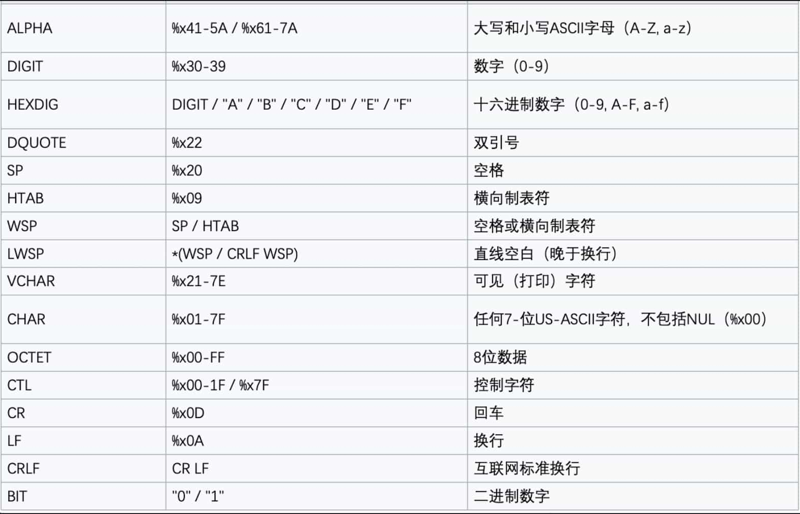
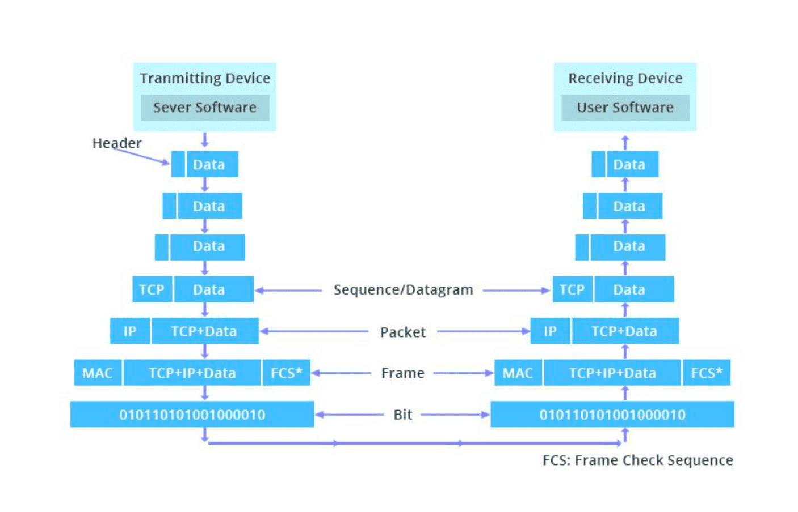
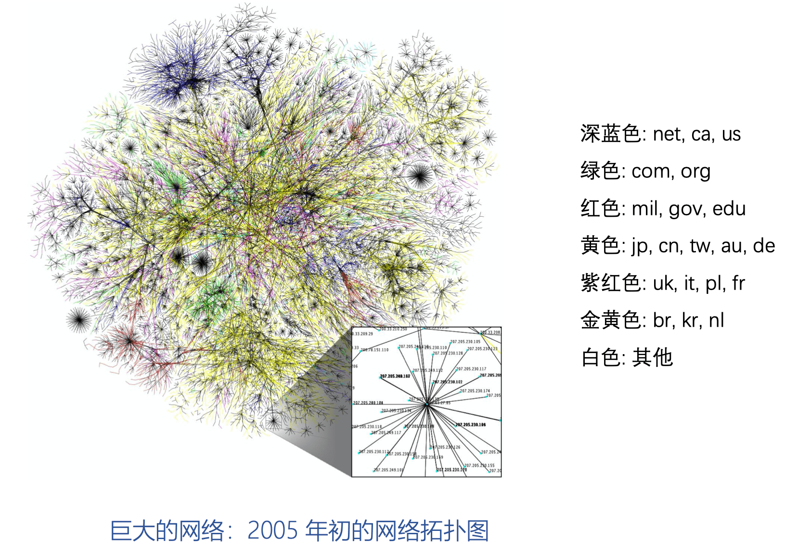
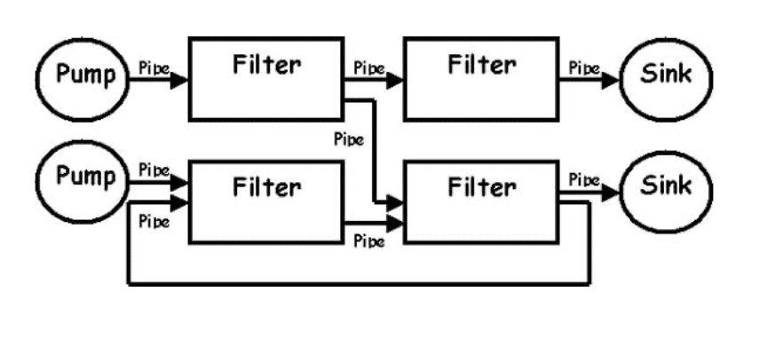
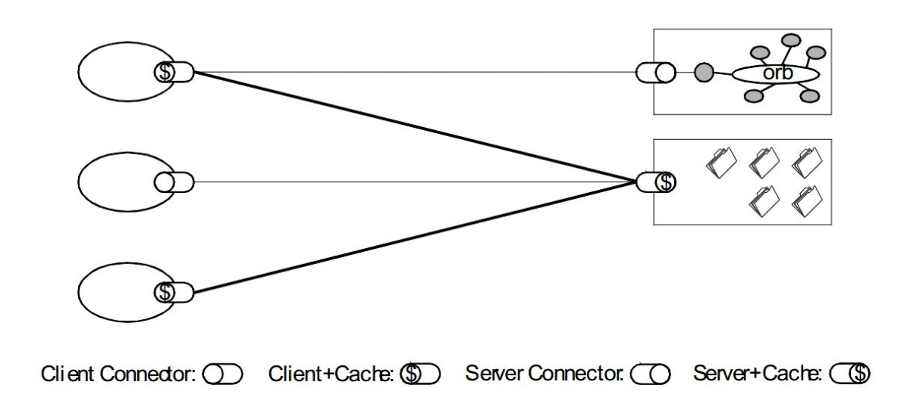
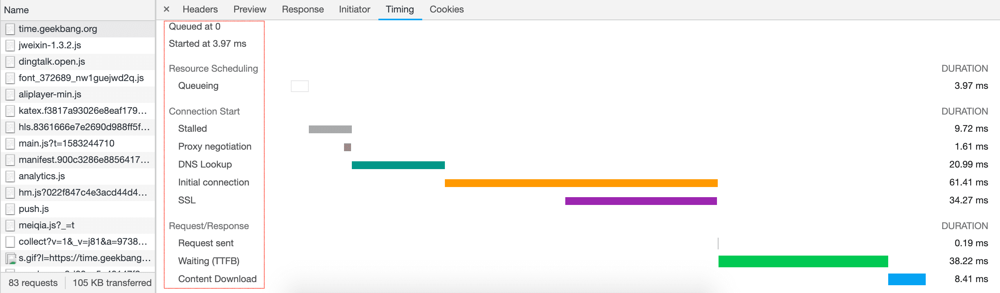

# Web协议详解与抓包实战

[《Web协议详解与抓包实战》](https://time.geekbang.org/course/intro/175)笔记

## 一、HTTP/1.1协议

### 综述

**应用层**
第 1 部分:HTTP/1.1

第 2 部分:Websocket

第 3 部分:HTTP/2.0

**应用层的安全基础设施** 

第 4 部分:TLS/SSL

**传输层**

第5部分:TCP

**网络层及数据链路层**

第 6 部分:IP 层和以太网


### 浏览器发起 HTTP 请求的典型场景




#### HTTP定义

**Hypertext Transfer Protocol (HTTP) 协议** 

a **stateless** application-level **request/response** protocol that uses **extensible semantics** and **self-descriptive** message payloads for flexible interaction with network-based **hypertext information** systems (RFC7230 2014.6)

一种**无状态的**、应用层的、以**请求/应答**方式运行的协议，它使用**可扩展的语义**和**自描述**消息格式，与基于网络的超文本信息系统灵活的互动


### 基于ABNF语义定义的HTTP消息格式


#### ABNF (扩充巴科斯-瑙尔范式)操作符

[ABNF(Augmented BNF) 官方文档](https://www.ietf.org/rfc/rfc5234.txt)

严谨的定义方式

- 空白字符:用来分隔定义中的各个元素

method SP request-target SP HTTP-version CRLF

- 选择 /:表示多个规则都是可供选择的规则 

   start-line = request-line / status-line

- 值范围 `%c##-##` :
    OCTAL=“0”/“1”/“2”/“3”/“4”/“5”/“6”/“7”与OCTAL=%x30-37等价
   
- 序列组合 ():将规则组合起来，视为单个元素

- 不定量重复 m*n:
  `*` 元素表示零个或更多元素: `*( header-field CRLF )`
  `1*` 元素表示一个或更多元素，`2*4` 元素表示两个至四个元素
  
- 可选序列 []:
 [ message-body ]

#### ABNF (扩充巴科斯-瑙尔范式)核心规则




#### 基于 ABNF 描述的 HTTP 协议格式

HTTP-message = start-line *( header-field CRLF ) CRLF [ message-body ]

- **start-line** = request-line / status-line
request-line=methodSPrequest-targetSPHTTP-versionCRLF
status-line=HTTP-versionSPstatus-codeSPreason-phraseCRLF

- **header-field** = field-name ":" OWS field-value OWS

  OWS=*(SP/HTAB)
  field-name = token 
  field-value = *( field-content / obs-fold )

- **message-body** = <span>*OCTET</span>


```
GET /wp-content/plugins/Pure-Highlightjs_1.0/assets/pure-highlight.css?ver=0.1.0 HTTP/1.1
Host:www.taohui.pub
```

wireshark

### 网络为什么要分层：OSI模型与TCP/IP模型

OSI概念模型

4 传输层 负载均衡

7 层  负载均衡


#### 报文头部



wireshark 上手👨‍💻‍


### HTTP解决了什么问题？

解决 WWW 信息交互必须面对的需求: 

- 低门槛     java的applet就是高门槛被js所取代

- 可扩展性: 巨大的用户群体，超长的寿命

- 分布式系统下的 Hypermedia: 大粒度数据的网络传输 

- Internet 规模

  * 无法控制的 scalability
      不可预测的负载、非法格式的数据、恶意消息
      客户端不能保持所有服务器信息，服务器不能保持多个请求间的状态信息

  * 独立的组件部署:新老组件并存

- 向前兼容:自 1993 年起 HTTP0.9\1.0(1996)已经被广泛使用




### 评估Web架构的七大关键属性

HTTP 协议应当在以下属性中取得可接受的**均衡**:

1. **性能** Performance:影响高可用的关键因素
2. **可伸缩性** Scalability:支持部署可以互相交互的大量组件
3. **简单性** Simplicity:易理解、易实现、易验证
4. **可见性** Visiable:对两个组件间的交互进行监视或者仲裁的能力。如缓存、分层设计等
5. **可移植性** Portability:在不同的环境下运行的能力
6. **可靠性** Reliability:出现部分故障时，对整体影响的程度
7. **可修改性** Modifiability:对系统作出修改的难易程度，由可进化性、可定制性、可扩展性、可配置性、可重用性构成

#### 性能

- **网络性能** Network Performance
  Throughput 吞吐量:小于等于带宽 bandwidth 

  Overhead 开销:首次开销，每次开销

- **用户感知到的性能** User-perceived Performance
   Latency 延迟:发起请求到接收到响应的时间
   Completion 完成时间:完成一个应用动作所花费的时间

- **网络效率** Network Efficiency
   重用缓存、减少交互次数、数据传输距离更近、COD

#### 可修改性

- 可进化性 Evolvability: 一个组件独立升级而不影响其他组件
- 可扩展性 Extensibility : 向系统添加功能，而不会影响到系统的其他部分
- 可定制性 Customizability : 临时性、定制性地更改某一要素来提供服务， 不对常规客户产生影响
- 可配置性 Configurability : 应用部署后可通过修改配置提供新的功能
- 可重用性 Reusabilit : 组件可以不做修改在其他应用在使用


#### REST 架构下的 Web


### 从五种架构风格推导出HTTP的REST架构


#### 5 种架构风格

- 数据流风格   Data-flow Styles
   • 优点:简单性、可进化性、可扩展性、可配置性、可重用性

- 复制风格  Replication Styles
   • 优点:用户可察觉的性能、可伸缩性，网络效率、可靠性也可以提到提升

- 分层风格  Hierarchical Styles
   • 优点:简单性、可进化性、可伸缩性

- 移动代码风格  Mobile Code Styles
   • 优点:可移植性、可扩展性、网络效率

- 点对点风格  Peer-to-Peer Styles
   • 优点:可进化性、可重用性、可扩展性、可配置性


#### 数据流风格 Data-flow Styles

- 管道与过滤器 Pipe And Filter，PF
   • 每个 Filter 都有输入端和输出端，只能从输入端读取数据，处理后再从输出端产生数据

  

- 统一接口的管道与过滤器 Uniform Pipe And Filter，UPF
   • 在 PF 上增加了统一接口的约束，所有 Filter 过滤器必须具备同样的接口

#### 复制风格 Replication Styles

- 复制仓库 Replicated Repository,  **RR**
   • 多个进程提供相同的服务，通过反向代理对外提供集中服务

- **缓存 $**
   • RR的变体，通过复制请求的结果，为后续请求复用



#### 分层风格Hierarchical Styles (一)

- 客户端服务器 Client-Server，**CS**
 • 由 Client 触发请求，Server 监听到请求后产生响应，Client 一直等待收到响应后，会话结束 

 • 分离关注点隐藏细节，良好的简单性、可伸缩性、可进化性

- 分层系统 Layered System ，**LS**
   • 每一层为其之上的层服务，并使用在其之下的层所提供的服务，例如 TCP/IP

- 分层客户端服务器 Layered Client-Server ， **LCS**
   • LS+CS，例如正向代理和反向代理，从空间上分为外部层与内部层
   
- 无状态、客户端服务器 Client-Stateless-Server  **CSS**

   • 基于 CS，服务器上不允许有session state会话状态
   • 提升了可见性、可伸缩性、可靠性，但重复数据导致降低网络性能

- 缓存、无状态、客户端服务器 Client-Cache-Stateless-Server **C$SS** 

   • 提升性能

- 分层、缓存、无状态、客户端服务器 Layered-Client-Cache-Stateless-Server, **LC$SS**

##### LC$SS 架构


#### 分层风格 Hierarchical Styles (二)

- 远程会话 Remote Session, **RS**
   • CS 变体，服务器保存 Application state 应用状态 

  • 可伸缩性、可见性差

- 远程数据访问 Remote Data Access ， **RDA**
   • CS 变体， Application state 应用状态同时分布在客户端与服务器 

   • 巨大的数据集有可能通过迭代而减少
   • 简单性、可伸缩性差

#### 移动代码风格 Mobile Code Styles

- 虚拟机 Virtual Machine， **VM** 

  • 分离指令与实现

- 远程求值 Remote Evaluation， **REV**

  • 基于 CS 的 VM，将代码发送至服务器执行

- 按需代码 Code on Demand， **COD**
   • 服务器在响应中发回处理代码，在客户端执行
   • 优秀的可扩展性和可配置性，提升用户可察觉性能和网络效率

- 分层、按需代码、缓存、无状态、客户端服务器 

  Layered-Code-on-Demand-Client-Cache-Stateless-Server， **LCODC$SS**

  • LC$SS+COD

- 移动代理 Mobile Agent， **MA**

  • 相当于 REV+COD

##### 统一接口的 LC$SS+COD


代码与执行过程或者执行结果分离，例如 Javascript

#### 点对点风格 Peer-to-Peer Styles

- Event-based Integration ，**EBI**:

  基于事件集成系统，如由类似 Kafka 这样的消息系统 + 分发订阅来消除耦合

  优秀的可重用性、可扩展性、可进化性

  缺乏可理解性

  由于消息广播等因素造成的消息风暴，可伸缩性差

  • **Chiron-2,C2** 

  参见论文《A Component- and Message-Based Architectural Style for GUI Software》

    相当于 EBI+LCS，控制了消息的方向 

- Distributed Objects ，DO

  组件结对交互

- Brokered Distributed Objects ，BDO
   引入名字解析组件来简化 DO，例如 CORBA


#### 风格演化


###  如何用Chrome的Network面板分析HTTP报文

https://developers.google.com/web/tools/chrome-devtools/network/

#### Network 面板


- **控制器**: 控制面板的外观与功能
- **过滤器**: 过滤请求列表中显示的资源
  按住 Command (Mac)或 Ctrl (Window / Linux)，然后点击过滤器可以 同时选择多个过滤器
- **概览**: 显示 HTTP 请求、响应的时间轴
- **请求列表**: 默认时间排序，可选择显示列
- **概要**: 请求总数、总数据量、总花费时间、DOM加载时间等


#### 控制器

- 抓包
- 停止抓包
- 清除请求
- 要跨页面加载保存请求:  **Preserve log**。  就是调整另个一页面后，前一个页面的请求还在
- 屏幕截图:Capture screenshots
- 重新执行XHR 请求:右键点击请求选择 Replay XHR
- 停用浏览器缓存
- 手动清除浏览器缓存:右键点击请求选择 Clear Browser Cache
- 离线模拟:Offline
- 模拟慢速网络连接:Network Throttling，**可自定义网速**
- 手动清除浏览器 Cookie:右键点击请求选择Clear Browser Cookies
- 隐藏 Filters 窗格
- 隐藏 Over view 窗格

#### 过滤器:按类型

- XHR、JS、CSS、Img、Media、Font、Doc、WS (WebSocket)、Manifest 或 Other (此处未列出的任何其他类型)
- 多类型，按住 Command (Mac) 或 Ctrl(Windows、Linux)
- 按时间过滤:  概览面板，拖动滚动条
- 隐藏Data URLs:  CSS 图片等小文件以 **BASE64** 格式嵌入 HTML 中，以减少 HTTP 请求数

#### 过滤器:属性过滤(一)

- domain:  仅显示来自指定域的资源。 您可以使用通配符字符 (*) 纳入多个域
- has-response-header: 显示包含指定 HTTP 响应标头的资源
- is:  使用 is:running 可以查找 WebSocket 资源，is:from-cache 可查找缓存读出的资源
- larger-than:  显示大于指定大小的资源(以字节为单位)。 将值设为 1000 等同于设置为1k
- method:  显示通过指定 HTTP 方法类型检索的资源
- mime-type:  显示指定 MIME 类型的资源

**多属性间通过空格实现 AND 操作**

#### 过滤器:属性过滤(二)

- mixed-content:显示所有混合内容资源 (mixed-content:all)，或者仅显示当前显示的资源 (mixed-content:displayed)。
- scheme:显示通过未保护 HTTP (scheme:http) 或受保护 HTTPS (scheme:https) 检索的资 源。
- set-cookie-domain:显示具有 Set-Cookie 标头并且 Domain 属性与指定值匹配的资源。
- set-cookie-name:显示具有 Set-Cookie 标头并且名称与指定值匹配的资源。
- set-cookie-value:显示具有 Set-Cookie 标头并且值与指定值匹配的资源。
- status-code:仅显示 HTTP 状态代码与指定代码匹配的资源。


#### 请求列表的排序

- 时间排序，默认

- 按列排序

- 按活动时间排序
   • Start Time:发出的第一个请求位于顶部
   • Response Time:开始下载的第一个请求位于顶部
   • End Time:完成的第一个请求位于顶部
   • Total Duration:连接设置时间和请求/响应时间最短的请求位于顶部 

   • Latency:等待最短响应时间的请求位于顶部

右击请求列表头部，可以控制显示那些列，waterfall可以选择上面不动活动时间


#### 请求列表(一)

- Name : 资源的名称

- Status : HTTP 状态代码

- Type : 请求的资源的 MIME 类型

- **Initiator** : 发起请求的对象或进程。它可能有以下几种值:
   • **Parser (解析器)** : Chrome的 HTML解析器发起了请求

   	鼠标悬停显示 JS 脚本
   • **Redirect (重定向)** : HTTP 重定向启动了请求 

   • **Script (脚本)** : 脚本启动了请求

   • **Other (其他)** : 一些其他进程或动作发起请求，例如用户点击链接跳转到页面或在地址栏中输入网址

- Size : 服务器返回的响应大小(包括头部和包体)，可显示解压后大小 
- Time : 总持续时间，从请求的开始到接收响应中的最后一个字节
- Waterfall:各请求相关活动的直观分析图


#### 预览请求内容（一）

• 查看头部
 • 查看 cookie
 • 预览响应正文:查看图像用
 • 查看响应正文
 • 时间详细分布
 • 导出数据为 HAR 格式
 • 查看未压缩的资源大小:Use Large Request Rows

#### 预览请求内容(二)

- 浏览器加载时间(概览、概要、请求列表)
   • DOMContentLoaded 事件的颜色设置为**蓝色**，而 load 事件设置为**红色**

- 将请求数据复制到剪贴版  （右击）
   • Copy Link Address: 将请求的网址复制到剪贴板
   • Copy Response: 将响应包体复制到剪贴板
   • Copy as cURL: 以 cURL 命令形式复制请求
   • Copy All as cURL: 以一系列 cURL 命令形式复制所有请求 

   • Copy All as HAR: 以 HAR 数据形式复制所有请求

- 查看请求上下游:按住 shift 键悬停请求上，绿色是上游，红色是下游


#### 浏览器加载时间

- 触发流程:
   • 解析 HTML 结构
   • 加载外部脚本和样式表文件
   • 解析并执行脚本代码 // 部分脚本会阻塞页面的加载 

   • DOM 树构建完成    // DOMContentLoaded 事件
   • 加载图片等外部文件
   • 页面加载完毕   // load 事件


#### 请求时间详细分布

- **Queueing**: 浏览器在以下情况下对请求排队
   • 存在更高优先级的请求
   • 此源已打开六个 TCP 连接，达到限值，仅适用于 HTTP/1.0 和 HTTP/1.1 • 浏览器正在短暂分配磁盘缓存中的空间

- **Stalled**: 请求可能会因 Queueing 中描述的任何原因而停止 
- **DNS Lookup**: 浏览器正在解析请求的 IP 地址
- **Proxy Negotiation**: 浏览器正在与代理服务器协商请求

- **Request sent**: 正在发送请求
- **ServiceWorker Preparation**: 浏览器正在启动 Service Worker
- **Request to ServiceWorker**: 正在将请求发送到 Service Worker
- **Waiting (TTFB)**: 浏览器正在等待响应的第一个字节。 TTFB 表示 Time To First Byte (至第一字节的时间)。 此时间包括 1 次往返延迟时间及服务器准备响应所用的时 间
- **Content Download**: 浏览器正在接收响应
- **Receiving Push**: 浏览器正在通过 HTTP/2 服务器推送接收此响应的数据
- **Reading Push**: 浏览器正在读取之前收到的本地数据

