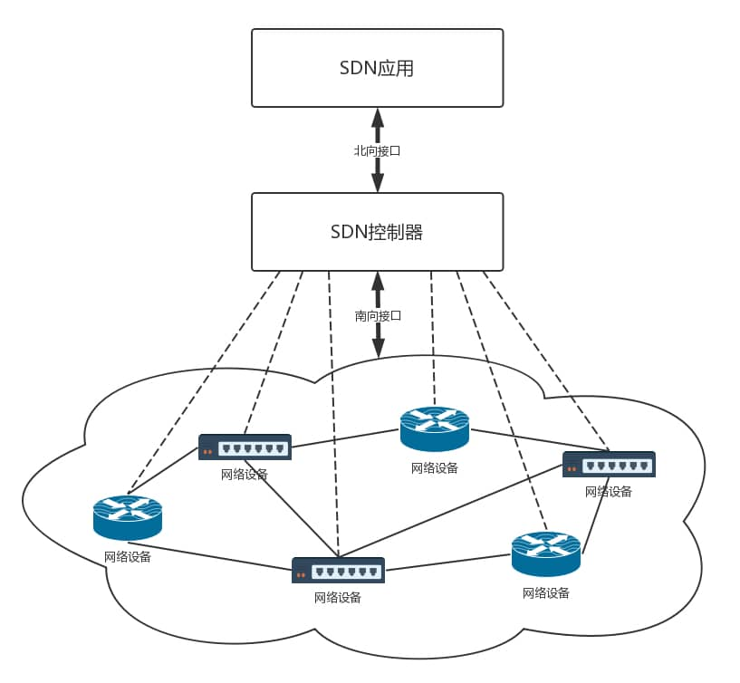
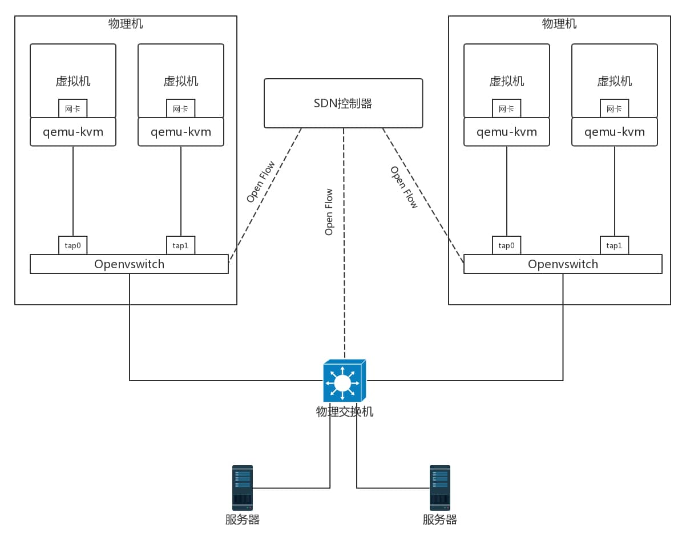
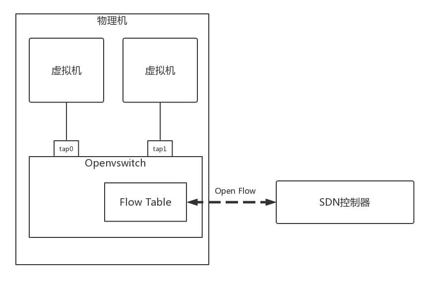
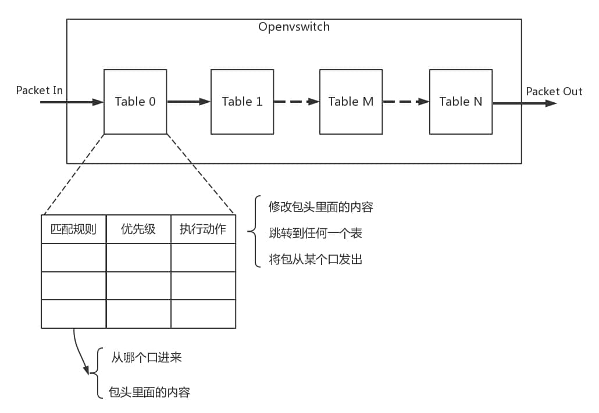
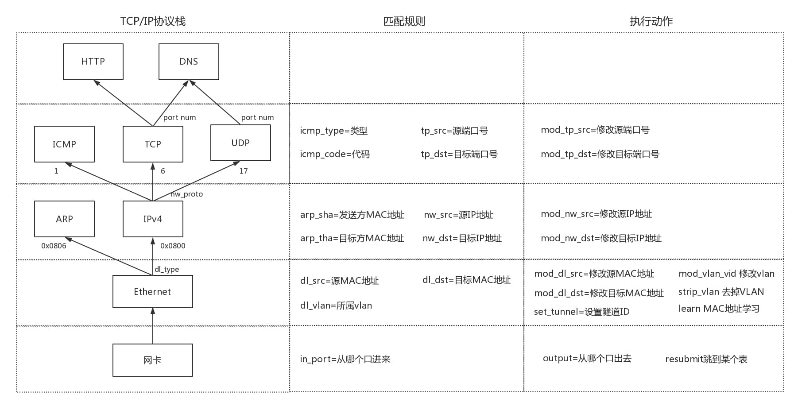
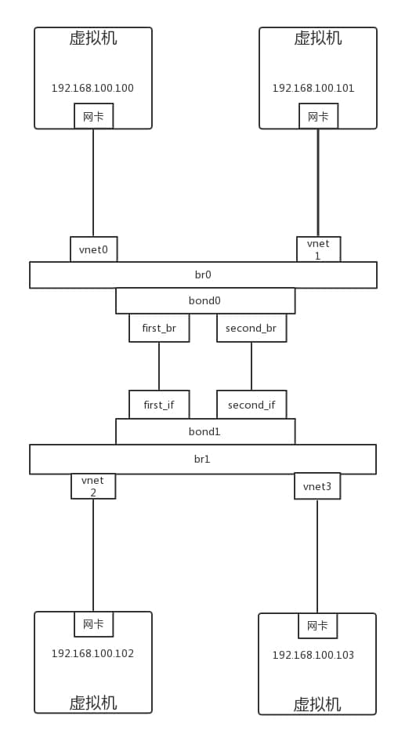
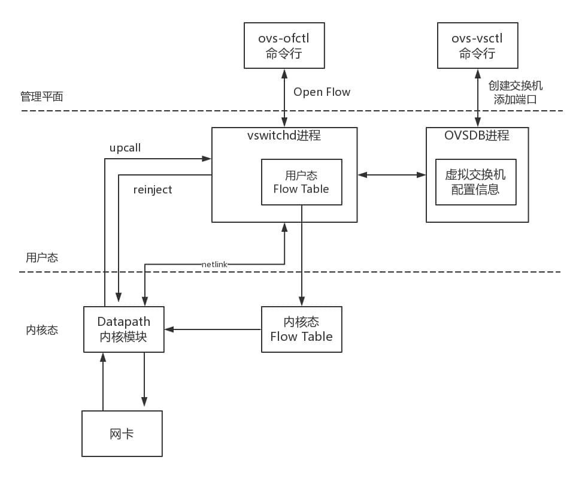
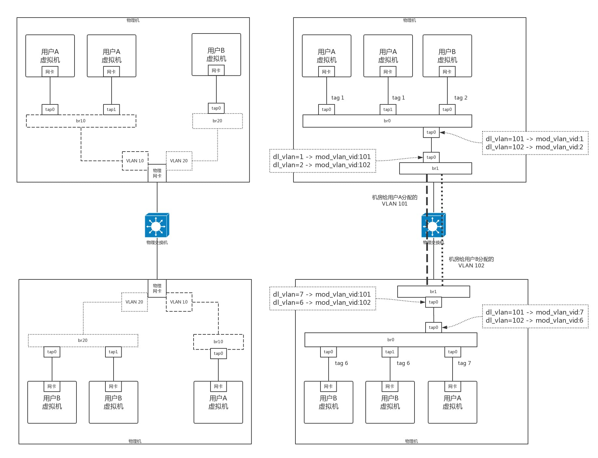

## 25-软件定义网络：共享基础设施的小区物业管理办法

上一节我们说到，使用原生的 VLAN 和 Linux网桥的方式来进行云平台的管理，但是这样在灵活性、隔离性方面都显得不足，而且整个网络缺少统一的视图、统一的管理。

可以这样比喻，云计算就像大家一起住公寓，要共享小区里面的基础设施，其中网络就相当于小区里面的电梯、楼道、路、大门等，大家都走，往往会常出现问题，尤其在上班高峰期，出门的人太多，对小区的物业管理就带来了挑战。

物业可以派自己的物业管理人员，到每个单元的楼梯那里，将电梯的上下行速度调快一点，可以派人将隔离健身区、景色区的栅栏门暂时打开，让大家可以横穿小区，直接上地铁，还可以派人将多个小区出入口，改成出口多、入口少等等。等过了十点半，上班高峰过去，再派人都改回来。

### 1. 软件定义网络（SDN）

这种模式就像传统的网络设备和普通的 Linux网桥的模式，配置整个云平台的网络通路，你需要登录到这台机器上配置这个，再登录到另外一个设备配置那个，才能成功。

如果物业管理人员有一套智能的控制系统，在物业监控室里就能看到小区里每个单元、每个电梯的人流情况，然后在监控室里面，只要通过远程控制的方式，拨弄一个手柄，电梯的速度就调整了，栅栏门就打开了，某个入口就改出口了。

这就是软件定义网络（SDN）。它主要有以下三个特点。



- **控制与转发分离**：转发平面就是一个个虚拟或者物理的网络设备，就像小区里面的一条条路。控制平面就是统一的控制中心，就像小区物业的监控室。它们原来是一起的，物业管理员要从监控室出来，到路上去管理设备，现在是分离的，路就是走人的，控制都在监控室。

- **控制平面与转发平面之间的开放接口**：控制器向上提供接口，被应用层调用，就像总控室提供按钮，让物业管理员使用。控制器向下调用接口，来控制网络设备，就像总控室会远程控制电梯的速度。这里经常使用两个名词，前面这个接口称为北向接口，后面这个接口称为南向接口，上北下南嘛。

- **逻辑上的集中控制**：逻辑上集中的控制平面可以控制多个转发面设备，也就是控制整个物理网络，因而可以获得全局的网络状态视图，并根据该全局网络状态视图实现对网络的优化控制，就像物业管理员在监控室能够看到整个小区的情况，并根据情况优化出入方案。

### 2. OpenFlow 和 OpenvSwitch

SDN 有很多种实现方式，我们来看一种开源的实现方式。

**OpenFlow** 是 SDN 控制器和网络设备之间互通的接口协议，**OpenvSwitch** 用于创建软件的虚拟交换机。OpenvSwitch 是支持 OpenFlow 协议的，当然也有一些硬件交换机也支持 OpenFlow 协议。它们都可以被统一的 SDN 控制器管理，从而实现物理机和虚拟机的网络连通。



SDN 控制器是如何通过 OpenFlow 协议控制网络的呢？



在 OpenvSwitch 里面，有一个流表规则，任何通过这个交换机的包，都会经过这些规则进行处理，从而接收、转发、放弃。

那流表长啥样呢？其实就是一个个表格，每个表格好多行，每行都是一条规则。每条规则都有优先级，先看高优先级的规则，再看低优先级的规则。



对于每一条规则，要看是否满足匹配条件。这些条件包括，从哪个端口进来的，网络包头里面有什么等等。满足了条件的网络包，就要执行一个动作，对这个网络包进行处理。可以修改包头里的内容，可以跳到任何一个表格，可以转发到某个网口出去，也可以丢弃。

通过这些表格，可以对收到的网络包随意处理。



具体都能做什么处理呢？通过上面的表格可以看出，简直是想怎么处理怎么处理，可以覆盖 TCP/IP 协议栈的四层。

对于物理层：

- 匹配规则包括由从哪个口进来；

- 执行动作包括从哪个口出去。

对于 MAC 层：

- 匹配规则包括：源 MAC 地址是多少？（dl_src），目标 MAC 是多少？（dl_dst），所属 vlan 是多少？（dl_vlan）；
- 执行动作包括：修改源 MAC（mod_dl_src），修改目标 MAC（mod_dl_dst），修改 VLAN（mod_vlan_vid），删除 VLAN（strip_vlan），MAC 地址学习（learn）。

对于网络层：

- 匹配规则包括：源 IP 地址是多少？(nw_src)，目标 IP 是多少？（nw_dst）。
- 执行动作包括：修改源 IP 地址（mod_nw_src），修改目标 IP 地址（mod_nw_dst）。

对于传输层：

- 匹配规则包括：源端口是多少？（tp_src），目标端口是多少？（tp_dst）。

- 执行动作包括：修改源端口（mod_tp_src），修改目标端口（mod_tp_dst）。

  总而言之，对于 OpenvSwitch 来讲，网络包到了我手里，就是一个 Buffer，我想怎么改怎么改，想发到哪个端口就发送到哪个端口。

OpenvSwitch 有本地的命令行可以进行配置，能够实验咱们前面讲过的一些功能。我们可以通过 OpenvSwitch 的命令创建一个虚拟交换机。然后可以将多个虚拟端口 port 添加到这个虚拟交换机上。

```
ovs-vsctl add-br ubuntu_br
```

### 3. 实验一：用 OpenvSwitch 实现 VLAN 的功能

下面我们实验一下通过 OpenvSwitch 实现 VLAN 的功能，在 OpenvSwitch 中端口 port 分两种。

第一类是 access port：

- 这个端口配置 tag，从这个端口进来的包会被打上这个 tag；
- 如果网络包本身带有的 VLAN ID 等于 tag，则会从这个 port 发出；
- 从 access port 发出的包不带 VLAN ID。

第二类是 trunk port：

- 这个 port 不配置 tag，配置 trunks；
- 如果 trunks 为空，则所有的 VLAN 都 trunk，也就意味着对于所有 VLAN 的包，本身带什么 VLAN ID，就是携带者什么 VLAN ID，如果没有设置 VLAN，就属于 VLAN 0，全部允许通过；
- 如果 trunks 不为空，则仅仅带着这些 VLAN ID 的包通过。

我们通过以下命令创建如下的环境：


```
ovs-vsctl add-port ubuntu_br first_br
ovs-vsctl add-port ubuntu_br second_br
ovs-vsctl add-port ubuntu_br third_br
ovs-vsctl set Port vnet0 tag=101
ovs-vsctl set Port vnet1 tag=102
ovs-vsctl set Port vnet2 tag=103
ovs-vsctl set Port first_br tag=103
ovs-vsctl clear Port second_br tag
ovs-vsctl set Port third_br trunks=101,102
```

另外要配置禁止 MAC 地址学习。
```
ovs-vsctl set bridge ubuntu_br flood-vlans=101,102,103
```


创建好了环境以后，我们来做这个实验。

1. 从 192.168.100.102 来 ping 192.168.100.103，然后用 tcpdump 进行抓包。first_if 收到包了，从 first_br 出来的包头是没有 VLAN ID 的。second_if 也收到包了，由于 second_br 是 trunk port，因而出来的包头是有 VLAN ID 的，third_if 收不到包。
2. 从 192.168.100.100 来 ping 192.168.100.105, 则 second_if 和 third_if 可以收到包，当然 ping 不通，因为 third_if 不属于某个 VLAN。first_if 是收不到包的。second_if 能够收到包，而且包头里面是 VLAN ID=101。third_if 也能收到包，而且包头里面是 VLAN ID=101。
3. 从 192.168.100.101 来 ping 192.168.100.104， 则 second_if 和 third_if 可以收到包。first_if 是收不到包的。second_br 能够收到包，而且包头里面是 VLAN ID=102。third_if 也能收到包，而且包头里面是 VLAN ID=102。

通过这个例子，我们可以看到，通过 OpenvSwitch，不用买一个支持 VLAN 的交换机，你也能学习 VLAN 的工作模式了。

### 4. 实验二：用 OpenvSwitch 模拟网卡绑定，连接交换机

接下来，我们来做另一个实验。在前面，我们还说过，为了高可用，可以使用网卡绑定，连接到交换机，OpenvSwitch 也可以模拟这一点。

在 OpenvSwitch 里面，有个 bond_mode，可以设置为以下三个值：

- active-backup：一个连接是 active，其他的是 backup，当 active 失效的时候，backup 顶上；
- balance-slb：流量安装源 MAC 和 output VLAN 进行负载均衡；
- balance-tcp：必须在支持 LACP 协议的情况下才可以，可根据 L2, L3, L4 进行负载均衡。

我们搭建一个测试环境。




我们使用下面的命令，建立 bond 连接。
```
ovs-vsctl add-bond br0 bond0 first_br second_br
ovs-vsctl add-bond br1 bond1 first_if second_if
ovs-vsctl set Port bond0 lacp=active
ovs-vsctl set Port bond1 lacp=active
```

默认情况下 bond_mode 是 active-backup 模式，一开始 active 的是 first_br 和 first_if。

这个时候我们从 192.168.100.100 ping 192.168.100.102，以及从 192.168.100.101 ping 192.168.100.103 的时候，tcpdump 可以看到所有的包都是从 first_if 通过。

如果把 first_if 设成 down，则包的走向会变，发现 second_if 开始有流量，对于 192.168.100.100 和 192.168.100.101 似乎没有收到影响。

如果我们通过以下命令，把 bond_mode 设为 balance-slb。然后我们同时在 192.168.100.100 ping 192.168.100.102，在 192.168.100.101 ping 192.168.100.103，我们通过 tcpdump 发现包已经被分流了。
```
ovs-vsctl set Port bond0 bond_mode=balance-slb
ovs-vsctl set Port bond1 bond_mode=balance-slb
```

通过这个例子，我们可以看到，通过 OpenvSwitch，你不用买两台支持 bond 的交换机，也能看到 bond 的效果。

那 OpenvSwitch 是怎么做到这些的呢？我们来看 OpenvSwitch 的架构图。



OpenvSwitch 包含很多的模块，在用户态有两个重要的进程，也有两个重要的命令行工具。

- 第一个进程是 OVSDB 进程。ovs-vsctl 命令行会和这个进程通信，去创建虚拟交换机，创建端口，将端口添加到虚拟交换机上，OVSDB 会将这些拓扑信息保存在一个本地的文件中。
- 第一个进程是 vswitchd 进程。ovs-ofctl 命令行会和这个进程通信，去下发流表规则，规则里面会规定如何对网络包进行处理，vswitchd 会将流表放在用户态 Flow Table 中。

在内核态，OpenvSwitch 有内核模块 OpenvSwitch.ko，对应图中的 Datapath 部分。在网卡上注册一个函数，每当有网络包到达网卡的时候，这个函数就会被调用。

在内核的这个函数里面，会拿到网络包，将各个层次的重要信息拿出来，例如：

- 在物理层，in_port 即包进入的网口的 ID；
- 在 MAC 层，源和目的 MAC 地址；
- 在 IP 层，源和目的 IP 地址；
- 在传输层，源和目的端口号。

在内核中，有一个内核态 Flow Table。接下来内核模块在这个内核流表中匹配规则，如果匹配上了，则执行操作、修改包，或者转发或者放弃。如果内核没有匹配上，则需要进入用户态，用户态和内核态之间通过 Linux 的一个机制 Netlink 相互通信。

内核通过 upcall，告知用户态进程 vswitchd 在用户态 Flow Table 里面去匹配规则，这里面的规则是全量的流表规则，而内核 Flow Table 里面的只是为了快速处理，保留了部分规则，内核里面的规则过一阵就会过期。

当在用户态匹配到了流表规则之后，就在用户态执行操作，同时将这个匹配成功的流表通过 reinject 下发到内核，从而接下来的包都能在内核找到这个规则。

这里调用 openflow 协议的，是本地的命令行工具，也可以是远程的 SDN 控制器，一个重要的 SDN 控制器是 OpenDaylight。

下面这个图就是 OpenDaylight 中看到的拓扑图。是不是有种物业管理员在监控室里的感觉？


我们可以通过在 OpenDaylight 里，将两个交换机之间配置通，也可以配置不通，还可以配置一个虚拟 IP 地址 VIP，在不同的机器之间实现负载均衡等等，所有的策略都可以灵活配置。

### 5. 如何在云计算中使用 OpenvSwitch？

OpenvSwitch 这么牛，如何用在云计算中呢？



我们还是讨论 VLAN 的场景。

在没有 OpenvSwitch 的时候，如果一个新的用户要使用一个新的 VLAN，还需要创建一个属于新的 VLAN 的虚拟网卡，并且为这个租户创建一个单独的虚拟网桥，这样用户越来越多的时候，虚拟网卡和虚拟网桥会越来越多，管理非常复杂。

另一个问题是虚拟机的 VLAN 和物理环境的 VLAN 是透传的，也即从一开始规划的时候，就需要匹配起来，将物理环境和虚拟环境强绑定，本来就不灵活。

而引入了 OpenvSwitch，状态就得到了改观。

首先，由于 OpenvSwitch 本身就是支持 VLAN 的，所有的虚拟机都可以放在一个网桥 br0 上，通过不同的用户配置不同的 tag，就能够实现隔离。例如上面的图，用户 A 的虚拟机都在 br0 上，用户 B 的虚拟机都在 br1 上，有了 OpenvSwitch，就可以都放在 br0 上，只是设置了不同的 tag。

另外，还可以创建一个虚拟交换机 br1，将物理网络和虚拟网络进行隔离。物理网络有物理网络的 VLAN 规划，虚拟机在一台物理机上，所有的 VLAN 都是从 1 开始的。由于一台机器上的虚拟机不会超过 4096 个，所以 VLAN 在一台物理机上如果从 1 开始，肯定够用了。

例如在图中，上面的物理机里面，用户 A 被分配的 tag 是 1，用户 B 被分配的 tag 是 2，而在下面的物理机里面，用户 A 被分配的 tag 是 7，用户 B 被分配的 tag 是 6。

如果物理机之间的通信和隔离还是通过 VLAN 的话，需要将虚拟机的 VLAN 和物理环境的 VLAN 对应起来，但为了灵活性，不一定一致，这样可以实现分别管理物理机的网络和虚拟机的网络。好在 OpenvSwitch 可以对包的内容进行修改。例如通过匹配 dl_vlan，然后执行 mod_vlan_vid 来改进进出出物理机的网络包。

尽管租户多了，物理环境的 VLAN 还是不够用，但是有了 OpenvSwitch 的映射，将物理和虚拟解耦，从而可以让物理环境使用其他技术，而不影响虚拟机环境，这个我们后面再讲。

### 6.小结和补充

- 用 SDN 控制整个云里面的网络，就像小区保安从总控室管理整个物业是一样的，将控制面和数据面进行了分离；
- 一种开源的虚拟交换机的实现 **OpenvSwitch**，它能**对经过自己的包做任意修改**，从而使得云对网络的控制十分灵活；
- 将 OpenvSwitch 引入了云之后，可以使得配置简单而灵活，并且可以解耦物理网络和虚拟网络。

- 在这一节中，提到了通过 VIP 可以通过流表在不同的机器之间实现复杂均衡，你知道怎样才能做到吗？

- 虽然 OpenvSwitch 可以解耦物理网络和虚拟网络，但是在物理网络里面使用 VLAN，数目还是不够，你知道该怎么办吗

