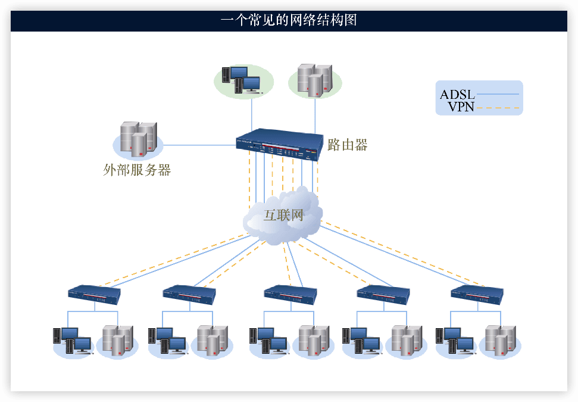
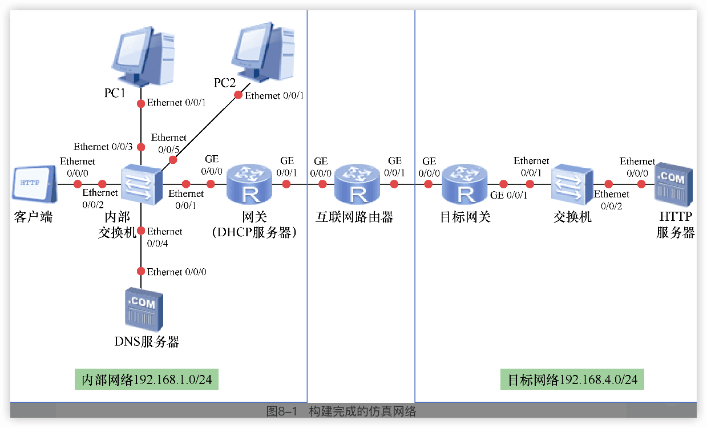

# 《Wireshark网络分析从入门到实践》

**任何的网络攻击行为最终都是通过发送数据包来实现的**，如果我们从数据包这个层次来分析问题，一切就会清晰起来。

Wireshark的两个重要作用：网络故障，网络安全。

2023 Version 4.0.3

https://www.wireshark.org/

https://github.com/wireshark/wireshark

## 1 走进Wireshark

“网络显微镜”：TcpDump（没有图形界面）、Sniffer、Ethereal和Wireshark等

### 1.1 Wireshark是什么

Wireshark是一个可以运行在各种主流操作系统上的**数据包分析软件**。

#### Wireshark的功能

现代网络，”**分组交换**“（将较大的信息拆分成基本单元），基本单元就是 `数据包 = 包头 + 包体`，包头是源地址和目标地址。

应用程序和操作系统在产生了数据包之后，会发送到**网卡**，然后再由网卡交给网络中的设备发送出去。

一般网卡在对接收到的数据包进行处理之前，会先对它们的目的地址进行检查，如果目的地址不是本机的话，就会丢弃这些数据，相反就会将这些数据包交给操作系统，操作系统再将其分配给应用程序。

1. 如果使用了Wireshark的话，那么网卡无论是接收还是发送数据包的时候，都会将这些数据包**==复制==**一份发送给Wireshark。这个获取流经网卡数据包的过程，也被称为“捕获数据包”或者简称为“**==抓包==**”。
2. Wireshark可以将捕获到的数据包进行自动分析，把这些0和1的组合解析成我们容易理解的形式，这个过程就是“**==数据包分析==**”。

#### Wireshark的历史

Gerald Combs，1998-7， Ethereal -> Wireshark，

#### Wireshark的工作原理

网卡两种工作方式：

**普通模式**：只会将发给本机的数据包传递给操作系统，其他的一律丢弃。

**混杂模式**：会将所有通过它的数据包（不管是不是发给本机）都传递给操作系统。Wireshark经常使用混杂模式

Wireshark的工作流程：

1. 捕获：Wireshark将网卡调整为混杂模式，在该模式下捕获网络中传输的二进制数据。
2. 转换：Wireshark将捕获到的二进制数据转换为我们容易理解的形式，同时也会将捕获到的数据包按照顺序进行组装。
3. 分析：最后Wireshark将会对捕获到的数据包进行分析。这些分析包括识别数据包所使用的**协议类型、源地址、目的地址、源端口和目的端口**等。Wireshark有时也会根据自带的**==协议解析器==**来深入地分析数据包的内容。

#### Wireshark的优势

1. 所有主流操作系统都可运行
2. 支持更多的网络协议
3. 极为友好的使用界面
4. 对网络数据实时的显示
5. 开源项目（C语言）

> 当需要对网络进行研究时，Wireshark绝对是一个最为理想的帮手。

### 1.2 安装

WinPcap

**ChmodBPF**

### 1.3 一次完整的Wireshark使用过程

1. 选择合适的网卡

Wireshark的启动界面中列出了**当前计算机上所有网卡设备的名称以及流经该网卡的数据包信息**。（每个网卡后面以曲线图的形式展示数据包的数量）

捕获选项：

2. 开始数据包的捕获

在进行数据包捕获时的工作界面：

> 1: 标题栏
>
> 2: 菜单栏
>
> 3: 工具栏
>
> 4：显示过滤器，它的作用是将捕获的所有流量进行筛选，过滤掉不需要的流量。
> 5：数据包列表面板；每一行表示一个捕获到的数据包，每一列表示数据包的特定信息，如下
> No：按顺序的唯一标识数据包的序列号。
> Time：捕获数据包时的时间戳。
> Source：捕获数据包的源IP地址。
> Destionation：捕获数据包的目的IP地址。
> Protocol：捕获数据包的协议类型。
> Length：捕获数据包的大小。
> Info：数据包的附加信息。
> 6：数据包细节面板。
> 7：数据包字节面板。左侧灰色的第1列表示数据的偏移量。第2列是以十六进制表示的数据包内容，第3列是以ASCII码表示的数据包内容。
>
> 8：状态条
3. 过滤无用的数据

**会话统计功能**：将相同的源地址和目的地址（例如192.168.0.1到1.1.1.1）之间的所有数据包看作是一个对话。**统计→会话（对话，Conversations）**

- Address A：该次对话的A地址。
- Address B：该次对话的B地址。
- Packets：该对话中的数据包数量。
- Bytes：该对话中产生全部数据包的大小。
- Packets A→B：从A地址发往B地址数据包的数量。
- Bytes A→B：从A地址发往B地址数据包的大小之和。
- Packets B→A：从B地址发往A地址数据包的数量。
- Bytes B→A：从B地址发往A地址数据包的大小之和。
- Rel Start：这个值表示的是从Wireshark开始捕获数据包到对话建立之间的时间间隔。
- Duration：这个对话建立的时间。
- Bits/s A→B：这个对话从A到B**每秒钟平均网络流量**。
- Bits/s B→A：这个对话从B到A每秒钟平均网络流量。

**名字解析**：把IP地址解析为域名（一般在数据捕获结束后启用，减轻捕获时的压力）。**“视图”→“解析名称”→“解析网络地址”。**此时在数据包列表面板会显示域名，在会话列表左下角勾选**解析名称**也可以看到域名。

**过滤功能**

4. 将捕获到的数据包保存到文件

**“文件”→“导出特定分组”**

## 2 过滤无用的数据包

在实际工作中，对Wireshark过滤器的使用也很能看出一个工作人员的基本功。

### 2.1 伯克利包过滤

伯克利包过滤（Berkeley Packet Filter，BPF），采用了一种与自然语言很接近的语法，利用这种语法构成的字符串可以确定保留哪些数据包以及忽略掉哪些数据包。

原语 + 限定符

伯克利包过滤的限定符有3种：

1. type：表示指代的对象，例如IP地址、子网或者端口等。常见的有host（用来表示主机名和IP地址）、net（用来表示子网）、port（用来表示端口）。如果没有指定的话，就默认为host。
2. dir：表示数据包传输的方向，常见的有src（源地址）和dst（目的地址）。如果没有指定的话，默认为“src or dst”。例如“192.168.1.1”就表示无论源地址或者目的地址为192.168.1.1的都使得这个语句为真。
3. proto：表示与数据包匹配的协议类型，常见的就是ether、ip、tcp、arp这些协议。

例如IP地址192.168.1.1，子网192.168.1.0/24，或者端口号8080都是常见的标识符。`host 192.168.1.1`和`port 8080`就是两个比较常见的原语，还可以用`and`、`or`和`not`把多于一个原语组成一个更复杂的过滤命令。例如`host 192.168.1.1 and port 8080`也是符合规则的过滤命令。

常见的原语实例：

- `host 192.168.1.1`，当数据包的目标地址或者源地址为192.168.1.1时，过滤语句为真。
- `dst host 192.168.1.1`，当数据包的目标地址为192.168.1.1时，过滤语句为真。
- `src host 192.168.1.1`，当数据包的源地址为192.168.1.1时，过滤语句为真。
- `ether host 11:22:33:44:55:66`，当数据包的以太网源地址或者目的地址为11:22:33: 44:55:66时，过滤语句为真。
- `ether dst 11:22:33:44:55:66`，当数据包的以太网目的地址为11:22:33:44:55:66，过滤语句为真。
- `ether src 11:22:33:44:55:66`，当数据包的以太网源地址为11:22:33:44:55:66，过滤语句为真。
- `dst net 192.168.1.0/24`，当数据包的IPv4/v6的目的地址的网络号为192.168.1.0/24时，过滤语句为真。
- `src net 192.168.1.0/24`，当数据包的IPv4/v6的源地址的网络号为192.168.1.0/24时，过滤语句为真。
- `net 192.168.1.0/24`，当数据包的IPv4/v6的源地址或目的地址的网络号为192.168.1.0/24时，过滤语句为真。
- `dst port 8080`，当数据包是tcp或者udp数据包且目的端口号为8080时，过滤语句为真。
- `src port 8080`，当数据包是tcp或者udp数据包且源端口号为8080时，过滤语句为真。
- `port 8080`当数据包的源端口或者目的端口为8080时，过滤命令为真。所有的port前面都可以加上关键字tcp或者udp。

对数据包进行更细微的操作，语法为`proto[expr:size]`，这里面的proto指代协议，expr表示相对给出协议层的字节偏移量，size表示要操作的字节数。其中size的值是可选的，可以是1、2、4中的一个，默认值为1。

例如，一个IP数据包头部的长度为20字节（图2-2中8位为1字节），其中的第12、13、14、15这4个字节表示的就是这个数据包的源地址。

现在我们使用这个格式来改写`dst host 192.168.1.1`，这里面要操作的dst host是源地址，它位于IP数据包头的第12,13,14,15位，expr的值为12，长度size的值为4，地址192.168.1.1转换为十六进制为“0xc0a80101”，最后就可以写成：`ip[12:4] =0xc0a80101`。

这种偏移量的写法在很多情形下是相当有用的，例如**对各种类型icmp协议的过滤，对各种TCP协议标志位的过滤**。

### 2.2 捕获过滤器

Wireshark中提供了两种不同的过滤器：**捕获过滤器和显示过滤器**。

捕获过滤器是**在Wireshark捕获过程的同时进行工作的**，这意味着如果你使用了捕获过滤器，那么Wireshark就不会捕获不符合规则的数据包。

编写的过滤器如果不正确的话，文本框的颜色会变成粉红色，如果正确的话则为绿色。

一些常见的过滤器。

- `tcp dst port 80`：只保留目标端口为80的TCP数据包。
- `ip src host 192.168.1.1`：只保留源地址为192.168.1.1的数据包。
- `src portrange 2000-2500`：只保留源端口在2000～2500范围的UDP和TCP数据包。
- `not icmp`：保留除了icmp以外的数据包。
- `src host 10.7.2.12 and not dst net 10.200.0.0/16`：保留源地址为10.7.2.12，但目标地址不为10.200.0.0/16范围的数据包。

### 2.3 显示过滤器

显示过滤器是在Wireshark**捕获的过程后进行工作的**，这表示即使你使用了显示过滤器，Wireshark仍然会捕获不符合规则的数据包，但是并不会将它们显示在数据包面板上。

显示过滤器的语法与捕获过滤器的语法并不相同。

显示过滤器可以根据定义的协议字段名称来定位和显示特定的数据包。我们可以通过一些选项来确定协议字段名称，这样就可以创建各种简单或者复杂的显示过滤器。

#### 使用过滤器输入框创建显示过滤器

#### 使用过滤器表达式创建显示过滤器

每个部分的含：

- 字段名称：这里列出了Wireshark中支持的各种协议以及它们的子类。
- 关系：这里列出了Wireshark中可以使用的各种运算符。
- 值：用户可以根据自己的过滤需求在这里输入内容。
- 预定义的值：这里面列出了当前选中协议常使用的值。

#### 在数据包细节面板中创建显示过滤器

初学者很难掌握“字段名称”中那数以百计的选项，不过Wireshark中提供了一种简单的创建显示过滤器的方法，就是**以某个数据包的特性**来作为过滤器。

## 3 捕获文件的打开与保存

### 捕获接口的输出功能

“捕获”→“选项”

### 环状缓冲区

保存的数据文件很大，连续保存时，无论多大的硬盘也会有耗尽的时候。

循环覆盖

### 捕获接口的其他功能

#### 显示选项

如果勾选了其中的“实时更新分组列表”，那么每当捕获到了新的数据包之后，数据包列表面板中的信息就会实时更新。

如果勾选了其中的“实时捕获时自动滚屏”，数据包列表面板在数据更新之后，面板会自动滚动。这两个选项默认是选中的。

如果勾选了“显示额外的捕获信息对话框”的话，那么在捕获数据包的时候就会弹出一个以百分比形式显示的统计数据窗口。

#### 解析名称

如果你勾选了“MAC地址解析”这个选项的话，Wireshark就会将MAC地址解析成一种更容易识别的形式，例如dc:fe:18:58:8c:3b就会被转换为Tp-linkT_58:8c:3b，这样我们就可以容易地识别出这是一台Tp-link的设备，MAC地址转换的规则为转换6个字节中的前3个。通常设备的MAC地址的前3个字节就是生产厂商的标识符。不过并不是所有的MAC地址都可以转换成功。

如果勾选了“解析网络名称”的话，Wireshark就会将IP地址装换成域名或者主机名，例如180.149.132.151就会被解析为www.a.shifen.com。但是这个解析是通过发送DNS请求实现的，因此会给系统造成额外的开销。

最后一个“解析传输层名称”表示将传输层的端口号解析成对应的应用层服务，这个并不一定准确。解析的原理是我们常用的服务往往要运行在固定的端口上，例如http往往会运行在80端口，而telnet就会运行在21端口上。也就是说这个功能其实是依靠一张端口和服务的对应表来实现的。

#### 自动停止捕获

以实现自动停止捕获。

第一个单选框的单位是分组，如果勾选它的话表示捕获的数据包达到指定数量时，停止捕获。

第二个单选框的单位是分组，表示创建的文件达到指定数量时，停止捕获。

第三个单选框的单位可以选择千字节、兆字节和千兆字节，表示捕获到的文件达到指定大小时，停止捕获。

第四个单选框是时间，单位可以是秒、分钟和小时，表示到达捕获的时间时，停止捕获。

如果勾选了多个选项的话，那么只要其中任意一个条件满足的话，就会停止捕获。

在完成了捕获操作之后，我们还需要对其进行检查。首先应该做的就是下拉数据包列表的滚动条，以确定当前捕获的数据包正是我们所希望获取的。

另外还需要考虑的就是丢包率，我们使用的网卡和操作系统未必能将全部的数据包都捕获到，在Wireshark底部中心状态栏会以百分比的形式来显示丢包率。这一点在捕获无线流量的时候尤为明显，我们往往需要多次操作才可能捕获到一个完整的无线连接过程。这种情况会影响到我们对流量的分析。如果希望保证捕获数据包的效率，可以使用性能更高的计算机和网卡，也可以调整捕获设备所处的位置。

🔖🔖

### 保存捕获到的数据

### 保存显示过滤器

经常使用的过滤器也可以保存起来，以便于以后再次使用。

### 保存配置文件

## 4 虚拟网络环境的构建

### 4.1　虚拟网络设备的构建工具eNSP

很多工具软件都提供了网络设备的虚拟功能，其中最著名的包括==GNS3==和==eNSP==等。GNS3 主要提供了对思科设备的模拟，而eNSP则主要提供了对华为设备的模拟，这两个模拟器都提供了虚拟设备与真实网络的连接功能。

### 4.2　虚拟PC的工具VMware

### 4.3　在虚拟环境中引入Kali Linux 2

### 4.5　eNSP与VMware的连接

## 5 各种常见的网络设备

### 网线

### 集线器

### 交换机 🔖

==物理地址（MAC地址）==：也叫==硬件地址==，长度是48比特（6字节），由十六进制的数字组成，分为前24位和后24位。•前24位叫作组织唯一标志符（Organizationally Unique Identifier，OUI），是由IEEE的注册管理机构给不同厂家分配的代码，用于区分不同的厂家。•后24位是由厂家自己分配的，称为扩展标识符。同一个厂家生产的网卡中MAC地址的后24位是不同的。

- 前24位叫作==组织唯一标志符==（Organizationally Unique Identifier，OUI），是由IEEE的注册管理机构给不同厂家分配的代码，用于区分不同的厂家。
- 后24位是由厂家自己分配的，称为==扩展标识符==。同一个厂家生产的网卡中MAC地址的后24位是不同的。

这里显示的4C-CC-6A-62-4E-29就是本机网卡的物理地址，其中“4C-CC-6A”是厂家的代码，后面的“62-4E-29”是这个网卡的扩展标识符。

### 路由器

## 6 Wireshark的部署方式

前面捕获和分析的都只是源地址或者目的地址是本机的数据包。

但是现实中遇到的情况往往要复杂得多，研究的对象要包括网络中的其他设备，我们需要找出合适的方案来捕获并分析那些本来不属于本机的数据包。

### 完成远程数据包捕获

### 集线器环境下使用Wireshark

### 交换机环境下使用Wireshark（端口镜像功能、ARP欺骗、分路器的使用）

### 完成本地流量的捕获

### 完成虚拟机流量的捕获；

## 7 找到网络发生延迟的位置

### 建立一个访问远程HTTP服务器的仿真网络

### 观察远程访问HTTP的过程

### 时间显示

### 各位置延迟时间的计算

## 8 分析不能上网的原因

### 建立一个用于测试的仿真网络

### 导致不能上网的原因

在实际生活中导致计算机不能上网的原因有很多，正常情况下可以按照如下的步骤来进行故障排除。

- 检查用户所用设备的网卡是否正常启动。
- 检查用户所用设备上每个网卡的IP地址、子网掩码、默认网关配置是否正确。
- 检查用户所在网络的ARP协议是否正常工作，例如网关的MAC地址是否正确。
- 检查用户所在网络的DNS协议是否正常工作。
- 检查用户所使用的具体网络服务是否正常工作。

### 检查计算机的网络设置

### 检查网络路径的连通性

### 其他情形

检查DNS协议；

检查网络传输路径；

检查目标服务器

## 9 来自链路层的攻击——失常的交换机

据统计，目前网络安全的问题有80%来自于“内部网络”，很多黑客也将攻击目标从单纯的计算机转到了网络结构和网络设计上来。

因为链路层是内部网络通信最为重要的协议，而交换机正是这一层的典型设备，所以以交换机为例。但是相比起其他网络设备来说，交换机的防护措施往往也是最差的，因此也经常成为黑客攻击的目标。

### 针对交换机的常见攻击方式

MAC地址欺骗攻击

MAC地址泛洪攻击

STP操纵攻击

广播风暴攻击

### 使用Wireshark的统计功能分析针对交换机的攻击

### 使用macof发起MAC地址泛洪攻击

### 如何防御MAC地址泛洪攻击

## 10 来自网络层的欺骗——中间人攻击

中间人攻击又被简称为NITM攻击

### 中间人攻击的相关理论

### 使用Wireshark的专家系统分析中间人攻击

### 发起中间人攻击

### 如何防御中间人攻击

静态绑定ARP表项

使用DHCP Snooping功能

划分VLAN

## 11 来自网络层的攻击——泪滴攻击

互联网上的每一个设备都需要通过IP地址来标识自己的身份。

### 泪滴攻击（TearDrop）的相关理论

#### IP协议的格式

1. 版本——占 4 位，指 IP 协议的版本目前的 IP协议版本号为 4（即IPv4）。
2. 首部长度——占 4 位，这里的值为20Bytes。
3. 总长度的是56 字节。
4. 标识（identification）——占16 位，它是一个计数器，用来产生数据包的标识。
5. 片偏移（16 位）——较长的分组在分片后某片在原分组中的相对位置，片偏移以8 个字节为偏移单位。
6. 生存时间（8 位）——记为TTL（Time To Live），表示数据包在网络中可通过的路由器数的最大值。
7. 协议（8 位）字段——指出此数据包携带的数据使用何种协议以便目的主机的IP 层将数据部分上交给哪个处理进程。
8. 源IP地址，表示数据包从哪里发出。
9. 目的IP地址，表示数据包将要发向哪里。

### Wireshark的着色规则

### 如何发起泪滴攻击

### 根据TTL值判断攻击的来源

TTL的作用是限制IP数据包在计算机网络中存在的时间。TTL的最大值是255，不同的操作系统发出数据包的TTL字段值都不相同。TTL字段由IP数据包的发送者设置，在IP数据包从源主机到目的主机的整个转发路径上，每经过一个路由器，路由器都会修改这个TTL字段值，具体的做法是把该TTL的值减1，然后再将IP包转发出去。

## 12 来自传输层的洪水攻击（1）——SYN Flooding

### 拒绝服务攻击的相关理论

### 模拟SYN flooding攻击

### 使用Wireshark的流向图功能来分析SYN flooding攻击

### 如何解决SYN Flooding拒绝服务攻击

### 在Wireshark中显示地理位置

## 13 网络在传输什么——数据流功能

### TCP中的数据传输

### Wireshark中的TCP流功能

### 网络取证实践

## 14 来自传输层的洪水攻击（2）——UDP Flooding

### UDP Flooding的相关理论

### 模拟UDP Flooding攻击

### 使用Wireshark的绘图功能来分析UDP Flooding攻击

### 如何防御UDP Flooding攻击

### amCharts的图表功能

## 15 来自应用层的攻击——缓冲区溢出

### 缓冲区溢出攻击的相关理论

### 模拟缓冲区溢出攻击

### 使用Wireshark分析缓冲区溢出攻击

### 使用Wireshark检测远程控制

### 使用Wireshark分析HTTPs协议

## 16 扩展Wireshark的功能

### Wireshark编程开发的基础

### 使用Lua开发简单扩展功能

### 在Wireshark开发新的协议解析器

### 对新协议的测试

### 编写恶意攻击数据包检测模块

## 17 Wireshark中的辅助工具

- Tshark.exe：这个工具可以看作是Wireshark的命令行版本，可以用来捕获数据包，也可以读取保存好的数据包捕获文件。

- editcap.exe：主要用来转换捕获数据包捕获文件的格式。
- dumpcap.exe：和tshark.exe一样用来捕获数据包，保存为libpcap格式文件。
- mergecap .exe：用来将多个数据包捕获文件合并成一个。
- capinfos.exe：用来将显示数据包捕获文件的信息。
- text2pcap.exe：将十六进制转储文件转换为数据包捕获文件。
