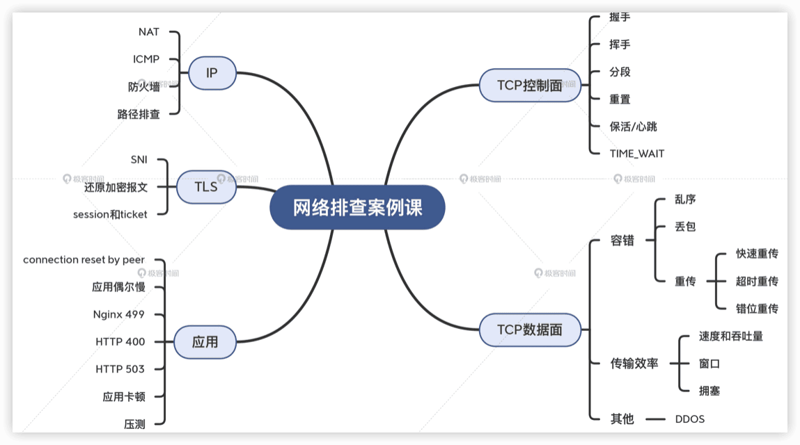
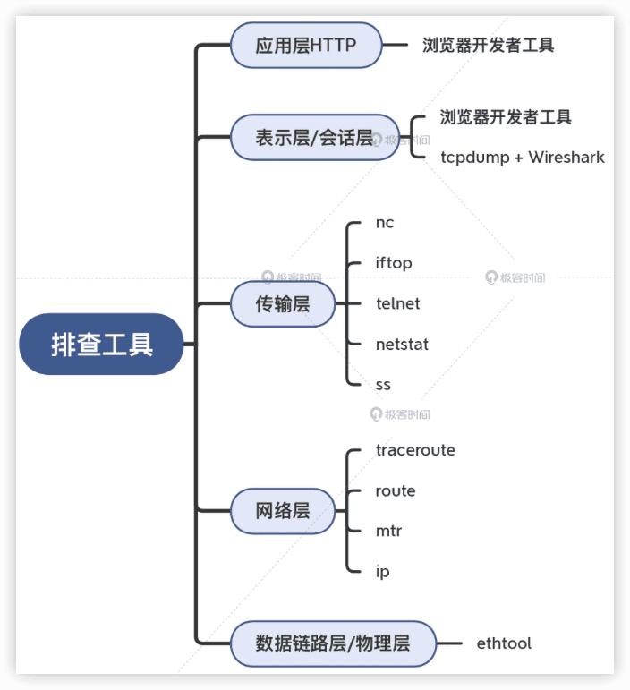

网络排查案例课
---

https://time.geekbang.org/column/intro/100104301  2022

# 开篇

## 开篇词 | 网络排查是工程师的必备能力

随着微服务和云计算的不断普及，越来越多的系统从本地的单体服务，变成跨网络的分布式的微服务。那么随之而来，就是数不清的跟网络相关的问题。比如：

- 为什么我的应用在单体应用的时候很正常，拆分成微服务以后却时常超时、报错呢？
- 为什么我的带宽是足够的，但数据传输速度却很慢？
- 为什么我的应用偶尔会卡住，但又不是每次都这样？
- 为什么……

面对这么多问题，我们经常束手无策。有些同学自嘲是优秀的“SRE”（Server Restart Engineer），遇到问题先上“重启大法”，也许也能搞定不少问题。但是呢，根因依然是未知，即使问题暂时消失了，但不知道什么时候，它又会再次到来，然后再次重启……

所有这一切，都让我深深地感到：**我们的工程师，太需要网络排查方面的能力了。**

## 01 | 网络模型和工具：网络为什么要分层？

## 02 | 抓包分析技术初探：你会用tcpdump和Wireshark吗？

# 实战一：TCP真实案例揭秘篇 (14讲)

03 | 握手：TCP连接都是用TCP协议沟通的吗？

04 | 挥手：Nginx日志报connection reset by peer是怎么回事？

05 | 定位防火墙（一）：传输层的对比分析

答疑（一）| 第1~5讲思考题答案

06 | 定位防火墙（二）：网络层的精确打击

07 | 保活机制：心跳包异常导致应用重启？

08 | 分段：MTU引发的血案

09 | 长肥管道：为何文件传输速度这么慢？

10 | 窗口：TCP Window Full会影响传输效率吗？

答疑（二）| 第6~10讲思考题答案

11 | 拥塞：TCP是如何探测到拥塞的？

12 | 重传的认识：重传到底是怎么回事？

13 | 重传的再认识：没有任何丢包却也一直重传？

14 | 安全：用Wireshark把DDoS攻击照出原形

# 实战二：应用层真实案例揭秘篇 (10讲)

15 | Nginx的499状态码是怎么回事？

答疑（三）| 第11~15讲思考题答案

16 | 服务器为什么回复HTTP 400？

17 | 为什么前端页面里多选一个城市就报错？

18 | 偶发性问题如何排查？

19 | TLS的各种特性：TLS握手为什么会失败？

20 | TLS加解密：如何解密HTTPS流量？

答疑（四）| 第16~20讲思考题答案

21 | 为什么用了负载均衡更加不均衡？

22 | 为什么压力测试TPS总是上不去？

# 实战三：不用抓包就能做的网络排查篇

23 | 路径排查：没有网络设备权限要如何做排查？

24 | 丢包：如何确定丢包的存在及其程度？

# 总结

25 | 抓包分析的回顾、拾遗，和提高

# 课程迭代

2025

旅程再启 | 那些关于网络排查的新思考

抓包分析工具再探：Wireshark

Wireshark困境：为何TLS通信以RST结束？
