图解HTTP
------------

## 1 了解Web及网络基础

通过发送请求获取服务器资源的Web浏览器等，都可称为**客户端（client）**。

Web使用一种名为**HTTP（HyperText Transfer Protocol，超文本传输协议，transfer翻译成转移更准确）**的协议作为规范，完成从客户端到服务器端等一系列运作流程。

### HTTP的诞生

CERN（欧洲核子研究组织）的蒂姆·伯纳斯-李（Tim Berners-Lee）博士提出了一种能让远隔两地的研究者们**共享知识**的设想。

3项WWW（World Wide Web，万维网，简称Web）构建技术：

1. 把**SGML**（StandardGeneralized Markup Language，标准通用标记语言）作为页面的文本标记语言的HTML（HyperText Markup Language，超文本标记语言）；

2. 作为文档传递协议的HTTP；

3. 指定文档所在地址的URL（Uniform Resource Locator，统一资源定位符）。

由于协议本身非常简单，于是在此基础上设想了很多应用方法并投入了实际使用。现在HTTP协议已经超出了Web这个框架的局限，被运用到了各种场景里。

### 网络基础TCP/IP

TCP/IP是互联网相关的各类协议族的总称。

TCP/IP协议族按层次分别分为以下4层：

1. 应用层：FTP、DNS、HTTP等。
2. 传输层：TCP（Transmission ControlProtocol，传输控制协议）和UDP（User Data Protocol，用户数据报协议）。
3. 网络层：IP
4. 数据链路层（又称网络接口层）

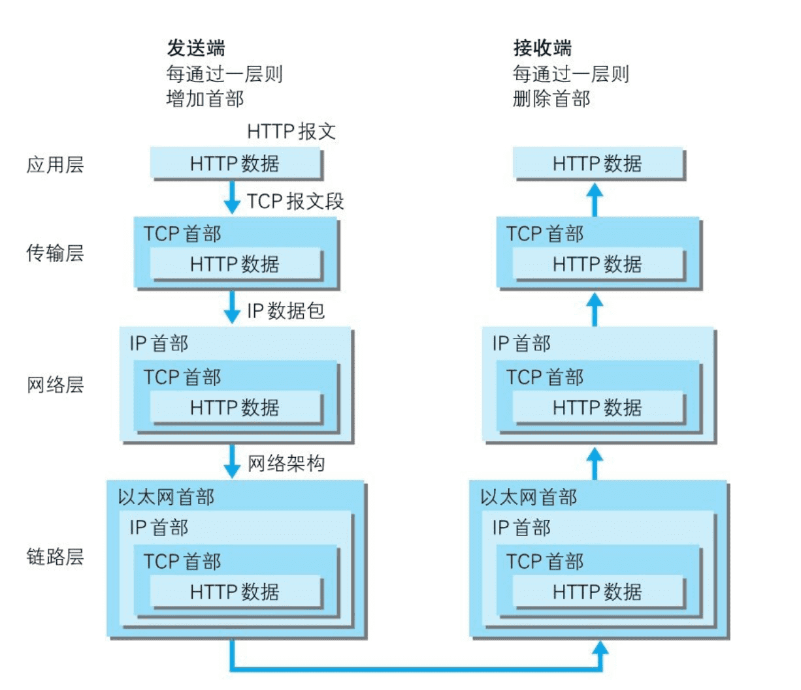

封装（encapsulate）

### 与HTTP关系密切的协议：IP、TCP和DNS

**IP协议（Internet Protocol）**的作用是把各种数据包传送给对方。而要保证确实传送到对方那里，则需要满足各类条件。其中两个重要的条件是IP地址和MAC地址（Media Access Control Address）。

**TCP协议**通过三次握手（three-way handshaking）策略，来保证可靠性：

发送端首先发送一个带SYN（synchronize）标志的数据包给对方。接收端收到后，回传一个带有SYN/ACK（acknowledgement）标志的数据包以示传达确认信息。最后，发送端再回传一个带ACK标志的数据包，代表“握手”结束。

**DNS（Domain Name System）**服务是和HTTP协议一样位于应用层的协议。它提供域名到IP地址之间的解析服务。


### 各种协议与HTTP协议的关系

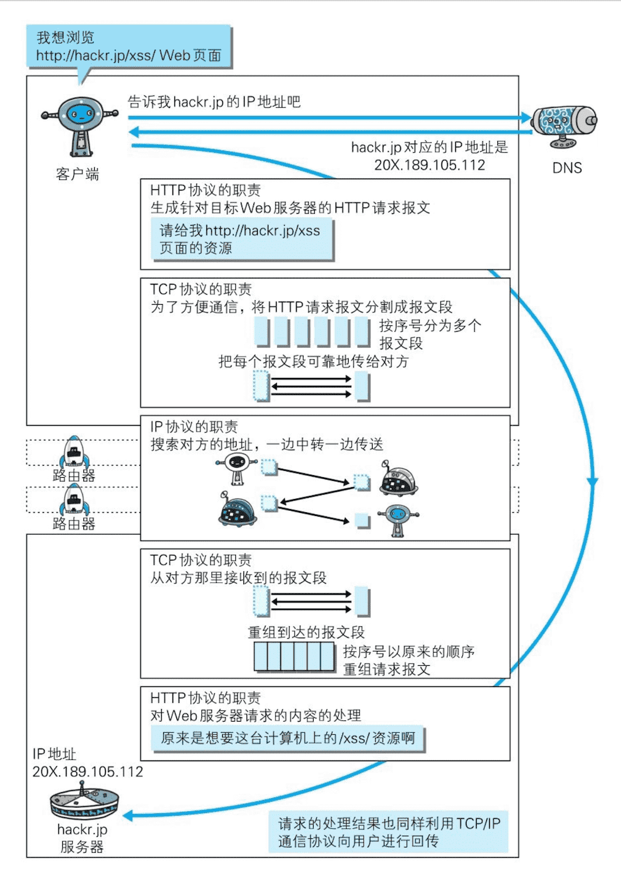

### URI和URL

URI（Uniform Resource Identifier，统一资源标识符）

URL（Uniform Resource Locator，统一资源定位符）

URI用字符串标识某一互联网资源（就是只要一个字符串能表示唯一的资源都可以），而URL表示资源的地点（互联网上所处的位置）。

可见<font color=#FF8C00>URL是URI的子集</font>。例如下面都是URI，但不都是URL([RFC3986](https://tools.ietf.org/html/rfc3986))：

```
ftp://ftp.is.co.za/rfc/rfc1808.txt
http://www.ietf.org/rfc/rfc2396.txt
ldap://[2001:db8::7]/c=GB?objectClass?one
mailto:John.Doe@example.com
news:comp.infosystems.www.servers.unix
tel:+1-816-555-1212
telnet://192.0.2.16:80/  urn:oasis:names:specification:docbook:dtd:xml:4.1.2
```

完整URL的格式：

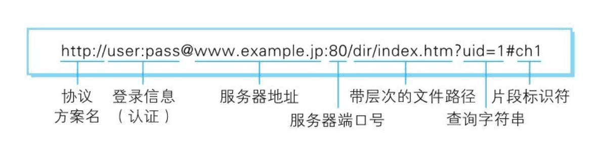

一些用来制定HTTP协议技术标准的文档，它们被称为**RFC**（Request for Comments，征求修正意见书）。

## 2 简单的HTTP协议

### 通过请求和响应的交换达成通信

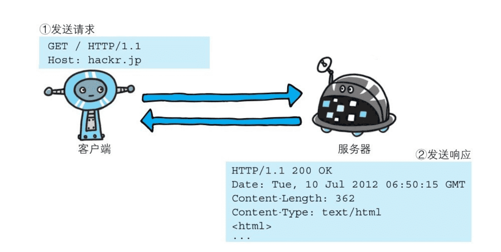

请求报文是由**请求方法**、**请求URI**（指明访问的资源对象）、**协议版本**、可选的**请求首部字段**和**内容实体**构成的。

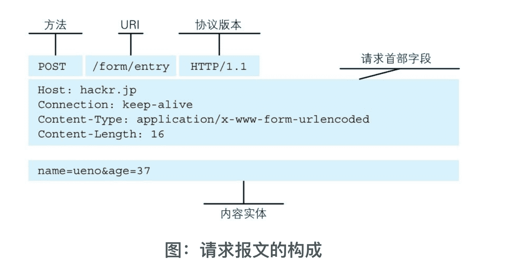

响应报文基本上由**协议版本**、**状态码**（status code，表示请求成功或失败的数字代码）、用以解释状态码的**原因短语**（reason-phrase）、可选的**响应首部字段**（header field）以及**实体主体**（entity body）构成。

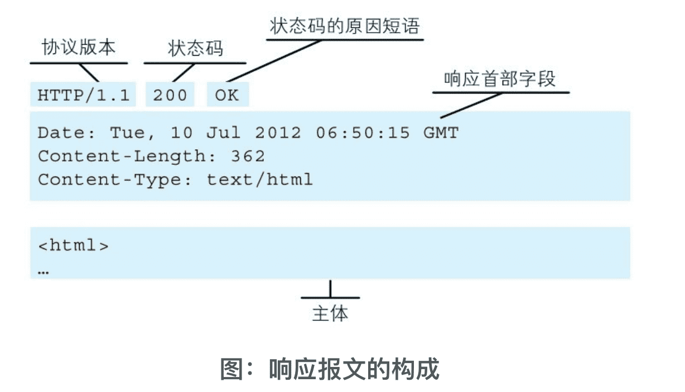

### HTTP是不保存状态的协议

HTTP是一种不保存状态，即无状态（stateless）协议。HTTP协议自身不对请求和响应之间的通信状态进行保存。

### 请求URI定位资源

如果不是访问特定资源而是对服务器本身发起请求，可以用一个*来代替请求URI：

```
OPTIONS * HTTP/1.1
```

### 告知服务器意图的HTTP方法

#### GET：获取资源

#### POST：传输实体主体

#### PUT：传输文件

PUT方法自身不带验证机制，一般禁用。若配合Web应用程序的验证机制，或架构设计采用REST（RepresentationalState Transfer，表征状态转移）标准的同类Web网站，就可能会开放使用PUT方法。

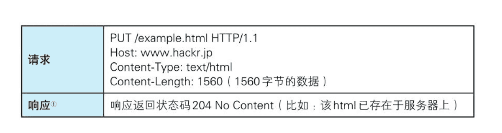

① 响应的意思其实是请求执行成功了，但无数据返回。

#### HEAD：获得报文首部

HEAD方法和GET方法一样，只是不返回报文主体部分。用于确认URI的有效性及资源更新的日期时间等。

#### DELETE：删除文件

是与PUT相反的方法，也不带验证机制，谨慎开放使用。

#### OPTIONS：询问支持的方法

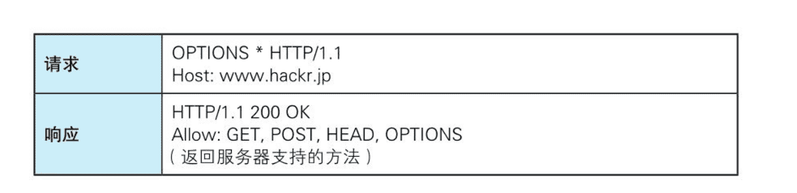

#### TRACE：追踪路径

TRACE方法是让Web服务器端将之前的请求通信环回给客户端的方法。

发送请求时，在Max-Forwards首部字段中填入数值，每经过一个服务器端就将该数字减1，当数值刚好减到0时，就停止继续传输，最后接收到请求的服务器端则返回状态码200 OK的响应。

!!

#### CONNECT：要求用隧道协议连接代理

CONNECT方法要求在与代理服务器通信时建立隧道，实现用隧道协议进行TCP通信。主要使用SSL（Secure Sockets Layer，安全套接层）和TLS（Transport Layer Security，传输层安全）协议把通信内容加密后经网络隧道传输。

### 持久连接节省通信量

持久连接（HTTP Persistent Connections，也称为HTTP keep-alive或HTTP connection reuse），特点是只要任意一端没有明确提出断开连接，则保持TCP连接状态。

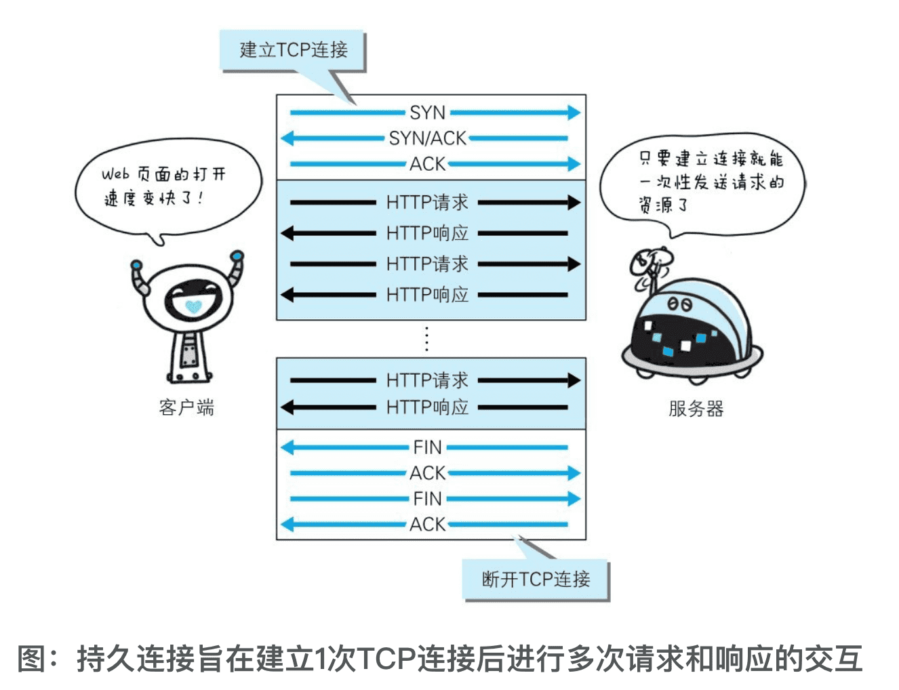

**管线化（pipelining）**，不用等待响应亦可直接发送下一个请求。

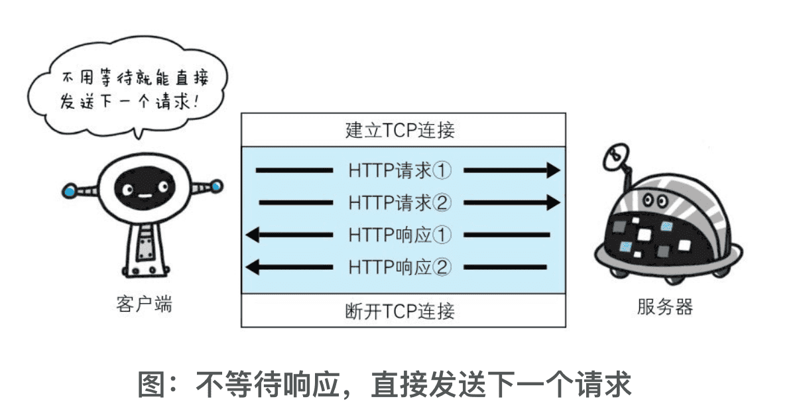

比如，当请求一个包含10张图片的HTML Web页面，与挨个连接相比，用持久连接可以让请求更快结束。而管线化技术则比持久连接还要快。请求数越多，时间差就越明显。

### 使用Cookie的状态管理

Cookie会根据从服务器端发送的响应报文内的一个叫做Set-Cookie的首部字段信息，通知客户端保存Cookie。当下次客户端再往该服务器发送请求时，客户端会自动在请求报文中加入Cookie值后发送出去。

服务器端发现客户端发送过来的Cookie后，会去检查究竟是从哪一个客户端发来的连接请求，然后对比服务器上的记录，最后得到之前的状态信息。

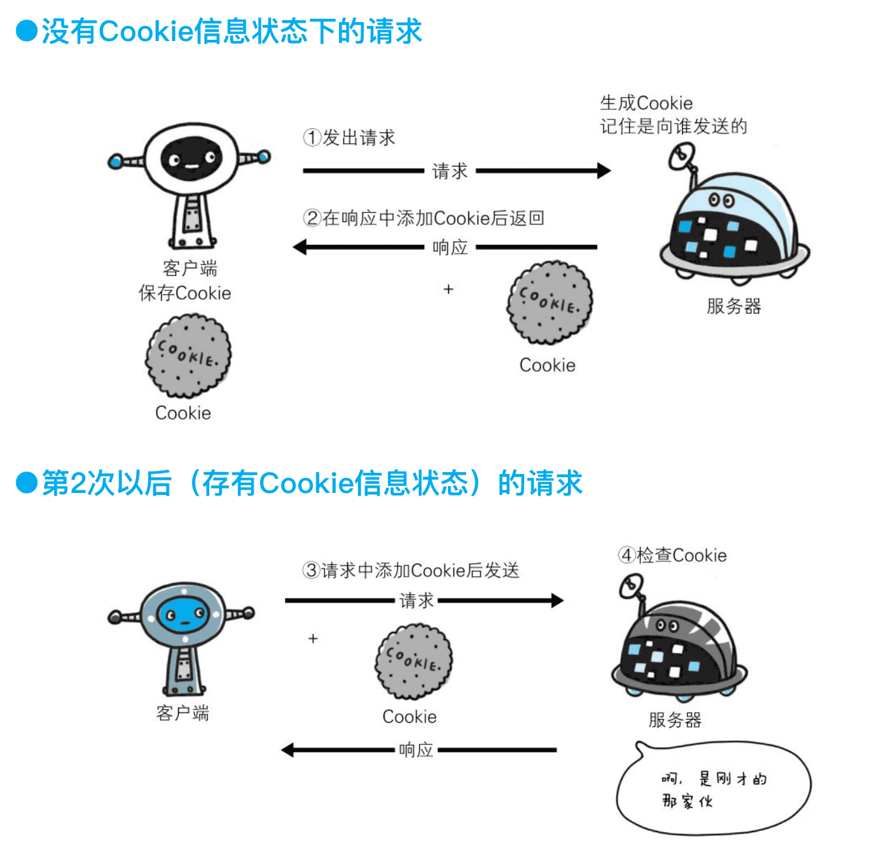

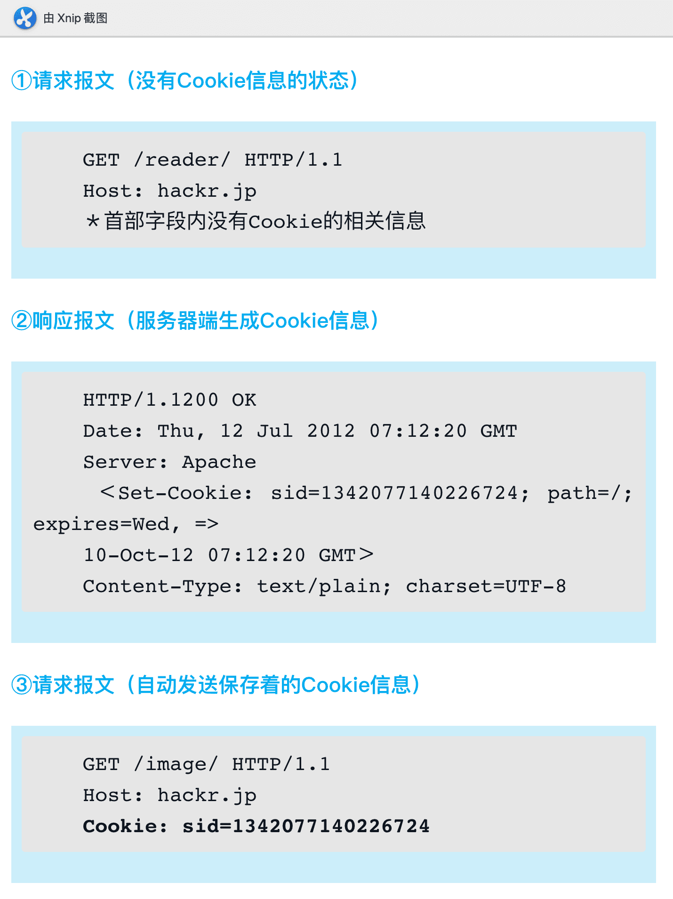

## 3 HTTP报文内的HTTP信息

### HTTP报文

**HTTP报文**：用于HTTP协议交互的信息。

请求端（客户端）的HTTP报文叫做**请求报文**，响应端（服务器端）的叫做**响应报文**。

HTTP报文大致分为：**报文首部**和**报文主体**。

用CR+LF作换行符。

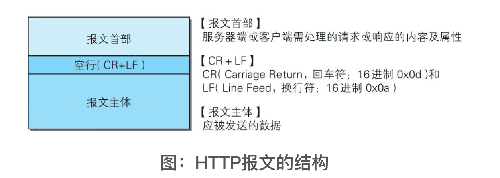

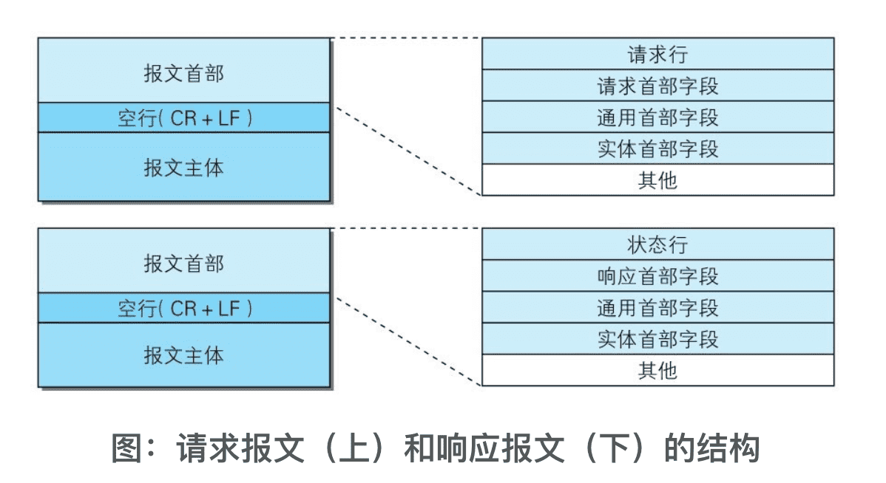

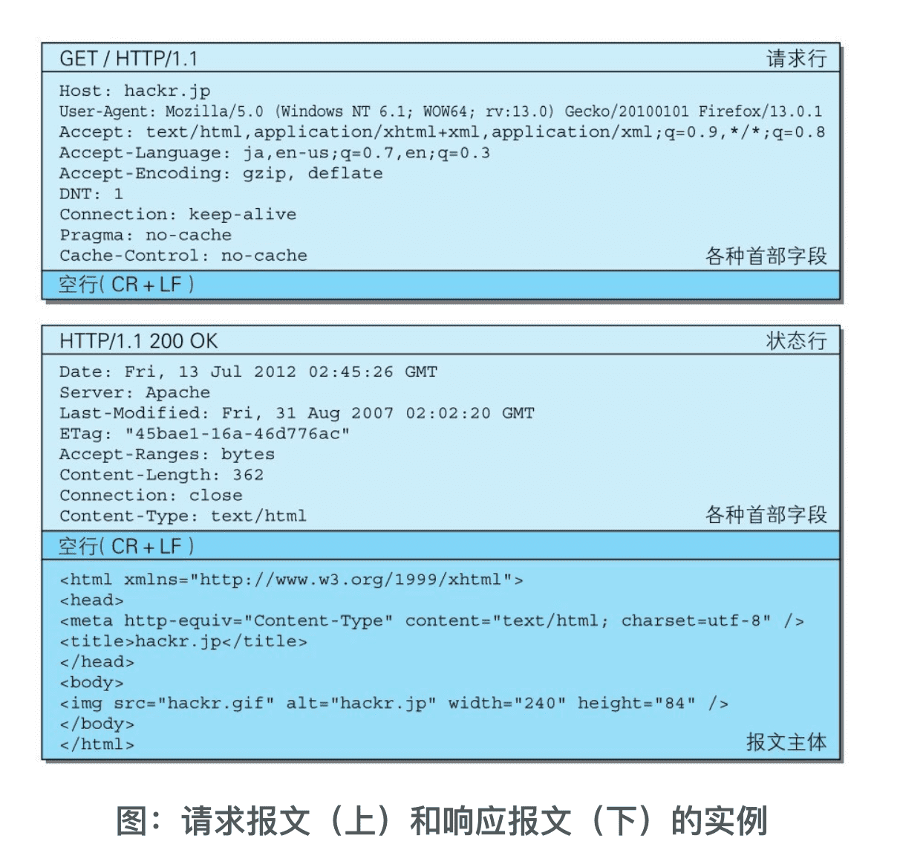

**首部字段**包含表示请求和响应的各种条件和属性的各类首部。一般有4种首部：通用首部、请求首部、响应首部和实体首部。

### 编码提升传输速率

通常，**报文主体**等于**实体主体**。只有当传输中进行编码操作时，实体主体的内容发生变化，才导致它和报文主体产生差异。

**内容编码**指明应用在实体内容上的编码格式，并保持实体信息原样压缩。内容编码后的实体由客户端接收并负责解码。

常用的内容编码：

gzip（GNU zip）

compress（UNIX系统的标准压缩）

deflate（zlib）

identity（不进行编码）

把实体主体分块的功能称为**分块传输编码（Chunked TransferCoding）**。

### 发送多种数据的多部分对象集合

**MIME**（Multipurpose Internet Mail Extensions，多用途因特网邮件扩展）机制，让邮件可以处理文本、图片、视频等多个不同类型的数据。

在MIME扩展中会使用一种称为**多部分对象集合（Multipart）**的方法，来容纳多份不同类型的数据。

相应地，HTTP协议中也采纳了多部分对象集合，发送的一份报文主体内可含有多类型实体。

`multipart/form-data `   在Web表单文件上传时使用。

!!

### 获取部分内容的范围请求

指定范围发送的请求叫做**范围请求（Range Request）**。

对一份10000字节大小的资源，如果使用范围请求，可以只请求5001～10000字节内的资源。

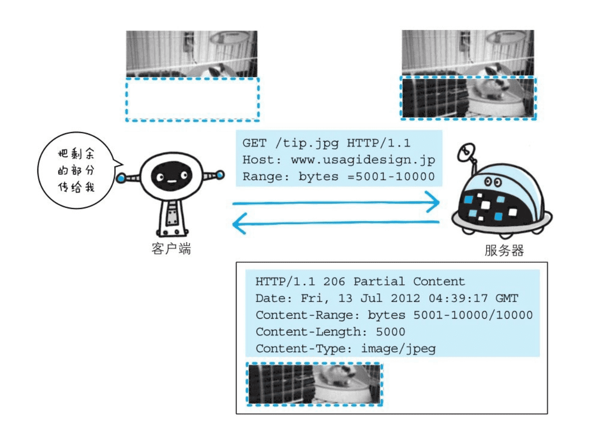

针对范围请求，响应会返回状态码为**206 Partial Content**的响应报文。

对于多重范围的范围请求，响应会在首部字段Content-Type标明multipart/byteranges后返回响应报文。

### 内容协商返回最合适的内容

同一个Web网站有可能存在着多份相同内容的页面。比如不同语言版本。当浏览器的默认语言为英语或中文，访问相同URI的Web页面时，则会显示对应的英语版或中文版的Web页面。这样的机制称为**内容协商（Content Negotiation）**。

内容协商会以响应资源的**语言、字符集、编码方式**等作为判断的基准。包含在请求报文中的某些首部字段：

- Accept
- Accept-Charset
- Accept-Encoding
- Accept-Language
- Content-Language

内容协商技术有3种类型：

服务器驱动协商（Server-driven Negotiation）

客户端驱动协商（Agent-driven Negotiation）

透明协商（Transparent Negotiation）

## 4 返回结果的HTTP状态码

### 状态码告知从服务器端返回的请求结果

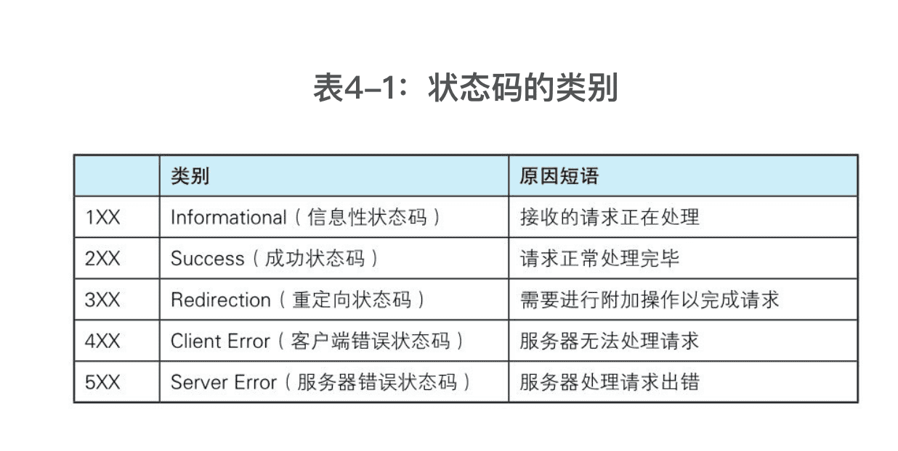

只要遵守状态码类别的定义，即使改变[RFC2616](https://tools.ietf.org/html/rfc2616)中定义的状态码，或服务器端自行创建状态码都没问题。

### 2XX 成功

#### 200 OK

#### 204 No Content

该状态码代表服务器接收的请求已成功处理，但在返回的响应报文中不含实体的主体部分。另外，也不允许返回任何实体的主体。

#### 206 Partial Content

范围请求

Content-Range

### 3XX 重定向

#### 301 Moved Permanently

永久性重定向。

#### 302 Found

临时性重定向。

#### 303 See Other

#### 304 Not Modified

#### 307 Temporary Redirect

### 4XX 客户端错误

#### 400 Bad Request

请求报文中存在语法错误。

#### 401 Unauthorized

发送的请求需要有通过HTTP认证（BASIC认证、DIGEST认证）的认证信息。

#### 403 Forbidden

表明对请求资源的访问被服务器拒绝了。

#### 404 Not Found

表明服务器上无法找到请求的资源。也可以在服务器端拒绝请求且不想说明理由时使用。

### 5XX 服务器错误

#### 500 Internal Server Error

表明服务器端在执行请求时发生了错误。也有可能是Web应用存在的bug或某些临时的故障。

#### 503 Service Unavailable

表明服务器暂时处于超负载或正在进行停机维护，现在无法处理请求。

## 5 与HTTP协作的Web服务器

### 用单台虚拟主机实现多个域名


### 通信数据转发程序：代理、网关、隧道

HTTP通信时，除客户端和服务器以外，还有一些用于通信数据转发的应用程序，例如代理、网关和隧道。它们可以配合服务器工作。

#### 代理

代理服务器的基本行为就是接收客户端发送的请求后转发给其他服务器。代理不改变请求URI，会直接发送给前方持有资源的目标服务器（源服务器）。

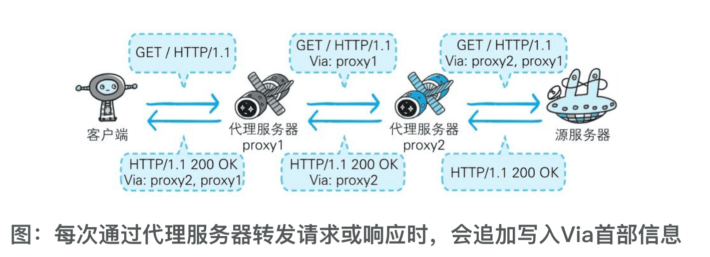

使用代理服务器的理由有：利用缓存技术（稍后讲解）减少网络带宽的流量，组织内部针对特定网站的访问控制，以获取访问日志为主要目的，等等。

代理按是否使用缓存和是否会修改报文，分别叫做：

**缓存代理（Caching Proxy）**：代理转发响应时，缓存代理会预先将资源的副本（缓存）保存在代理服务器上。

当代理再次接收到对相同资源的请求时，就可以不从源服务器那里获取资源，而是将之前缓存的资源作为响应返回。

**透明代理（Transparent Proxy）**：转发请求或响应时，不对报文做任何加工的代理类型。反之，对报文内容进行加工的代理被称为**非透明代理**。

### 网关

与代理相似。但网关能使通信线路上的服务器提供**非HTTP协议服务**。

利用网关能提高通信的安全性，因为可以在客户端与网关之间的通信线路上加密以确保连接的安全。比如，网关可以连接数据库，使用SQL语句查询数据。另外，在Web购物网站上进行信用卡结算时，网关可以和信用卡结算系统联动。

### 隧道

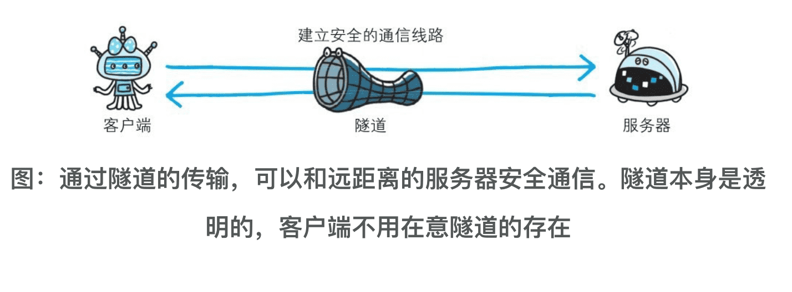

### 保存资源的缓存

缓存是指代理服务器或客户端本地磁盘内保存的资源副本。利用缓存可减少对源服务器的访问，因此也就节省了通信流量和通信时间。

缓存服务器是代理服务器的一种。

#### 缓存的有效期限

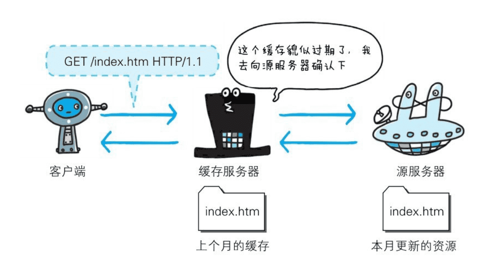

#### 客户端的缓存

也就是浏览器缓存，IE的叫做临时网络文件（Temporary Internet File）。