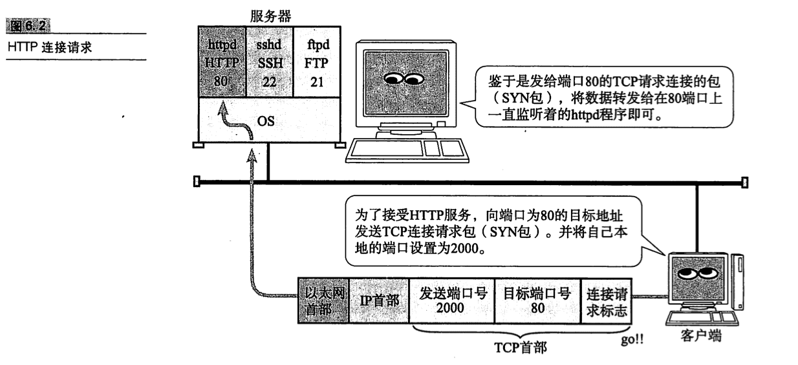
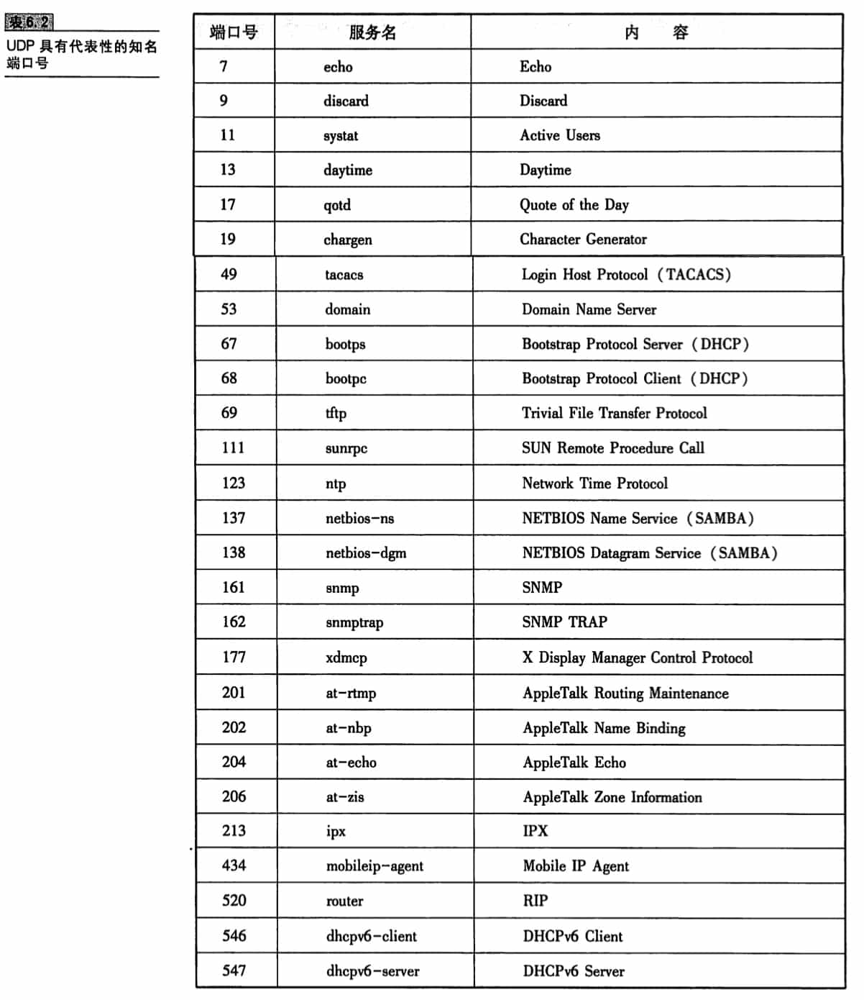
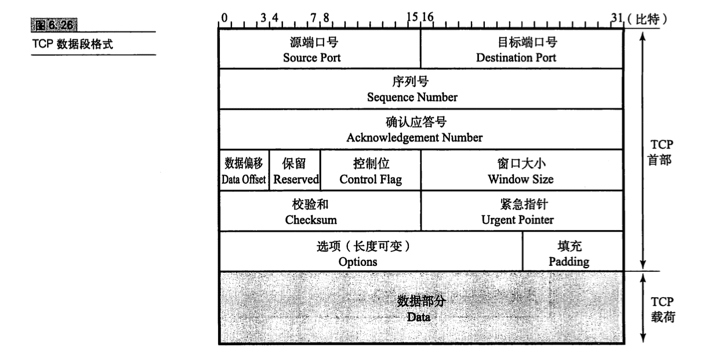
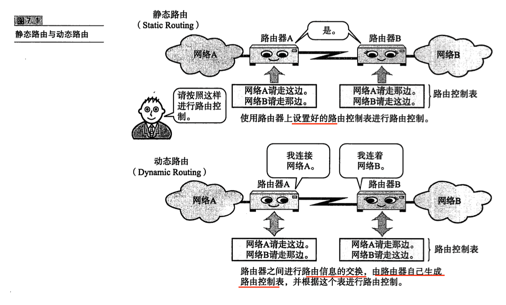
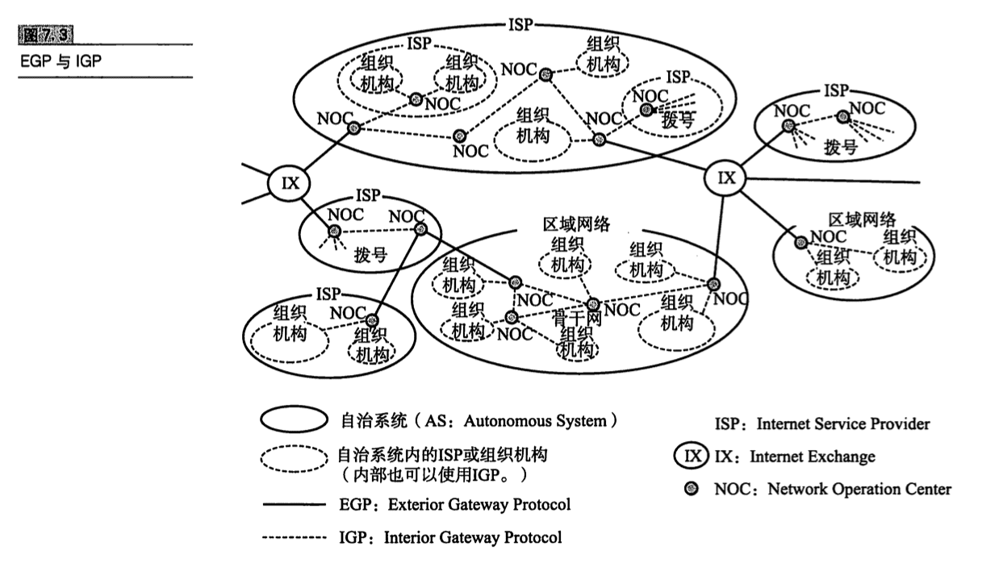
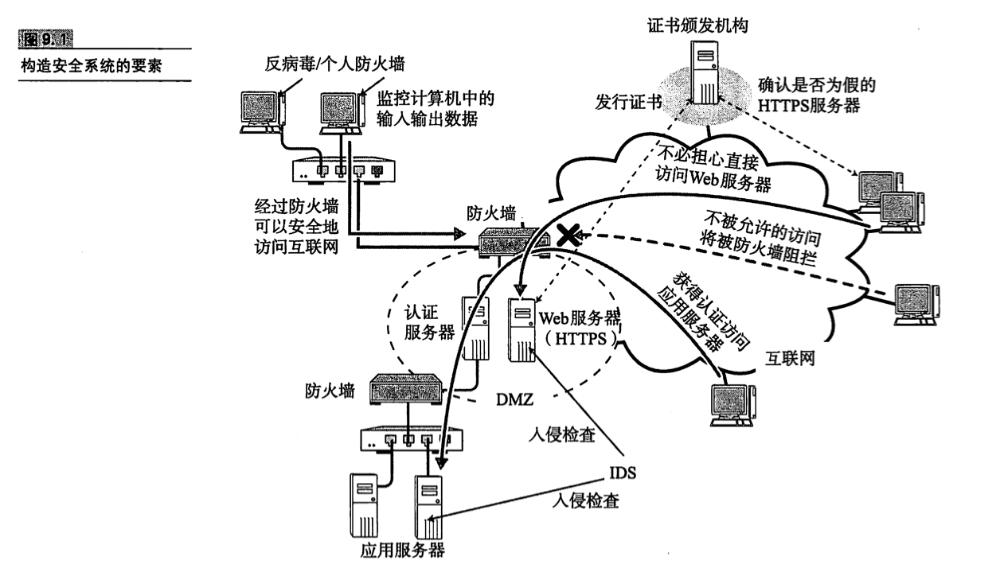
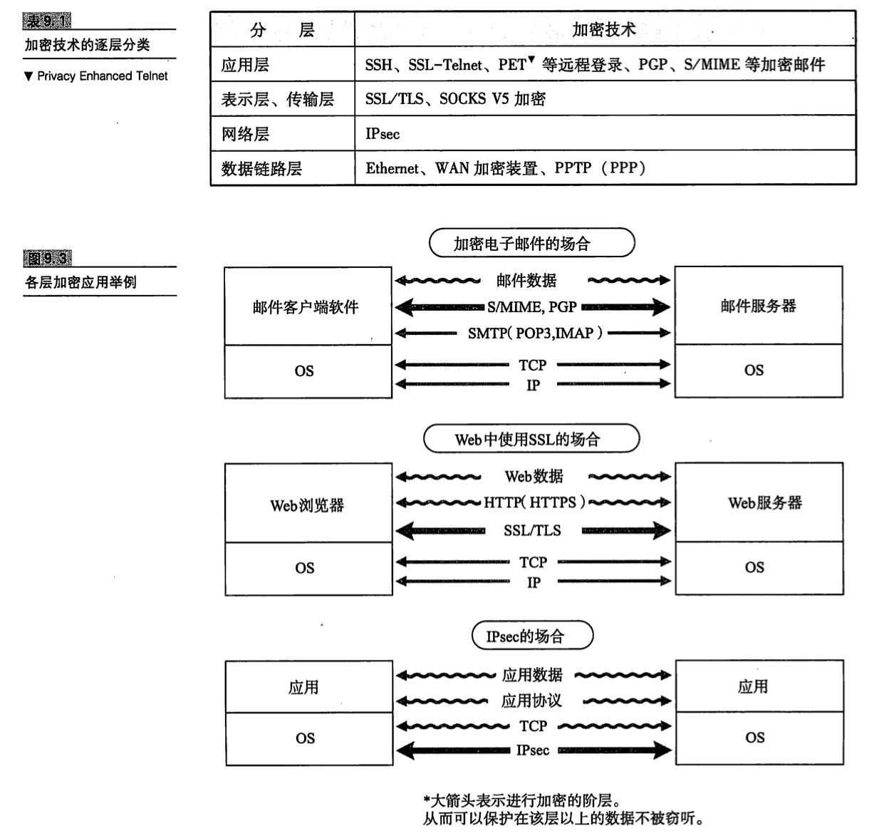

[《图解TCP/IP（第5版）》](https://book.douban.com/subject/24737674/)

## 1 网络基础知识

现在TCP/IP不局限于链接计算机，还可以链接汽车、数码相机、家电等，另外还应用在计算机系统虚拟化和云计算。

### 1.1 计算机网络出现的背景
- 从独立模式到网络互连模式  
WAN（Wide Area Network， 广域网），LAN（Local Area Network，局域网）  

- 从计算机通信到信息通信

### 1.2 计算机与网络发展的7个阶段
1. 批处理（batch processing）： 事先先将用户程序和数据装入卡带或磁带，并由计算机按照一定的顺序读取  

2. 分时系统（time sharing system ，TSS）(1960s)：多个终端与同一个计算机连接，允许多个用户同时使用一台计算机的系统。  
  	独占性、多路性、交互性、及时性  
	 	BASIC

3. 计算机之间的通信 (1970s)   
	多台计算机分布式处理    通信线路

4. 计算机网络的产生 (1980s)   
**分组交换技术**    **窗口系统**

5. 互联网的普及 (1990s)

6. 以互联网技术为中心 (2000s)
电话网 -> IP网

7. 从“单纯建立连接”到“安全建立连接”

8. TCP/IP

### 1.3 协议

- 协议就信是计算机之间通过网络实现通时事先达成都的一种“**约定**”。  
协议如同人与人的对话：  
将汉语和英语当作“协议”  
将聊天当作“通信”  
将说话的内容当作“数据” 

- cpu通常同一时间只能运行一个程序。**乱转机制**	**多任务调度**

- 人与人之间交流的容错率很高，而计算机不一样，计算机之间交流要注意“**应对异常**”。

- **分组交换协议** 是将大数据分割成包（**Packet**）的较小单位进行传输的方法。

### 1.4 协议由谁规定

ISO（International Organization for Standards, 国际标准化组织）制定了国际标准OSI（Open System Interconnection, 开放式通信系统互联参考模型）

### 1.5 协议分层
**分层** 类似模块化开发。  
"接口" 上下层之间交互所遵循的约定  
"协议" 同一层之间交互所遵循的约定

- 分层的优势：**独立使用**（扩展灵活），**细分通信功能**。

- 分层的劣势：过分模块化，使处理变得更加沉重以及每个模块都不得不实现相似的处理逻辑

- OSI参考模型各个分层的作用

### 1.6 OSI参考模型通信处理举例
假设用户A使用主机A要给使用主机B的用户B  

- 在应用层

- 在表示层
表示层将数据从主机特有的格式转换为网络标准传输格式。不同计算机对数据在内存中相异的分配方式（如：大实体和小实体）

- 在会话层
会话层决定采用哪个链接发送（何时连接，何时发送，但没有实际传输数据的功能）

- 在传输层：实际传输数据

- 网络层

网络层与传输层相互协作以确保数据包能够传送的世界各地，实现可靠传输。

- 数据链路层、物理层

数据链路层通过传输介质互连的设备之间进行数据处理

物理层将数据的0、1转换为电压和脉冲传输给物理的传输介质，而相互直连的设备之间使用地址（**MAC地址**）实现传输

### 1.7 传输方式的分类

1. 面向有连接型与面向无连接型

2. **电路交换**（历史久，主要用于电话网）和 **分组交换**（蓄积交换）

3. 根据接收端数量分类
 * 单播（unicast）
 * 广播（broadcast)	 电视播放
 * 多播（multicast）	电视会议
 * 任播（anycast）	   DNS根域名解析服务器

 

### 1.8 地址

1.地址的**唯一性**  	在同一个通信网络中不允许有两个相同地址的通信主体存在。
2.地址的**层次性**	为了高效地从越来越多的地址中找出通信的目标地址。

**ip地址具有层次性**  

**MAC寻址** 参考 **地址转发表**(记录实际的MAC地址)    
**IP地址** 参考 **路由控制表**(记录之后的网络号和子网掩码)

### 1.9 网络的构成要素

#### 1.9.1 通信媒介与数据链路

- 传输速率，单位**bps**(Bits Per Second, 每秒比特数)， 又称为 **带宽**(Bandwidth)
- **吞吐量**：主机之间实际的传输速率。
吞吐量不仅衡量带宽，也衡量主机的CPU处理能力、网络的拥堵程度、报文中数据字段的占有份额等信息。

#### 1.9.2 网卡

网卡，全程网络接口卡（**NIC**, Network Information Center），也称网络适配器、LAN卡。

#### 1.9.3 中继器(Repeater)

波形调整和放大  
中继器无法改变传输速率  
有多个端口服务的中继器被称为 **集线器**

#### 1.9.4 网桥/2层交换机

- 自学式网桥会记住曾经通过自己转发的所有数据帧的MAC地址，并保存到自己里的内存表中。

- **交换集线器** 是网桥的一种

#### 1.9.5 路由器/3层交换机

网络是根据物理地址（MAC地址）进行处理，而路由器/3层交换机则是根据IP地址进行处理的。

#### 1.9.6  4~7层交换机

#### 1.9.7网关

- 典型例子是互联网邮件与手机邮件之间的转换服务。  

- 代理服务器也是网关的一种，成为应用网关

- 防火墙

## 2 TCP/IP基础知识

### 2.1 TCP/IP出现的背景及其历史

军用技术  
ARPANET  

UNIX系统的普及与互联网的扩张  

商用互联网服务的启蒙     ISP

### 2.2 TCP/IP的标准化

- TCP/IP协议群
  

- TCP/IP规范  ----  RFC
  RFC(Request For Comment，征求意见表)  

- TCP/IP的标准化流程

> 互联网草案阶段 -> 记入RFC进入提议标准阶段 -> 草案标准阶段 -> 真正的标准阶段 

### 2.3 互联网基础知识

- 互联网结构

### 2.4 TCP/IP协议分层模型

- 硬件（物理层）
- 网络接口层（数据链路层）
- 互联网层（网络层）
  连接互联网的所有主机跟路由器必须实现IP的功能，其它连接互联网的网络设备（如网桥、中继器或集线器）就没有必要一定实现IP或TCP的功能（有时为了监控和管理这些设备就要了）。  

ARP：从分组数据包的IP地址中解析出物理地址（MAC地址）的协议

- 传输层 ： 让应用程序之间实现通信
  

- 应用层

### 2.5 TCP/IP分层模型与通信示例

  

  

每个分层的包首部中还包含一个识别位。

## 3 数据链路

### 3.1 数据链路的作用

二进制0、1表示信息，在通信媒介中对应的是**电压的高低**、**光的闪灭**以及**电波的强弱**等信号。  

数据链路被视为网络传输中的最小单位。  

不同的数据链路网路：  
**以太网**  
**FDDI**（Fiber Distributed Data Interface，光纤分布式数据接口）  
**ATM**（Asynchronous Transfer Mode，异步传输方式）  
**无线LAN**  
**蓝牙**  

网络拓扑（Topology）

### 3.2 数据链路相关技术

#### 3.2.1 MAC地址

MAC地址长48比特，一般被烧入到ROM中。任意一个网卡的MAC地址是全世界唯一的（虚拟网卡除外）。

<!-- more -->

厂商识别码（OUI, Organizationally Unique Ideifier），可通过**网络分析器**分析得到。

#### 3.2.2 共享介质网路：多个设备共享一个通信介质 

- 争用方式（Contention），也叫 **CSMA**（载波监听多路访问）

- CSMA/CD (Carrier Sense Multiple Acess with Collision Detection) 

- 令牌传递方式  
只有获得令牌的站才能发送数据  

#### 3.2.3 非共享介质网络

  

半双工与全双工通信

#### 3.2.4 根据MAC地址转发

**交换集线器** 也叫 **以太网交换机**

#### 3.2.5 环路检测技术

#### 3.2.6 VLAN

### 3.3 以太网

以太网（Ethernet）源于Ether（以太），意为介质。

- 以太网的分类
BASE前的10、100、10G等代表传输速度，BASE后的2、5、T、F等字符代表传输介质。

以太网传输速度与计算机内部的表现值不同，以太网中是1000（1K=1000，1M=1000K等），而计算机内部是1024。

  

### 3.4 无线通信

### 3.5 PPP

PPP(Point-to-Point Protocol) 点对点  

  

## 4 IP协议

TCP/IP的心脏是互联网层，包括IP(Internet Protocol)和ICMP(Internet Control Message Protocol)两个协议。

### 4.1 IP即网际协议

  

**主机**：配置IP地址，但不进行路由控制的设备。  
**路由器**：配置IP地址又有路由控制的设备。
**节点**：主机和路由器的统称。

### 4.2 IP基础知识

#### IP地址属于网络层地址

#### 路由控制

IP路由也叫**多路路由**  

为了将数据包发给目标主机，所有主机都维护这一张**路由控制表**（Routing Table）  

#### 数据链路的抽象化

不同数据链路最大区别是**最大传输单位**（MTU，Maximum Transmission Unit）。  

#### IP属于面向无连接型

**面向无连接**是指在发包之前，不需要建立与对端目标地址之间的连接。  

这样做的原因： **简化**  **提速**  

为了提高可靠性，上一层的TCP采用面向有连接型

### 4.3 IP地址的基础知识

#### IP地址组成

IP地址组成： **网路标识**（网络地址）， **主机标识（主机地址）**

#### IP地址的分类

#### 广播地址

#### IP多播

#### 子网掩码

#### CIDR与VLSM

0、10、27等开头的A类地址都是具有特殊意义的保留地址。  

#### 全局地址与私有地址

### 4.4 路由控制

#### IP地址与路由控制

  

路由控制表中记录着网络地址与下一步应该发送至路由器的地址。	在Windows和Unix上表示路由器的方法分别为**netstat-r**， **netstat-rn**。

**环回地址**：同一台计算机上的程序之间进行网络通信时所使用的一个默认地址。 `127.0.0.1`  

#### 路由控制器的聚合

### 4.5 IP分割处理与再构成处理  

#### IP报文的分片与重组

经过分片之后的IP数据报在背重组的时候，**只能由目标主机进行**。路由器虽然做分片但不会进行重组。

  

#### 路径MTU发现

  

### 4.6 IPv6

### 4.7 IPv4首部

### 4.8 IPv6 首部格式

## 5 iP协议相关技术

仅凭IP无法完成通信

### 5.1 DNS

### 5.2 ARP

ARP(Address Resolution Protocol)，以目标IP地址为线索，用来定位下一个应该接收数据分包的网络设备对应的MAC地址。

#### ARP的工作机制

ARP借助ARP请求与ARP响应两种类型的包确定MAC地址。

  

#### RARP

RARP(Reverse Address Resolution Protocol)，从MAC地址定位IP地址的协议

#### 代理ARP 

### 5.3 ICMP

ICMP的主要功能：确认IP包是否成功送达目标地址，通知在发送过程当中IP包被废弃的具体原因，改善网路设置等。  

### 5.4 DHCP  

DHCP(Dynamic Host Configuration Protocol)，实现自动设置IP地址、统一管理IP地址分配。  

#### DHCP工作机制

### 5.5 NAT

NAT(Network Address Translator)，用于本地网络中使用私有地址，在连接互联网时转而使用全局IP地址的技术。

### 5.6 IP隧道

## 6 TCP与UDP

### 6.1 传输层的作用

#### 传输层定义

传输层的TCP和UDP，为了识别自己所传输的数据部分究竟应该发给哪个应用，设定一个编号（端口号）。

#### 通信处理

这些服务端程序在UNIX系统当中叫做**守护进程**。例如**httpd**（HTTP守护进程）、**sshd**（SSH守护进程）等等。

在UNIX中，并不是将这些守护进程都启动，而是启动一个超级守护进程**inetd**（互联网守护进程），通过数据包中的端口号，会创建（fork）新的进程并转换（exec）为sshd等守护进程。

#### TCP与UDP的区别

### 6.2 端口号

数据链路层，MAC地址，识别同一链路中不同的计算机；

IP层，IP地址，识别TCP/IP网络中互连的主机和路由器；

传输层，端口号，识别同一台计算机中不同应用程序，端口号也被称为**程序地址**。

#### 根据端口号识别应用

#### 通过IP地址、端口号、协议号进行通信识别

采用5个信息（源IP地址、目标IP地址、协议号、源端口号、目标端口号）来识别一个通信。

#### 端口号如何确定

##### 标准既定的端口号

**知名端口号**（Well-Known Port Number），0~1023

**注册端口号**，1024~49151

[详细最新](https://www.iana.org/assignments/service-names-port-numbers/service-names-port-numbers.xhtml)

##### 动态分配

49152~65535

不同的传输协议可以使用相同的端口号。

### 6.3 UDP

UDP（User Datagram Protocol），这边的User可以理解为程序员，也就是说UDP是按照程序员的编程思路传送数据报。

UDP常用于：

- 包总量较少的通信（DNS、SNMP等）
- 视频、音频等多媒体通信（即时通信）
- 限定于LAN等特定网络中的应用通信
- 广播通信（广播、多播）

### 6.4 TCP

!!

### 6.5 其它传输层协议

#### UDP-Lite

#### SCTP

SCTP（Stream Control Transmission Protocol，流控制传输协议）

#### DCCP

DCCP（数据报拥塞控制协议）

### 6.6 UDP首部的格式

### 6.7 TCP首部格式

## 7 路由协议

### 7.1 路由控制的定义

### 7.2 路由控制范围

IGP（Interior Getway Protocol）

EGP（Exterior Getway Protocol）

### 7.3 路由算法

### 7.4 RIP

### 7.5 OSPF

### 7.6 BGP

### 7.7 MPLS

## 8 应用协议

### 远程登录

#### TELNET

#### SSH

### 文件传输

### 电子邮件

### WWW

### 网络管理

#### SNMP

#### MIB

#### RMON

### 其它应用层协议

#### 多媒体通信实现技术

#### P2P

#### LDAP

## 9 网络安全

### 网络安全构成要素

#### 防火墙

#### IDS（入侵检测系统）

#### 反病毒/个人防火墙

### 加密技术基础

### 安全协议

#### IPsec和VPN

#### TLS/SSL与HTTPS

#### IEEE802.1X

