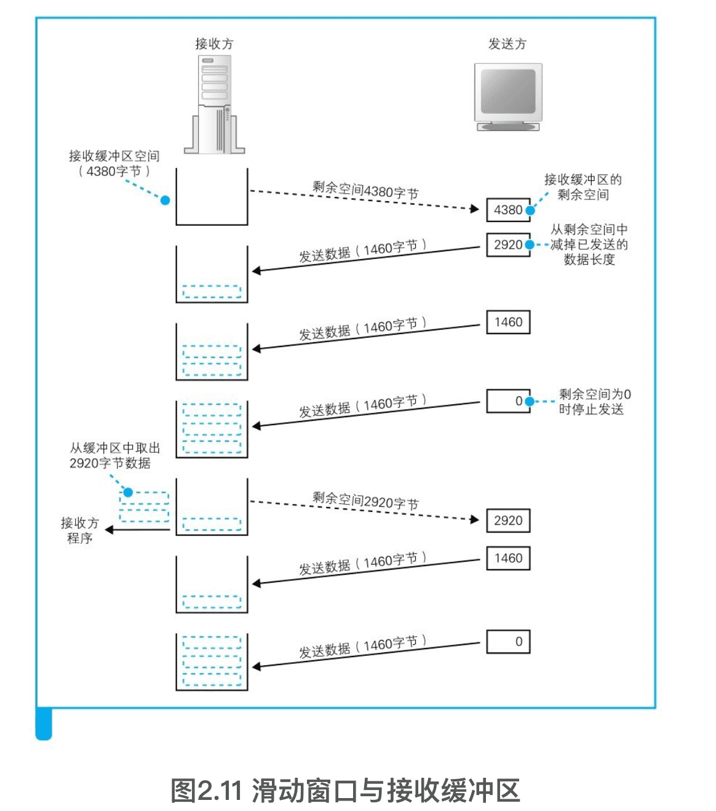

网络是怎么连接的
-------

QQ是直接使用IP地址来连接服务器的。

手动实现路由器的功能：首先，接在路由器上的电脑需要彼此能够通信，这需要配置一个基本的**交换机功能**。其次，接在路由器上的电脑要自动获取IP地址等配置，这需要配置一个**DHCP服务器**。然后，连接外网的端口需要单独配置它的IP地址等参数，或者配置**PPP连接**，还得配置相应的**路由表**。到这里还不算完，因为内网的电脑要访问外网，还得配置好网络**地址转换（NAT）**！


不理解网络的全貌，也就无法理解每一种网络技术背后的本质意义。

http://www.nikkeibp.co.jp/

之所以要控制在一本书的篇幅，是因为：如果只是讲解TCP/IP、以太网这些单独的技术，读者就无法理解网络这个系统的全貌；如果无法理解网络的全貌，也就无法理解每一种网络技术背后的本质意义；而如果无法理解其本质意义，就只能停留在死记硬背的程度，无法做到实际应用。


### 1 浏览器生成消息——探索浏览器内部

浏览器等网络应用程序实际上并不具备网络控制功能，而是委托操作系统来控制网络。

#### 1.1 生成HTTP请求消息

浏览器是一个具备多种客户端功能的综合性客户端软件，因此它需要一些东西（`http:`，`ftp:`等）来判断应该使用其中哪种功能来访问不同的服务器得到相应的数据。


##### 浏览器先要解析URL

URL的格式会随着协议的不同而不同。

浏览器解析URL过程：


一般来说，URI的内容是一个存放**网页数据的文件名**或者是一个**CGI程序的文件名**。

##### 生成HTTP请求消息


##### 发送请求后会收到响应


#### 1.2 向DNS服务器查询Web服务器的IP地址

请求消息生成之后，浏览器会委托操作系统向Web服务器发送请求，但浏览器必须告诉操作系统接收方的IP地址才行，因此浏览器必须先查出Web服务器的IP地址。网址中只有Web服务器的域名，因此浏览器需要向DNS服务器查询域名对应的IP地址。


子网掩码是一串与IP地址长度相同的32比特数字，其左边一半都是1，右边一半都是0。其中，子网掩码为1的部分表示**网络号**，子网掩码为0的部分表示**主机号**。


> IP地址的主机号：全0表示整个子；网全1表示向子网上所有设备发送包，即“广播”。

##### 域名和IP地址并用的理由

TCP/IP网络是通过IP地址来确定通信对象的。

域名容易记

IP地址的长度为32比特，也就是4字节，相对地，域名最短也要几十个字节，最长甚至可以达到255字节，增加了路由器的负担。


##### Socket库提供查询IP地址的功能

对于DNS服务器，我们的计算机上一定有相应的DNS客户端，而相当于DNS客户端的部分称为**DNS解析器**，或者简称解析器。通过DNS查询IP地址的操作称为**域名解析**，因此负责执行解析（resolution）这一操作的就叫**解析器（resolver）**了。

解析器实际上是一段程序，它包含在操作系统的Socket库中。

**Socket库**是在加州大学伯克利分校开发的UNIX系操作系统BSD中开发的C语言库，互联网中所使用的大多数功能都是基于Socket库来开发的。因此，BSD之外的其他操作系统以及C语言之外的其他编程语言也参照Socket库开发了相应的网络库。可以说，Socket库是网络开发中的一种标准库。


##### 通过解析器向DNS服务器发出查询


> 根据域名查询IP地址时，浏览器会使用Socket库中的解析器。

##### 解析器的内部原理


> DNS服务器的IP地址，一般都是事前设置好的。


#### 1.3 全世界DNS服务器的大接力

全世界共有上万台DNS服务器，它们相互接力才能完成IP地址的查询。


##### DNS服务器的基本工作

DNS服务器的基本工作就是接收来自客户端的查询消息，然后根据消息的内容返回响应。

客户端的查询消息有3种：

1. 域名
2. Class。在最早设计DNS方案时，DNS在互联网以外的其他网络中的应用也被考虑到了，而Class就是用来识别网络的信息。不过，如今除了互联网并没有其他的网络了，因此Class的值永远是代表互联网的`IN`。
3. 记录类型。表示域名对应何种类型的记录。例如，当类型为**A**（Address）时，表示域名对应的是IP地址；当类型为**MX**（Mail eXchange，邮件交换）时，表示域名对应的是邮件服务器。对于不同的记录类型，服务器向客户端返回的信息也会不同。有很多记录类型，例如根据IP地址反查域名的**PTR**类型，查询域名相关别名的**CNAME**类型，查询DNS服务器IP地址的**NS**类型，以及查询域名属性信息的**SOA**类型等。


##### 域名的层次结构

互联网中存在着不计其数的服务器，将这些服务器的信息全部保存在一台DNS服务器中是不可能的。


##### 寻找相应的DNS服务器并获取IP地址


将负责管理下级域的DNS服务器的IP地址注册到它们的上级DNS服务器中，然后上级DNS服务器的IP地址再注册到更上一级的DNS服务器中，以此类推。

也就是说，负责管理lab.glasscom.com这个域的DNS服务器的IP地址需要注册到glasscom.com域的DNS服务器中，而glasscom.com域的DNS服务器的IP地址又需要注册到com域的DNS服务器中。

com和jp的上面还有一级域，称为**根域**。

将根域的DNS服务器信息保存在互联网中所有的DNS服务器中。这样一来，任何DNS服务器就都可以找到并访问根域DNS服务器了。

分配给根域DNS服务器的IP地址在全世界仅有13个（当然每个IP下有很多台服务器）而且这些地址几乎不发生变化。


##### 通过缓存加快DNS服务器的响应

在真实的互联网中，一台DNS服务器可以管理多个域的信息，因此并不是像图1.16这样每个域都有一台自己的DNS服务器。

DNS服务器有一个缓存功能，可以记住之前查询过的域名，并不是每次都需要从最上级的根域开始查询。


#### 1.4 委托协议栈发送消息

>  查询到IP地址之后，浏览器是如何可以将消息委托给操作系统发送给Web服务器了？
>
> “委托给操作系统”，有非常详细的规则，必须要遵守这些规则才能完成操作。

##### 数据收发操作概览

> 向操作系统内部的协议栈发出委托时，需要按照指定的顺序来调用Socket库中的程序组件。

收发数据的操作大致可分为4个阶段：

1. 创建套接字（创建套接字阶段）
2. 将管道连接到服务器端的套接字上（连接阶段）
3. 收发数据（通信阶段）
4. 断开管道并删除套接字（断开阶段）

在每个阶段，Socket库中的程序组件都会被调用来执行相关的数据收发操作。

前面这4个操作都是由操作系统中的协议栈来执行的，浏览器等应用程序并不会自己去做连接管道、放入数据这些工作，而是委托协议栈来代劳。


##### 创建套接字阶段


内部分为创建套接字、连接Web服务器、发送数据、接收数据、断开连接几个阶段。

> 应用程序是通过“**<font color=#FF8C00>描述符</font>**”这一类似号码牌的东西来识别套接字的（一台计算机上可能同时存在多个套接字）。

##### 连接阶段：把管道接上去

`connect()`

> 描述符：应用程序用来识别套接字的机制
>
> IP地址和端口号：客户端和服务器之间用来识别对方套接字的机制


##### 通信阶段：传递消息

`write()`

调用read时需要指定用于存放接收到的响应消息的内存地址，这一内存地址称为**接收缓冲区**。


##### 断开阶段：收发数据结束

`close`


### 2 用电信号传输TCP/IP数据——探索协议栈和网卡


在网络包出现之前，通信都是像电话一样把线路连接起来进行的。但是，连接线路的通信方式只能和固定的对象进行通信，无法发挥计算机可以处理多种工作的特点。为了解决这个问题，人们设计出了使用网络包来进行通信的方式。

#### 2.1 创建套接字

##### 协议栈的内部结构

本章将探索操作系统中的**网络控制软件（协议栈）**和**网络硬件（网卡）**是如何将浏览器的消息发送给服务器的。


上面的部分会向下面的部分委派工作，下面的部分接受委派的工作并实际执行。当然也有一部分上下关系不明确，或者上下关系相反的情况，所以也不必过于纠结

> 浏览器、邮件等一般应用程序收发数据时用TCP；
>
> DNS查询等收发较短的控制数据时用UDP。

##### 套接字的实体就是通信控制信息

在协议栈内部有一块用于存放控制信息的内存空间，这里记录了用于控制通信操作的控制信息，例如通信对象的IP地址、端口号、通信操作的进行状态等。

>  协议栈是根据套接字中记录的控制信息来工作的。


图中**每一行相当于一个套接字**，当创建套接字时，就会在这里增加一行新的控制信息，赋予“即将开始通信”的状态，并进行通信的准备工作，如分配用于临时存放收发数据的缓冲区空间。


##### 调用socket时的操作

> 大写字母开头的**Socket**表示Socket库，而小写字母开头的**socket**表示Socket库中名为socket的程序组件。


🔖

#### 2.2 连接服务器

##### 连接是什么意思

连接实际上是通信双方交换控制信息，在套接字中记录这些必要信息并准备数据收发的一连串操作。


##### 负责保存控制信息的头部


> 通信操作中使用的控制信息分为两类：
>
> 1. 头部中记录的信息
>
> 2. 套接字（协议栈中的内存空间）中记录的信息

##### 连接操作的实际过程

从应用程序调用Socket库的connect开始：

```
      connect（<描述符>, <服务器IP地址和端口号>, …）
```


> 连接操作的第一步是在TCP模块处创建表示连接控制信息的头部。
>
> 通过TCP头部中的发送方和接收方端口号可以找到要连接的套接字。


#### 2.3 收发数据

##### 将HTTP请求消息交给协议栈


> **MTU**（Maximum Transmission Unit，最大传输单元）：一个网络包的最大长度，以太网中一般为1500字节。
>
> **MSS**（Maximum Segment Size，最大分段大小）：除去头部之后，一个网络包所能容纳的TCP数据的最大长度。


起始帧分界符：Start Frame Delimiter, SFD。

FCS：Frame Check Sequence，帧校验序列。

##### 对较大的数据进行拆分


##### 使用ACK号确认网络包已收到

在实际的通信中，序号并不是从1开始的，而是需要用随机数计算出一个初始值，这是因为如果序号都从1开始，通信过程就会非常容易预测，有人会利用这一点来发动攻击。


客户端和服务器双方都需要各自计算序号，因此双方需要在连接过程中互相告知自己计算的序号初始值。


> 通过“序号”和“ACK号”可以确认接收方是否收到了网络包。

##### 根据网络包平均往返时间调整ACK号等待时间


##### 使用窗口有效管理ACK号


首先，接收方需要告诉发送方自己最多能接收多少数据，然后发送方根据这个值对数据发送操作进行控制，这就是滑动窗口方式的基本思路。

实际上，接收方在收到数据之后马上就会开始进行处理，如果接收方的性能高，处理速度比包的到达速率还快，缓冲区马上就会被清空，并通过窗口字段告知发送方。





##### ACK与窗口的合并


当接收方将数据传递给应用程序，导致接收缓冲区剩余容量增加时，就需要告知发送方，这就是更新窗口大小的时机。

##### 接收HTTP响应消息


>  总结：首先，协议栈会检查收到的数据块和TCP头部的内容，判断是否有数据丢失，如果没有问题则返回ACK号。然后，协议栈将数据块暂存到接收缓冲区中，并将数据块按顺序连接起来还原出原始的数据，最后将数据交给应用程序。具体来说，协议栈会将接收到的数据复制到应用程序指定的内存地址中，然后将控制流程交回应用程序。将数据交给应用程序之后，协议栈还需要找到合适的时机向发送方发送窗口更新。

#### 2.4 从服务器断开并删除套接字

##### 数据发送完毕后断开连接


##### 删除套接字

客户端先发起断开，则断开的操作顺序如下：

1. 客户端发送FIN
2. 服务器返回ACK号
3. 服务器发送FIN
4. 客户端返回ACK号


##### 数据收发操作小结


#### 2.5 IP与以太网的包收发操作

##### 包的基本知识

TCP模块在执行连接、收发、断开等各阶段操作时，都需要委托IP模块将数据封装成包发送给通信对象。


##### 包收发操作概览


##### 生成包含接收方IP地址的IP头部


##### 生成以太网用的MAC头部


MAC地址是在网卡生产时写入ROM里的，只要将这个值读取出来写入MAC头部就可以了。

> IP模块根据路由表Gateway栏的内容判断应该把包发送给谁。

##### 通过ARP查询目标路由器的MAC地址


##### 以太网的基本知识

以太网是一种为多台计算机能够彼此自由和廉价地相互通信而设计的通信技术。


##### 将IP包转换成电或光信号发送出去


> 网卡的ROM中保存着全世界唯一的MAC地址，这是在生产网卡时写入的。
>
> 网卡中保存的MAC地址会由网卡驱动程序读取并分配给MAC模块。

##### 给网络包再加3个控制数据


##### 向集线器发送网络包

发送信号的操作分为两种，一种是使用集线器的半双工模式，另一种是使用交换机的全双工模式。


##### 接收返回包


##### 将服务器的响应包从IP传递给TCP


#### 2.6 UDP协议的收发操作


##### 不需要重发的数据用UDP发送更高效


向DNS服务器查询IP地址的时候我们用的也是UDP协议


##### 控制用的短数据

像DNS查询等交换控制信息的操作基本上都可以在一个包的大小范围内解决，这种场景中就可以用UDP来代替TCP。


##### 音频和视频数据


### 3 从网络到网络设备——探索集线器、交换机和路由器


#### 3.1 信号在网线和集线器中传输

##### 每个包都是独立传输的


##### 防止网线中的信号衰减很重要


##### “双绞”是为了抑制噪声


##### 集线器将信号发往所有线路

当信号到达集线器后，会被广播到整个网络中。以太网的基本架构就是将包发到所有的设备，然后由设备根据接收方MAC地址来判断应该接收哪些包，而集线器就是这一架构的忠实体现，它就是负责按照以太网的基本架构将信号广播出去。


#### 3.2 交换机的包转发操作

##### 交换机根据地址表进行转发


##### MAC地址表的维护


#### 3.3 路由器的包转发操作


> 路由器的各个端口都具有MAC地址和IP地址。

##### 路由表中的信息


> 路由器会忽略主机号，只匹配网络号。


##### 路由器的包接收操作


#####  查询路由表确定输出端口


##### 找不到匹配路由时选择默认路由


子网掩码0.0.0.0的意思是网络包接收方IP地址和路由表目标地址的匹配中需要匹配的比特数为0，换句话说，就是根本不需要匹配。


##### 包的有效期


##### 通过分片功能拆分大网络包


TCP拆分数据的操作是在将数据装到包里之前进行的，换句话说，拆分好的一个数据块正好装进一个包里。从IP分片的角度来看，这样一个包其实是一个未拆分的整体，也就是说，分片是对一个完整的包再进行拆分的过程。


##### 路由器的发送操作和计算机相同


> 路由器判断下一个转发目标的方法如下。
>
> - 如果路由表的网关列内容为IP地址，则该地址就是下一个转发目标。
> - 如果路由表的网关列内容为空，则IP头部中的接收方IP地址就是下一个转发目标。


路由器也会使用ARP来查询下一个转发目标的MAC地址。


##### 路由器与交换机的关系

IP（路由器）负责将包送达通信对象这一整体过程，而其中将包传输到下一个路由器的过程则是由以太网（交换机）来负责的。


#### 3.4 路由器的附加功能


##### 通过地址转换有效利用IP地址


##### 地址转换的基本原理


##### 改写端口号的原因


##### 从互联网访问公司内网


##### 路由器的包过滤功能


### 4 通过接入网进入互联网内部——探索接入网和网络运营商


电信号和光信号传播的速度大体上相同，之所以电缆不如光纤通信速率高，是因为电信号在提升通信速率的同时，其衰减率也会提高（信号在传播过程中减弱），导致信号无法传到目的地。相对地，光信号本来的衰减率就很低，提高通信速率也并不会提高衰减率。此外，光纤还不受电磁噪声的影响，因此光纤能够进行高速通信。


#### 4.1 ADSL接入网的结构和工作方式

家庭和公司的内网是通过接入网连接到网络运营商的。接入网有很多类型，这里我们将介绍ADSL接入网的知识，重点包括ADSL接入网的结构、电话线中传输的信号以及与电话共用的方式。


#### 4.2 光纤接入网（FTTH）

我们还会介绍另一种常用的接入网技术——与ADSL技术的利用率不相上下的光纤技术，重点包括光纤结构、单模和多模的区别之类的光纤性质，以及光纤用作接入网时的工作方式。


#### 4.3 接入网中使用的PPP和隧道

接入网需要通过用户名和密码验证用户的身份，然后由网络运营商向用户分配公有地址。此外，从接入网向网络运营商传输网络包时还使用了隧道技术，这些都是本章的看点。


#### 4.4 网络运营商的内部

接入网后面连接着网络运营商的网络，运营商网络也是以路由器为核心组成的，这一点和家庭、公司网络是一样的，包转发的工作原理也没有区别。不过，运营商网络也使用了一些和家庭、公司网络不同的技术，比如运营商之间可以自动交换路由信息和更新路由表，这些都是本章的看点。


#### 4.5 跨越运营商的网络包

互联网是由多个运营商网络相互连接形成的巨大网络，而多个运营商之间相互连接的部分可以说就是互联网的核心部分。


### 5 服务器端的局域网中有什么玄机

浏览器有时候是和Web服务器通信，有时候是和缓存服务器以及负载均衡器等进行通信。


#### 5.1 Web服务器的部署地点

客户端计算机一般都放在家庭、公司网络上，但服务器的部署不仅限于家庭和公司中。那么服务器到底放在哪里呢？这是我们的第一个看点。


#### 5.2 防火墙的结构和原理

一般在Web服务器前面都会部署防火墙，那么防火墙是通过怎样的机制保护服务器的呢？


#### 5.3 通过将请求平均分配给多台服务器来平衡负载

随着访问量的增加，Web服务器的处理能力会不够用，对于访问量很大的大型网站来说，必须要考虑到这一点。如何应对这个问题，也是我们的看点之一。有很多方案可以应对这个问题，我们先介绍其中一种方法，即通过多台Web服务器来分担负载。


#### 5.4 利用缓存服务器分担负载

另一种减轻Web服务器负担的方法是将访问过的数据保存在缓存服务器中，当再次访问时直接使用缓存的数据。除了在服务器端部署缓存服务器之外，在客户端也可以部署缓存服务器，缓存服务器有各种用法。


#### 5.5 内容分发服务

内容分发服务是从缓存服务器发展而来的，它在互联网中部署很多缓存服务器，并将用户的访问引导到最近的缓存服务器上。那么如何才能找到离用户最近的缓存服务器呢？如何将用户的访问引导到这台服务器上呢？内容分发服务的结构还是非常耐人寻味的。


### 6 请求到达Web服务器，响应返回浏览器


#### 6.1 服务器概览

服务器的职责是响应客户端的请求，但仅从如何响应请求这一点是无法看清服务器的全貌的，这样是无法理解服务器的。因此，我们会先介绍一下服务器程序的整体结构，以及启动后要做的一些准备工作，这样大家就能够了解服务器到底是怎么一回事了。


#### 6.2 服务器的接收操作

搞清楚服务器的全貌之后，我们来探索一下服务器的协议栈是如何接收数据的。首先我们看一看服务器如何接收信号并将信号还原成数字形式的网络包，然后从中提取出HTTP消息。在第1章、第2章介绍发送操作的时候我们也提了一些关于接收操作的内容，但那些介绍都比较零散，本章我们将对接收操作做一个整体性的探索。然后，我们将探索协议栈是如何将接收的消息通过Socket库传递给Web服务器程序的。


#### 6.3 Web服务器程序解释请求消息并作出响应

Web服务器程序收到消息后，会查询其中的内容，并按照请求进行处理，将结果返回给客户端。例如，如果请求内容是获取某个网页的数据，那么就读取该文件并取出数据；如果请求某个CGI程序，就将相关参数传递给该程序并执行，然后获取程序输出的数据。接下来，这些数据会以响应消息的形式返回给客户端。我们将对上面这一系列操作进行探索。


#### 6.4 浏览器接收响应消息并显示内容

Web服务器返回的响应消息会通过互联网到达客户端计算机的浏览器。接下来，浏览器会将消息的内容显示在屏幕上。当客户端计算机上显示出网页的内容时，访问Web服务器的操作就全部完成了，这也是我们本次探索之旅的终点。


### 附录 网络包的旅程

