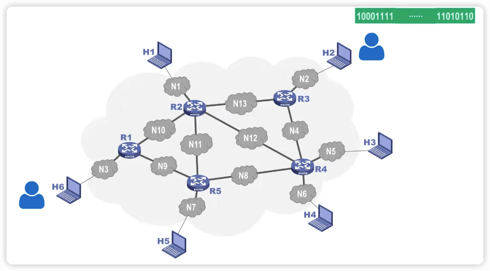
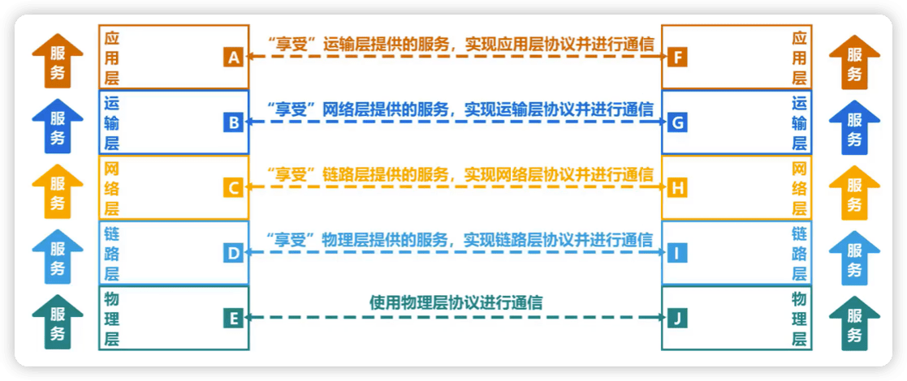
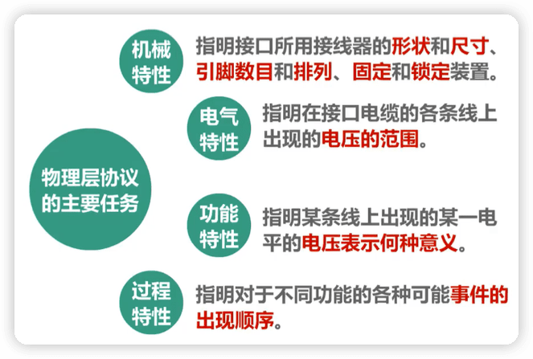
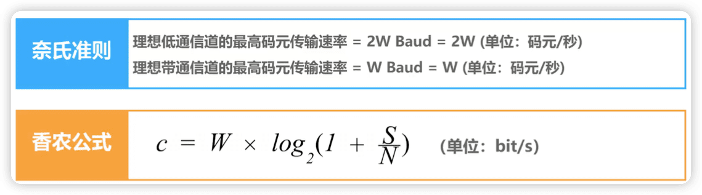

# 计算机网络微课堂

https://www.bilibili.com/video/BV1c4411d7jb

## 1 概述

### 1.1 计算机网络在信息时代的作用

[中国互联网络信息中心](http://www.cnnic.net.cn)

- 计算机网络己由一种==通信基础设施==发展成为一种重要的==信息服务基础设施==。

- 计算机网络已经像水、电、煤气这些基础设施一样，成为我们生活中不可或缺的一部分。

### 1.2 因特网概述

#### 1 网络、互连网（互联网）和因特网

- 网络 (Network） 由若干结点(Node）和连接这些结点的链路（Link） 组成。

- 多个网络还可以通过路由器互连起来，这样就构成了一个覆盖范围更大的网络，即互联网（或互连网）。因此，互联网是“网络的网络 (Netwrok of Networks) "

- 因特网 (Internet）是世界上最大的互连网络（用户数以亿计，互连的网络数以百万计）。

> **internet与Internet的区别**
>
> internet(互联网或互连网）是一个通用名词，它泛指由多个计算机网络互连而成的网络。在这些网络之间的通信协议可以是任意的。
>
> Internet（因特网）则是一个专用名词，它指当前全球最大的、开放的、由众多网络相互连接而成的特定计算机网络，它采用TCP/P协议族作为通信的
>
> 机则，其前身是美国的ARPANET。

#### 2 因特网发展的三个阶段

-  因特网服务提供者ISP（Internet Service Provider）

普通用户是如何接入到因特网的呢? 

答: **通过**ISP**接入因特网**

ISP可以从因特网管理机构申请到成块的IP地址，同时拥有通信线路以及路由器等联网设备。任何 机构和个人只需缴纳费用，就可从 ISP**的得到所需要的**IP**地址** 。

**因为因特网上的主机都必须有**IP**地址才能进行通信，这样就可以通过该**ISP**接入到因特网**。

- 基于ISP的三层结构的因特网

> 一旦某个用户能够接入到因特网，那么他也可以成为一个ISP，所需要做的就是购买一些如调制解调器或路由器这样的设备，让其他用户能与他相连。
>
> 因此这个图只是一个示意图，一个ISP可以很方便地在因特网拓扑上增添新的层次和分支。

#### 3 因特网的标准化工作

- 因特网的标准化工作对因特网的发展起到了非常重要的作用。

- 因特网在制定其标准上的一个很大的特点是==面向公众==。
  + 因特网所有的==RFC==(Request For Comments)技术文档都可从因特网上免费下载：(http://www.ietf.org/rfc.html)
  + 任何人都可以随时用电子邮件发表对某个文档的意见或建议。

- ==因特网协会ISOC==是一个国际性组织，它负责对因特网进行全面管理，以及在世界范国内促进其发展和使用。
  + 因特网体系结构委员会IAB，负责管理因特网有关协议的开发；
  + 因特网工程部IETF，负责研究中短期工程问题，主要针对协议的开发和标准化;
  + 因特网研究部IRTF，从事理论方面的研究和开发一些需要长期考虑的问题。

- 制订因特网的正式标准要经过以下4个阶段：
  1. 因特网草案（在这个阶段还不是RFC文档）
  2. 建议标准（从这个阶段开始就成为RFC文档）
  3. 草案标准
  4. 因特网标准

> 只有一小部分RFC文档才能成为因特网标准。

#### 4 因特网的组成

因特网的拓扑结构虽然非常复杂，并且在地理上覆盖了全球，但从功能上可以分为两个部分：

- 边缘部分。有所有连接在因特网上的==主机==组成。这部分是==用户直接使用==的，用来进行==通信==（传送数据、音频或视频）和==资源共享==。
- 核心部分。有==大量网络==和连接这些网络的==路由器==组成，这部分是为==边缘部分提供服务的==（提供连通性和交换）。

路由器是一种专用计算机，但我们不称它为主机，路由器是实现分组交换的关键构建，其任务是转发收到的分组，这是网络核心最重要的部分。
处在互联网边缘的部分就是连接在互联网上的所有的主机。这些主机又称为==端系统 (end system)==。 端系统在功能上可能有很大的差别:

1. 小的端系统可以是一台普通个人电脑，具有上网功能的智能手机，甚至是一个很小的网络摄像头。
2. 大的端系统则可以是一台非常昂贵的大型计算机。
3. 端系统的拥有者可以是个人，也可以是单位(如学校、企业、政府机关等)，当然也可以是某个ISP。

**端系统之间通信的含义**

“主机 A 和主机 B 进行通信”实际上是指:“运行在主机 A 上的某个程序和运行在主机 B 上的另一个程序进 行通信”。**即**“**主机** A **的某个进程和主机** B **上的另一个进程进行通信**”**。简称为**“**计算机之间通信**”**。**

端系统之间的通信方式通常可划分为两大类:

**客户**-**服务器方式:**

- 客户 (client) 和服务器 (server) 都是指通信中所涉及的两个应用进程。 
- 客户 - 服务器方式所描述的是进程之间服务和被服务的关系。 
- 客户是服务的请求方，服务器是服务的提供方。

> 服务请求方和服务提供方都要使用网络核心部分所提供的服务。

**对等连接方式:**

- **对等连接** (peer-to-peer，简写为P2P) 是指两个主机在通信时并不区分哪一个是服务请求方还是服务提供方。
- 只要两个主机都运行了对等连接软件 (P2P软件) ，它们就可以进行**平等的、对等连接通信**。 
- 双方都可以下载对方已经存储在硬盘中的共享文档。

### 1.3 三种交换方式：电路交换、分组交换和报文交换

网络核心部分是互联网中最复杂的部分。
网络中的核心部分要向网络边缘中的大量主机提供连通性，使边缘部分中的任何一个主机都能够向其他主机通信(即传送或接收各种形式的数据)。
在网络核心部分起特殊作用的是 ==路由器 (router)==。
路由器是实现分组交换 (packet switching) 的关键构件，其任务是转发收到的分组，这是网络核心部分最重要的功能。

#### 电路交换

- 电话交换机接头电话线的方式称为电路交换（Circuit Swithing）；

- 从通信资源的分配角度来看，交换（Swithing）就是按照某种方式动态地分配传输线路的资源；
- 电路交换的三个步骤
  1. 建立连接（分配通信资源）。例如，在使用电路交换打电话之前，必须线拨号请求建立连接，当背胶用户听到电话交换机送来的拨号音并摘机后，从主叫端到被叫端建立一条连接，也就是一条专用的物理通路。这条连接保证了双方通话时所需要的通信资源，而这些资源在双方通信时不会被其他用户占用。
  2. 通话（一直占用通信资源）。
  3. 释放连接（归还通信资源）。

> 用户线归电话用户专用，而电话交换机之间拥有的大量话路的中继线则是许多用户共享的。

当使用电路交换来传送计算机数据时，其线路的传输效率往往很低。这是因为计算机数据是突发式地出现在传输线路上的。所以计算机通常采用的是**分组交换**，而不是线路交换。

#### 分组交换（Packet Switching）

在因特网中最重要的分组交换器就是路由器，它负责将各种网络互连起来，并对接收到的分组进行转发，也就是进行分组交换。

通常我们把表示**该消息的整块数据**成为一个**报文**。在发送报文之前，先把较长的报文划分成一个个更小的**等长数据段**，在每一个数据段前面。加上一些由必**要的控制信息组成的首部**后，就构成一个**分组**，也可简称为“**包**”，相应地，首部也可称为“**包头**”。

添加首部的作用？

首部包含了**分组的目的地址**，分组从源主机到目的主机，可走不同的路径。

在上例中，主机H6将所有构造出的个分组依次发送出去，各分组经过途中各分组交换机的存储转发，最终到达主机H2；主机H2收到这些分组后，去掉它们的首部，将各数据段组合还原出原始报文。

#### 报文交换（Message Switching）

与分组交换类似，报文交换中的交换节点也采用存储转发方式。但报文交换对报文的大小没有限制，这就要求交换节点需要有较大的缓存空间。

报文交换主要用户早期的电报通信网，现在较少使用。

#### 对比🔖

假设A，B，C，D是分组传输路径所要经过的4个结点交换机，纵坐标为时间

电路交换：

- 通信之前首先要建立连接；连接建立好之后，就可以使用已建立好的连接进行数据传送；数据传送后，需释放连接，以归还之前建立连接所占用的通信线路资源。
- 一旦建立连接，中间的各结点交换机就是直通形式的，比特流可以直达终点；

报文交换：

- 可以随时发送报文，而不需要事先建立连接；整个报文先传送到相邻结点交换机，全部存储下来后进行查表转发，转发到下一个结点交换机。
- 整个报文需要在各结点交换机上进行存储转发，由于不限制报文大小，因此需要各结点交换机都具有较大的缓存空间。

分组交换：

- 可以随时发送分组，而不需要事先建立连接。构成原始报文的一个个分组，依次在各结点交换机上存储转发。各结点交换机在发送分组的同时，还缓存接收到的分组。
- 构成原始报文的一个个分组，在各结点交换机上进行存储转发，相比报文交换，减少了转发时延，还可以避免过长的报文长时间占用链路，同时也有利于进行差错控制。

### 1.4 计算机网络的定义和分类

#### 定义

* 计算机网络的精确定义并未统一

* 计算机网络的最简单的定义是：一些**==互==**相**==连==**接的、**==自治==**的计算机的**==集合==**。

  - 互连：是指计算机之间可以通过有线或无线的方式进行数据通信；

  - 自治：是指独立的计算机，他有自己的硬件和软件，可以单独运行使用；

  - 集合：是指至少需要两台计算机；

- 现阶段计算机网络的较好的定义是：计算机网络主要是由一些**==通用的，可编程的硬件（一定包含有中央处理机CPU）互连==**而成的，而这些硬件并非专门用来实现某一特定目的（例如，传送数据或视频信号）。这些可编程的硬件能够用来**==传送多种不同类型的数据==**，并能**支持广泛的和日益增长的应用**。

  - 计算机网络所连接的硬件，并不限于一般的计算机，而是包括了智能手机等智能硬件。

  - 计算机网络并非专门用来传送数据，而是能够支持很多种的应用（包括今后可能出现的各种应用）。

#### 分类

**按交换技术分类：**

- 电路交换网络
- 报文交换网络
- 分组交换网络

**按使用者分类：**

- 公用网。所有愿意按电信公司的规定交纳费用的人都可以使用这种网络。
- 专用网。指某个部门为本单位的特殊业务工作的需要而建造的网络。

**按传输介质分类：**

- 有线网络
- 无线网络

**按覆盖范围分类：**

- 广域网WAN（Wide Area Network）

​	作用范围通常为几十到几千公里，因而有时也称为远程网（long haul network）。广域网是互联网的核心部分，其任务是通过长距离（例如，跨越不同的国家）运送主机所发送的数据。

- 城域网MAN

​	作用范围一般是一个城市，可跨越几个街区甚至整个城市

- 局域网LAN

​	一般用微型计算机或工作站通过高速通信线路相连（速率通常在 10 Mbit/s 以上），但地理上范围较小（1 km 左右）

- 个域网PAN

​	就是在个人工作的地方把个人使用的电子设备用无线技术连接起来的网络。

**按拓扑结构分类：**

- 总线型网络

- 星型网络

- 环形网络

- 网状型网络

### 1.5 计算机网络的性能指标

性能指标可以从不同的方面来度量计算机网络的性能。

#### 1 速率

> 显示中硬盘大小厂家给出与计算机的运算单位可能不同，10^3^ 和 2^10^。
>
> 

#### 2 带宽

#### 3 吞吐量

- 吞吐量表示在==单位时间内通过某个网络（或信道、接口）的数据量==。

- 吞吐量被经常用于对现实世界中的网络的一种测量，以便知道实际上到底有多少数据量能够通过网络。

- 吞吐量受网络的==带宽或额定速率的限制==。

> 
>
> 带宽1 Gb/s的以太网，代表其额定速率是1 Gb/s，这个数值也是该以太网的**吞吐量的绝对上限值**。因此，对于带宽1 Gb/s的以太网，可能实际吞吐量只有 700 Mb/s，甚至更低。
>
> 注意：吞吐量还可以用每秒传送的字节数或帧数表示

#### 4 时延

时延时指数据（一个报文或分组，甚至比特）从网络（或链路）的一端传送到另一端所需的时间。

网络时延由几部分组成：

- 发送时延

主机或路由器发送数据帧所需要的时间，也就是从发送数据帧的第一个比特算起，到该帧的最后一个比特发送完毕所需的时间。

- 传播时延

电磁波在信道中传播一定的距离需要花费的时间。

- 处理时延

主机或路由器在收到分组时要花费一定时间进行处理

- 排队时延

分组在进过网络传输时，要经过许多路由器。但分组在进入路由器后要先在输入队列中排队等待处理。

> 有时会把排队时延看成**处理时延的一部分**
>
> 总时延 = 发送时延 + 传播时延 + 处理时延 （处理时延 + 排队时延）

当处理时延忽略不计时，发送时延和传播时延谁占主导，要具体情况具体分析。

#### 5 时延带宽积

时延带宽积 = 传播时延 * 带宽

#### 6 往返时间

互联网上的信息不仅仅单方向传输而是双向交互的。因此，我们有时很需要知道**双向交互一次所需的时间**。

- 在许多情况下，因特网上的信息不仅仅单方向传输，而是双向交互；

- 我们有时很需要知道双向交互一次所需的时间；
- 因此，往返时间==RTT==(Round-Trip Time)也是一个重要的性能指标。

#### 7 利用率

利用率有**信道利用率**（用来表示某信道有百分之几的时间是被利用的（有数据通过））和**网络利用率**（全网络的信道利用率的加权平均）两种。

- 根据排队论，当某信道的利用率增大时，该信道引起的时延也会迅速增加；

- 因此，==信道利用率井非越高越好==；

- 如果令D0表示网络空闲时的时延，D表示网络当前的时延，那么在适当的假定条件下，可以用下面的简单公式来表示D、D0和利用率U之间的关系：
  
  * 当网络的利用率达到50%时，时延就要加倍；
  * 当网络的利用率超过50%时，时延急剧增大;
  * 当网络的利用率接近100%时，时延就趋于无穷大；
  * 因此，一些拥有较大主干网的ISP通常会控制它们的信道利用率不超过50%。如果超过了，就要准备扩容，增大线路的带宽。

- 也不能使信道利用率大低，这会使宝贵的通信资源被白白浪费。应该使用一些机制，可以根据情况动态调整输入到网络中的通信量，使网络利用率

保持在一个合理的范国内。

#### 8 丢包率

- 丢包率即分组丢失率，是指在一定的时间范国内，传输过程中**丢失的分组数量与总分组数量的比率**。

- 丢包率具体可分为**接口丢包率、结点丟包率、链路丢包率，路径丢包率、网络丢包率**等。

- 丢包率是网络运维人员非常关心的一个网络性能指标，但对于普通用户来说往往井不关心这个指标，因为他们通常意识不到网络丟包。

- 分组丢失主要有两种情况：
  * 分组在传输过程中出现==误码==，被结点丢奔；
  * 分组到达一台队列已满的分组交换机时被丢奔；在通信量较大时就可能造成==网络拥塞==。

- 因此，丢包率反映了网络的拥塞情况：
  * 无拥塞时路径丢包率为0
  * 轻度拥塞时路径丟包率为1%~4%
  * 严重拥塞时路径丟包率为5%~15%

### 1.6 计算机网络体系结构

#### 1 常见的计算机网络体系结构

如今用的最多的是TCP/IP体系结构，现今规模最大的、覆盖全球的、基于TCP/IP的互联网并未使用OSI标准。

TCP/IP体系结构相当于将OSI体系结构的 **物理层** 和 **数据链路层** 合并为了 **网络接口层** ，并去掉了 **会话 层**和**表示层**。

TCP/IP在网络层使用的协议是IP协议，IP协议的意思是网际协议，因此 TCP/IP**体系结构的网络层称 为网际层**。

在用户主机的操作系统中，通常都带有符合TCP/IP体系结构标准的TCP/IP协议族。 

而用于网络互连的路由器中，也带有符合TCP/IP体系结构标准的TCP/IP协议族。

只不过路由器一般只包含网络接口层和网际层。

> **网络接口层** :并没有规定具体内容，这样做的目的是可以互连全世界各种不同的网络接口，例 如:有线的以太网接口，无线局域网的WIFI接口等。
>
> **网际层** :它的核心协议是IP协议。
> **运输层** :TCP和UDP是这层的两个重要协议。 
>
> **应用层**:这层包含了大量的应用层协议，如 HTTP , DNS 等。

IP**协议(网际层)** 可以将不同的 **网络接口(网络接口层)** 进行互连，并向其上的 TCP**协议和**UDP**协 议(运输层)** 提供网络互连服务

而 TCP**协议** 在享受IP协议提供的网络互连服务的基础上，可向 **应用层的相应协议** 提供 **可靠** 的传输服 务。

UDP**协议** 在享受IP协议提供的网络互连服务的基础上，可向 **应用层的相应协议** 提供 **不可靠** 的传输 服务。

TCP/IP体系结构中最重要的是 IP**协议** 和 TCP**协议** ，因此用TCP和IP来表示整个协议大家族。

教学时把TCP/IP体系结构的 **网络接口层** 分成了 **物理层** 和 **数据链路层**。

#### 2 计算机网络体系结构分层的必要性

- 计算机网络是个非常复杂的系统。早在最初的ARPANET设计时就提出了分层的设计理念。

- “分层"可将庞大而复杂的问题，转化为若干较小的局部问题，而这些较小的局部向题就比较易于研究和处理。

- 下面，我们按照由简单到复杂的顺序，来看看实现计算机网络要面临哪些主要的问题，以及如何将这些问题划分到相应的层次，层层处理。

##### 物理层问题

##### 数据链路层问题

##### 网络层问题

##### 运输层问题

##### 应用层问题

##### 总结

#### 3 计算机网络体系结构分层思想举例

例子：主机的浏览器如何与Web服务器进行通信

**解析：**

主机和Web服务器之间基于网络的通信，实际上是主机中的**浏览器应用进程**与Web服务器中的**Web服务器应用进程**之间基于**网络的通信**

**体系结构的各层在整个过程中起到怎样的作用？**

##### 1-发送方发送

第一步：

- **应用层**按照HTTP协议的规定构建一个**HTTP请求报文**

- 应用层将**HTTP请求报文**交付给**运输层**处理

第二步：

- **运输层**给**HTTP请求报文**添加一个**TCP首部**，使之成为**TCP报文段**

- **TCP报文段的首部格式**作用是区分应用进程以及实现可靠传输

- **运输层**将T**CP报文段**交付给**网络层**处理

第三步：

- **网络层**给**TCP报文段**添加一个**IP首部**，使之成为**IP数据报**

- **IP数据报的首部格式**作用是使**IP数据报**可以在互联网传输，也就是被路由器转发

- **网络层**将**IP数据报**交付给**数据链路层**处理

第四步：

- **数据链路层**给**IP数据报**添加一个**首部**和一个**尾部**，使之成为**帧** （图示右边为首部，左边为尾部）

- 该**首部**的作用主要是为了让**帧**能够在一段链路上或一个网络上传输，能够被相应的目的主机接收

- 该**尾部**的作用是让目的主机检查所接收到的**帧**是否有误码

- **数据链路层**将**帧**交付给**物理层**

第五步：

- **物理层**先将**帧**看做是**比特流**，这里的网络N1假设是以太网，所以**物理层**还会给该**比特流**前面添加**前导码**

- **前导码**的作用是为了让目的主机做好接收帧的准备

- **物理层**将装有**前导码**的**比特流**变换成相应的**信号**发送给传输媒体

第六步：

- **信号**通过**传输媒体**到达**路由器**

##### 2-路由器转发

在路由器中

- **物理层**将**信号**变为**比特流**，然后去掉**前导码**后，将其交付给**数据链路层**

- **数据链路层**将**帧**的**首部**和**尾部**去掉后，将其交付给**网络层**，这实际交付的是**IP数据报**

- **网络层**解析**IP数据报**的**首部**，从中提取**目的网络地址**

在路由器中

- 提取**目的网络地址**后查找**自身路由表**。确定**转发端口**， 以便进行转发

- **网络层**将**IP数据报**交付给**数据链路层**

- **数据链路层**给**IP数据报**添加一个**首部**和一个**尾部**，使之成为**帧**

- **数据链路层**将帧交付给**物理层**

- **物理层**先将**帧**看成**比特流**，这里的网络N2假设是以太网，所以**物理层**还会给该**比特流**前面添加**前导码**

- 物理层将装有**前导码**的**比特流**变换成相应的**信号**发送给传输媒体，信号通过传输媒体到达**Web服务器**

##### 3-接收方接收

和发送方（主机）发送过程的封装正好是反着来

在Web 服务器上

- **物理层**将**信号**变换为**比特流**，然后去掉**前导码**后成为**帧**，交付给**数据链路层**

- **数据链路层**将**帧**的**首部**和**尾部**去掉后成为**IP数据报**，将其交付给**网络层**

- **网络层**将**IP数据报**的**首部**去掉后成为**TCP报文段**，将其交付给**运输层**

- **运输层**将**TCP报文段**的**首部**去掉后成为**HTTP请求报文**，将其交付给**应用层**

- **应用层**对**HTTP请求报文**进行**解析**，然后给主机发回**响应报文**

**发回响应报文的步骤和之前过程类似**

### 4 计算机网络体系结构中的专用术语

以下介绍的专用术语来源于OSI的七层协议体系结构，但也适用于TCP/IP的四层体系结构和五层协议体系结构。

##### 实体

- 实体：任何可发送或接收信息的==硬件==或==软件进程==。
- 对等实体：收发双方==相同层次中的实体==。

##### 协议

协议：控制两个对等实体进行逻辑通信的规则的集合

协议三要素：

- 语法：定义所交换信息的格式

- 语义：定义收发双方所要完成的操作

- 同步：定义收发双发的时序关系

##### 服务

- 在协议的控制下，两个对等实体间的逻辑通信使得本层能够向上一层提供服务。

- 要实现本层协议，还需要使用下面一层所提供的服务。

- 协议是“==水平的==〞，服务是“==垂直的==”。

- 实体看得见相邻下层所提供的服务，但井不知道实现该服务的具体协议。也就是说，下面的协议对上面的实体是“==透明==”的。

- 服务访问点。在同一系统中==相邻两层的实体交换信息的逻辑接口==，用于区分不同的服务类型。
  * 数据链路层的服务访问点为帧的“类型”宇段。
  * 网络层的服务访问点为1P数据报首部中的“协议字段”。
  * 运输层的服务访问点为 “端口号〞。

- 服务原语。上层使用下层所提供的服务必须通过与下层==交换一些命令==，这些命令称为服务原语。

- 协议数据单元PDU。==对等层次之间传送的数据包==称为该层的协议数据单元。

- 服务数据单元SDU。==同一系统内，层与层之间交换的数据包==称为服务数据单元。

- 多个SDU可以合成为一个PDU;一个SDU也可划分为几个PDU。

## 2 物理层

### 2.1 物理层的基本概念

- 物理层考虑的是怎样才能在连接各种计算机的传输媒体上传输数据比特流。

- 物理层为数据链路层屏蔽了各种传输媒体的差异，使数据链路层只需要考虑如何完成本层的协议和服务，而不必考虑网络具体的传输媒体是什么。

### 2.2 物理层下面的传输媒体

**传输媒体**也称为传输介质或传输媒介，他就是数据传输系统中在发送器和接收器之间的物理通路。传输媒体课分为两大类，即导引型传输媒体和非导引型传输媒体

传输媒体不属于计算机网络体系结构的任何一层。如果非要将它添加到体系结构中，那只能将其放置到物理层之下。

#### 导引型传输媒体

在导引型传输媒体中，电磁波被导引沿着固体媒体传播。

##### 同轴电缆

##### 双绞线

##### 光纤

- **多模光纤** 可以存在多条不同角度入射的光线在一条光纤中传输。这种光纤就称为 **多模光纤** 。

- **单模光纤** 若光纤的直径减小到只有一个光的波长，则光纤就像一根波导那样，它可使光线一直向前传 播，而不会产生多次反射。这样的光纤称为 **单模光纤** 。

##### **电力线**

#### 非导引型传输媒体

非导引型传输媒体是指自由空间。

##### **无线电波**

##### **微波**

##### 红外线

- 点对点无线传输

- 直线传输，中间不能有障碍物，传输距离短

- 传输速率低 (4Mb/s~16Mb/s)

==淘汰==

##### **可见光**

LIFI

> 无线电频谱管理机构
> 中国：工业和信息化部无线电管理局（国家无线电办公室）
> 美国：联邦通讯委员会FCC
> ISM (Industrial, Scientific, Medical)频段
>
> 

### 2.3 传输方式

#### 串行传输和并行传输

- **串行传输** : 数据是一个比特一个比特依次发送的，因此在发送端与接收端之间，只需要一条数据传输线路即可 

- **并行传输** :
  - 一次发送n个比特，因此，在发送端和接收端之间需要有n条传输线路 
  - 并行传输的优点是比串行传输的速度n倍，但成本高

数据在传输线路上的传输采用是 **串行传输** ，计算机内部的数据传输常用**并行传输**。

#### **同步传输和异步传输**

同步传输 :

- 数据块以稳定的比特流的形式传输。字节之间没有间隔 
- 接收端在每个比特信号的中间时刻进行检测，以判别接收到的是比特0还是比特1 
- 由于不同设备的时钟频率存在一定差异，不可能做到完全相同，在传输大量数据的过程中， 所产生的判别时刻的累计误差，会导致接收端对比特信号的判别错位

所以要使收发双发时钟保持同步。

异步传输 :

- 以字节为独立的传输单位，字节之间的时间间隔不是固定
- 接收端仅在每个字节的起始处对字节内的比特实现同步
- 通常在每个字节前后分别加上起始位和结束位

#### 单向通信(单工)、双向交替通信(半双工)和双向同时通信(全双工)

在许多情况下，我们要使用“ **信道(**channel**)** ”这一名词。信道和电路并不等同。信道一般都是用来表示 向某一个方向传送信息的媒体。因此，一条通信电路往往包含一条发送信道和一条接收信道。

从通信的双方信息交互的方式来看，可以有以下三种基本方式: 

**单向通信** :

又称为 **单工通信** ，即只能有一个方向的通信而没有反方向的交互。无线电广播或有线电以及电视广播就属于这种类型。

**双向交替通信** :
又称为**半双工通信** ，即通信的双方可以发送信息，但不能双方同时发送(当然也就不能同时接收)。这种通信方式使一方发送另一方接收，过一段时间后可以再反过来。

双向同时通信 :
又称为**全双工通信** ，即通信的双发可以同时发送和接收信息。

> **单向通信**只需要一条信道，而**双向交替通信**或**双向同时通信**则需要两条信道(每个方向各一条)。
>
> **双向同时通信**的传输效率最高。

### 2.4 编码与调制

> **常用术语**
>
> - **数据**(data) —— 运送消息的实体。
> - **信号**(signal) —— 数据的电气的或电磁的表现。
> - **模拟信号** (analogous signal) —— 代表消息的参数的取值是连续的。
> - **数字信号** (digital signal) —— 代表消息的参数的取值是离散的。
> - **码元** (code) —— 在使用时间域(或简称为时域)的波形表示数字信号时，代表不同离散数值 的基本波形。
> - **基带信号**(即基本频带信号)—— 来自信源的信号。像计算机输出的代表各种文字或图像文 件的数据信号都属于基带信号。 
> - 基带信号往往包含有较多的低频成分，甚至有直流成分，而许多信道并不能传输这种低频分 量或直流分量。因此必须对基带信号进行**调制** (modulation)。

在计算机网络中，常见的是将数字基带信号通过编码或调制的方法在相应信道进行传输。

#### 传输媒体与信道的关系

> **信道的几个基本概念**
>
> - **信道** —— 一般用来表示向某一个方向传送信息的媒体。
> - **单向通信(单工通信)** ——只能有一个方向的通信而没有反方向的交互。 
> - **双向交替通信(半双工通信)** ——通信的双方都可以发送信息，但不能双方同时发送(当然也 就不能同时接收)。
> - **双向同时通信(全双工通信)** ——通信的双方可以同时发送和接收信息。

严格来说，传输媒体不能和信道划等号
对于单工传输，传输媒体只包含一个信道，要么是发送信道，要么是接收信道

对于半双工和全双工，传输媒体中要包含两个信道，一个发送信道，另一个是接收信道。

如果使用信道复用技术，一条传输媒体还可以包含多个信道。

#### 常用编码

##### 不归零编码

- 正电平表示比特1/0 
- 负电平表示比特0/1

中间的虚线是零电平，所谓不归零编码，就是指在整个码元时间内，电平不会出现零电平。
实际比特1和比特0的表示要看现实怎么规定。

这需要发送方的发送与接收方的接收做到严格的同步

- 需要**额外一根传输线来传输时钟信号** ，使发送方和接收方同步，接收方按时钟信号的节拍来逐个接收码元
- 但是对于计算机网络， 宁愿利用这根传输线传输数据信号，而不是传输时钟信号

由于 不归零编码 存在 **同步问题**，因此计算机网络中的数据传输不采用这类编码!

##### 归零编码

- ==每个码元传输结束后信号都要 “归零“==，所以接收方只要在信号归零后进行采样即可，不需要单独的时钟信号。

- 实际上，归零编码相当于把时钟信号用“归零〞 方式编码在了数据之内，这称为〝==自同步==”信号。

- 但是，归零编码中大部分的==数据带宽==，都用来传输“归零”而==浪费==掉了。

**归零编码** 虽然**自同步** ，但 **编码效率低**。

##### 曼彻斯特编码

在每个码元时间的中间时刻，信号都会发生跳变

- 负跳变表示比特1/0
- 正跳变表示比特0/1 
- 码元中间时刻的跳变即表示时钟，又表示数据

实际比特1和比特0的表示要看现实怎么规定 

传统以太网使用的就是曼切斯特编码

##### 差分曼彻斯特编码

在每个码元时间的中间时刻，信号都会发送跳变，但与 曼彻斯特不同

- 跳变仅表示时钟

- 码元开始处电平是否变换表示数据
  变化表示比特1/0 

  不变化表示比特0/1

实际比特1和比特0的表示要看现实怎么规定 

比曼彻斯特编码变化少，更适合较高的传输速率

##### 总结

#### **调制**

数字信号转换为模拟信号，在模拟信道中传输，例如WiFi，采用补码键控CCK/直接序列扩频DSSS/正交频 分复用OFDM等 **调制** 方式。

模拟信号转换为另一种模拟信号，在模拟信道中传输，例如，语音数据加载到模拟的载波信号中传输。 频分复用FDM技术，充分利用带宽资源。

##### 基本调制方法

- **调幅**AM :所调制的信号由两种不同振幅的基本波形构成。每个基本波形只能表示1比特信息 量。
- **调频**FM :所调制的信号由两种不同频率的基本波形构成。每个基本波形只能表示1比特信息 量。
- **调相**PM :所调制的信号由两种不同初相位的基本波形构成。每个基本波形只能表示1比特信 息量。

但是使用基本调制方法，1个码元只能包含1个比特信息

##### 混合调制

因为==频率和相位时相关==的，即频率是相位随时间的变化率。所以一次只能调制频率和相位两个中的一个。

通常情况下，==相位和振幅==可以结合起来一起调制，称为==正交振幅调制QAM==。

上图码元所对应的4个比特是错误的，码元不能随便对应4个比特

#### 码元

在使用时间域的波形表示数字信号时，代表不同离散数值的基本波形。

### 2.5 信道的极限容量

- 任何实际的信道都不是理想的，在传输信号时会产生各种失真以及带来多种干扰。
- 码元传输的速率越高，或信号传输的距离越远，或传输媒体质量越差，在信道的输出端的波形的失真就越严重。

失真的原因:

- 码元传输的速率越高
- 信号传输的距离越远
- 噪声干扰越大
- 传输媒体质量越差

奈氏准则和香农公式对比:

- 在信道带宽一定的情况下，根据奈氏准则和香农公式，要想==提高信息的传输速率==就必须采用==多元制== （更好的调制方法） 和努力==提高信道中的信噪比==。

- 自从香农公式发表后，各种==新的信号处理和调制方法就不断出现==，其目的都是为了尽可能地==接近香农公式给出的传输速率极限==。

### **补充:信道复用技术**

本节内容视频未讲到，是《计算机网络(第7版)谢希仁》物理层的内容

#### **频分复用、时分复用和统计时分复用**

复用 (multiplexing) 是通信技术中的基本概念。 它允许用户使用一个共享信道进行通信，降低成本，提高利用率。

**频分复用**FDM (Frequency Division Multiplexing)

- 将整个带宽分为多份，用户在分配到一定的频带后，在通信过程中自始至终都占用这个频带。 
- **频分复用** 的所有用户在同样的时间 **占用不同的带宽资源** (请注意，这里的“带宽”是频率带宽而不是 数据的发送速率)。

**时分复用**TDM (Time Division Multiplexing)

- **时分复用** 则是将时间划分为一段段等长的 **时分复用帧(**TDM**帧)** 。每一个时分复用的用户在每一个 TDM 帧中占用固定序号的时隙。
- 每一个用户所占用的时隙是 **周期性地出现** (其周期就是TDM帧的长度)的。
- TDM 信号也称为**等时** (isochronous) 信号。 
- **时分复用的所有用户在不同的时间占用同样的频带宽度。**

- 时分复用可能会造成线路资源的浪费
  使用时分复用系统传送计算机数据时，由于计算机数据的突发性质，用户对分配到的子信道的利用率一般是不高的。

**统计时分复用** STDM (Statistic TDM)

#### **波分复用**

波分复用 WDM(Wavelength Division Multiplexing)

#### **码分复用**

码分复用 CDM (Code Division Multiplexing)

- 常用的名词是**码分多址** CDMA (Code Division Multiple Access)。 
- 各用户使用经过特殊挑选的不同码型，因此彼此不会造成干扰。 
- 这种系统发送的信号有很强的抗干扰能力，其频谱类似于白噪声，不易被敌人发现。

## 3 数据链路层

### 3.1 数据链路层概述

### 3.2 封装成帧

### 3.3 差错检测

### 3.4 可靠传输

### 3.5 点对点协议PPP

### 3.6 媒体接入控制

### 3.7 MAC地址、IP地址以及ARP协议

### 3.8 集线器与交换机的区别

### 3.9 以太网交换机

### 3.10 

### 3.11 虚拟局域网VLAN

## 4 网络层

### 4.1 网络层概述

### 4.2 网络层提供的两种服务

### 4.3 IPv4

### 4.4 IP数据报的发送和转发过程

### 4.5 静态路由配置及其可能产生的路由环路问题

### 4.6 

### 4.7 IPv4数据报的首部格式

### 4.8 网际控制报文协议ICMP

### 4.9 虚拟专用网VPN与网络地址转换NAT

## 5 运输层

## 6 应用层

