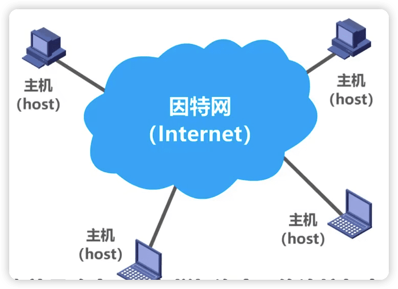
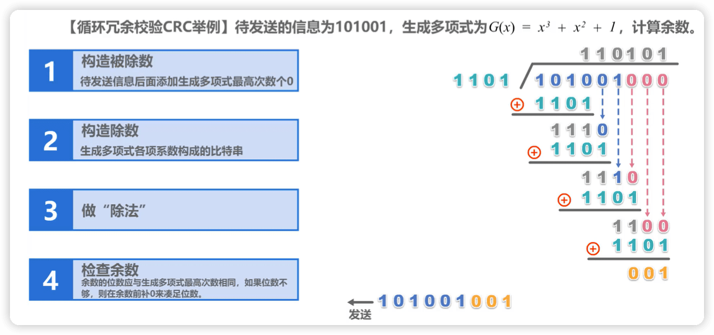
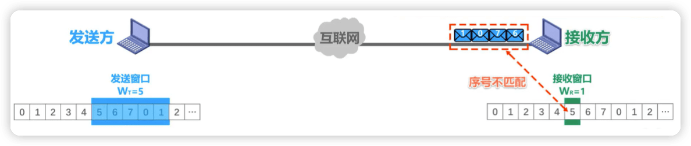

# 计算机网络微课堂

https://www.bilibili.com/video/BV1c4411d7jb


课程[深入浅出计算机网络](https://www.bilibili.com/video/BV1NT411g7n6)是升级补充版本，可以之后再看。

对应的课件在阿里网盘


## 1 概述

### 1.1 计算机网络在信息时代的作用

[中国互联网络信息中心](http://www.cnnic.net.cn)


- 计算机网络己由一种==通信基础设施==发展成为一种重要的==信息服务基础设施==。

- 计算机网络已经像水、电、煤气这些基础设施一样，成为我们生活中不可或缺的一部分。

### 1.2 因特网概述

#### 1 网络、互连网（互联网）和因特网

- 网络 (Network） 由若干结点(Node）和连接这些结点的链路（Link） 组成。

- 多个网络还可以通过路由器互连起来，这样就构成了一个覆盖范围更大的网络，即互联网（或互连网）。因此，互联网是“网络的网络 (Netwrok of Networks) "


- 因特网 (Internet）是世界上最大的互连网络（用户数以亿计，互连的网络数以百万计）。



> **internet与Internet的区别**
>
> internet(互联网或互连网）是一个通用名词，它泛指由多个计算机网络互连而成的网络。在这些网络之间的通信协议可以是任意的。
>
> Internet（因特网）则是一个专用名词，它指当前全球最大的、开放的、由众多网络相互连接而成的特定计算机网络，它采用TCP/P协议族作为通信的
>
> 机则，其前身是美国的ARPANET。


#### 2 因特网发展的三个阶段


-  因特网服务提供者ISP（Internet Service Provider）


普通用户是如何接入到因特网的呢? 

答: **通过**ISP**接入因特网**

ISP可以从因特网管理机构申请到成块的IP地址，同时拥有通信线路以及路由器等联网设备。任何 机构和个人只需缴纳费用，就可从 ISP**的得到所需要的**IP**地址** 。

**因为因特网上的主机都必须有**IP**地址才能进行通信，这样就可以通过该**ISP**接入到因特网**。

- 基于ISP的三层结构的因特网


> 一旦某个用户能够接入到因特网，那么他也可以成为一个ISP，所需要做的就是购买一些如调制解调器或路由器这样的设备，让其他用户能与他相连。
>
> 因此这个图只是一个示意图，一个ISP可以很方便地在因特网拓扑上增添新的层次和分支。

#### 3 因特网的标准化工作

- 因特网的标准化工作对因特网的发展起到了非常重要的作用。

- 因特网在制定其标准上的一个很大的特点是==面向公众==。
  + 因特网所有的==RFC==(Request For Comments)技术文档都可从因特网上免费下载：(http://www.ietf.org/rfc.html)
  + 任何人都可以随时用电子邮件发表对某个文档的意见或建议。

- ==因特网协会ISOC==是一个国际性组织，它负责对因特网进行全面管理，以及在世界范国内促进其发展和使用。
  + 因特网体系结构委员会IAB，负责管理因特网有关协议的开发；
  + 因特网工程部IETF，负责研究中短期工程问题，主要针对协议的开发和标准化;
  + 因特网研究部IRTF，从事理论方面的研究和开发一些需要长期考虑的问题。


- 制订因特网的正式标准要经过以下4个阶段：
  1. 因特网草案（在这个阶段还不是RFC文档）
  2. 建议标准（从这个阶段开始就成为RFC文档）
  3. 草案标准
  4. 因特网标准

> 只有一小部分RFC文档才能成为因特网标准。

#### 4 因特网的组成

因特网的拓扑结构虽然非常复杂，并且在地理上覆盖了全球，但从功能上可以分为两个部分：

- 边缘部分。有所有连接在因特网上的==主机==组成。这部分是==用户直接使用==的，用来进行==通信==（传送数据、音频或视频）和==资源共享==。
- 核心部分。有==大量网络==和连接这些网络的==路由器==组成，这部分是为==边缘部分提供服务的==（提供连通性和交换）。


路由器是一种专用计算机，但我们不称它为主机，路由器是实现分组交换的关键构建，其任务是转发收到的分组，这是网络核心最重要的部分。
处在互联网边缘的部分就是连接在互联网上的所有的主机。这些主机又称为==端系统 (end system)==。 端系统在功能上可能有很大的差别:

1. 小的端系统可以是一台普通个人电脑，具有上网功能的智能手机，甚至是一个很小的网络摄像头。
2. 大的端系统则可以是一台非常昂贵的大型计算机。
3. 端系统的拥有者可以是个人，也可以是单位(如学校、企业、政府机关等)，当然也可以是某个ISP。

**端系统之间通信的含义**

“主机 A 和主机 B 进行通信”实际上是指:“运行在主机 A 上的某个程序和运行在主机 B 上的另一个程序进 行通信”。**即**“**主机** A **的某个进程和主机** B **上的另一个进程进行通信**”**。简称为**“**计算机之间通信**”**。**

端系统之间的通信方式通常可划分为两大类:

**客户**-**服务器方式:**

- 客户 (client) 和服务器 (server) 都是指通信中所涉及的两个应用进程。 
- 客户 - 服务器方式所描述的是进程之间服务和被服务的关系。 
- 客户是服务的请求方，服务器是服务的提供方。

> 服务请求方和服务提供方都要使用网络核心部分所提供的服务。

**对等连接方式:**

- **对等连接** (peer-to-peer，简写为P2P) 是指两个主机在通信时并不区分哪一个是服务请求方还是服务提供方。
- 只要两个主机都运行了对等连接软件 (P2P软件) ，它们就可以进行**平等的、对等连接通信**。 
- 双方都可以下载对方已经存储在硬盘中的共享文档。


### 1.3 三种交换方式：电路交换、分组交换和报文交换

网络核心部分是互联网中最复杂的部分。
网络中的核心部分要向网络边缘中的大量主机提供连通性，使边缘部分中的任何一个主机都能够向其他主机通信(即传送或接收各种形式的数据)。
在网络核心部分起特殊作用的是 ==路由器 (router)==。
路由器是实现分组交换 (packet switching) 的关键构件，其任务是转发收到的分组，这是网络核心部分最重要的功能。

#### 电路交换


- 电话交换机接头电话线的方式称为电路交换（Circuit Swithing）；

- 从通信资源的分配角度来看，交换（Swithing）就是按照某种方式动态地分配传输线路的资源；
- 电路交换的三个步骤
  1. 建立连接（分配通信资源）。例如，在使用电路交换打电话之前，必须线拨号请求建立连接，当背胶用户听到电话交换机送来的拨号音并摘机后，从主叫端到被叫端建立一条连接，也就是一条专用的物理通路。这条连接保证了双方通话时所需要的通信资源，而这些资源在双方通信时不会被其他用户占用。
  2. 通话（一直占用通信资源）。
  3. 释放连接（归还通信资源）。


> 用户线归电话用户专用，而电话交换机之间拥有的大量话路的中继线则是许多用户共享的。


当使用电路交换来传送计算机数据时，其线路的传输效率往往很低。这是因为计算机数据是突发式地出现在传输线路上的。所以计算机通常采用的是**分组交换**，而不是线路交换。

#### 分组交换（Packet Switching）

在因特网中最重要的分组交换器就是路由器，它负责将各种网络互连起来，并对接收到的分组进行转发，也就是进行分组交换。


通常我们把表示**该消息的整块数据**成为一个**报文**。在发送报文之前，先把较长的报文划分成一个个更小的**等长数据段**，在每一个数据段前面。加上一些由必**要的控制信息组成的首部**后，就构成一个**分组**，也可简称为“**包**”，相应地，首部也可称为“**包头**”。

添加首部的作用？

首部包含了**分组的目的地址**，分组从源主机到目的主机，可走不同的路径。

在上例中，主机H6将所有构造出的个分组依次发送出去，各分组经过途中各分组交换机的存储转发，最终到达主机H2；主机H2收到这些分组后，去掉它们的首部，将各数据段组合还原出原始报文。


#### 报文交换（Message Switching）

与分组交换类似，报文交换中的交换节点也采用存储转发方式。但报文交换对报文的大小没有限制，这就要求交换节点需要有较大的缓存空间。

报文交换主要用户早期的电报通信网，现在较少使用。


#### 对比🔖

假设A，B，C，D是分组传输路径所要经过的4个结点交换机，纵坐标为时间


电路交换：

- 通信之前首先要建立连接；连接建立好之后，就可以使用已建立好的连接进行数据传送；数据传送后，需释放连接，以归还之前建立连接所占用的通信线路资源。
- 一旦建立连接，中间的各结点交换机就是直通形式的，比特流可以直达终点；

报文交换：

- 可以随时发送报文，而不需要事先建立连接；整个报文先传送到相邻结点交换机，全部存储下来后进行查表转发，转发到下一个结点交换机。
- 整个报文需要在各结点交换机上进行存储转发，由于不限制报文大小，因此需要各结点交换机都具有较大的缓存空间。

分组交换：

- 可以随时发送分组，而不需要事先建立连接。构成原始报文的一个个分组，依次在各结点交换机上存储转发。各结点交换机在发送分组的同时，还缓存接收到的分组。
- 构成原始报文的一个个分组，在各结点交换机上进行存储转发，相比报文交换，减少了转发时延，还可以避免过长的报文长时间占用链路，同时也有利于进行差错控制。


### 1.4 计算机网络的定义和分类

#### 定义

* 计算机网络的精确定义并未统一

* 计算机网络的最简单的定义是：一些**==互==**相**==连==**接的、**==自治==**的计算机的**==集合==**。

  - 互连：是指计算机之间可以通过有线或无线的方式进行数据通信；

  - 自治：是指独立的计算机，他有自己的硬件和软件，可以单独运行使用；

  - 集合：是指至少需要两台计算机；

- 现阶段计算机网络的较好的定义是：计算机网络主要是由一些**==通用的，可编程的硬件（一定包含有中央处理机CPU）互连==**而成的，而这些硬件并非专门用来实现某一特定目的（例如，传送数据或视频信号）。这些可编程的硬件能够用来**==传送多种不同类型的数据==**，并能**支持广泛的和日益增长的应用**。

  - 计算机网络所连接的硬件，并不限于一般的计算机，而是包括了智能手机等智能硬件。

  - 计算机网络并非专门用来传送数据，而是能够支持很多种的应用（包括今后可能出现的各种应用）。

#### 分类

**按交换技术分类：**

- 电路交换网络
- 报文交换网络
- 分组交换网络

**按使用者分类：**

- 公用网。所有愿意按电信公司的规定交纳费用的人都可以使用这种网络。
- 专用网。指某个部门为本单位的特殊业务工作的需要而建造的网络。

**按传输介质分类：**

- 有线网络
- 无线网络

**按覆盖范围分类：**

- 广域网WAN（Wide Area Network）

​	作用范围通常为几十到几千公里，因而有时也称为远程网（long haul network）。广域网是互联网的核心部分，其任务是通过长距离（例如，跨越不同的国家）运送主机所发送的数据。

- 城域网MAN

​	作用范围一般是一个城市，可跨越几个街区甚至整个城市

- 局域网LAN

​	一般用微型计算机或工作站通过高速通信线路相连（速率通常在 10 Mbit/s 以上），但地理上范围较小（1 km 左右）

- 个域网PAN

​	就是在个人工作的地方把个人使用的电子设备用无线技术连接起来的网络。

**按拓扑结构分类：**

- 总线型网络


- 星型网络


- 环形网络


- 网状型网络


### 1.5 计算机网络的性能指标

性能指标可以从不同的方面来度量计算机网络的性能。

#### 1 速率


> 显示中硬盘大小厂家给出与计算机的运算单位可能不同，10^3^ 和 2^10^。
>
> 


#### 2 带宽


#### 3 吞吐量

- 吞吐量表示在==单位时间内通过某个网络（或信道、接口）的数据量==。

- 吞吐量被经常用于对现实世界中的网络的一种测量，以便知道实际上到底有多少数据量能够通过网络。

- 吞吐量受网络的==带宽或额定速率的限制==。


> 
>
> 带宽1 Gb/s的以太网，代表其额定速率是1 Gb/s，这个数值也是该以太网的**吞吐量的绝对上限值**。因此，对于带宽1 Gb/s的以太网，可能实际吞吐量只有 700 Mb/s，甚至更低。
>
> 注意：吞吐量还可以用每秒传送的字节数或帧数表示

#### 4 时延

时延时指数据（一个报文或分组，甚至比特）从网络（或链路）的一端传送到另一端所需的时间。

网络时延由几部分组成：

- 发送时延

主机或路由器发送数据帧所需要的时间，也就是从发送数据帧的第一个比特算起，到该帧的最后一个比特发送完毕所需的时间。

- 传播时延

电磁波在信道中传播一定的距离需要花费的时间。

- 处理时延

主机或路由器在收到分组时要花费一定时间进行处理

- 排队时延

分组在进过网络传输时，要经过许多路由器。但分组在进入路由器后要先在输入队列中排队等待处理。

> 有时会把排队时延看成**处理时延的一部分**
>
> 总时延 = 发送时延 + 传播时延 + 处理时延 （处理时延 + 排队时延）


当处理时延忽略不计时，发送时延和传播时延谁占主导，要具体情况具体分析。

#### 5 时延带宽积

时延带宽积 = 传播时延 * 带宽


#### 6 往返时间

互联网上的信息不仅仅单方向传输而是双向交互的。因此，我们有时很需要知道**双向交互一次所需的时间**。

- 在许多情况下，因特网上的信息不仅仅单方向传输，而是双向交互；

- 我们有时很需要知道双向交互一次所需的时间；
- 因此，往返时间==RTT==(Round-Trip Time)也是一个重要的性能指标。


#### 7 利用率

利用率有**信道利用率**（用来表示某信道有百分之几的时间是被利用的（有数据通过））和**网络利用率**（全网络的信道利用率的加权平均）两种。

- 根据排队论，当某信道的利用率增大时，该信道引起的时延也会迅速增加；

- 因此，==信道利用率井非越高越好==；

- 如果令D0表示网络空闲时的时延，D表示网络当前的时延，那么在适当的假定条件下，可以用下面的简单公式来表示D、D0和利用率U之间的关系：
  
  * 当网络的利用率达到50%时，时延就要加倍；
  * 当网络的利用率超过50%时，时延急剧增大;
  * 当网络的利用率接近100%时，时延就趋于无穷大；
  * 因此，一些拥有较大主干网的ISP通常会控制它们的信道利用率不超过50%。如果超过了，就要准备扩容，增大线路的带宽。

- 也不能使信道利用率大低，这会使宝贵的通信资源被白白浪费。应该使用一些机制，可以根据情况动态调整输入到网络中的通信量，使网络利用率

保持在一个合理的范国内。


#### 8 丢包率

- 丢包率即分组丢失率，是指在一定的时间范国内，传输过程中**丢失的分组数量与总分组数量的比率**。

- 丢包率具体可分为**接口丢包率、结点丟包率、链路丢包率，路径丢包率、网络丢包率**等。

- 丢包率是网络运维人员非常关心的一个网络性能指标，但对于普通用户来说往往井不关心这个指标，因为他们通常意识不到网络丟包。

- 分组丢失主要有两种情况：
  * 分组在传输过程中出现==误码==，被结点丢奔；
  * 分组到达一台队列已满的分组交换机时被丢奔；在通信量较大时就可能造成==网络拥塞==。

- 因此，丢包率反映了网络的拥塞情况：
  * 无拥塞时路径丢包率为0
  * 轻度拥塞时路径丟包率为1%~4%
  * 严重拥塞时路径丟包率为5%~15%


### 1.6 计算机网络体系结构

#### 1 常见的计算机网络体系结构


如今用的最多的是TCP/IP体系结构，现今规模最大的、覆盖全球的、基于TCP/IP的互联网并未使用OSI标准。

TCP/IP体系结构相当于将OSI体系结构的 **物理层** 和 **数据链路层** 合并为了 **网络接口层** ，并去掉了 **会话 层**和**表示层**。

TCP/IP在网络层使用的协议是IP协议，IP协议的意思是网际协议，因此 TCP/IP**体系结构的网络层称 为网际层**。


在用户主机的操作系统中，通常都带有符合TCP/IP体系结构标准的TCP/IP协议族。 

而用于网络互连的路由器中，也带有符合TCP/IP体系结构标准的TCP/IP协议族。

只不过路由器一般只包含网络接口层和网际层。


> **网络接口层** :并没有规定具体内容，这样做的目的是可以互连全世界各种不同的网络接口，例 如:有线的以太网接口，无线局域网的WIFI接口等。
>
> **网际层** :它的核心协议是IP协议。
> **运输层** :TCP和UDP是这层的两个重要协议。 
>
> **应用层**:这层包含了大量的应用层协议，如 HTTP , DNS 等。

IP**协议(网际层)** 可以将不同的 **网络接口(网络接口层)** 进行互连，并向其上的 TCP**协议和**UDP**协 议(运输层)** 提供网络互连服务

而 TCP**协议** 在享受IP协议提供的网络互连服务的基础上，可向 **应用层的相应协议** 提供 **可靠** 的传输服 务。

UDP**协议** 在享受IP协议提供的网络互连服务的基础上，可向 **应用层的相应协议** 提供 **不可靠** 的传输 服务。

TCP/IP体系结构中最重要的是 IP**协议** 和 TCP**协议** ，因此用TCP和IP来表示整个协议大家族。


教学时把TCP/IP体系结构的 **网络接口层** 分成了 **物理层** 和 **数据链路层**。

#### 2 计算机网络体系结构分层的必要性

- 计算机网络是个非常复杂的系统。早在最初的ARPANET设计时就提出了分层的设计理念。

- “分层"可将庞大而复杂的问题，转化为若干较小的局部问题，而这些较小的局部向题就比较易于研究和处理。

- 下面，我们按照由简单到复杂的顺序，来看看实现计算机网络要面临哪些主要的问题，以及如何将这些问题划分到相应的层次，层层处理。


##### 物理层问题


##### 数据链路层问题


##### 网络层问题


##### 运输层问题


##### 应用层问题


##### 总结


#### 3 计算机网络体系结构分层思想举例

例子：主机的浏览器如何与Web服务器进行通信


**解析：**

主机和Web服务器之间基于网络的通信，实际上是主机中的**浏览器应用进程**与Web服务器中的**Web服务器应用进程**之间基于**网络的通信**


**体系结构的各层在整个过程中起到怎样的作用？**

##### 1-发送方发送


第一步：

- **应用层**按照HTTP协议的规定构建一个**HTTP请求报文**

- 应用层将**HTTP请求报文**交付给**运输层**处理


第二步：

- **运输层**给**HTTP请求报文**添加一个**TCP首部**，使之成为**TCP报文段**

- **TCP报文段的首部格式**作用是区分应用进程以及实现可靠传输

- **运输层**将T**CP报文段**交付给**网络层**处理


第三步：

- **网络层**给**TCP报文段**添加一个**IP首部**，使之成为**IP数据报**

- **IP数据报的首部格式**作用是使**IP数据报**可以在互联网传输，也就是被路由器转发

- **网络层**将**IP数据报**交付给**数据链路层**处理


第四步：

- **数据链路层**给**IP数据报**添加一个**首部**和一个**尾部**，使之成为**帧** （图示右边为首部，左边为尾部）

- 该**首部**的作用主要是为了让**帧**能够在一段链路上或一个网络上传输，能够被相应的目的主机接收

- 该**尾部**的作用是让目的主机检查所接收到的**帧**是否有误码

- **数据链路层**将**帧**交付给**物理层**


第五步：

- **物理层**先将**帧**看做是**比特流**，这里的网络N1假设是以太网，所以**物理层**还会给该**比特流**前面添加**前导码**

- **前导码**的作用是为了让目的主机做好接收帧的准备

- **物理层**将装有**前导码**的**比特流**变换成相应的**信号**发送给传输媒体


第六步：

- **信号**通过**传输媒体**到达**路由器**

##### 2-路由器转发


在路由器中

- **物理层**将**信号**变为**比特流**，然后去掉**前导码**后，将其交付给**数据链路层**

- **数据链路层**将**帧**的**首部**和**尾部**去掉后，将其交付给**网络层**，这实际交付的是**IP数据报**

- **网络层**解析**IP数据报**的**首部**，从中提取**目的网络地址**


在路由器中

- 提取**目的网络地址**后查找**自身路由表**。确定**转发端口**， 以便进行转发

- **网络层**将**IP数据报**交付给**数据链路层**

- **数据链路层**给**IP数据报**添加一个**首部**和一个**尾部**，使之成为**帧**

- **数据链路层**将帧交付给**物理层**

- **物理层**先将**帧**看成**比特流**，这里的网络N2假设是以太网，所以**物理层**还会给该**比特流**前面添加**前导码**

- 物理层将装有**前导码**的**比特流**变换成相应的**信号**发送给传输媒体，信号通过传输媒体到达**Web服务器**


##### 3-接收方接收

和发送方（主机）发送过程的封装正好是反着来

在Web 服务器上

- **物理层**将**信号**变换为**比特流**，然后去掉**前导码**后成为**帧**，交付给**数据链路层**

- **数据链路层**将**帧**的**首部**和**尾部**去掉后成为**IP数据报**，将其交付给**网络层**

- **网络层**将**IP数据报**的**首部**去掉后成为**TCP报文段**，将其交付给**运输层**

- **运输层**将**TCP报文段**的**首部**去掉后成为**HTTP请求报文**，将其交付给**应用层**

- **应用层**对**HTTP请求报文**进行**解析**，然后给主机发回**响应报文**

**发回响应报文的步骤和之前过程类似**


### 4 计算机网络体系结构中的专用术语

以下介绍的专用术语来源于OSI的七层协议体系结构，但也适用于TCP/IP的四层体系结构和五层协议体系结构。

##### 实体

- 实体：任何可发送或接收信息的==硬件==或==软件进程==。
- 对等实体：收发双方==相同层次中的实体==。


##### 协议


协议：控制两个对等实体进行逻辑通信的规则的集合

协议三要素：

- 语法：定义所交换信息的格式

- 语义：定义收发双方所要完成的操作

- 同步：定义收发双发的时序关系


##### 服务

- 在协议的控制下，两个对等实体间的逻辑通信使得本层能够向上一层提供服务。

- 要实现本层协议，还需要使用下面一层所提供的服务。

- 协议是“==水平的==〞，服务是“==垂直的==”。

- 实体看得见相邻下层所提供的服务，但井不知道实现该服务的具体协议。也就是说，下面的协议对上面的实体是“==透明==”的。


- 服务访问点。在同一系统中==相邻两层的实体交换信息的逻辑接口==，用于区分不同的服务类型。
  * 数据链路层的服务访问点为帧的“类型”宇段。
  * 网络层的服务访问点为1P数据报首部中的“协议字段”。
  * 运输层的服务访问点为 “端口号〞。

- 服务原语。上层使用下层所提供的服务必须通过与下层==交换一些命令==，这些命令称为服务原语。


- 协议数据单元PDU。==对等层次之间传送的数据包==称为该层的协议数据单元。

- 服务数据单元SDU。==同一系统内，层与层之间交换的数据包==称为服务数据单元。

- 多个SDU可以合成为一个PDU;一个SDU也可划分为几个PDU。


## 2 物理层

### 2.1 物理层的基本概念

- 物理层考虑的是怎样才能在连接各种计算机的传输媒体上传输数据比特流。

- 物理层为数据链路层屏蔽了各种传输媒体的差异，使数据链路层只需要考虑如何完成本层的协议和服务，而不必考虑网络具体的传输媒体是什么。


### 2.2 物理层下面的传输媒体

**传输媒体**也称为传输介质或传输媒介，他就是数据传输系统中在发送器和接收器之间的物理通路。传输媒体课分为两大类，即导引型传输媒体和非导引型传输媒体

传输媒体不属于计算机网络体系结构的任何一层。如果非要将它添加到体系结构中，那只能将其放置到物理层之下。


#### 导引型传输媒体

在导引型传输媒体中，电磁波被导引沿着固体媒体传播。

##### 同轴电缆


##### 双绞线


##### 光纤


- **多模光纤** 可以存在多条不同角度入射的光线在一条光纤中传输。这种光纤就称为 **多模光纤** 。

- **单模光纤** 若光纤的直径减小到只有一个光的波长，则光纤就像一根波导那样，它可使光线一直向前传 播，而不会产生多次反射。这样的光纤称为 **单模光纤** 。

##### **电力线**


#### 非导引型传输媒体

非导引型传输媒体是指自由空间。


##### **无线电波**


##### **微波**


##### 红外线

- 点对点无线传输

- 直线传输，中间不能有障碍物，传输距离短

- 传输速率低 (4Mb/s~16Mb/s)

==淘汰==

##### **可见光**

LIFI


> 无线电频谱管理机构
> 中国：工业和信息化部无线电管理局（国家无线电办公室）
> 美国：联邦通讯委员会FCC
> ISM (Industrial, Scientific, Medical)频段
>
> 


### 2.3 传输方式

#### 串行传输和并行传输


- **串行传输** : 数据是一个比特一个比特依次发送的，因此在发送端与接收端之间，只需要一条数据传输线路即可 

- **并行传输** :
  - 一次发送n个比特，因此，在发送端和接收端之间需要有n条传输线路 
  - 并行传输的优点是比串行传输的速度n倍，但成本高

数据在传输线路上的传输采用是 **串行传输** ，计算机内部的数据传输常用**并行传输**。

#### **同步传输和异步传输**


同步传输 :

- 数据块以稳定的比特流的形式传输。字节之间没有间隔 
- 接收端在每个比特信号的中间时刻进行检测，以判别接收到的是比特0还是比特1 
- 由于不同设备的时钟频率存在一定差异，不可能做到完全相同，在传输大量数据的过程中， 所产生的判别时刻的累计误差，会导致接收端对比特信号的判别错位

所以要使收发双发时钟保持同步。


异步传输 :

- 以字节为独立的传输单位，字节之间的时间间隔不是固定
- 接收端仅在每个字节的起始处对字节内的比特实现同步
- 通常在每个字节前后分别加上起始位和结束位

#### 单向通信(单工)、双向交替通信(半双工)和双向同时通信(全双工)

在许多情况下，我们要使用“ **信道(**channel**)** ”这一名词。信道和电路并不等同。信道一般都是用来表示 向某一个方向传送信息的媒体。因此，一条通信电路往往包含一条发送信道和一条接收信道。

从通信的双方信息交互的方式来看，可以有以下三种基本方式: 

**单向通信** :

又称为 **单工通信** ，即只能有一个方向的通信而没有反方向的交互。无线电广播或有线电以及电视广播就属于这种类型。


**双向交替通信** :
又称为**半双工通信** ，即通信的双方可以发送信息，但不能双方同时发送(当然也就不能同时接收)。这种通信方式使一方发送另一方接收，过一段时间后可以再反过来。


双向同时通信 :
又称为**全双工通信** ，即通信的双发可以同时发送和接收信息。


> **单向通信**只需要一条信道，而**双向交替通信**或**双向同时通信**则需要两条信道(每个方向各一条)。
>
> **双向同时通信**的传输效率最高。

### 2.4 编码与调制


> **常用术语**
>
> - **数据**(data) —— 运送消息的实体。
> - **信号**(signal) —— 数据的电气的或电磁的表现。
> - **模拟信号** (analogous signal) —— 代表消息的参数的取值是连续的。
> - **数字信号** (digital signal) —— 代表消息的参数的取值是离散的。
> - **码元** (code) —— 在使用时间域(或简称为时域)的波形表示数字信号时，代表不同离散数值 的基本波形。
> - **基带信号**(即基本频带信号)—— 来自信源的信号。像计算机输出的代表各种文字或图像文 件的数据信号都属于基带信号。 
> - 基带信号往往包含有较多的低频成分，甚至有直流成分，而许多信道并不能传输这种低频分 量或直流分量。因此必须对基带信号进行**调制** (modulation)。

在计算机网络中，常见的是将数字基带信号通过编码或调制的方法在相应信道进行传输。

#### 传输媒体与信道的关系

> **信道的几个基本概念**
>
> - **信道** —— 一般用来表示向某一个方向传送信息的媒体。
> - **单向通信(单工通信)** ——只能有一个方向的通信而没有反方向的交互。 
> - **双向交替通信(半双工通信)** ——通信的双方都可以发送信息，但不能双方同时发送(当然也 就不能同时接收)。
> - **双向同时通信(全双工通信)** ——通信的双方可以同时发送和接收信息。

严格来说，传输媒体不能和信道划等号
对于单工传输，传输媒体只包含一个信道，要么是发送信道，要么是接收信道


对于半双工和全双工，传输媒体中要包含两个信道，一个发送信道，另一个是接收信道。


如果使用信道复用技术，一条传输媒体还可以包含多个信道。

#### 常用编码

##### 不归零编码


- 正电平表示比特1/0 
- 负电平表示比特0/1

中间的虚线是零电平，所谓不归零编码，就是指在整个码元时间内，电平不会出现零电平。
实际比特1和比特0的表示要看现实怎么规定。


这需要发送方的发送与接收方的接收做到严格的同步

- 需要**额外一根传输线来传输时钟信号** ，使发送方和接收方同步，接收方按时钟信号的节拍来逐个接收码元
- 但是对于计算机网络， 宁愿利用这根传输线传输数据信号，而不是传输时钟信号

由于 不归零编码 存在 **同步问题**，因此计算机网络中的数据传输不采用这类编码!

##### 归零编码


- ==每个码元传输结束后信号都要 “归零“==，所以接收方只要在信号归零后进行采样即可，不需要单独的时钟信号。

- 实际上，归零编码相当于把时钟信号用“归零〞 方式编码在了数据之内，这称为〝==自同步==”信号。

- 但是，归零编码中大部分的==数据带宽==，都用来传输“归零”而==浪费==掉了。

**归零编码** 虽然**自同步** ，但 **编码效率低**。

##### 曼彻斯特编码


在每个码元时间的中间时刻，信号都会发生跳变

- 负跳变表示比特1/0
- 正跳变表示比特0/1 
- 码元中间时刻的跳变即表示时钟，又表示数据

实际比特1和比特0的表示要看现实怎么规定 

传统以太网使用的就是曼切斯特编码

##### 差分曼彻斯特编码


在每个码元时间的中间时刻，信号都会发送跳变，但与 曼彻斯特不同

- 跳变仅表示时钟

- 码元开始处电平是否变换表示数据
  变化表示比特1/0 

  不变化表示比特0/1

实际比特1和比特0的表示要看现实怎么规定 

比曼彻斯特编码变化少，更适合较高的传输速率

##### 总结


#### **调制**

数字信号转换为模拟信号，在模拟信道中传输，例如WiFi，采用补码键控CCK/直接序列扩频DSSS/正交频 分复用OFDM等 **调制** 方式。

模拟信号转换为另一种模拟信号，在模拟信道中传输，例如，语音数据加载到模拟的载波信号中传输。 频分复用FDM技术，充分利用带宽资源。

##### 基本调制方法


- **调幅**AM :所调制的信号由两种不同振幅的基本波形构成。每个基本波形只能表示1比特信息 量。
- **调频**FM :所调制的信号由两种不同频率的基本波形构成。每个基本波形只能表示1比特信息 量。
- **调相**PM :所调制的信号由两种不同初相位的基本波形构成。每个基本波形只能表示1比特信 息量。

但是使用基本调制方法，1个码元只能包含1个比特信息

##### 混合调制

因为==频率和相位时相关==的，即频率是相位随时间的变化率。所以一次只能调制频率和相位两个中的一个。

通常情况下，==相位和振幅==可以结合起来一起调制，称为==正交振幅调制QAM==。


上图码元所对应的4个比特是错误的，码元不能随便对应4个比特


#### 码元

在使用时间域的波形表示数字信号时，代表不同离散数值的基本波形。


### 2.5 信道的极限容量

- 任何实际的信道都不是理想的，在传输信号时会产生各种失真以及带来多种干扰。
- 码元传输的速率越高，或信号传输的距离越远，或传输媒体质量越差，在信道的输出端的波形的失真就越严重。


失真的原因:

- 码元传输的速率越高
- 信号传输的距离越远
- 噪声干扰越大
- 传输媒体质量越差


奈氏准则和香农公式对比:


- 在信道带宽一定的情况下，根据奈氏准则和香农公式，要想==提高信息的传输速率==就必须采用==多元制== （更好的调制方法） 和努力==提高信道中的信噪比==。

- 自从香农公式发表后，各种==新的信号处理和调制方法就不断出现==，其目的都是为了尽可能地==接近香农公式给出的传输速率极限==。

### **补充:信道复用技术**

本节内容视频未讲到，是《计算机网络(第7版)谢希仁》物理层的内容

#### **频分复用、时分复用和统计时分复用**

复用 (multiplexing) 是通信技术中的基本概念。 它允许用户使用一个共享信道进行通信，降低成本，提高利用率。


**频分复用**FDM (Frequency Division Multiplexing)

- 将整个带宽分为多份，用户在分配到一定的频带后，在通信过程中自始至终都占用这个频带。 
- **频分复用** 的所有用户在同样的时间 **占用不同的带宽资源** (请注意，这里的“带宽”是频率带宽而不是 数据的发送速率)。


**时分复用**TDM (Time Division Multiplexing)

- **时分复用** 则是将时间划分为一段段等长的 **时分复用帧(**TDM**帧)** 。每一个时分复用的用户在每一个 TDM 帧中占用固定序号的时隙。
- 每一个用户所占用的时隙是 **周期性地出现** (其周期就是TDM帧的长度)的。
- TDM 信号也称为**等时** (isochronous) 信号。 
- **时分复用的所有用户在不同的时间占用同样的频带宽度。**


- 时分复用可能会造成线路资源的浪费
  使用时分复用系统传送计算机数据时，由于计算机数据的突发性质，用户对分配到的子信道的利用率一般是不高的。


**统计时分复用** STDM (Statistic TDM)


#### **波分复用**

波分复用 WDM(Wavelength Division Multiplexing)


#### **码分复用**

码分复用 CDM (Code Division Multiplexing)

- 常用的名词是**码分多址** CDMA (Code Division Multiple Access)。 
- 各用户使用经过特殊挑选的不同码型，因此彼此不会造成干扰。 
- 这种系统发送的信号有很强的抗干扰能力，其频谱类似于白噪声，不易被敌人发现。

## 3 数据链路层

### 3.1 数据链路层概述

#### 概述

**链路** 是从一个结点到相邻结点的一段物理线路， **数据链路** 则是在链路的基础上增加了一些必要的硬件 (如网络适配器)和软件(如协议的实现)。

网络中的主机、路由器等都必须实现数据链路层。


局域网中的主机、交换机等都必须实现数据链路层。


**从层次上来看数据的流动**


仅从数据链路层观察帧的流动


- ==链路(Link）==就是从一个结点到相邻结点的一段物理线路，而中间没有任何其他的交换结点。

- ==数据链路==(Data Link)是指把实现通信协议的硬件和软件加到链路上，就构成了数据链路。

- 数据链路层以==帧==为单位传输和处理数据。

主机H1 到主机H2 所经过的网络可以是多种不同类型的。 

**注意:不同的链路层可能采用不同的数据链路层协议**。


数据链路层属于计算机网路的低层。 **数据链路层使用的信道主要有以下两种类型:**

- 点对点信道 
- 广播信道


> 局域网属于数据链路层
> 局域网虽然是个网络。但我们并不把局域网放在网络层中讨论。这是因为在网络层要讨论的是多个网络互连的问题，是讨论分组怎么从一个网络，通过路由器，转发到另一个网络。
> 而在同一个局域网中，分组怎么从一台主机传送到另一台主机，但并不经过路由器转发。从整个互联网来看， ==局域网仍属于数据链路层的范围==。

#### **三个重要问题**

数据链路层传送的协议数据单元是 **帧 **

##### **封装成帧**

- **封装成帧** (framing) 就是在一段数据的前后分别添加首部和尾部，然后就构成了一个帧。 
- 首部和尾部的一个重要作用就是进行 **帧定界** 。


##### 差错控制

在传输过程中可能会产生**比特差错**:1可能会变成0， 而 0 也可能变成 1。


##### 可靠传输

接收方主机收到有误码的帧后，是不会接受该帧的，会将它丢弃。
如果数据链路层向其上层提供的是不可靠服务，那么丢弃就丢弃了，不会再有更多措施。
如果数据链路层向其上层提供的是可靠服务，那就还需要其他措施，来**确保接收方主机还可以重新收到被丢弃的这个帧的正确副本**。

尽管误码是不能完全避免的，但若能实现发送发发送什么，接收方就能收到什么，就称为==可靠传输==。

以上三个问题都是使用 点对点信道的数据链路层来举例的。如果使用广播信道的数据链路层除了包含上面三个问题外，还有一些问题要解决。

如图所示，主机A，B，C，D，E通过一根总线进行互连，主机A要给主机C发送数据，代表帧的信号会通过总线传输到总线上的其他各主机，那么主机B，D，E如何知道所收到的帧不是发送给她们的，主机C如何知道发送的帧是发送给自己的 


可以用编址(地址)的来解决
将帧的目的地址添加在帧中一起传输


还有数据碰撞问题


随着技术的发展，交换技术的成熟，
 在 有线(局域网)领域 使用**点对点链路**和**链路层交换机**的**交换式局域网**取代了共享式局域网 

在无线局域网中仍然使用的是共享信道技术


### 3.2 封装成帧

封装成帧是指数据链路层给上层交付的协议数据单元添加帧头和帧尾使之成为帧

帧头和帧尾中包含有重要的控制信息


发送方的数据链路层将上层交付下来的协议数据单元封装成帧后，还要通过物理层，将构成帧的各比
特，转换成电信号交给传输媒体，那么接收方的数据链路层如何从物理层交付的比特流中提取出一个个
的帧?
答:需要帧头和帧尾来做 ==帧定界==


但不是每一种数据链路层协议的帧都包含有帧定界标志，例如下面例子


> 前导码
>
> - 前同步码:作用是使接收方的时钟同步 
> - 帧开始定界符:表明其后面紧跟着的就是MAC帧

另外以太网还规定了帧间间隔为96比特时间，因此，MAC帧不需要帧结束定界符


#### 透明传输

透明指某一个实际存在的事物看起来却好像不存在一样。

透明传输是指**数据链路层对上层交付的传输数据没有任何限制**，好像数据链路层不存在一样。
帧界定标志也就是个特定数据值，如果在上层交付的协议数据单元中， 恰好也包含这个特定数值，接收 方就不能正确接收


所以数据链路层应该对上层交付的数据有限制，其内容不能包含帧定界符的值

解决透明传输问题


- **解决方法**:面向字节的物理链路使用**字节填充** (byte stuffing) 或**字符填充** (character stuffing)，面向 比特的物理链路使用比特填充的方法实现透明传输 
- 发送端的数据链路层在数据中出现控制字符“SOH”或“EOT”的前面 **插入一个转义字符**“ESC” (其十六 进制编码是1B)。
- 接收端的数据链路层在将数据送往网络层之前删除插入的转义字符。 
- 如果转义字符也出现在数据当中，那么应在转义字符前面插入一个转义字符 ESC。当接收端收到连 续的两个转义字符时，就删除其中前面的一个。


**帧的数据部分长度**

- 为了提高帧的传输效率，应当**使帧的数据部分的长度尽可能大些**。

- 考虑到差错控制等多种因素，每一种数据链路层协议都规定了帧的数据部分的长度上限，即==最大传送单元MTU==(Maximum Transfer Unit) •


#### 总结

- 封装成帧是指数据链路层给上层交付的协议数据单元添加帧头和帧尾使之成为帧。
  * 帧头和帧尾中包含有重要的控制信息。
  * 帧头和帧尾的作用之一就是==帧定界==。

- 透明传输 是指数据链路层对上层交付的传输数据没有任何限制，就好像数据链路层不存在一样。

  * 面向字节的物理链路使用==字节填充==(或称字符填充）的方法实现透明传输。

    

  * 面向比特的物理链路使用比特填充的方法实现透明传输。

    

- 为了提高帧的传输效率，应当使帧的数据部分的长度尽可能大些。

- 考虑到差错控制等多种因素，每一种数据链路层协议都规定了帧的数据部分的长度上限，即最大传送单元MTU (Maximum Transfer Unit) 。

### 3.3 差错检测

- 实际的通信链路都不是理想的，比特在传输过程中可能会产生差错：1可能会变成0，而0也可能变成1。这称为==比特差错==。
- 在一段时间内，传输错误的比特占所传输比特总数的比率称为==误码率BER==(Bit Error Rate)。

- 使用==差错检测码==来检测数据在传输过程中是否产生了比特差错，是数据链路层所要解決的重要问题之一。


#### 奇偶校验

- 在待发送的数据后面**添加1位奇偶校验位**，使整个数据（包括所添加的校验位在内）中“1” 的个数为奇数（奇校验）或偶数（偶校验）。

- 如果有奇数个位发生误码，则奇偶性发生变化，可以检查出误码；

- 如果有偶数个位发生误码，则奇偶性不发生变化，不能检查出误码（漏检）；


#### 循环冗余校验CRC(Cyclic Redundancy Check)

- 收发双方约定好一个生成多项式G(x)；

- 发送方基于待发送的数据和生成多项式计算出差错检测码（==冗余码==），将其添加到待传输数据的后面一起传输;

- 接收方通过生成多项式来计算收到的数据是否产生了误码；





#### 总结

- 检错码只能检测出帧在传输过程中出现了差错，但并不能定位错误，因此==无法纠正错误==。

- 要想纠正传输中的差错，可以使用冗余信息更多的==纠错码==进行==前向纠错==。但纠错码的**开销比较大**，在计算机网络中**较少使用**。

- 循环冗余校验CRC有很好的检错能力（**漏检率非常低**），虽然计算比较复杂，但非常**易于用硬件实现**，因此被**广泛应用于数据链路层**。

- 在计算机网络中通常采用我们后续课程中将要讨论的检错重传方式来纠正传输中的差错，或者仅仅是丢奔检测到差错的帧，这取决于数据链路层向其上层提供的是可靠传输服务还是不可靠传输服务。

循环冗余校验 CRC 是一种检错方法，而帧校验序列 FCS 是添加在数据后面的冗余码。


### 3.4 可靠传输

#### 基本概念

##### 比特差错

- 使用差错检测技术 （例如循环冗余校验CRC)，接收方的数据链路层就可检测出帧在传输过程中是否产生了误码(比特错误）。

- 数据链路层向上层提供的服务类型
  - 不可靠传输服务：仅仅丢弃有误码的帧，其他什么也不做;
  - 可靠传输服务：想办法实现发送端发送什么，接收端就收到什么。

- 一般情况下，有线链路的误码率比较低，为了减小开销，并不要求数据链路层向上提供可靠传输服务。即使出现了误码，可靠传输的问题由其上层处理。

- 无线链路易受干扰，误码率比较高，因此要求数据链路层必须向上层提供可靠传输服务。


比特差错只是传输差错中的一种。从整个计算机网络体系结构来看，传输差错还包括分组丢失、分组失序以及分组重复。

##### 分组丢失

路由器输入队列快满了，主动丢弃收到的分组


##### 分组失序

数据并未按照发送顺序依次到达接收端


##### 分组重复

由于某些原因，有些分组在网络中滞留了，没有及时到达接收端，这可能会造成发送端对该分组的重 发，重发的分组到达接收端，但一段时间后，滞留在网络的分组也到达了接收端，这就造成 分组重复 的 传输差错


- 比特差错只是传输差错中的一种。

- 从整个计算机网络体系结构来看，传输差错还包括分组丟失、分组失序以及分组重复。

- 分组丢失、分组失序以及分组重复这些传输差错，一般不会出现在数据链路层，而会出现在其上层。

- 可靠传输服务并不仅局限于数据链路层，其他各层均可选择实现可靠传输。

  

- 可靠传输的实现比较复杂，开销也比较大，是否使用可靠传输取决于应用需求。

#### 三种可靠协议


这三种可靠传输实现机制的基本原理并不仅限于数据链路层，可以应用到计算机网络体系结构的各层协议中。

##### 停止-等待协议SW

###### **停止**-**等待协议可能遇到的四个问题**

1. **确认与否认**


2. **超时重传**


3. 确认丢失


4. 确认迟到


> 注意，图中最下面那个数据分组与之前序号为0的那个数据分组不是同一个数据分组

**注意事项:**

- 接收端检测到数据分组有误码时，将其丢弃井等待发送方的超时重传。但对于误码率较高的点对点链路，为使发送方==尽早重传==，也可给发送方发送NAK分组。
- 为了让接收方能够判断所收到的数据分组是否是重复的，需要给==数据分组编号==。由于停止-等待协议的停等特性，只需1个比特编号就够了，即编号0和1。

- 为了让发送方能够判断所收到的ACK分组是否是重复的，需要给ACK分组编号，所用比特数量与数据分组编号所用比特数量一样，数据链路层一般不会出现ACK分组迟到的情況，因此**在数据链路层实现停止-等待协议可以不用给ACK分组编号**。

- 超时计时器设置的==重传时间==应仔细选择。一般将重传时间选为略大于“从发送方到接收方的平均往返时间”。
  * 在数据链路层点对点的往返时间比较确定，重传时间比较好设定。
  * 然而在运输层，由于端到端往返时间非常不确定，设置合适的重传时间有时并不容易。

###### **停止**-等待协议的信道利用率

假设收发双方之间是一条直通的信道

- TD:是发送方发送数据分组所耗费的发送时延 
- RTT:是收发双方之间的往返时间
- TA:是接收方发送确认分组所耗费的发送时延

TA一般都远小于TD，可以忽略，当RTT远大于TD时，信道利用率会非常低


- 当往返时延RTT远大于数据帧发送时延T~D~时（例如使用卫星链路），信道利用率非常低。

- 若出现重传，则对于传送有用的数据信息来说，信道利用率还要降低。

- 为了克服停止-等待协议信道利用率很低的缺点，就产生了另外两种协议，即后退N帧协议GBN和选择重传协议SR。

像停止-等待协议这样通过确认和重传机制实现的可靠传输协议，常称为自动请求重传协议 ARQ(Automatic Repeat reQuest)，意思是重传的请求是自动进行，因为不需要接收方显式地请求， 发送方重传某个发送的分组

##### 回退N帧协议GBN

###### **为什么用回退**N**帧协议**

在相同的时间内，使用停止-等待协议的发送方只能发送一个数据分组，而采用流水线传输的发送方，可 以发送多个数据分组


回退N帧协议在流水线传输的基础上，利用发送窗口来限制发送方可连续发送数据分组的个数


###### 无差错情况流程

发送方将序号落在发送窗口内的0~4号数据分组，依次连续发送出去


他们经过互联网传输正确到达接收方，就是没有乱序和误码，接收方按序接收它们，每接收一个，接收
窗口就向前滑动一个位置，并给发送方发送针对所接收分组的确认分组，在通过互联网的传输正确到达
了发送方。


发送方每接收一个、发送窗口就向前滑动一个位置，这样就有新的序号落入发送窗口，发送方可以将收到确认的数据分组从缓存中删除了，而接收方可以择机将已接收的数据分组交付上层处理


###### 累计确认


优点:

- 即使确认分组丢失，发送方也可能不必重传
- 减小接收方的开销
- 减小对网络资源的占用

缺点: 不能向发送方及时反映出接收方已经正确接收的数据分组信息

###### **有差错情况**

例如 在传输数据分组时，5号数据分组出现误码，接收方通过数据分组中的检错码发现了错误


于是丢弃该分组，而后续到达的这剩下四个分组与接收窗口的序号不匹配



接收同样也不能接收它们，讲它们丢弃，并对之前按序接收的最后一个数据分组进行确认，发送ACK4， **每丢弃一个数据分组，就发送一个**ACK4


当收到重复的ACK4时，就知道之前所发送的数据分组出现了差错，于是可以不等超时计时器超时就立刻 开始重传，具体收到几个重复确认就立刻重传，根据具体实现决定


如果收到这4个重复的确认并不会触发发送立刻重传，一段时间后。超时计时器超时，也会将发送窗口 内以发送过的这些数据分组全部重传


若WT超过取值范围，例如WT=8，会出现什么情况?


###### 总结


- 回退N帧协议在流水线传输的基础上利用发送窗口来限制发送方连续发送数据分组的数量，是一种 连续ARQ协议 
- 在协议的工作过程中发送窗口和接收窗口不断向前滑动，因此这类协议又称为滑动窗口协议 
- 由于回退N帧协议的特性，当通信线路质量不好时，其信道利用率并不比停止-等待协议高

##### 选择重传协议SR

- 回退N帧协议的接收窗口尺寸W~R~只能等于1，因此**接收方只能按序接收正确到达的数据分组**。
- 一个数据分组的误码就会导致其后续多个数据分组不能被接收方按序接收而丢奔（尽管它们无乱序和误码）。这必然会造成发送方对这些数据分组的超时重传，显然这是对通信资源的极大浪费。

- 为了进一步提高性能，可设法只重传出现误码的数据分组。因此，接收窗口的尺寸W~R~不应再等于1（而应大于1），以便接收方先收下失序到达但无误码并且序号落在接收窗口内的那些数据分组，等到所缺分组收齐后再一井送交上层。这就是选择重传协议。

注意：选择重传协议为了使发送方仅重传出现差错的分组，接收方不能再采用累积确认，而需要对每个正确接收到的数据分组进行逐一确认！


总结


### 3.5 点对点协议PPP

- 点对点协议PPP(Point-to-Point Protocol)是目前使用最广泛的点对点数据链路层协议 
- PPP协议是因特网工程任务组IEIF在1992年制定的。经过1993年和1994年的修订，现在的PPP协议已 成为因特网的正式标准[RFC1661，RFC1662] 
- 数据链路层使用的一种协议，它的特点是:简单;只检测差错，而不是纠正差错;不使用序号，也 不进行流量控制;可同时支持多种网络层协议


- PPPoE 是为宽带上网的主机使用的链路层协议

- PPP协议为在点对点链路传输各种协议数据报提供了一个标准方法，主要由以下三部分构成：
  - 对各种协议数据报的封装方法（封装成帧）
  - 链路控制协议LCP   用于建立、配置以及测试数据链路的连接
  - 一套网络控制协议NCPs  其中的每一个协议支持不同的网络层协议


#### 帧格式

必须规定特殊的字符作为帧定界符


#### 透明传输

必须保证数据传输的透明性
实现透明传输的方法

- 面向字节的异步链路:字节填充法(插入“转义字符”)


- 面向比特的同步链路:比特填充法(插入“比特0”)


#### 差错检测

能够对接收端收到的帧进行检测，并立即丢弃有差错的帧。


#### 工作状态

- 当用户拨号接入 ISP 时，路由器的调制解调器对拨号做出确认，并建立一条物理连接。 
- PC 机向路由器发送一系列的 LCP 分组(封装成多个 PPP 帧)。 
- 这些分组及其响应选择一些 PPP 参数，并进行网络层配置，NCP 给新接入的 PC 机 
- 分配一个临时的 IP 地址，使 PC 机成为因特网上的一个主机。
- 通信完毕时，NCP 释放网络层连接，收回原来分配出去的 IP 地址。接着，LCP 释放数据链路层连 接。最后释放的是物理层的连接。


可见，PPP 协议已不是纯粹的数据链路层的协议，它还包含了物理层和网络层的内容。

### 3.6 媒体接入控制**(介质访问控制)**——广播信道

媒体接入控制(介质访问控制)使用一对多的广播通信方式。Medium Access Control翻译成媒体接入控制，有些翻译成介质访问控制。 

局域网的数据链路层

- 局域网最主要的特点是:
  * 网络为一个单位所拥有;
  * 地理范围和站点数目均有限。 
- 局域网具有如下 主要优点 :
  * 具有广播功能，从一个站点可很方便地访问全网。局域网上的主机可共享连接在局域网上的各种硬件和软件资源。
  * 便于系统的扩展和逐渐地演变，各设备的位置可灵活调整和改变。
  * 提高了系统的可靠性、可用性和残存性。


数据链路层的两个子层
了使数据链路层能更好地适应多种局域网标准，IEEE 802 委员会就将局域网的数据链路层拆成**两个子层**:

1. **逻辑链路控制** LLC (Logical Link Control)子层;
2. **媒体接入控制** MAC (Medium Access Control)子层。

与接入到传输媒体有关的内容都放在 MAC子层，而 LLC 子层则与传输媒体无关。 **不管采用何种协议的局域网，对** LLC **子层来说都是透明的。**


#### 基本概念

为什么要媒体接入控制(介质访问控制)?
共享信道带来的问题
若多个设备在共享信道上同时发送数据，则会造成彼此干扰，导致发送失败。

共享信道要着重考虑的一个问题就是如何协调多个发送和接收站点对一个共享传输媒体的占用，即媒体接入控制MAC(Medium Access Control)。


随着技术的发展，交换技术的成熟和成本的降低，具有更高性能的使用点对点链路和链路层交换机的交换式局域网在有线领域已完全取代了共享式局域网，但由于无线信道的广播天性，无线局域网仍然使用的是共享媒体技术。

#### 静态划分信道 

##### 信道复用

- 复用 (Multiplexing） 是通信技术中的一个重要概念。复用就是通过一条物理线路同时传输多路用户的信号。

- 当网络中传输媒体的传输容量大于多条单一信道传输的总通信量时，可利用复用技术在一条物理线路上建立多条通信信道来充分利用传输媒体的带宽。


##### 频分复用FDM (Frequency Division Multiplexing)

- 将整个带宽分为多份，用户在分配到一定的频带后，在通信过程中自始至终都占用这个频带。 
- **频分复用** 的所有用户在同样的时间 **占用不同的带宽资源** (请注意，这里的“带宽”是频率带宽而不是 数据的发送速率)。


##### 时分复用TDM(Time Division Multiplexing)

- 时分复用 则是将时间划分为一段段等长的 时分复用帧(TDM帧) 。每一个时分复用的用户在每一个 TDM 帧中占用固定序号的时隙。
- 每一个用户所占用的时隙是 周期性地出现 (其周期就是TDM帧的长度)的。
- TDM 信号也称为等时 (isochronous) 信号。 
- 时分复用的所有用户在不同的时间占用同样的频带宽度。


##### 波分复用 WDM(Wavelength Division Multiplexing)


波分复用就是光的频分复用，使用一根光纤来同时传输多个光载波信号。光信号传输一段距离后悔衰减，所以要用 掺铒光纤放大器 放大光信号

##### 码分复用CDM(Code Division Multiplexing)

🔖

#### 动态接入控制


#### 随机接入(CSMA/CD协议)

🔖

#### 随机接入(CSMA/CA协议)

🔖

### 3.7 MAC地址、IP地址以及ARP协议


#### MAC地址🔖


#### IP地址

IP地址属于网络层的范畴，不属于数据链路层的范畴

下面内容讲的是IP地址的使用，详细的IP地址内容在网络层中介绍

#### ARP协议

如何从IP地址找出其对应的MAC地址?

ARP(地址解析协议)


ARP高速缓存表


当主机B要给主机C发送数据包时，会首先在自己的ARP高速缓存表中查找主机C的IP地址所对应的 MAC地址，但未找到，因此，主机B需要发送ARP请求报文，来获取主机C的MAC地址


ARP请求报文有具体的格式，上图的只是简单描述 

ARP请求报文被封装在MAC帧中发送，目的地址为广播地址 

主机B发送封装有ARP请求报文的广播帧，总线上的其他主机都能收到该广播帧


收到ARP请求报文的主机A和主机C会把ARP请求报文交给上层的ARP进程 

主机A发现所询问的IP地址不是自己的IP地址，因此不用理会 

主机C的发现所询问的IP地址是自己的IP地址，需要进行相应


动态与静态的区别


ARP**协议只能在一段链路或一个网络上使用，而不能跨网络使用**


ARP协议的使用是逐段链路进行的

##### 总结

- 源主机在自己的==ARP高速缓存表==中查找目的主机的IP地址所对应的MAC地址，若找到了，则可以封装MAC帧进行发送;若找不到，则发送ARP请求（封装在广播MAC顿中）；

- 目的主机收到 ARP请求后，将源主机的IP地址与MAC地址记录到自己的ARP高速缓存表中，然后给源主机发送==ARP响应==（封装在单播MAC帧中），ARP响应中包含有目的主机的1P地址和MAC地址;

- 源主机收到ARP响应后，将目的主机的1IP地址与MAC地址记录到自己的ARP高速缓存表中，然后就可以封装之前想发送的MAC帧并发送给目的主机；

- ARP的作用范围：==逐段链路或逐个网络使用==；

- ==除ARP请求和响应外，ARP还有其他类型的报文==（例如用于检查IP地址冲突的“无故A尺P、免费ARP(Gratuitous ARP)”)

- ARP没有安全验证机制，==存在ARP欺骗（政击）问题==。

ARP表中的IP地址与MAC地址的对应关系记录，是 **会定期自动删除的** ， **因为**IP**地址与**MAC**地址的对 应关系不是永久性的**


### 3.8 集线器与交换机的区别

#### 集线器-在物理层扩展以太网


#### 以太网交换机-在数据链路层扩展以太网


### 3.9 以太网交换机自学习和转发帧的流程


### 3.10 以太网交换机的生成树协议STP


### 3.11 虚拟局域网VLAN


## 4 网络层🔖

### 4.1 网络层概述

网络层的主要任务是 **实现网络互连** ，进而 **实现数据包在各网络之间的传输**。


> 这些异构型网络N1~N7如果只是需要各自内部通信，他们只要实现各自的物理层和数据链路层即可 但是如果要将这些异构型网络互连起来，形成一个更大的互联网，就需要实现网络层设备路由器 有时为了简单起见，可以不用画出这些网络，图中N1~N7，而将他们看做是一条链路即可

要实现网络层任务，需要解决一下主要问题:

- 网络层向运输层提供怎样的服务(“可靠传输”还是“不可靠传输”)
  在数据链路层那课讲过的可靠传输，详情可以看那边的笔记:网络层对以下的 分组丢失 、 分组失 序 、 分组重复 的传输错误采取措施，使得接收方能正确接受发送方发送的数据，就是 可靠传输 ， 反之，如果什么措施也不采取，则是 不可靠传输

- 网络层寻址问题

  

- 路由选择问题

路由器收到数据后，是依据什么来决定将数据包从自己的哪个接口转发出去?
依据数据包的目的地址和路由器中的路由表


但在实际当中，路由器是怎样知道这些路由记录?

- 由用户或网络管理员进行人工配置，这种方法只适用于规模较小且网络拓扑不改变的小 型互联网 
- 另一种是实现各种路由选择协议，由路由器执行路由选择协议中所规定的路由选择算 法，而自动得出路由表中的路有记录，这种方法更适合规模较大且网络拓扑经常改变的 大型互联网


**网络层(网际层)**除了 IP**协议**外，还有之前介绍过的**地址解析协议**ARP，还有**网际控制报文 协议**ICMP ， **网际组管理协议**IGMP

#### 总结

- 网络层的主要任务是实现网络互连，进而实现数据包在各网络之间的传输。

- 要实现网络层任务，需要解决以下主要问题：
  * 网络层向运输层提供怎样的服务(“可靠传输” 还是 “不可靠传输”〕
  * 网络层寻址问题
  * 路由选择问题

- 因特网 (Internet）是目前全世界用户数量最多的互联网，它使用TCP/IP协议栈。

- 由于TCPAP协议栈的网络层使用网际协议1P，它是整个协议栈的核心协议，因此在TCP/P协议栈中网络层常称为网际层。

- 综上所述，我们通过学习TCP/P协议栈的网际层来学习网络层的理论知识和实践技术。

### 4.2 网络层提供的两种服务

在计算机网络领域，网络层应该向运输层提供怎样的服务(“ **面向连接** ”还是“ **无连接** ”)曾引起了长 期的争论。
争论焦点的实质就是: **在计算机通信中，可靠交付应当由谁来负责** ?是 **网络** 还是 **端系统** ?

#### 面向连接的虚电路服务


#### 无连接的数据报服务


#### 虚电路服务与数据报服务的对比


### 4.3 IPv4


#### 分类编制的IPv4地址


#### 划分子网的IPv4地址


#### 无分类编址的IPv4地址


#### IPv4地址的应用规划


### 4.4 IP数据报的发送和转发过程


### 4.5 静态路由配置及其可能产生的路由环路问题


### 4.6 路由选择协议


路由信息协议RIP


开放最短路径优先 OSPF (Open Shortest Path First)


边界网关协议BGP


直接封装RIP、OSPF和BGP报文的协议


### 4.7 IPv4数据报的首部格式


### 4.8 网际控制报文协议ICMP


### 4.9 虚拟专用网VPN与网络地址转换NAT


## 5 运输层🔖🔖

### 5.1 运输层概述

#### 概念

##### 进程之间的通信


##### 进程之间通信流程


### 5.2 运输层端口号、复用与分用的概念 

#### 为什么用端口号


#### 发送方的复用和接收方的分用


#### TCP/IP体系的应用层常用协议所使用的运输层熟知端口号


#### 运输层传输流程


### 5.3 UDP和TCP的对比


### 5.4 TCP的流量控制


### 5.5 TCP的拥塞控制


### 5.6 TCP超时重传时间的选择


### 5.7 TCP可靠传输的实现


### 5.8 TCP的运输连接管理


### 5.9 TCP报文段的首部格式


## 6 应用层

### 6.1 应用层概述


- 应用层是计算机网络体系结构的==最顶层==，是==设计和建立计算机网络的最终目的==，也是计算机网络中==发展最快的部分==。
  - 早期基于文本的应用（电子邮件、远程登录、文件传输、新间组）
  - 20世纪90年代将因特网带入千家万户的万维网www
  - 当今流行的即时通信、P2P文件共享及各种音视频应用
  - 计算设备的小型化和“无处不在〞，宽带住宅接入和无线接入的日益普及和迅速发展，为未来更多的新型应用提供了广阔的舞台。

- 在本章中，我们以一些经典的网络应用为例来学习有关网络应用的原理、协议和实现方面的知识。

我们在浏览器的地址中输入某个网站的域名后，就可以访问该网站的内容，这个就是万维网www应用其相关的应 用层协议为超文本传送协议HTTP。

用户在浏览器地址栏中输入的是“见名知意”的 **域名** ，而TCP/IP的网际层使用 IP**地址** 来表示目的主机，从 域名到IP地址的装转换，由属于 **应用层范畴的域名系统**DNS ，在后台帮用户完成。

常见的应用


### 6.2 客户/服务器方式(C/S方式)和对等方式(P2P方式)

网络应用程序运行在处于网络边缘的不同的端系统上，通过彼此间的通信来共同完成某项任务。

开发一种新的网络应用首先要考虑的问题就是==网络应用程序在各种端系统上的组织方式和它们之间的关系==。目前流行的主要有以下两种：

- 客户/服务器 (Client/Server, C/S)方式

- 对等 (Peer-to-Peer, P2P)方式

#### 客户/服务器方式(C/S方式)

- 客户和服务器是指通信中所涉及的两个应用进程。

- 客户/服务器方式所描述的是进程之间服务和被服务的关系。

- ==客户是服务请求方，服务器是服务提供方==。

- 服务器总是处于运行状态，井等待客户的服务请求。服务器具有固定端口号（例如HTTP服务器的默认端口号为80），而运行服务器的主机也具有固定的IP地址。


- C/S方式是因特网上传统的、同时也是最成熟的方式，很多我们熟悉的网络应用采用的都是C/S方式。包括万维网WWW、电子邮件、文件传输FTP等。

- 基于C/S方式的应用服务通常是==服务集中型==的，即应用服务集中在网络中比客户计算机少得多的服务器计算机上。
  - 由于一台服务器计算机要为多个客户机提供服务，在C/S应用中，常会出现服务器计算机跟不上众多客户机请求的情况。
  - 为此，在C/S应用中，常用计算机群集（或服务器场）构建一个强大的虛拟服务器。

#### 对等方式(P2P方式)

- 在P2P方式中，==没有固定的服务请求者和服务提供者==，分布在网络边缘各端系统中的应用进程是对等的，被称为==对等方==。对等方相互之间直接通信，每个对等方既是服务的请求者，又是服务的提供者。

- 目前，在因特网上流行的P2P应用主要包括**P2P文件共享、即时通信、P2P流媒体、分布式存储**等。

- 基于P2P的应用是==服务分散型==的，因为服务不是集中在少数几个服务器计算机中，而是分散在大量对等计算机中，这些计算机井不为服务提供商所有，而是为个人控制的桌面计算机和笔记本电脑，它们通常位于住宅、校园和办公室中。


- P2P方式的最突出特性之一就是它的==可扩展性==。因为系统每增加一个对等方，不仅增加的是服务的请求者，同时也增加了服务的提供者，==系统性能不会因规模的增大而降低==。

- P2P方式具有==成本上的优势==，因为它通常不需要庞大的服务器设施和服务器带宽。为了降低成本，服务提供商对于将P2P方式用于应用的兴趣越来越大。


### 6.3 动态主机配置协议DHCP

互联网广泛使用的**动态主机配置协议** DHCP (Dynamic Host Configuration Protocol) 提供了**即插即用 连网** (plug-and-play networking) 的机制。

这种机制允许一台计算机加入新的网络和获取 IP 地址，而不用手工配置。

#### DHCP的作用

在之前，如果要正常访问Web服务器，需要该主机手动配置网络的相关配置信息


如果主机数很多，就工作量大，容易出错。

如果我们给网络中添加一台DHCP服务器


#### DHCP的工作过程

**DHCP使用客户-服务器方式**

- 需要 IP 地址的主机在启动时就向 DHCP 服务器广播发送发现报文(DHCP DISCOVER)，这时该主机就成为 DHCP 客户。 
- 本地网络上所有主机都能收到此广播报文，但只有 DHCP 服务器才回答此广播报文。
- DHCP 服务器先在其数据库中查找该计算机的配置信息。若找到，则返回找到的信息。若找不到， 则从服务器的 IP 地址池 (address pool) 中取一个地址分配给该计算机。DHCP服务器的回答报文叫做 提供报文(DHCP OFFER)。

##### **DHCP工作方式**

- DHCP 使用客户-服务器方式，采用请求/应答方式工作。
- DHCP 基于 UDP 工作(DHCP报文在运输层会被封装成为UDP用户数据报)，DHCP 服务器运行在 67 号端口， DHCP客户运行在 68 号端口。

##### **DHCP交互过程**


> DHCP**客户端将广播发送**DHCP**发现报文(**DHCP DISCOVER**)** 
>
> - 事务ID
> - DHCP客户端的MAC地址 
>
> **封装该报文的**IP**数据报的源**IP**地址为**0.0.0.0**，这是因为主机目前还未分配到**IP**地址** ，因此使用该地址代替
>
> **目的**IP**地址为广播地址**255.255.255.255**，之所以广播发送，是因为主机现在并不知道网络中有哪几 个**DHCP**服务器** 。它们的IP地址各是什么
>
> DHCP**服务器收到**DHCP**发现报文后，根据其中封装的**DHCP**客户端的**MAC**地址来查找自己的数据 库** ，如果查到匹配信息，则使用这些配置信息来构建并发送DHCP提供报文，如果没有则采用默认 配置信息来构建报文并发送


> DHCP**服务端将广播发送**DHCP**提供报文(**DHCP OFFER**)** 
>
> 事务ID:DHCP客户端会与之前DHCP发现报文的事务ID做对比，来判断该DHCP提供报文是否是自己的
>
> 配置信息:
>
> - IP地址:DHCP服务器从自己的IP地址池中挑选待租用给主机的IP地址(使用ARP来确保 所选IP地址未被网络中其他主机占用)
> - 子网掩码
> - 地址租期
> - 默认网关
> - DNS服务器 
>
> 源IP地址:发送DHCP提供报文的DHCP服务器的IP 
>
> 目的地址:因为目的主机还没分配到IP，所以使用广播地址

在本例中，DHCP客户会收到两个DHCP服务器发来的DHCP提供报文，DHCP客户从中选择一个，一般选择 先到的，并向所选择的DHCP服务器发送DHCP请求报文


DHCP**客户端将广播发送**DHCP**请求报文(**DHCP REQUEST**)**

- 事务ID
- DHCP客户端的MAC地址 
- 接收的租约中的IP地址 
- 提供此租约的DHCP服务器端的IP地址

源地址:0.0.0.0，因为此时DHCP客户才从多个DHCP服务器中挑选一个作为自己的DHCP服务器。它 首先要征得该服务器的同意，之后才能正式使用向该DHCP服务器租用的IP地址

目的地址:广播地址，这样可以一次性向所有DHCP服务器发送DHCP请求报文，来告知它们是否请 求它们作为自己的DHCP服务器

在本例中，假设DHCP客户端选择DHCP服务器1作为自己的DHCP服务器，DHCP服务器1接受该请求，于是 DHCP服务器1给DHCP客户端发送DHCP确认报文


源地址:DHCP服务器1的IP地址 

目的地址:广播地址 

DHCP**客户收到该报文后就可以使用租用的**IP**地址 **

**在使用前还会进行**ARP**检测**


#### DHCP中继代理

下图的网络拓扑中的各主机是否可以通过DHCP来自动获取到网络配置?


使用DHCP中继代理是因为我们不用给每一个网络上都设置一个DHCP服务器，这样会使DHCP服务 器的数量太多

#### 总结

- 动态主机配置协议DHCP(Dynamic Host Configuration Protocol)提供了一种机制，称为即插即用连网。这种机制==允许一台计算机加入新网络时可自动获取IP地址等网络配置信息而不用手工参与==。

- DHCP主要使用以下报文来实现其功能：
  - DHCP DISCOVER: DHCP发现报文
  - DHCP REQUEST： DHCP请求报文
  - DHCP OFFER: DHCP提供报文
  - DHCP ACK: DHCP确认报文
  - DHCP NACK: DHCP否认报文
  - DHCP RELEASE： DHCP释放报文

- DHCP报文==在运输层使用UDP协议封装==
  - DHCP客户使用的UDP端口号为68
  - DHCP客户在==未获取到IP地址时使用地址0.0.0.0==

- 在每一个网络上都设置一个DHCP服务器会使DHCP服务器的数量太多。因此现在是使每一个网络至少有一个==DHCP中继代理(通常是一台路由器）==，它配置了DHCP服务器的IP地址信息，作为各网络中计算机与DHCP服务器的桥梁。


### 6.4 域名系统DNS

#### 概述


因特网是否可以只使用一台DNS服务器? 不行

这种做法井不可取。因为因特网的规模很大，这样的域名服务器肯定会因为超负荷而无法正常工作，而且一旦域名服务器出现故障，整个因特网就会瘫痪。

早在1983年，因特网就开始采用==层次结构的命名树==作为主机的名字（即域名）并使用分布式的域名系统DNS。

DNS使==大多数域名都在本地解析==，仅少量解析需要在因特网上通信，因此系统效率很高。

由于DNS是分布式系统，即使单个计算机出了故障，也不会妨碍整个系统的正常运行。

- 因特网采用层次树状结构的域名结构
- 域名的结构由若干个分量组成，各分量之间用“点〞隔开，分别代表不同级别的域名。

```
… .三级域名.二级域名.顶级域名
```

​	每一级的域名都由英文字母和数字组成，不超过63个宇符，不区分大小号宇母。

​	级别最低的域名写在最左边，而级别最高的顶级域名号在最右边。

​	完整的域名不超过255个字符。

- 域名系统既不规定一个域名需要包含多少个下级域名，也不规定每一级的域名代表什么意思。

- 各级域名由其上一级的域名管理机构管理，而最高的顶级域名则由因特网名称与数字地址分配机构ICANN进行管理。


- **顶级域名TLD** (Top Level Domain） 分为以下三类：
  - **国家顶级域名nTLD** 采用IS0 3166的规定。如cn表示中国，us表示美国，uk表示英国、等等。
  - **通用顶级域名gTLD** 最常见的通用顶级域名有七个，即：==com（公司企业）==、net(网络服务机构）、org（非营利性组织）、int(国际组织）、edu（美国教育结构）、gov(美国政府部门）、mil（美国军事部门）。
  - **反向域arpa**  用于反向域名解析，即IP地址反向解析为域名。

- ==在国家顶级域名下注册的二级域名均由该国家自行确定==。例如，顶级域名为jp的日本，将其教育和企业机构的二级域名定为ac和co，而不用edu和com。

- 我国则将二级域名划分为以下两类：
  * **类别域名**  共七个：ac（科研机构）、==com（工、商、金融等企业）==（注意与上面的区分）、edu（教育机构）、gov（政府部门）、net(提供网络服务的机构）、mil （军事机构）和org（非营利性组织）。
  * **行政区域名**  共34个，适用于我国的各省、自治区、直辖市。例如：bj为北京市、sh为上海市、js为江苏省，等等。

> 名称相同的域名其等级未必相同


> 这种按等级管理的命名方法便于维护名字的唯一性，并且也容易设计出一种高效的域名（查询机制。需要注意的是，域名只是个逻辑概念，井不代表计算机所在的物理地点。

- 域名和IP地址的映射关系必须保存在域名服务器中，供所有其他应用查询。显然不能将所有信息都储存在一台域名服务器中。DNS使用分布在各地的域名服务器来实现域名到!P地址的转换。

- 域名服务器可以划分为以下四种不同的类型：

  - 根域名服务器

    根域名服务器是最高层次的域名服务器。每个根域名服务器都知道所有的顶级域名服务器的域名及其IP地址。因特网上共有==13个==不同IP地址的根域名服务器。尽管我们将这13个根域名服务器中的每一个都视为单个的服务器，但“每台服务器〞 实际上是由许多分布在世界各地的计算机构成的服务器群集。当本地域名服务器向根域名服务器发出查询请求时，路由器就把查询请求报文转发到离这个DNS客户最近的一个根域名服务器。这就加快了DNS的查询过程，同时也更合理地利用了因特网的资源。==根域名服务器通常并不直接对域名进行解析，而是返回该域名所属顶级域名的顶级域名服务器的IP地址。==

  - 顶级域名服务器

    这些域名服务器负责==管理在该顶级域名服务器注册的所有二级域名==。当收到DNS查询请求时就给出相应的回答（可能是最后的结果，也可能是下一级权限域名服务器的IP地址）。

  - 权限域名服务器

    这些域名服务器负责==管理某个区的域名==。每一个主机的域名都必须在某个权限域名服务器处注册登记。因此权限域名服务器知道其管辖的域名与1P地址的映射关系。另外，权限域名服务器还知道其下级域名服务器的地址。

  - 本地域名服务器

    本地域名服务器不属于上述的域名服务器的等级结构。当一个主机发出DNS请求报文时，这个报文就首先被送往该主机的本地域名服务器。==本地域名服务器起着代理的作用，会格该报文转发到上述的域名服务器的等级结构中==。每一个因特网服务提供者1SP，一个大学，甚至一个大学里的学院，都可以拥有一个本地域名服务器，它有时也称为默认域名服务器。本地域名服务器离用户较近，一般不超过几个路由器的距离，也有可能就在同一个局域网中。本地域名服务器的1P地址需要直接配置在需要域名解析的主机中。

#### 域名解析过程

递归查询和迭代查询


- 为了提高DNS的查询效率，，并减轻根域名服务器的负荷和减少因特网上的DNS查询报文数量，在域名服务器中广泛地使用了==高速缓存==。高速缓存用来存放最近查询过的域名以及从何处获得域名映射信息的记录。


- 为了提高DNS的查询效率，井减轻根域名服务器的负荷和减少因特网上的DNS查询报文数量，在域名服务器中广泛地使用了高速缓存。高速缓存用来存放最近查询过的域名以及从何处获得域名映射信息的记录。
- 由于域名到IP地址的映射关系井不是永久不变，为保持高速缓存中的内容正确，域名服务器==应为每项内容设置计时器并删除超过合理时间的项==（例如，每个项目只存放两天）。
- 不但在本地域名服务器中需要高速缓存，在用户主机中也很需要。许多用户主机在启动时从本地域名服务器下载域名和IP地址的全部数据库，维护存放自己最近使用的域名的高速缓存，井且只在从缓存中找不到域名时才向域名服务器查询。同理，主机也需要保持高速缓存中内容的正确性。


DNS报文使用运输层的UDP协议进行封装，运输层端口号为==53==。

### 6.5 文件传送协议FTP

- 将某台计算机中的文件通过网络传送到可能相距很远的另一台计算机中，是一项基本的网络应用，即文件传送。
- ==文件传送协议FTP==(File Transfer Protocol)是因特网上使用得最广泛的文件传送协议。
  - FTP提供==交互式的访问==，允许客户==指明文件的类型与格式==（如指明是否使用ASCI!码），并允许文件具有存取权限（如访问文件的用户必须经过授权，并输入有效的口令）。
  - ==FTP屏蔽了各计算机系统的细节，因而适合于在异构网络中任意计算机之间传送文件==。

- 在因特网发展的早期阶段，用FTP传送文件约占整个因特网的通信量的三分之一，而由电子邮件和域名系统所产生的通信量还要小于FTP所产生的通信量。只是到了1995年，万维网Www的通信量才首次超过了FTP。

#### **文件传送协议**FTP**的应用**

FTP采用C/S方式(客户/服务器方式) 

FTP客户计算机可将各种类型的文件上传到FTP服务器计算机


FTP客户计算机也可以从FTP服务器计算机下载文件


根据应用需求的不同， FTP服务器可能需要一台高性能和高可靠性的服务器计算机，也可能只需要一台普通的个人计算机即可。

FTP的常见用途是在计算机之间传输文件，尤其是用于批量传输文件。

FTP的另一个常见用途是让网站设计者将构成网站内容的大量文件批量上传到他们的Web服务器。

#### FTP基本工作原理🔖


### 6.6 电子邮件


### 6.7 万维网WWW
